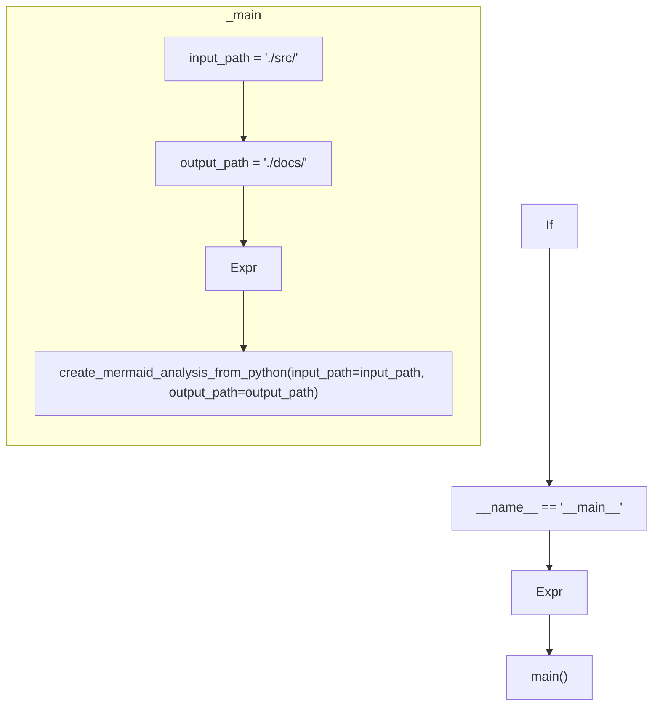

# ./src/main.py

### Imports

  - [pyremaid.pyremaid.create_mermaid_analysis_from_python](/docs/pyremaid/pyremaid.py.md)

---

---

<details>
<summary>Debug AST model dump</summary>

```
Module(
  body=[
    ImportFrom(
      module='pyremaid.pyremaid',
      names=[
        alias(
          name='create_mermaid_analysis_from_python',
          lineno=3,
          col_offset=30,
          end_lineno=3,
          end_col_offset=65)],
      level=0,
      lineno=3,
      col_offset=0,
      end_lineno=3,
      end_col_offset=65),
    FunctionDef(
      name='main',
      args=arguments(
        posonlyargs=[],
        args=[],
        kwonlyargs=[],
        kw_defaults=[],
        defaults=[]),
      body=[
        Assign(
          targets=[
            Name(
              id='input_path',
              ctx=Store(),
              lineno=9,
              col_offset=4,
              end_lineno=9,
              end_col_offset=14)],
          value=Constant(
            value='./src/',
            lineno=9,
            col_offset=17,
            end_lineno=9,
            end_col_offset=25),
          lineno=9,
          col_offset=4,
          end_lineno=9,
          end_col_offset=25),
        Assign(
          targets=[
            Name(
              id='output_path',
              ctx=Store(),
              lineno=10,
              col_offset=4,
              end_lineno=10,
              end_col_offset=15)],
          value=Constant(
            value='./docs/',
            lineno=10,
            col_offset=18,
            end_lineno=10,
            end_col_offset=27),
          lineno=10,
          col_offset=4,
          end_lineno=10,
          end_col_offset=27),
        Expr(
          value=Call(
            func=Name(
              id='create_mermaid_analysis_from_python',
              ctx=Load(),
              lineno=11,
              col_offset=4,
              end_lineno=11,
              end_col_offset=39),
            args=[],
            keywords=[
              keyword(
                arg='input_path',
                value=Name(
                  id='input_path',
                  ctx=Load(),
                  lineno=11,
                  col_offset=51,
                  end_lineno=11,
                  end_col_offset=61),
                lineno=11,
                col_offset=40,
                end_lineno=11,
                end_col_offset=61),
              keyword(
                arg='output_path',
                value=Name(
                  id='output_path',
                  ctx=Load(),
                  lineno=11,
                  col_offset=75,
                  end_lineno=11,
                  end_col_offset=86),
                lineno=11,
                col_offset=63,
                end_lineno=11,
                end_col_offset=86)],
            lineno=11,
            col_offset=4,
            end_lineno=11,
            end_col_offset=87),
          lineno=11,
          col_offset=4,
          end_lineno=11,
          end_col_offset=87)],
      decorator_list=[],
      lineno=6,
      col_offset=0,
      end_lineno=11,
      end_col_offset=87),
    If(
      test=Compare(
        left=Name(
          id='__name__',
          ctx=Load(),
          lineno=14,
          col_offset=3,
          end_lineno=14,
          end_col_offset=11),
        ops=[
          Eq()],
        comparators=[
          Constant(
            value='__main__',
            lineno=14,
            col_offset=15,
            end_lineno=14,
            end_col_offset=25)],
        lineno=14,
        col_offset=3,
        end_lineno=14,
        end_col_offset=25),
      body=[
        Expr(
          value=Call(
            func=Name(
              id='main',
              ctx=Load(),
              lineno=15,
              col_offset=4,
              end_lineno=15,
              end_col_offset=8),
            args=[],
            keywords=[],
            lineno=15,
            col_offset=4,
            end_lineno=15,
            end_col_offset=10),
          lineno=15,
          col_offset=4,
          end_lineno=15,
          end_col_offset=10)],
      orelse=[],
      lineno=14,
      col_offset=0,
      end_lineno=15,
      end_col_offset=10)],
  type_ignores=[])
```
</details>

