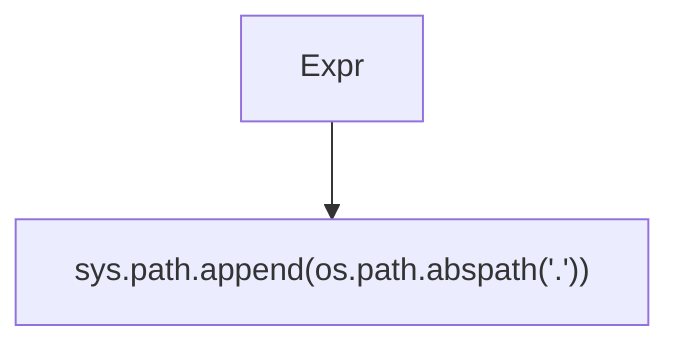

# ./src/pyremaid/__init__.py

### Imports

  - sys.*
  - os.*

---

---

<details>
<summary>Debug AST model dump</summary>

```
Module(
  body=[
    Import(
      names=[
        alias(
          name='sys',
          lineno=1,
          col_offset=7,
          end_lineno=1,
          end_col_offset=10)],
      lineno=1,
      col_offset=0,
      end_lineno=1,
      end_col_offset=10),
    Import(
      names=[
        alias(
          name='os',
          lineno=2,
          col_offset=7,
          end_lineno=2,
          end_col_offset=9)],
      lineno=2,
      col_offset=0,
      end_lineno=2,
      end_col_offset=9),
    Expr(
      value=Call(
        func=Attribute(
          value=Attribute(
            value=Name(
              id='sys',
              ctx=Load(),
              lineno=4,
              col_offset=0,
              end_lineno=4,
              end_col_offset=3),
            attr='path',
            ctx=Load(),
            lineno=4,
            col_offset=0,
            end_lineno=4,
            end_col_offset=8),
          attr='append',
          ctx=Load(),
          lineno=4,
          col_offset=0,
          end_lineno=4,
          end_col_offset=15),
        args=[
          Call(
            func=Attribute(
              value=Attribute(
                value=Name(
                  id='os',
                  ctx=Load(),
                  lineno=4,
                  col_offset=16,
                  end_lineno=4,
                  end_col_offset=18),
                attr='path',
                ctx=Load(),
                lineno=4,
                col_offset=16,
                end_lineno=4,
                end_col_offset=23),
              attr='abspath',
              ctx=Load(),
              lineno=4,
              col_offset=16,
              end_lineno=4,
              end_col_offset=31),
            args=[
              Constant(
                value='.',
                lineno=4,
                col_offset=32,
                end_lineno=4,
                end_col_offset=35)],
            keywords=[],
            lineno=4,
            col_offset=16,
            end_lineno=4,
            end_col_offset=36)],
        keywords=[],
        lineno=4,
        col_offset=0,
        end_lineno=4,
        end_col_offset=37),
      lineno=4,
      col_offset=0,
      end_lineno=4,
      end_col_offset=37)],
  type_ignores=[])
```
</details>

