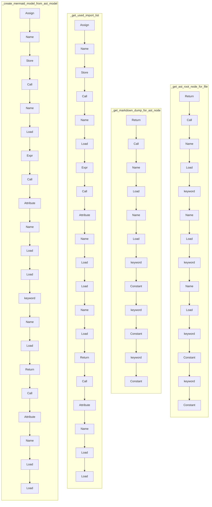

# ./src/pyremaid/ast_tools/ast_tools.py

### Imports

  - ast.AST
  - ast.dump
  - ast.parse
  - typing.Optional
  - [ast_tools.visitors.BlockGenerator](/docs/pyremaid/ast_tools/visitors.py.md)
  - [ast_tools.visitors.ImportNodeFinder](/docs/pyremaid/ast_tools/visitors.py.md)
  - [models.MermaidElement](/docs/pyremaid/models.py.md)

---

---

<details>
<summary>Debug AST model dump</summary>

```
Module(
  body=[
    ImportFrom(
      module='ast',
      names=[
        alias(name='AST'),
        alias(name='dump'),
        alias(name='parse')],
      level=0,
      lineno=1,
      col_offset=0,
      end_lineno=1,
      end_col_offset=32),
    ImportFrom(
      module='typing',
      names=[
        alias(name='Optional')],
      level=0,
      lineno=2,
      col_offset=0,
      end_lineno=2,
      end_col_offset=27),
    ImportFrom(
      module='ast_tools.visitors',
      names=[
        alias(name='BlockGenerator'),
        alias(name='ImportNodeFinder')],
      level=0,
      lineno=4,
      col_offset=0,
      end_lineno=4,
      end_col_offset=63),
    ImportFrom(
      module='models',
      names=[
        alias(name='MermaidElement')],
      level=0,
      lineno=5,
      col_offset=0,
      end_lineno=5,
      end_col_offset=33),
    FunctionDef(
      name='get_ast_root_node_for_file',
      args=arguments(
        posonlyargs=[],
        args=[
          arg(
            arg='source_code',
            annotation=Name(
              id='str',
              ctx=Load(),
              lineno=8,
              col_offset=44,
              end_lineno=8,
              end_col_offset=47),
            lineno=8,
            col_offset=31,
            end_lineno=8,
            end_col_offset=47),
          arg(
            arg='input_file',
            annotation=Name(
              id='str',
              ctx=Load(),
              lineno=8,
              col_offset=61,
              end_lineno=8,
              end_col_offset=64),
            lineno=8,
            col_offset=49,
            end_lineno=8,
            end_col_offset=64)],
        kwonlyargs=[],
        kw_defaults=[],
        defaults=[]),
      body=[
        Return(
          value=Call(
            func=Name(
              id='parse',
              ctx=Load(),
              lineno=9,
              col_offset=11,
              end_lineno=9,
              end_col_offset=16),
            args=[],
            keywords=[
              keyword(
                arg='source',
                value=Name(
                  id='source_code',
                  ctx=Load(),
                  lineno=10,
                  col_offset=15,
                  end_lineno=10,
                  end_col_offset=26),
                lineno=10,
                col_offset=8,
                end_lineno=10,
                end_col_offset=26),
              keyword(
                arg='filename',
                value=Name(
                  id='input_file',
                  ctx=Load(),
                  lineno=11,
                  col_offset=17,
                  end_lineno=11,
                  end_col_offset=27),
                lineno=11,
                col_offset=8,
                end_lineno=11,
                end_col_offset=27),
              keyword(
                arg='mode',
                value=Constant(
                  value='exec',
                  lineno=12,
                  col_offset=13,
                  end_lineno=12,
                  end_col_offset=19),
                lineno=12,
                col_offset=8,
                end_lineno=12,
                end_col_offset=19),
              keyword(
                arg='type_comments',
                value=Constant(
                  value=True,
                  lineno=13,
                  col_offset=22,
                  end_lineno=13,
                  end_col_offset=26),
                lineno=13,
                col_offset=8,
                end_lineno=13,
                end_col_offset=26)],
            lineno=9,
            col_offset=11,
            end_lineno=14,
            end_col_offset=5),
          lineno=9,
          col_offset=4,
          end_lineno=14,
          end_col_offset=5)],
      decorator_list=[],
      returns=Subscript(
        value=Name(
          id='Optional',
          ctx=Load(),
          lineno=8,
          col_offset=69,
          end_lineno=8,
          end_col_offset=77),
        slice=Name(
          id='AST',
          ctx=Load(),
          lineno=8,
          col_offset=78,
          end_lineno=8,
          end_col_offset=81),
        ctx=Load(),
        lineno=8,
        col_offset=69,
        end_lineno=8,
        end_col_offset=82),
      lineno=8,
      col_offset=0,
      end_lineno=14,
      end_col_offset=5),
    FunctionDef(
      name='get_markdown_dump_for_ast_node',
      args=arguments(
        posonlyargs=[],
        args=[
          arg(
            arg='ast_node',
            annotation=Name(
              id='AST',
              ctx=Load(),
              lineno=17,
              col_offset=45,
              end_lineno=17,
              end_col_offset=48),
            lineno=17,
            col_offset=35,
            end_lineno=17,
            end_col_offset=48)],
        kwonlyargs=[],
        kw_defaults=[],
        defaults=[]),
      body=[
        Return(
          value=Call(
            func=Name(
              id='dump',
              ctx=Load(),
              lineno=18,
              col_offset=11,
              end_lineno=18,
              end_col_offset=15),
            args=[
              Name(
                id='ast_node',
                ctx=Load(),
                lineno=18,
                col_offset=16,
                end_lineno=18,
                end_col_offset=24)],
            keywords=[
              keyword(
                arg='annotate_fields',
                value=Constant(
                  value=True,
                  lineno=18,
                  col_offset=42,
                  end_lineno=18,
                  end_col_offset=46),
                lineno=18,
                col_offset=26,
                end_lineno=18,
                end_col_offset=46),
              keyword(
                arg='include_attributes',
                value=Constant(
                  value=True,
                  lineno=18,
                  col_offset=67,
                  end_lineno=18,
                  end_col_offset=71),
                lineno=18,
                col_offset=48,
                end_lineno=18,
                end_col_offset=71),
              keyword(
                arg='indent',
                value=Constant(
                  value=2,
                  lineno=18,
                  col_offset=80,
                  end_lineno=18,
                  end_col_offset=81),
                lineno=18,
                col_offset=73,
                end_lineno=18,
                end_col_offset=81)],
            lineno=18,
            col_offset=11,
            end_lineno=18,
            end_col_offset=82),
          lineno=18,
          col_offset=4,
          end_lineno=18,
          end_col_offset=82)],
      decorator_list=[],
      returns=Name(
        id='str',
        ctx=Load(),
        lineno=17,
        col_offset=53,
        end_lineno=17,
        end_col_offset=56),
      lineno=17,
      col_offset=0,
      end_lineno=18,
      end_col_offset=82),
    FunctionDef(
      name='get_used_import_list',
      args=arguments(
        posonlyargs=[],
        args=[
          arg(
            arg='ast_node',
            annotation=Name(
              id='AST',
              ctx=Load(),
              lineno=21,
              col_offset=35,
              end_lineno=21,
              end_col_offset=38),
            lineno=21,
            col_offset=25,
            end_lineno=21,
            end_col_offset=38)],
        kwonlyargs=[],
        kw_defaults=[],
        defaults=[]),
      body=[
        Assign(
          targets=[
            Name(
              id='finder',
              ctx=Store(),
              lineno=22,
              col_offset=4,
              end_lineno=22,
              end_col_offset=10)],
          value=Call(
            func=Name(
              id='ImportNodeFinder',
              ctx=Load(),
              lineno=22,
              col_offset=13,
              end_lineno=22,
              end_col_offset=29),
            args=[],
            keywords=[],
            lineno=22,
            col_offset=13,
            end_lineno=22,
            end_col_offset=31),
          lineno=22,
          col_offset=4,
          end_lineno=22,
          end_col_offset=31),
        Expr(
          value=Call(
            func=Attribute(
              value=Name(
                id='finder',
                ctx=Load(),
                lineno=23,
                col_offset=4,
                end_lineno=23,
                end_col_offset=10),
              attr='visit',
              ctx=Load(),
              lineno=23,
              col_offset=4,
              end_lineno=23,
              end_col_offset=16),
            args=[
              Name(
                id='ast_node',
                ctx=Load(),
                lineno=23,
                col_offset=17,
                end_lineno=23,
                end_col_offset=25)],
            keywords=[],
            lineno=23,
            col_offset=4,
            end_lineno=23,
            end_col_offset=26),
          lineno=23,
          col_offset=4,
          end_lineno=23,
          end_col_offset=26),
        Return(
          value=Call(
            func=Attribute(
              value=Name(
                id='finder',
                ctx=Load(),
                lineno=24,
                col_offset=11,
                end_lineno=24,
                end_col_offset=17),
              attr='get_found_imports',
              ctx=Load(),
              lineno=24,
              col_offset=11,
              end_lineno=24,
              end_col_offset=35),
            args=[],
            keywords=[],
            lineno=24,
            col_offset=11,
            end_lineno=24,
            end_col_offset=37),
          lineno=24,
          col_offset=4,
          end_lineno=24,
          end_col_offset=37)],
      decorator_list=[],
      returns=Subscript(
        value=Name(
          id='list',
          ctx=Load(),
          lineno=21,
          col_offset=43,
          end_lineno=21,
          end_col_offset=47),
        slice=Name(
          id='str',
          ctx=Load(),
          lineno=21,
          col_offset=48,
          end_lineno=21,
          end_col_offset=51),
        ctx=Load(),
        lineno=21,
        col_offset=43,
        end_lineno=21,
        end_col_offset=52),
      lineno=21,
      col_offset=0,
      end_lineno=24,
      end_col_offset=37),
    FunctionDef(
      name='create_mermaid_model_from_ast_model',
      args=arguments(
        posonlyargs=[],
        args=[
          arg(
            arg='model',
            annotation=Name(
              id='AST',
              ctx=Load(),
              lineno=27,
              col_offset=47,
              end_lineno=27,
              end_col_offset=50),
            lineno=27,
            col_offset=40,
            end_lineno=27,
            end_col_offset=50)],
        kwonlyargs=[],
        kw_defaults=[],
        defaults=[]),
      body=[
        Assign(
          targets=[
            Name(
              id='generator',
              ctx=Store(),
              lineno=28,
              col_offset=4,
              end_lineno=28,
              end_col_offset=13)],
          value=Call(
            func=Name(
              id='BlockGenerator',
              ctx=Load(),
              lineno=28,
              col_offset=16,
              end_lineno=28,
              end_col_offset=30),
            args=[],
            keywords=[],
            lineno=28,
            col_offset=16,
            end_lineno=28,
            end_col_offset=32),
          lineno=28,
          col_offset=4,
          end_lineno=28,
          end_col_offset=32),
        Expr(
          value=Call(
            func=Attribute(
              value=Name(
                id='generator',
                ctx=Load(),
                lineno=29,
                col_offset=4,
                end_lineno=29,
                end_col_offset=13),
              attr='visit',
              ctx=Load(),
              lineno=29,
              col_offset=4,
              end_lineno=29,
              end_col_offset=19),
            args=[],
            keywords=[
              keyword(
                arg='node',
                value=Name(
                  id='model',
                  ctx=Load(),
                  lineno=29,
                  col_offset=25,
                  end_lineno=29,
                  end_col_offset=30),
                lineno=29,
                col_offset=20,
                end_lineno=29,
                end_col_offset=30)],
            lineno=29,
            col_offset=4,
            end_lineno=29,
            end_col_offset=31),
          lineno=29,
          col_offset=4,
          end_lineno=29,
          end_col_offset=31),
        Return(
          value=Call(
            func=Attribute(
              value=Name(
                id='generator',
                ctx=Load(),
                lineno=30,
                col_offset=11,
                end_lineno=30,
                end_col_offset=20),
              attr='get_list_of_elements',
              ctx=Load(),
              lineno=30,
              col_offset=11,
              end_lineno=30,
              end_col_offset=41),
            args=[],
            keywords=[],
            lineno=30,
            col_offset=11,
            end_lineno=30,
            end_col_offset=43),
          lineno=30,
          col_offset=4,
          end_lineno=30,
          end_col_offset=43)],
      decorator_list=[],
      returns=Subscript(
        value=Name(
          id='list',
          ctx=Load(),
          lineno=27,
          col_offset=55,
          end_lineno=27,
          end_col_offset=59),
        slice=Name(
          id='MermaidElement',
          ctx=Load(),
          lineno=27,
          col_offset=60,
          end_lineno=27,
          end_col_offset=74),
        ctx=Load(),
        lineno=27,
        col_offset=55,
        end_lineno=27,
        end_col_offset=75),
      lineno=27,
      col_offset=0,
      end_lineno=30,
      end_col_offset=43)],
  type_ignores=[])
```
</details>

