```mermaid
flowchart TB
  _c53_f54_n1500["AnnAssign"]
  _c53_f54_n1501["Attribute"]
  _c53_f54_n1502["Name"]
  _c53_f54_n1503["Load"]
  _c53_f54_n1504["Store"]
  _c53_f54_n1505["Subscript"]
  _c53_f54_n1506["Name"]
  _c53_f54_n1507["Load"]
  _c53_f54_n1508["Tuple"]
  _c53_f54_n1509["Name"]
  _c53_f54_n1510["Load"]
  _c53_f54_n1511["Subscript"]
  _c53_f54_n1512["Name"]
  _c53_f54_n1513["Load"]
  _c53_f54_n1514["Name"]
  _c53_f54_n1515["Load"]
  _c53_f54_n1516["Load"]
  _c53_f54_n1517["Load"]
  _c53_f54_n1518["Load"]
  _c53_f54_n1519["Dict"]
  _c53_f54_n1520["AnnAssign"]
  _c53_f54_n1521["Attribute"]
  _c53_f54_n1522["Name"]
  _c53_f54_n1523["Load"]
  _c53_f54_n1524["Store"]
  _c53_f54_n1525["Subscript"]
  _c53_f54_n1526["Name"]
  _c53_f54_n1527["Load"]
  _c53_f54_n1528["Tuple"]
  _c53_f54_n1529["Name"]
  _c53_f54_n1530["Load"]
  _c53_f54_n1531["Subscript"]
  _c53_f54_n1532["Name"]
  _c53_f54_n1533["Load"]
  _c53_f54_n1534["Name"]
  _c53_f54_n1535["Load"]
  _c53_f54_n1536["Load"]
  _c53_f54_n1537["Load"]
  _c53_f54_n1538["Load"]
  _c53_f54_n1539["Dict"]
  _c53_f55_n1540["If"]
  _c53_f55_n1541["Compare"]
  _c53_f55_n1542["Name"]
  _c53_f55_n1543["Load"]
  _c53_f55_n1544["NotIn"]
  _c53_f55_n1545["Attribute"]
  _c53_f55_n1546["Name"]
  _c53_f55_n1547["Load"]
  _c53_f55_n1548["Load"]
  _c53_f55_n1549["Assign"]
  _c53_f55_n1550["Subscript"]
  _c53_f55_n1551["Attribute"]
  _c53_f55_n1552["Name"]
  _c53_f55_n1553["Load"]
  _c53_f55_n1554["Load"]
  _c53_f55_n1555["Name"]
  _c53_f55_n1556["Load"]
  _c53_f55_n1557["Store"]
  _c53_f55_n1558["List"]
  _c53_f55_n1559["Load"]
  _c53_f55_n1560["Expr"]
  _c53_f55_n1561["Call"]
  _c53_f55_n1562["Attribute"]
  _c53_f55_n1563["Subscript"]
  _c53_f55_n1564["Attribute"]
  _c53_f55_n1565["Name"]
  _c53_f55_n1566["Load"]
  _c53_f55_n1567["Load"]
  _c53_f55_n1568["Name"]
  _c53_f55_n1569["Load"]
  _c53_f55_n1570["Load"]
  _c53_f55_n1571["Load"]
  _c53_f55_n1572["Name"]
  _c53_f55_n1573["Load"]
  _c53_f55_n1574["If"]
  _c53_f55_n1575["Compare"]
  _c53_f55_n1576["Name"]
  _c53_f55_n1577["Load"]
  _c53_f55_n1578["NotIn"]
  _c53_f55_n1579["Attribute"]
  _c53_f55_n1580["Name"]
  _c53_f55_n1581["Load"]
  _c53_f55_n1582["Load"]
  _c53_f55_n1583["Assign"]
  _c53_f55_n1584["Subscript"]
  _c53_f55_n1585["Attribute"]
  _c53_f55_n1586["Name"]
  _c53_f55_n1587["Load"]
  _c53_f55_n1588["Load"]
  _c53_f55_n1589["Name"]
  _c53_f55_n1590["Load"]
  _c53_f55_n1591["Store"]
  _c53_f55_n1592["List"]
  _c53_f55_n1593["Load"]
  _c53_f55_n1594["Expr"]
  _c53_f55_n1595["Subscript"]
  _c53_f55_n1596["Attribute"]
  _c53_f55_n1597["Subscript"]
  _c53_f55_n1598["Attribute"]
  _c53_f55_n1599["Name"]
  _c53_f55_n1600["Load"]
  _c53_f55_n1601["Load"]
  _c53_f55_n1602["Name"]
  _c53_f55_n1603["Load"]
  _c53_f55_n1604["Load"]
  _c53_f55_n1605["Load"]
  _c53_f55_n1606["Name"]
  _c53_f55_n1607["Load"]
  _c53_f55_n1608["Load"]
  _f56_n1609["Expr"]
  _f56_n1610["Constant"]
  _f56_n1611["Assign"]
  _f56_n1612["Name"]
  _f56_n1613["Store"]
  _f56_n1614["Dict"]
  _f56_n1615["For"]
  _f56_n1616["Name"]
  _f56_n1617["Store"]
  _f56_n1618["Name"]
  _f56_n1619["Load"]
  _f56_n1620["Assign"]
  _f56_n1621["Name"]
  _f56_n1622["Store"]
  _f56_n1623["Call"]
  _f56_n1624["Name"]
  _f56_n1625["Load"]
  _f56_n1626["keyword"]
  _f56_n1627["Name"]
  _f56_n1628["Load"]
  _f56_n1629["keyword"]
  _f56_n1630["Name"]
  _f56_n1631["Load"]
  _f56_n1632["Assign"]
  _f56_n1633["Subscript"]
  _f56_n1634["Name"]
  _f56_n1635["Load"]
  _f56_n1636["Name"]
  _f56_n1637["Load"]
  _f56_n1638["Store"]
  _f56_n1639["Name"]
  _f56_n1640["Load"]
  _f56_n1641["Return"]
  _f56_n1642["Name"]
  _f56_n1643["Load"]
  _f57_n1644["Return"]
  _f57_n1645["Subscript"]
  _f57_n1646["Name"]
  _f57_n1647["Load"]
  _f57_n1648["Slice"]
  _f57_n1649["Constant"]
  _f57_n1650["Call"]
  _f57_n1651["Attribute"]
  _f57_n1652["Name"]
  _f57_n1653["Load"]
  _f57_n1654["Load"]
  _f57_n1655["Constant"]
  _f57_n1656["Load"]
  _f58_n1657["Assign"]
  _f58_n1658["Name"]
  _f58_n1659["Store"]
  _f58_n1660["Dict"]
  _f58_n1661["For"]
  _f58_n1662["Name"]
  _f58_n1663["Store"]
  _f58_n1664["Name"]
  _f58_n1665["Load"]
  _f58_n1666["If"]
  _f58_n1667["NamedExpr"]
  _f58_n1668["Name"]
  _f58_n1669["Store"]
  _f58_n1670["Call"]
  _f58_n1671["Name"]
  _f58_n1672["Load"]
  _f58_n1673["keyword"]
  _f58_n1674["Name"]
  _f58_n1675["Load"]
  _f58_n1676["If"]
  _f58_n1677["NamedExpr"]
  _f58_n1678["Name"]
  _f58_n1679["Store"]
  _f58_n1680["Call"]
  _f58_n1681["Name"]
  _f58_n1682["Load"]
  _f58_n1683["keyword"]
  _f58_n1684["Name"]
  _f58_n1685["Load"]
  _f58_n1686["keyword"]
  _f58_n1687["Name"]
  _f58_n1688["Load"]
  _f58_n1689["For"]
  _f58_n1690["Name"]
  _f58_n1691["Store"]
  _f58_n1692["Call"]
  _f58_n1693["Name"]
  _f58_n1694["Load"]
  _f58_n1695["keyword"]
  _f58_n1696["Name"]
  _f58_n1697["Load"]
  _f58_n1698["Assign"]
  _f58_n1699["Name"]
  _f58_n1700["Store"]
  _f58_n1701["Constant"]
  _f58_n1702["Assign"]
  _f58_n1703["Name"]
  _f58_n1704["Store"]
  _f58_n1705["Call"]
  _f58_n1706["Name"]
  _f58_n1707["Load"]
  _f58_n1708["Name"]
  _f58_n1709["Load"]
  _f58_n1710["If"]
  _f58_n1711["Compare"]
  _f58_n1712["Name"]
  _f58_n1713["Load"]
  _f58_n1714["In"]
  _f58_n1715["Name"]
  _f58_n1716["Load"]
  _f58_n1717["Assign"]
  _f58_n1718["Name"]
  _f58_n1719["Store"]
  _f58_n1720["Subscript"]
  _f58_n1721["Name"]
  _f58_n1722["Load"]
  _f58_n1723["Name"]
  _f58_n1724["Load"]
  _f58_n1725["Load"]
  _f58_n1726["Assign"]
  _f58_n1727["Subscript"]
  _f58_n1728["Name"]
  _f58_n1729["Load"]
  _f58_n1730["Name"]
  _f58_n1731["Load"]
  _f58_n1732["Store"]
  _f58_n1733["Name"]
  _f58_n1734["Load"]
  _f58_n1735["Return"]
  _f58_n1736["Name"]
  _f58_n1737["Load"]
  _f59_n1738["Expr"]
  _f59_n1739["Constant"]
  _f59_n1740["Assign"]
  _f59_n1741["Name"]
  _f59_n1742["Store"]
  _f59_n1743["Call"]
  _f59_n1744["Name"]
  _f59_n1745["Load"]
  _f59_n1746["keyword"]
  _f59_n1747["Name"]
  _f59_n1748["Load"]
  _f59_n1749["keyword"]
  _f59_n1750["Name"]
  _f59_n1751["Load"]
  _f59_n1752["Assign"]
  _f59_n1753["Name"]
  _f59_n1754["Store"]
  _f59_n1755["Call"]
  _f59_n1756["Name"]
  _f59_n1757["Load"]
  _f59_n1758["keyword"]
  _f59_n1759["Name"]
  _f59_n1760["Load"]
  _f59_n1761["keyword"]
  _f59_n1762["Name"]
  _f59_n1763["Load"]
  _f59_n1764["Return"]
  _f59_n1765["Name"]
  _f59_n1766["Load"]

  subgraph ImportMap
    direction TB
    subgraph _c53___init__
      direction TB
      _c53_f54_n1500 --> _c53_f54_n1501
      _c53_f54_n1501 --> _c53_f54_n1502
      _c53_f54_n1502 --> _c53_f54_n1503
      _c53_f54_n1503 --> _c53_f54_n1504
      _c53_f54_n1504 --> _c53_f54_n1505
      _c53_f54_n1505 --> _c53_f54_n1506
      _c53_f54_n1506 --> _c53_f54_n1507
      _c53_f54_n1507 --> _c53_f54_n1508
      _c53_f54_n1508 --> _c53_f54_n1509
      _c53_f54_n1509 --> _c53_f54_n1510
      _c53_f54_n1510 --> _c53_f54_n1511
      _c53_f54_n1511 --> _c53_f54_n1512
      _c53_f54_n1512 --> _c53_f54_n1513
      _c53_f54_n1513 --> _c53_f54_n1514
      _c53_f54_n1514 --> _c53_f54_n1515
      _c53_f54_n1515 --> _c53_f54_n1516
      _c53_f54_n1516 --> _c53_f54_n1517
      _c53_f54_n1517 --> _c53_f54_n1518
      _c53_f54_n1518 --> _c53_f54_n1519
      _c53_f54_n1519 --> _c53_f54_n1520
      _c53_f54_n1520 --> _c53_f54_n1521
      _c53_f54_n1521 --> _c53_f54_n1522
      _c53_f54_n1522 --> _c53_f54_n1523
      _c53_f54_n1523 --> _c53_f54_n1524
      _c53_f54_n1524 --> _c53_f54_n1525
      _c53_f54_n1525 --> _c53_f54_n1526
      _c53_f54_n1526 --> _c53_f54_n1527
      _c53_f54_n1527 --> _c53_f54_n1528
      _c53_f54_n1528 --> _c53_f54_n1529
      _c53_f54_n1529 --> _c53_f54_n1530
      _c53_f54_n1530 --> _c53_f54_n1531
      _c53_f54_n1531 --> _c53_f54_n1532
      _c53_f54_n1532 --> _c53_f54_n1533
      _c53_f54_n1533 --> _c53_f54_n1534
      _c53_f54_n1534 --> _c53_f54_n1535
      _c53_f54_n1535 --> _c53_f54_n1536
      _c53_f54_n1536 --> _c53_f54_n1537
      _c53_f54_n1537 --> _c53_f54_n1538
      _c53_f54_n1538 --> _c53_f54_n1539
    end
    subgraph _c53_add_import
      direction TB
      _c53_f55_n1540 --> _c53_f55_n1541
      _c53_f55_n1541 --> _c53_f55_n1542
      _c53_f55_n1542 --> _c53_f55_n1543
      _c53_f55_n1543 --> _c53_f55_n1544
      _c53_f55_n1544 --> _c53_f55_n1545
      _c53_f55_n1545 --> _c53_f55_n1546
      _c53_f55_n1546 --> _c53_f55_n1547
      _c53_f55_n1547 --> _c53_f55_n1548
      _c53_f55_n1548 --> _c53_f55_n1549
      _c53_f55_n1549 --> _c53_f55_n1550
      _c53_f55_n1550 --> _c53_f55_n1551
      _c53_f55_n1551 --> _c53_f55_n1552
      _c53_f55_n1552 --> _c53_f55_n1553
      _c53_f55_n1553 --> _c53_f55_n1554
      _c53_f55_n1554 --> _c53_f55_n1555
      _c53_f55_n1555 --> _c53_f55_n1556
      _c53_f55_n1556 --> _c53_f55_n1557
      _c53_f55_n1557 --> _c53_f55_n1558
      _c53_f55_n1558 --> _c53_f55_n1559
      _c53_f55_n1559 --> _c53_f55_n1560
      _c53_f55_n1560 --> _c53_f55_n1561
      _c53_f55_n1561 --> _c53_f55_n1562
      _c53_f55_n1562 --> _c53_f55_n1563
      _c53_f55_n1563 --> _c53_f55_n1564
      _c53_f55_n1564 --> _c53_f55_n1565
      _c53_f55_n1565 --> _c53_f55_n1566
      _c53_f55_n1566 --> _c53_f55_n1567
      _c53_f55_n1567 --> _c53_f55_n1568
      _c53_f55_n1568 --> _c53_f55_n1569
      _c53_f55_n1569 --> _c53_f55_n1570
      _c53_f55_n1570 --> _c53_f55_n1571
      _c53_f55_n1571 --> _c53_f55_n1572
      _c53_f55_n1572 --> _c53_f55_n1573
      _c53_f55_n1573 --> _c53_f55_n1574
      _c53_f55_n1574 --> _c53_f55_n1575
      _c53_f55_n1575 --> _c53_f55_n1576
      _c53_f55_n1576 --> _c53_f55_n1577
      _c53_f55_n1577 --> _c53_f55_n1578
      _c53_f55_n1578 --> _c53_f55_n1579
      _c53_f55_n1579 --> _c53_f55_n1580
      _c53_f55_n1580 --> _c53_f55_n1581
      _c53_f55_n1581 --> _c53_f55_n1582
      _c53_f55_n1582 --> _c53_f55_n1583
      _c53_f55_n1583 --> _c53_f55_n1584
      _c53_f55_n1584 --> _c53_f55_n1585
      _c53_f55_n1585 --> _c53_f55_n1586
      _c53_f55_n1586 --> _c53_f55_n1587
      _c53_f55_n1587 --> _c53_f55_n1588
      _c53_f55_n1588 --> _c53_f55_n1589
      _c53_f55_n1589 --> _c53_f55_n1590
      _c53_f55_n1590 --> _c53_f55_n1591
      _c53_f55_n1591 --> _c53_f55_n1592
      _c53_f55_n1592 --> _c53_f55_n1593
      _c53_f55_n1593 --> _c53_f55_n1594
      _c53_f55_n1594 --> _c53_f55_n1595
      _c53_f55_n1595 --> _c53_f55_n1596
      _c53_f55_n1596 --> _c53_f55_n1597
      _c53_f55_n1597 --> _c53_f55_n1598
      _c53_f55_n1598 --> _c53_f55_n1599
      _c53_f55_n1599 --> _c53_f55_n1600
      _c53_f55_n1600 --> _c53_f55_n1601
      _c53_f55_n1601 --> _c53_f55_n1602
      _c53_f55_n1602 --> _c53_f55_n1603
      _c53_f55_n1603 --> _c53_f55_n1604
      _c53_f55_n1604 --> _c53_f55_n1605
      _c53_f55_n1605 --> _c53_f55_n1606
      _c53_f55_n1606 --> _c53_f55_n1607
      _c53_f55_n1607 --> _c53_f55_n1608
    end
  end
  subgraph __get_import_to_file_map
    direction TB
    _f56_n1609 --> _f56_n1610
    _f56_n1610 --> _f56_n1611
    _f56_n1611 --> _f56_n1612
    _f56_n1612 --> _f56_n1613
    _f56_n1613 --> _f56_n1614
    _f56_n1614 --> _f56_n1615
    _f56_n1615 --> _f56_n1616
    _f56_n1616 --> _f56_n1617
    _f56_n1617 --> _f56_n1618
    _f56_n1618 --> _f56_n1619
    _f56_n1619 --> _f56_n1620
    _f56_n1620 --> _f56_n1621
    _f56_n1621 --> _f56_n1622
    _f56_n1622 --> _f56_n1623
    _f56_n1623 --> _f56_n1624
    _f56_n1624 --> _f56_n1625
    _f56_n1625 --> _f56_n1626
    _f56_n1626 --> _f56_n1627
    _f56_n1627 --> _f56_n1628
    _f56_n1628 --> _f56_n1629
    _f56_n1629 --> _f56_n1630
    _f56_n1630 --> _f56_n1631
    _f56_n1631 --> _f56_n1632
    _f56_n1632 --> _f56_n1633
    _f56_n1633 --> _f56_n1634
    _f56_n1634 --> _f56_n1635
    _f56_n1635 --> _f56_n1636
    _f56_n1636 --> _f56_n1637
    _f56_n1637 --> _f56_n1638
    _f56_n1638 --> _f56_n1639
    _f56_n1639 --> _f56_n1640
    _f56_n1640 --> _f56_n1641
    _f56_n1641 --> _f56_n1642
    _f56_n1642 --> _f56_n1643
  end
  subgraph __get_parent_import
    direction TB
    _f57_n1644 --> _f57_n1645
    _f57_n1645 --> _f57_n1646
    _f57_n1646 --> _f57_n1647
    _f57_n1647 --> _f57_n1648
    _f57_n1648 --> _f57_n1649
    _f57_n1649 --> _f57_n1650
    _f57_n1650 --> _f57_n1651
    _f57_n1651 --> _f57_n1652
    _f57_n1652 --> _f57_n1653
    _f57_n1653 --> _f57_n1654
    _f57_n1654 --> _f57_n1655
    _f57_n1655 --> _f57_n1656
  end
  subgraph __create_import_table
    direction TB
    _f58_n1657 --> _f58_n1658
    _f58_n1658 --> _f58_n1659
    _f58_n1659 --> _f58_n1660
    _f58_n1660 --> _f58_n1661
    _f58_n1661 --> _f58_n1662
    _f58_n1662 --> _f58_n1663
    _f58_n1663 --> _f58_n1664
    _f58_n1664 --> _f58_n1665
    _f58_n1665 --> _f58_n1666
    _f58_n1666 --> _f58_n1667
    _f58_n1667 --> _f58_n1668
    _f58_n1668 --> _f58_n1669
    _f58_n1669 --> _f58_n1670
    _f58_n1670 --> _f58_n1671
    _f58_n1671 --> _f58_n1672
    _f58_n1672 --> _f58_n1673
    _f58_n1673 --> _f58_n1674
    _f58_n1674 --> _f58_n1675
    _f58_n1675 --> _f58_n1676
    _f58_n1676 --> _f58_n1677
    _f58_n1677 --> _f58_n1678
    _f58_n1678 --> _f58_n1679
    _f58_n1679 --> _f58_n1680
    _f58_n1680 --> _f58_n1681
    _f58_n1681 --> _f58_n1682
    _f58_n1682 --> _f58_n1683
    _f58_n1683 --> _f58_n1684
    _f58_n1684 --> _f58_n1685
    _f58_n1685 --> _f58_n1686
    _f58_n1686 --> _f58_n1687
    _f58_n1687 --> _f58_n1688
    _f58_n1688 --> _f58_n1689
    _f58_n1689 --> _f58_n1690
    _f58_n1690 --> _f58_n1691
    _f58_n1691 --> _f58_n1692
    _f58_n1692 --> _f58_n1693
    _f58_n1693 --> _f58_n1694
    _f58_n1694 --> _f58_n1695
    _f58_n1695 --> _f58_n1696
    _f58_n1696 --> _f58_n1697
    _f58_n1697 --> _f58_n1698
    _f58_n1698 --> _f58_n1699
    _f58_n1699 --> _f58_n1700
    _f58_n1700 --> _f58_n1701
    _f58_n1701 --> _f58_n1702
    _f58_n1702 --> _f58_n1703
    _f58_n1703 --> _f58_n1704
    _f58_n1704 --> _f58_n1705
    _f58_n1705 --> _f58_n1706
    _f58_n1706 --> _f58_n1707
    _f58_n1707 --> _f58_n1708
    _f58_n1708 --> _f58_n1709
    _f58_n1709 --> _f58_n1710
    _f58_n1710 --> _f58_n1711
    _f58_n1711 --> _f58_n1712
    _f58_n1712 --> _f58_n1713
    _f58_n1713 --> _f58_n1714
    _f58_n1714 --> _f58_n1715
    _f58_n1715 --> _f58_n1716
    _f58_n1716 --> _f58_n1717
    _f58_n1717 --> _f58_n1718
    _f58_n1718 --> _f58_n1719
    _f58_n1719 --> _f58_n1720
    _f58_n1720 --> _f58_n1721
    _f58_n1721 --> _f58_n1722
    _f58_n1722 --> _f58_n1723
    _f58_n1723 --> _f58_n1724
    _f58_n1724 --> _f58_n1725
    _f58_n1725 --> _f58_n1726
    _f58_n1726 --> _f58_n1727
    _f58_n1727 --> _f58_n1728
    _f58_n1728 --> _f58_n1729
    _f58_n1729 --> _f58_n1730
    _f58_n1730 --> _f58_n1731
    _f58_n1731 --> _f58_n1732
    _f58_n1732 --> _f58_n1733
    _f58_n1733 --> _f58_n1734
    _f58_n1734 --> _f58_n1735
    _f58_n1735 --> _f58_n1736
    _f58_n1736 --> _f58_n1737
  end
  subgraph _get_all_imports_from_files
    direction TB
    _f59_n1738 --> _f59_n1739
    _f59_n1739 --> _f59_n1740
    _f59_n1740 --> _f59_n1741
    _f59_n1741 --> _f59_n1742
    _f59_n1742 --> _f59_n1743
    _f59_n1743 --> _f59_n1744
    _f59_n1744 --> _f59_n1745
    _f59_n1745 --> _f59_n1746
    _f59_n1746 --> _f59_n1747
    _f59_n1747 --> _f59_n1748
    _f59_n1748 --> _f59_n1749
    _f59_n1749 --> _f59_n1750
    _f59_n1750 --> _f59_n1751
    _f59_n1751 --> _f59_n1752
    _f59_n1752 --> _f59_n1753
    _f59_n1753 --> _f59_n1754
    _f59_n1754 --> _f59_n1755
    _f59_n1755 --> _f59_n1756
    _f59_n1756 --> _f59_n1757
    _f59_n1757 --> _f59_n1758
    _f59_n1758 --> _f59_n1759
    _f59_n1759 --> _f59_n1760
    _f59_n1760 --> _f59_n1761
    _f59_n1761 --> _f59_n1762
    _f59_n1762 --> _f59_n1763
    _f59_n1763 --> _f59_n1764
    _f59_n1764 --> _f59_n1765
    _f59_n1765 --> _f59_n1766
  end

```

# ./src/pyremaid/ast_tools/import_map.py

### Imports

  - [ast_tools.get_ast_root_node_for_file](/docs/pyremaid/ast_tools/__init__.py.md)
  - [ast_tools.get_used_import_list](/docs/pyremaid/ast_tools/__init__.py.md)
  - [files.source.get_source_code_from_file](/docs/pyremaid/files/source.py.md)
  - [files.source.get_import_name_from_path](/docs/pyremaid/files/source.py.md)

---

---

<details>
<summary>Debug AST model dump</summary>

```
Module(
  body=[
    ImportFrom(
      module='ast_tools',
      names=[
        alias(name='get_ast_root_node_for_file'),
        alias(name='get_used_import_list')],
      level=0,
      lineno=1,
      col_offset=0,
      end_lineno=1,
      end_col_offset=70),
    ImportFrom(
      module='files.source',
      names=[
        alias(name='get_source_code_from_file'),
        alias(name='get_import_name_from_path')],
      level=0,
      lineno=2,
      col_offset=0,
      end_lineno=2,
      end_col_offset=77),
    ClassDef(
      name='ImportMap',
      bases=[],
      keywords=[],
      body=[
        FunctionDef(
          name='__init__',
          args=arguments(
            posonlyargs=[],
            args=[
              arg(
                arg='self',
                lineno=7,
                col_offset=17,
                end_lineno=7,
                end_col_offset=21)],
            kwonlyargs=[],
            kw_defaults=[],
            defaults=[]),
          body=[
            AnnAssign(
              target=Attribute(
                value=Name(
                  id='self',
                  ctx=Load(),
                  lineno=8,
                  col_offset=8,
                  end_lineno=8,
                  end_col_offset=12),
                attr='import_to',
                ctx=Store(),
                lineno=8,
                col_offset=8,
                end_lineno=8,
                end_col_offset=22),
              annotation=Subscript(
                value=Name(
                  id='dict',
                  ctx=Load(),
                  lineno=8,
                  col_offset=25,
                  end_lineno=8,
                  end_col_offset=29),
                slice=Tuple(
                  elts=[
                    Name(
                      id='str',
                      ctx=Load(),
                      lineno=8,
                      col_offset=30,
                      end_lineno=8,
                      end_col_offset=33),
                    Subscript(
                      value=Name(
                        id='list',
                        ctx=Load(),
                        lineno=8,
                        col_offset=35,
                        end_lineno=8,
                        end_col_offset=39),
                      slice=Name(
                        id='str',
                        ctx=Load(),
                        lineno=8,
                        col_offset=40,
                        end_lineno=8,
                        end_col_offset=43),
                      ctx=Load(),
                      lineno=8,
                      col_offset=35,
                      end_lineno=8,
                      end_col_offset=44)],
                  ctx=Load(),
                  lineno=8,
                  col_offset=30,
                  end_lineno=8,
                  end_col_offset=44),
                ctx=Load(),
                lineno=8,
                col_offset=25,
                end_lineno=8,
                end_col_offset=45),
              value=Dict(
                keys=[],
                values=[],
                lineno=8,
                col_offset=48,
                end_lineno=8,
                end_col_offset=50),
              simple=0,
              lineno=8,
              col_offset=8,
              end_lineno=8,
              end_col_offset=50),
            AnnAssign(
              target=Attribute(
                value=Name(
                  id='self',
                  ctx=Load(),
                  lineno=9,
                  col_offset=8,
                  end_lineno=9,
                  end_col_offset=12),
                attr='import_from',
                ctx=Store(),
                lineno=9,
                col_offset=8,
                end_lineno=9,
                end_col_offset=24),
              annotation=Subscript(
                value=Name(
                  id='dict',
                  ctx=Load(),
                  lineno=9,
                  col_offset=27,
                  end_lineno=9,
                  end_col_offset=31),
                slice=Tuple(
                  elts=[
                    Name(
                      id='str',
                      ctx=Load(),
                      lineno=9,
                      col_offset=32,
                      end_lineno=9,
                      end_col_offset=35),
                    Subscript(
                      value=Name(
                        id='list',
                        ctx=Load(),
                        lineno=9,
                        col_offset=37,
                        end_lineno=9,
                        end_col_offset=41),
                      slice=Name(
                        id='str',
                        ctx=Load(),
                        lineno=9,
                        col_offset=42,
                        end_lineno=9,
                        end_col_offset=45),
                      ctx=Load(),
                      lineno=9,
                      col_offset=37,
                      end_lineno=9,
                      end_col_offset=46)],
                  ctx=Load(),
                  lineno=9,
                  col_offset=32,
                  end_lineno=9,
                  end_col_offset=46),
                ctx=Load(),
                lineno=9,
                col_offset=27,
                end_lineno=9,
                end_col_offset=47),
              value=Dict(
                keys=[],
                values=[],
                lineno=9,
                col_offset=50,
                end_lineno=9,
                end_col_offset=52),
              simple=0,
              lineno=9,
              col_offset=8,
              end_lineno=9,
              end_col_offset=52)],
          decorator_list=[],
          returns=Constant(
            value=None,
            lineno=7,
            col_offset=26,
            end_lineno=7,
            end_col_offset=30),
          lineno=7,
          col_offset=4,
          end_lineno=9,
          end_col_offset=52),
        FunctionDef(
          name='add_import',
          args=arguments(
            posonlyargs=[],
            args=[
              arg(
                arg='self',
                lineno=12,
                col_offset=19,
                end_lineno=12,
                end_col_offset=23),
              arg(
                arg='from_',
                annotation=Name(
                  id='str',
                  ctx=Load(),
                  lineno=12,
                  col_offset=32,
                  end_lineno=12,
                  end_col_offset=35),
                lineno=12,
                col_offset=25,
                end_lineno=12,
                end_col_offset=35),
              arg(
                arg='to',
                annotation=Name(
                  id='str',
                  ctx=Load(),
                  lineno=12,
                  col_offset=41,
                  end_lineno=12,
                  end_col_offset=44),
                lineno=12,
                col_offset=37,
                end_lineno=12,
                end_col_offset=44)],
            kwonlyargs=[],
            kw_defaults=[],
            defaults=[]),
          body=[
            If(
              test=Compare(
                left=Name(
                  id='from_',
                  ctx=Load(),
                  lineno=13,
                  col_offset=11,
                  end_lineno=13,
                  end_col_offset=16),
                ops=[
                  NotIn()],
                comparators=[
                  Attribute(
                    value=Name(
                      id='self',
                      ctx=Load(),
                      lineno=13,
                      col_offset=24,
                      end_lineno=13,
                      end_col_offset=28),
                    attr='import_to',
                    ctx=Load(),
                    lineno=13,
                    col_offset=24,
                    end_lineno=13,
                    end_col_offset=38)],
                lineno=13,
                col_offset=11,
                end_lineno=13,
                end_col_offset=38),
              body=[
                Assign(
                  targets=[
                    Subscript(
                      value=Attribute(
                        value=Name(
                          id='self',
                          ctx=Load(),
                          lineno=14,
                          col_offset=12,
                          end_lineno=14,
                          end_col_offset=16),
                        attr='import_to',
                        ctx=Load(),
                        lineno=14,
                        col_offset=12,
                        end_lineno=14,
                        end_col_offset=26),
                      slice=Name(
                        id='from_',
                        ctx=Load(),
                        lineno=14,
                        col_offset=27,
                        end_lineno=14,
                        end_col_offset=32),
                      ctx=Store(),
                      lineno=14,
                      col_offset=12,
                      end_lineno=14,
                      end_col_offset=33)],
                  value=List(
                    elts=[],
                    ctx=Load(),
                    lineno=14,
                    col_offset=36,
                    end_lineno=14,
                    end_col_offset=38),
                  lineno=14,
                  col_offset=12,
                  end_lineno=14,
                  end_col_offset=38)],
              orelse=[],
              lineno=13,
              col_offset=8,
              end_lineno=14,
              end_col_offset=38),
            Expr(
              value=Call(
                func=Attribute(
                  value=Subscript(
                    value=Attribute(
                      value=Name(
                        id='self',
                        ctx=Load(),
                        lineno=15,
                        col_offset=8,
                        end_lineno=15,
                        end_col_offset=12),
                      attr='import_to',
                      ctx=Load(),
                      lineno=15,
                      col_offset=8,
                      end_lineno=15,
                      end_col_offset=22),
                    slice=Name(
                      id='from_',
                      ctx=Load(),
                      lineno=15,
                      col_offset=23,
                      end_lineno=15,
                      end_col_offset=28),
                    ctx=Load(),
                    lineno=15,
                    col_offset=8,
                    end_lineno=15,
                    end_col_offset=29),
                  attr='append',
                  ctx=Load(),
                  lineno=15,
                  col_offset=8,
                  end_lineno=15,
                  end_col_offset=36),
                args=[
                  Name(
                    id='to',
                    ctx=Load(),
                    lineno=15,
                    col_offset=37,
                    end_lineno=15,
                    end_col_offset=39)],
                keywords=[],
                lineno=15,
                col_offset=8,
                end_lineno=15,
                end_col_offset=40),
              lineno=15,
              col_offset=8,
              end_lineno=15,
              end_col_offset=40),
            If(
              test=Compare(
                left=Name(
                  id='to',
                  ctx=Load(),
                  lineno=17,
                  col_offset=11,
                  end_lineno=17,
                  end_col_offset=13),
                ops=[
                  NotIn()],
                comparators=[
                  Attribute(
                    value=Name(
                      id='self',
                      ctx=Load(),
                      lineno=17,
                      col_offset=21,
                      end_lineno=17,
                      end_col_offset=25),
                    attr='import_from',
                    ctx=Load(),
                    lineno=17,
                    col_offset=21,
                    end_lineno=17,
                    end_col_offset=37)],
                lineno=17,
                col_offset=11,
                end_lineno=17,
                end_col_offset=37),
              body=[
                Assign(
                  targets=[
                    Subscript(
                      value=Attribute(
                        value=Name(
                          id='self',
                          ctx=Load(),
                          lineno=18,
                          col_offset=12,
                          end_lineno=18,
                          end_col_offset=16),
                        attr='import_from',
                        ctx=Load(),
                        lineno=18,
                        col_offset=12,
                        end_lineno=18,
                        end_col_offset=28),
                      slice=Name(
                        id='to',
                        ctx=Load(),
                        lineno=18,
                        col_offset=29,
                        end_lineno=18,
                        end_col_offset=31),
                      ctx=Store(),
                      lineno=18,
                      col_offset=12,
                      end_lineno=18,
                      end_col_offset=32)],
                  value=List(
                    elts=[],
                    ctx=Load(),
                    lineno=18,
                    col_offset=35,
                    end_lineno=18,
                    end_col_offset=37),
                  lineno=18,
                  col_offset=12,
                  end_lineno=18,
                  end_col_offset=37)],
              orelse=[],
              lineno=17,
              col_offset=8,
              end_lineno=18,
              end_col_offset=37),
            Expr(
              value=Subscript(
                value=Attribute(
                  value=Subscript(
                    value=Attribute(
                      value=Name(
                        id='self',
                        ctx=Load(),
                        lineno=19,
                        col_offset=8,
                        end_lineno=19,
                        end_col_offset=12),
                      attr='import_from',
                      ctx=Load(),
                      lineno=19,
                      col_offset=8,
                      end_lineno=19,
                      end_col_offset=24),
                    slice=Name(
                      id='to',
                      ctx=Load(),
                      lineno=19,
                      col_offset=25,
                      end_lineno=19,
                      end_col_offset=27),
                    ctx=Load(),
                    lineno=19,
                    col_offset=8,
                    end_lineno=19,
                    end_col_offset=28),
                  attr='append',
                  ctx=Load(),
                  lineno=19,
                  col_offset=8,
                  end_lineno=19,
                  end_col_offset=35),
                slice=Name(
                  id='from_',
                  ctx=Load(),
                  lineno=19,
                  col_offset=36,
                  end_lineno=19,
                  end_col_offset=41),
                ctx=Load(),
                lineno=19,
                col_offset=8,
                end_lineno=19,
                end_col_offset=42),
              lineno=19,
              col_offset=8,
              end_lineno=19,
              end_col_offset=42)],
          decorator_list=[],
          returns=Constant(
            value=None,
            lineno=12,
            col_offset=49,
            end_lineno=12,
            end_col_offset=53),
          lineno=12,
          col_offset=4,
          end_lineno=19,
          end_col_offset=42)],
      decorator_list=[],
      lineno=5,
      col_offset=0,
      end_lineno=19,
      end_col_offset=42),
    FunctionDef(
      name='_get_import_to_file_map',
      args=arguments(
        posonlyargs=[],
        args=[
          arg(
            arg='input_path',
            annotation=Name(
              id='str',
              ctx=Load(),
              lineno=22,
              col_offset=40,
              end_lineno=22,
              end_col_offset=43),
            lineno=22,
            col_offset=28,
            end_lineno=22,
            end_col_offset=43),
          arg(
            arg='python_files',
            annotation=Subscript(
              value=Name(
                id='list',
                ctx=Load(),
                lineno=22,
                col_offset=59,
                end_lineno=22,
                end_col_offset=63),
              slice=Name(
                id='str',
                ctx=Load(),
                lineno=22,
                col_offset=64,
                end_lineno=22,
                end_col_offset=67),
              ctx=Load(),
              lineno=22,
              col_offset=59,
              end_lineno=22,
              end_col_offset=68),
            lineno=22,
            col_offset=45,
            end_lineno=22,
            end_col_offset=68)],
        kwonlyargs=[],
        kw_defaults=[],
        defaults=[]),
      body=[
        Expr(
          value=Constant(
            value=' Create a mapping of import paths to filenames first ',
            lineno=23,
            col_offset=4,
            end_lineno=23,
            end_col_offset=63),
          lineno=23,
          col_offset=4,
          end_lineno=23,
          end_col_offset=63),
        Assign(
          targets=[
            Name(
              id='import_to_file_map',
              ctx=Store(),
              lineno=24,
              col_offset=4,
              end_lineno=24,
              end_col_offset=22)],
          value=Dict(
            keys=[],
            values=[],
            lineno=24,
            col_offset=25,
            end_lineno=24,
            end_col_offset=27),
          lineno=24,
          col_offset=4,
          end_lineno=24,
          end_col_offset=27),
        For(
          target=Name(
            id='in_file',
            ctx=Store(),
            lineno=26,
            col_offset=8,
            end_lineno=26,
            end_col_offset=15),
          iter=Name(
            id='python_files',
            ctx=Load(),
            lineno=26,
            col_offset=19,
            end_lineno=26,
            end_col_offset=31),
          body=[
            Assign(
              targets=[
                Name(
                  id='import_name',
                  ctx=Store(),
                  lineno=27,
                  col_offset=8,
                  end_lineno=27,
                  end_col_offset=19)],
              value=Call(
                func=Name(
                  id='get_import_name_from_path',
                  ctx=Load(),
                  lineno=27,
                  col_offset=22,
                  end_lineno=27,
                  end_col_offset=47),
                args=[],
                keywords=[
                  keyword(
                    arg='input_path',
                    value=Name(
                      id='input_path',
                      ctx=Load(),
                      lineno=28,
                      col_offset=23,
                      end_lineno=28,
                      end_col_offset=33),
                    lineno=28,
                    col_offset=12,
                    end_lineno=28,
                    end_col_offset=33),
                  keyword(
                    arg='input_file',
                    value=Name(
                      id='in_file',
                      ctx=Load(),
                      lineno=28,
                      col_offset=46,
                      end_lineno=28,
                      end_col_offset=53),
                    lineno=28,
                    col_offset=35,
                    end_lineno=28,
                    end_col_offset=53)],
                lineno=27,
                col_offset=22,
                end_lineno=29,
                end_col_offset=9),
              lineno=27,
              col_offset=8,
              end_lineno=29,
              end_col_offset=9),
            Assign(
              targets=[
                Subscript(
                  value=Name(
                    id='import_to_file_map',
                    ctx=Load(),
                    lineno=30,
                    col_offset=8,
                    end_lineno=30,
                    end_col_offset=26),
                  slice=Name(
                    id='import_name',
                    ctx=Load(),
                    lineno=30,
                    col_offset=27,
                    end_lineno=30,
                    end_col_offset=38),
                  ctx=Store(),
                  lineno=30,
                  col_offset=8,
                  end_lineno=30,
                  end_col_offset=39)],
              value=Name(
                id='in_file',
                ctx=Load(),
                lineno=30,
                col_offset=42,
                end_lineno=30,
                end_col_offset=49),
              lineno=30,
              col_offset=8,
              end_lineno=30,
              end_col_offset=49)],
          orelse=[],
          lineno=26,
          col_offset=4,
          end_lineno=30,
          end_col_offset=49),
        Return(
          value=Name(
            id='import_to_file_map',
            ctx=Load(),
            lineno=32,
            col_offset=11,
            end_lineno=32,
            end_col_offset=29),
          lineno=32,
          col_offset=4,
          end_lineno=32,
          end_col_offset=29)],
      decorator_list=[],
      returns=Subscript(
        value=Name(
          id='dict',
          ctx=Load(),
          lineno=22,
          col_offset=73,
          end_lineno=22,
          end_col_offset=77),
        slice=Tuple(
          elts=[
            Name(
              id='str',
              ctx=Load(),
              lineno=22,
              col_offset=78,
              end_lineno=22,
              end_col_offset=81),
            Name(
              id='str',
              ctx=Load(),
              lineno=22,
              col_offset=83,
              end_lineno=22,
              end_col_offset=86)],
          ctx=Load(),
          lineno=22,
          col_offset=78,
          end_lineno=22,
          end_col_offset=86),
        ctx=Load(),
        lineno=22,
        col_offset=73,
        end_lineno=22,
        end_col_offset=87),
      lineno=22,
      col_offset=0,
      end_lineno=32,
      end_col_offset=29),
    FunctionDef(
      name='_get_parent_import',
      args=arguments(
        posonlyargs=[],
        args=[
          arg(
            arg='import_name',
            annotation=Name(
              id='str',
              ctx=Load(),
              lineno=35,
              col_offset=36,
              end_lineno=35,
              end_col_offset=39),
            lineno=35,
            col_offset=23,
            end_lineno=35,
            end_col_offset=39)],
        kwonlyargs=[],
        kw_defaults=[],
        defaults=[]),
      body=[
        Return(
          value=Subscript(
            value=Name(
              id='import_name',
              ctx=Load(),
              lineno=36,
              col_offset=11,
              end_lineno=36,
              end_col_offset=22),
            slice=Slice(
              lower=Constant(
                value=0,
                lineno=36,
                col_offset=23,
                end_lineno=36,
                end_col_offset=24),
              upper=Call(
                func=Attribute(
                  value=Name(
                    id='import_name',
                    ctx=Load(),
                    lineno=36,
                    col_offset=26,
                    end_lineno=36,
                    end_col_offset=37),
                  attr='rfind',
                  ctx=Load(),
                  lineno=36,
                  col_offset=26,
                  end_lineno=36,
                  end_col_offset=43),
                args=[
                  Constant(
                    value='.',
                    lineno=36,
                    col_offset=44,
                    end_lineno=36,
                    end_col_offset=47)],
                keywords=[],
                lineno=36,
                col_offset=26,
                end_lineno=36,
                end_col_offset=48),
              lineno=36,
              col_offset=23,
              end_lineno=36,
              end_col_offset=48),
            ctx=Load(),
            lineno=36,
            col_offset=11,
            end_lineno=36,
            end_col_offset=49),
          lineno=36,
          col_offset=4,
          end_lineno=36,
          end_col_offset=49)],
      decorator_list=[],
      returns=Name(
        id='str',
        ctx=Load(),
        lineno=35,
        col_offset=44,
        end_lineno=35,
        end_col_offset=47),
      lineno=35,
      col_offset=0,
      end_lineno=36,
      end_col_offset=49),
    FunctionDef(
      name='_create_import_table',
      args=arguments(
        posonlyargs=[],
        args=[
          arg(
            arg='python_files',
            annotation=Subscript(
              value=Name(
                id='list',
                ctx=Load(),
                lineno=40,
                col_offset=18,
                end_lineno=40,
                end_col_offset=22),
              slice=Name(
                id='str',
                ctx=Load(),
                lineno=40,
                col_offset=23,
                end_lineno=40,
                end_col_offset=26),
              ctx=Load(),
              lineno=40,
              col_offset=18,
              end_lineno=40,
              end_col_offset=27),
            lineno=40,
            col_offset=4,
            end_lineno=40,
            end_col_offset=27),
          arg(
            arg='import_to_file_map',
            annotation=Subscript(
              value=Name(
                id='dict',
                ctx=Load(),
                lineno=41,
                col_offset=24,
                end_lineno=41,
                end_col_offset=28),
              slice=Tuple(
                elts=[
                  Name(
                    id='str',
                    ctx=Load(),
                    lineno=41,
                    col_offset=29,
                    end_lineno=41,
                    end_col_offset=32),
                  Name(
                    id='str',
                    ctx=Load(),
                    lineno=41,
                    col_offset=34,
                    end_lineno=41,
                    end_col_offset=37)],
                ctx=Load(),
                lineno=41,
                col_offset=29,
                end_lineno=41,
                end_col_offset=37),
              ctx=Load(),
              lineno=41,
              col_offset=24,
              end_lineno=41,
              end_col_offset=38),
            lineno=41,
            col_offset=4,
            end_lineno=41,
            end_col_offset=38)],
        kwonlyargs=[],
        kw_defaults=[],
        defaults=[]),
      body=[
        Assign(
          targets=[
            Name(
              id='all_imports_list',
              ctx=Store(),
              lineno=44,
              col_offset=4,
              end_lineno=44,
              end_col_offset=20)],
          value=Dict(
            keys=[],
            values=[],
            lineno=44,
            col_offset=23,
            end_lineno=44,
            end_col_offset=25),
          lineno=44,
          col_offset=4,
          end_lineno=44,
          end_col_offset=25),
        For(
          target=Name(
            id='in_file',
            ctx=Store(),
            lineno=46,
            col_offset=8,
            end_lineno=46,
            end_col_offset=15),
          iter=Name(
            id='python_files',
            ctx=Load(),
            lineno=46,
            col_offset=19,
            end_lineno=46,
            end_col_offset=31),
          body=[
            If(
              test=NamedExpr(
                target=Name(
                  id='source_code',
                  ctx=Store(),
                  lineno=47,
                  col_offset=11,
                  end_lineno=47,
                  end_col_offset=22),
                value=Call(
                  func=Name(
                    id='get_source_code_from_file',
                    ctx=Load(),
                    lineno=47,
                    col_offset=26,
                    end_lineno=47,
                    end_col_offset=51),
                  args=[],
                  keywords=[
                    keyword(
                      arg='input_file',
                      value=Name(
                        id='in_file',
                        ctx=Load(),
                        lineno=47,
                        col_offset=63,
                        end_lineno=47,
                        end_col_offset=70),
                      lineno=47,
                      col_offset=52,
                      end_lineno=47,
                      end_col_offset=70)],
                  lineno=47,
                  col_offset=26,
                  end_lineno=47,
                  end_col_offset=71),
                lineno=47,
                col_offset=11,
                end_lineno=47,
                end_col_offset=71),
              body=[
                If(
                  test=NamedExpr(
                    target=Name(
                      id='ast_node',
                      ctx=Store(),
                      lineno=48,
                      col_offset=15,
                      end_lineno=48,
                      end_col_offset=23),
                    value=Call(
                      func=Name(
                        id='get_ast_root_node_for_file',
                        ctx=Load(),
                        lineno=48,
                        col_offset=27,
                        end_lineno=48,
                        end_col_offset=53),
                      args=[],
                      keywords=[
                        keyword(
                          arg='source_code',
                          value=Name(
                            id='source_code',
                            ctx=Load(),
                            lineno=49,
                            col_offset=28,
                            end_lineno=49,
                            end_col_offset=39),
                          lineno=49,
                          col_offset=16,
                          end_lineno=49,
                          end_col_offset=39),
                        keyword(
                          arg='input_file',
                          value=Name(
                            id='in_file',
                            ctx=Load(),
                            lineno=50,
                            col_offset=27,
                            end_lineno=50,
                            end_col_offset=34),
                          lineno=50,
                          col_offset=16,
                          end_lineno=50,
                          end_col_offset=34)],
                      lineno=48,
                      col_offset=27,
                      end_lineno=51,
                      end_col_offset=13),
                    lineno=48,
                    col_offset=15,
                    end_lineno=51,
                    end_col_offset=13),
                  body=[
                    For(
                      target=Name(
                        id='used_import',
                        ctx=Store(),
                        lineno=52,
                        col_offset=20,
                        end_lineno=52,
                        end_col_offset=31),
                      iter=Call(
                        func=Name(
                          id='get_used_import_list',
                          ctx=Load(),
                          lineno=52,
                          col_offset=35,
                          end_lineno=52,
                          end_col_offset=55),
                        args=[],
                        keywords=[
                          keyword(
                            arg='ast_node',
                            value=Name(
                              id='ast_node',
                              ctx=Load(),
                              lineno=52,
                              col_offset=65,
                              end_lineno=52,
                              end_col_offset=73),
                            lineno=52,
                            col_offset=56,
                            end_lineno=52,
                            end_col_offset=73)],
                        lineno=52,
                        col_offset=35,
                        end_lineno=52,
                        end_col_offset=74),
                      body=[
                        Assign(
                          targets=[
                            Name(
                              id='known_file',
                              ctx=Store(),
                              lineno=53,
                              col_offset=20,
                              end_lineno=53,
                              end_col_offset=30)],
                          value=Constant(
                            value='',
                            lineno=53,
                            col_offset=33,
                            end_lineno=53,
                            end_col_offset=35),
                          lineno=53,
                          col_offset=20,
                          end_lineno=53,
                          end_col_offset=35),
                        Assign(
                          targets=[
                            Name(
                              id='parent_import',
                              ctx=Store(),
                              lineno=54,
                              col_offset=20,
                              end_lineno=54,
                              end_col_offset=33)],
                          value=Call(
                            func=Name(
                              id='_get_parent_import',
                              ctx=Load(),
                              lineno=54,
                              col_offset=36,
                              end_lineno=54,
                              end_col_offset=54),
                            args=[
                              Name(
                                id='used_import',
                                ctx=Load(),
                                lineno=54,
                                col_offset=55,
                                end_lineno=54,
                                end_col_offset=66)],
                            keywords=[],
                            lineno=54,
                            col_offset=36,
                            end_lineno=54,
                            end_col_offset=67),
                          lineno=54,
                          col_offset=20,
                          end_lineno=54,
                          end_col_offset=67),
                        If(
                          test=Compare(
                            left=Name(
                              id='parent_import',
                              ctx=Load(),
                              lineno=55,
                              col_offset=23,
                              end_lineno=55,
                              end_col_offset=36),
                            ops=[
                              In()],
                            comparators=[
                              Name(
                                id='import_to_file_map',
                                ctx=Load(),
                                lineno=55,
                                col_offset=40,
                                end_lineno=55,
                                end_col_offset=58)],
                            lineno=55,
                            col_offset=23,
                            end_lineno=55,
                            end_col_offset=58),
                          body=[
                            Assign(
                              targets=[
                                Name(
                                  id='known_file',
                                  ctx=Store(),
                                  lineno=56,
                                  col_offset=24,
                                  end_lineno=56,
                                  end_col_offset=34)],
                              value=Subscript(
                                value=Name(
                                  id='import_to_file_map',
                                  ctx=Load(),
                                  lineno=56,
                                  col_offset=37,
                                  end_lineno=56,
                                  end_col_offset=55),
                                slice=Name(
                                  id='parent_import',
                                  ctx=Load(),
                                  lineno=56,
                                  col_offset=56,
                                  end_lineno=56,
                                  end_col_offset=69),
                                ctx=Load(),
                                lineno=56,
                                col_offset=37,
                                end_lineno=56,
                                end_col_offset=70),
                              lineno=56,
                              col_offset=24,
                              end_lineno=56,
                              end_col_offset=70)],
                          orelse=[],
                          lineno=55,
                          col_offset=20,
                          end_lineno=56,
                          end_col_offset=70),
                        Assign(
                          targets=[
                            Subscript(
                              value=Name(
                                id='all_imports_list',
                                ctx=Load(),
                                lineno=57,
                                col_offset=20,
                                end_lineno=57,
                                end_col_offset=36),
                              slice=Name(
                                id='used_import',
                                ctx=Load(),
                                lineno=57,
                                col_offset=37,
                                end_lineno=57,
                                end_col_offset=48),
                              ctx=Store(),
                              lineno=57,
                              col_offset=20,
                              end_lineno=57,
                              end_col_offset=49)],
                          value=Name(
                            id='known_file',
                            ctx=Load(),
                            lineno=57,
                            col_offset=52,
                            end_lineno=57,
                            end_col_offset=62),
                          lineno=57,
                          col_offset=20,
                          end_lineno=57,
                          end_col_offset=62)],
                      orelse=[],
                      lineno=52,
                      col_offset=16,
                      end_lineno=57,
                      end_col_offset=62)],
                  orelse=[],
                  lineno=48,
                  col_offset=12,
                  end_lineno=57,
                  end_col_offset=62)],
              orelse=[],
              lineno=47,
              col_offset=8,
              end_lineno=57,
              end_col_offset=62)],
          orelse=[],
          lineno=46,
          col_offset=4,
          end_lineno=57,
          end_col_offset=62),
        Return(
          value=Name(
            id='all_imports_list',
            ctx=Load(),
            lineno=59,
            col_offset=11,
            end_lineno=59,
            end_col_offset=27),
          lineno=59,
          col_offset=4,
          end_lineno=59,
          end_col_offset=27)],
      decorator_list=[],
      returns=Subscript(
        value=Name(
          id='dict',
          ctx=Load(),
          lineno=42,
          col_offset=5,
          end_lineno=42,
          end_col_offset=9),
        slice=Tuple(
          elts=[
            Name(
              id='str',
              ctx=Load(),
              lineno=42,
              col_offset=10,
              end_lineno=42,
              end_col_offset=13),
            Name(
              id='str',
              ctx=Load(),
              lineno=42,
              col_offset=15,
              end_lineno=42,
              end_col_offset=18)],
          ctx=Load(),
          lineno=42,
          col_offset=10,
          end_lineno=42,
          end_col_offset=18),
        ctx=Load(),
        lineno=42,
        col_offset=5,
        end_lineno=42,
        end_col_offset=19),
      lineno=39,
      col_offset=0,
      end_lineno=59,
      end_col_offset=27),
    FunctionDef(
      name='get_all_imports_from_files',
      args=arguments(
        posonlyargs=[],
        args=[
          arg(
            arg='input_path',
            annotation=Name(
              id='str',
              ctx=Load(),
              lineno=62,
              col_offset=43,
              end_lineno=62,
              end_col_offset=46),
            lineno=62,
            col_offset=31,
            end_lineno=62,
            end_col_offset=46),
          arg(
            arg='python_files',
            annotation=Subscript(
              value=Name(
                id='list',
                ctx=Load(),
                lineno=62,
                col_offset=62,
                end_lineno=62,
                end_col_offset=66),
              slice=Name(
                id='str',
                ctx=Load(),
                lineno=62,
                col_offset=67,
                end_lineno=62,
                end_col_offset=70),
              ctx=Load(),
              lineno=62,
              col_offset=62,
              end_lineno=62,
              end_col_offset=71),
            lineno=62,
            col_offset=48,
            end_lineno=62,
            end_col_offset=71)],
        kwonlyargs=[],
        kw_defaults=[],
        defaults=[]),
      body=[
        Expr(
          value=Constant(
            value="\n    This is kind of expensive for what it does\n    It's tricky not to require multiple passes to achieve what is being done here\n    ",
            lineno=63,
            col_offset=4,
            end_lineno=66,
            end_col_offset=7),
          lineno=63,
          col_offset=4,
          end_lineno=66,
          end_col_offset=7),
        Assign(
          targets=[
            Name(
              id='import_to_file_map',
              ctx=Store(),
              lineno=68,
              col_offset=4,
              end_lineno=68,
              end_col_offset=22)],
          value=Call(
            func=Name(
              id='_get_import_to_file_map',
              ctx=Load(),
              lineno=68,
              col_offset=25,
              end_lineno=68,
              end_col_offset=48),
            args=[],
            keywords=[
              keyword(
                arg='input_path',
                value=Name(
                  id='input_path',
                  ctx=Load(),
                  lineno=69,
                  col_offset=19,
                  end_lineno=69,
                  end_col_offset=29),
                lineno=69,
                col_offset=8,
                end_lineno=69,
                end_col_offset=29),
              keyword(
                arg='python_files',
                value=Name(
                  id='python_files',
                  ctx=Load(),
                  lineno=69,
                  col_offset=44,
                  end_lineno=69,
                  end_col_offset=56),
                lineno=69,
                col_offset=31,
                end_lineno=69,
                end_col_offset=56)],
            lineno=68,
            col_offset=25,
            end_lineno=70,
            end_col_offset=5),
          lineno=68,
          col_offset=4,
          end_lineno=70,
          end_col_offset=5),
        Assign(
          targets=[
            Name(
              id='all_imports_list',
              ctx=Store(),
              lineno=72,
              col_offset=4,
              end_lineno=72,
              end_col_offset=20)],
          value=Call(
            func=Name(
              id='_create_import_table',
              ctx=Load(),
              lineno=72,
              col_offset=23,
              end_lineno=72,
              end_col_offset=43),
            args=[],
            keywords=[
              keyword(
                arg='python_files',
                value=Name(
                  id='python_files',
                  ctx=Load(),
                  lineno=73,
                  col_offset=21,
                  end_lineno=73,
                  end_col_offset=33),
                lineno=73,
                col_offset=8,
                end_lineno=73,
                end_col_offset=33),
              keyword(
                arg='import_to_file_map',
                value=Name(
                  id='import_to_file_map',
                  ctx=Load(),
                  lineno=73,
                  col_offset=54,
                  end_lineno=73,
                  end_col_offset=72),
                lineno=73,
                col_offset=35,
                end_lineno=73,
                end_col_offset=72)],
            lineno=72,
            col_offset=23,
            end_lineno=74,
            end_col_offset=5),
          lineno=72,
          col_offset=4,
          end_lineno=74,
          end_col_offset=5),
        Return(
          value=Name(
            id='all_imports_list',
            ctx=Load(),
            lineno=76,
            col_offset=11,
            end_lineno=76,
            end_col_offset=27),
          lineno=76,
          col_offset=4,
          end_lineno=76,
          end_col_offset=27)],
      decorator_list=[],
      lineno=62,
      col_offset=0,
      end_lineno=76,
      end_col_offset=27)],
  type_ignores=[])
```
</details>

