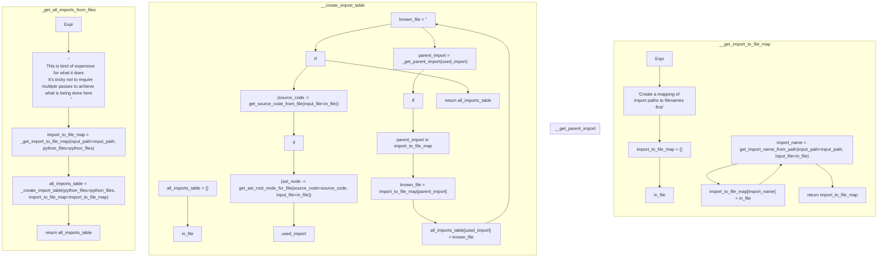

# ./src/pyremaid/ast_tools/import_map.py

### Imports

  - [pyremaid.ast_tools.get_ast_root_node_for_file](/docs/pyremaid/ast_tools/__init__.py.md)
  - [pyremaid.ast_tools.get_used_import_list](/docs/pyremaid/ast_tools/__init__.py.md)
  - [pyremaid.files.source.get_source_code_from_file](/docs/pyremaid/files/source.py.md)
  - [pyremaid.files.source.get_import_name_from_path](/docs/pyremaid/files/source.py.md)

---

---

<details>
<summary>Debug AST model dump</summary>

```
Module(
  body=[
    ImportFrom(
      module='pyremaid.ast_tools',
      names=[
        alias(
          name='get_ast_root_node_for_file',
          lineno=1,
          col_offset=31,
          end_lineno=1,
          end_col_offset=57),
        alias(
          name='get_used_import_list',
          lineno=1,
          col_offset=59,
          end_lineno=1,
          end_col_offset=79)],
      level=0,
      lineno=1,
      col_offset=0,
      end_lineno=1,
      end_col_offset=79),
    ImportFrom(
      module='pyremaid.files.source',
      names=[
        alias(
          name='get_source_code_from_file',
          lineno=2,
          col_offset=34,
          end_lineno=2,
          end_col_offset=59),
        alias(
          name='get_import_name_from_path',
          lineno=2,
          col_offset=61,
          end_lineno=2,
          end_col_offset=86)],
      level=0,
      lineno=2,
      col_offset=0,
      end_lineno=2,
      end_col_offset=86),
    FunctionDef(
      name='_get_import_to_file_map',
      args=arguments(
        posonlyargs=[],
        args=[
          arg(
            arg='input_path',
            annotation=Name(
              id='str',
              ctx=Load(),
              lineno=5,
              col_offset=40,
              end_lineno=5,
              end_col_offset=43),
            lineno=5,
            col_offset=28,
            end_lineno=5,
            end_col_offset=43),
          arg(
            arg='python_files',
            annotation=Subscript(
              value=Name(
                id='list',
                ctx=Load(),
                lineno=5,
                col_offset=59,
                end_lineno=5,
                end_col_offset=63),
              slice=Name(
                id='str',
                ctx=Load(),
                lineno=5,
                col_offset=64,
                end_lineno=5,
                end_col_offset=67),
              ctx=Load(),
              lineno=5,
              col_offset=59,
              end_lineno=5,
              end_col_offset=68),
            lineno=5,
            col_offset=45,
            end_lineno=5,
            end_col_offset=68)],
        kwonlyargs=[],
        kw_defaults=[],
        defaults=[]),
      body=[
        Expr(
          value=Constant(
            value='Create a mapping of import paths to filenames first',
            lineno=6,
            col_offset=4,
            end_lineno=6,
            end_col_offset=61),
          lineno=6,
          col_offset=4,
          end_lineno=6,
          end_col_offset=61),
        Assign(
          targets=[
            Name(
              id='import_to_file_map',
              ctx=Store(),
              lineno=7,
              col_offset=4,
              end_lineno=7,
              end_col_offset=22)],
          value=Dict(
            keys=[],
            values=[],
            lineno=7,
            col_offset=25,
            end_lineno=7,
            end_col_offset=27),
          lineno=7,
          col_offset=4,
          end_lineno=7,
          end_col_offset=27),
        For(
          target=Name(
            id='in_file',
            ctx=Store(),
            lineno=9,
            col_offset=8,
            end_lineno=9,
            end_col_offset=15),
          iter=Name(
            id='python_files',
            ctx=Load(),
            lineno=9,
            col_offset=19,
            end_lineno=9,
            end_col_offset=31),
          body=[
            Assign(
              targets=[
                Name(
                  id='import_name',
                  ctx=Store(),
                  lineno=10,
                  col_offset=8,
                  end_lineno=10,
                  end_col_offset=19)],
              value=Call(
                func=Name(
                  id='get_import_name_from_path',
                  ctx=Load(),
                  lineno=10,
                  col_offset=22,
                  end_lineno=10,
                  end_col_offset=47),
                args=[],
                keywords=[
                  keyword(
                    arg='input_path',
                    value=Name(
                      id='input_path',
                      ctx=Load(),
                      lineno=11,
                      col_offset=23,
                      end_lineno=11,
                      end_col_offset=33),
                    lineno=11,
                    col_offset=12,
                    end_lineno=11,
                    end_col_offset=33),
                  keyword(
                    arg='input_file',
                    value=Name(
                      id='in_file',
                      ctx=Load(),
                      lineno=11,
                      col_offset=46,
                      end_lineno=11,
                      end_col_offset=53),
                    lineno=11,
                    col_offset=35,
                    end_lineno=11,
                    end_col_offset=53)],
                lineno=10,
                col_offset=22,
                end_lineno=12,
                end_col_offset=9),
              lineno=10,
              col_offset=8,
              end_lineno=12,
              end_col_offset=9),
            Assign(
              targets=[
                Subscript(
                  value=Name(
                    id='import_to_file_map',
                    ctx=Load(),
                    lineno=13,
                    col_offset=8,
                    end_lineno=13,
                    end_col_offset=26),
                  slice=Name(
                    id='import_name',
                    ctx=Load(),
                    lineno=13,
                    col_offset=27,
                    end_lineno=13,
                    end_col_offset=38),
                  ctx=Store(),
                  lineno=13,
                  col_offset=8,
                  end_lineno=13,
                  end_col_offset=39)],
              value=Name(
                id='in_file',
                ctx=Load(),
                lineno=13,
                col_offset=42,
                end_lineno=13,
                end_col_offset=49),
              lineno=13,
              col_offset=8,
              end_lineno=13,
              end_col_offset=49)],
          orelse=[],
          lineno=9,
          col_offset=4,
          end_lineno=13,
          end_col_offset=49),
        Return(
          value=Name(
            id='import_to_file_map',
            ctx=Load(),
            lineno=15,
            col_offset=11,
            end_lineno=15,
            end_col_offset=29),
          lineno=15,
          col_offset=4,
          end_lineno=15,
          end_col_offset=29)],
      decorator_list=[],
      returns=Subscript(
        value=Name(
          id='dict',
          ctx=Load(),
          lineno=5,
          col_offset=73,
          end_lineno=5,
          end_col_offset=77),
        slice=Tuple(
          elts=[
            Name(
              id='str',
              ctx=Load(),
              lineno=5,
              col_offset=78,
              end_lineno=5,
              end_col_offset=81),
            Name(
              id='str',
              ctx=Load(),
              lineno=5,
              col_offset=83,
              end_lineno=5,
              end_col_offset=86)],
          ctx=Load(),
          lineno=5,
          col_offset=78,
          end_lineno=5,
          end_col_offset=86),
        ctx=Load(),
        lineno=5,
        col_offset=73,
        end_lineno=5,
        end_col_offset=87),
      lineno=5,
      col_offset=0,
      end_lineno=15,
      end_col_offset=29),
    FunctionDef(
      name='_get_parent_import',
      args=arguments(
        posonlyargs=[],
        args=[
          arg(
            arg='import_name',
            annotation=Name(
              id='str',
              ctx=Load(),
              lineno=18,
              col_offset=36,
              end_lineno=18,
              end_col_offset=39),
            lineno=18,
            col_offset=23,
            end_lineno=18,
            end_col_offset=39)],
        kwonlyargs=[],
        kw_defaults=[],
        defaults=[]),
      body=[
        Return(
          value=Subscript(
            value=Name(
              id='import_name',
              ctx=Load(),
              lineno=19,
              col_offset=11,
              end_lineno=19,
              end_col_offset=22),
            slice=Slice(
              upper=Call(
                func=Attribute(
                  value=Name(
                    id='import_name',
                    ctx=Load(),
                    lineno=19,
                    col_offset=25,
                    end_lineno=19,
                    end_col_offset=36),
                  attr='rfind',
                  ctx=Load(),
                  lineno=19,
                  col_offset=25,
                  end_lineno=19,
                  end_col_offset=42),
                args=[
                  Constant(
                    value='.',
                    lineno=19,
                    col_offset=43,
                    end_lineno=19,
                    end_col_offset=46)],
                keywords=[],
                lineno=19,
                col_offset=25,
                end_lineno=19,
                end_col_offset=47),
              lineno=19,
              col_offset=23,
              end_lineno=19,
              end_col_offset=47),
            ctx=Load(),
            lineno=19,
            col_offset=11,
            end_lineno=19,
            end_col_offset=48),
          lineno=19,
          col_offset=4,
          end_lineno=19,
          end_col_offset=48)],
      decorator_list=[],
      returns=Name(
        id='str',
        ctx=Load(),
        lineno=18,
        col_offset=44,
        end_lineno=18,
        end_col_offset=47),
      lineno=18,
      col_offset=0,
      end_lineno=19,
      end_col_offset=48),
    FunctionDef(
      name='_create_import_table',
      args=arguments(
        posonlyargs=[],
        args=[
          arg(
            arg='python_files',
            annotation=Subscript(
              value=Name(
                id='list',
                ctx=Load(),
                lineno=23,
                col_offset=18,
                end_lineno=23,
                end_col_offset=22),
              slice=Name(
                id='str',
                ctx=Load(),
                lineno=23,
                col_offset=23,
                end_lineno=23,
                end_col_offset=26),
              ctx=Load(),
              lineno=23,
              col_offset=18,
              end_lineno=23,
              end_col_offset=27),
            lineno=23,
            col_offset=4,
            end_lineno=23,
            end_col_offset=27),
          arg(
            arg='import_to_file_map',
            annotation=Subscript(
              value=Name(
                id='dict',
                ctx=Load(),
                lineno=23,
                col_offset=49,
                end_lineno=23,
                end_col_offset=53),
              slice=Tuple(
                elts=[
                  Name(
                    id='str',
                    ctx=Load(),
                    lineno=23,
                    col_offset=54,
                    end_lineno=23,
                    end_col_offset=57),
                  Name(
                    id='str',
                    ctx=Load(),
                    lineno=23,
                    col_offset=59,
                    end_lineno=23,
                    end_col_offset=62)],
                ctx=Load(),
                lineno=23,
                col_offset=54,
                end_lineno=23,
                end_col_offset=62),
              ctx=Load(),
              lineno=23,
              col_offset=49,
              end_lineno=23,
              end_col_offset=63),
            lineno=23,
            col_offset=29,
            end_lineno=23,
            end_col_offset=63)],
        kwonlyargs=[],
        kw_defaults=[],
        defaults=[]),
      body=[
        Assign(
          targets=[
            Name(
              id='all_imports_table',
              ctx=Store(),
              lineno=26,
              col_offset=4,
              end_lineno=26,
              end_col_offset=21)],
          value=Dict(
            keys=[],
            values=[],
            lineno=26,
            col_offset=24,
            end_lineno=26,
            end_col_offset=26),
          lineno=26,
          col_offset=4,
          end_lineno=26,
          end_col_offset=26),
        For(
          target=Name(
            id='in_file',
            ctx=Store(),
            lineno=28,
            col_offset=8,
            end_lineno=28,
            end_col_offset=15),
          iter=Name(
            id='python_files',
            ctx=Load(),
            lineno=28,
            col_offset=19,
            end_lineno=28,
            end_col_offset=31),
          body=[
            If(
              test=NamedExpr(
                target=Name(
                  id='source_code',
                  ctx=Store(),
                  lineno=29,
                  col_offset=11,
                  end_lineno=29,
                  end_col_offset=22),
                value=Call(
                  func=Name(
                    id='get_source_code_from_file',
                    ctx=Load(),
                    lineno=29,
                    col_offset=26,
                    end_lineno=29,
                    end_col_offset=51),
                  args=[],
                  keywords=[
                    keyword(
                      arg='input_file',
                      value=Name(
                        id='in_file',
                        ctx=Load(),
                        lineno=29,
                        col_offset=63,
                        end_lineno=29,
                        end_col_offset=70),
                      lineno=29,
                      col_offset=52,
                      end_lineno=29,
                      end_col_offset=70)],
                  lineno=29,
                  col_offset=26,
                  end_lineno=29,
                  end_col_offset=71),
                lineno=29,
                col_offset=11,
                end_lineno=29,
                end_col_offset=71),
              body=[
                If(
                  test=NamedExpr(
                    target=Name(
                      id='ast_node',
                      ctx=Store(),
                      lineno=30,
                      col_offset=15,
                      end_lineno=30,
                      end_col_offset=23),
                    value=Call(
                      func=Name(
                        id='get_ast_root_node_for_file',
                        ctx=Load(),
                        lineno=30,
                        col_offset=27,
                        end_lineno=30,
                        end_col_offset=53),
                      args=[],
                      keywords=[
                        keyword(
                          arg='source_code',
                          value=Name(
                            id='source_code',
                            ctx=Load(),
                            lineno=31,
                            col_offset=28,
                            end_lineno=31,
                            end_col_offset=39),
                          lineno=31,
                          col_offset=16,
                          end_lineno=31,
                          end_col_offset=39),
                        keyword(
                          arg='input_file',
                          value=Name(
                            id='in_file',
                            ctx=Load(),
                            lineno=32,
                            col_offset=27,
                            end_lineno=32,
                            end_col_offset=34),
                          lineno=32,
                          col_offset=16,
                          end_lineno=32,
                          end_col_offset=34)],
                      lineno=30,
                      col_offset=27,
                      end_lineno=33,
                      end_col_offset=13),
                    lineno=30,
                    col_offset=15,
                    end_lineno=33,
                    end_col_offset=13),
                  body=[
                    For(
                      target=Name(
                        id='used_import',
                        ctx=Store(),
                        lineno=34,
                        col_offset=20,
                        end_lineno=34,
                        end_col_offset=31),
                      iter=Call(
                        func=Name(
                          id='get_used_import_list',
                          ctx=Load(),
                          lineno=34,
                          col_offset=35,
                          end_lineno=34,
                          end_col_offset=55),
                        args=[],
                        keywords=[
                          keyword(
                            arg='ast_node',
                            value=Name(
                              id='ast_node',
                              ctx=Load(),
                              lineno=34,
                              col_offset=65,
                              end_lineno=34,
                              end_col_offset=73),
                            lineno=34,
                            col_offset=56,
                            end_lineno=34,
                            end_col_offset=73)],
                        lineno=34,
                        col_offset=35,
                        end_lineno=34,
                        end_col_offset=74),
                      body=[
                        Assign(
                          targets=[
                            Name(
                              id='known_file',
                              ctx=Store(),
                              lineno=35,
                              col_offset=20,
                              end_lineno=35,
                              end_col_offset=30)],
                          value=Constant(
                            value='',
                            lineno=35,
                            col_offset=33,
                            end_lineno=35,
                            end_col_offset=35),
                          lineno=35,
                          col_offset=20,
                          end_lineno=35,
                          end_col_offset=35),
                        Assign(
                          targets=[
                            Name(
                              id='parent_import',
                              ctx=Store(),
                              lineno=36,
                              col_offset=20,
                              end_lineno=36,
                              end_col_offset=33)],
                          value=Call(
                            func=Name(
                              id='_get_parent_import',
                              ctx=Load(),
                              lineno=36,
                              col_offset=36,
                              end_lineno=36,
                              end_col_offset=54),
                            args=[
                              Name(
                                id='used_import',
                                ctx=Load(),
                                lineno=36,
                                col_offset=55,
                                end_lineno=36,
                                end_col_offset=66)],
                            keywords=[],
                            lineno=36,
                            col_offset=36,
                            end_lineno=36,
                            end_col_offset=67),
                          lineno=36,
                          col_offset=20,
                          end_lineno=36,
                          end_col_offset=67),
                        If(
                          test=Compare(
                            left=Name(
                              id='parent_import',
                              ctx=Load(),
                              lineno=37,
                              col_offset=23,
                              end_lineno=37,
                              end_col_offset=36),
                            ops=[
                              In()],
                            comparators=[
                              Name(
                                id='import_to_file_map',
                                ctx=Load(),
                                lineno=37,
                                col_offset=40,
                                end_lineno=37,
                                end_col_offset=58)],
                            lineno=37,
                            col_offset=23,
                            end_lineno=37,
                            end_col_offset=58),
                          body=[
                            Assign(
                              targets=[
                                Name(
                                  id='known_file',
                                  ctx=Store(),
                                  lineno=38,
                                  col_offset=24,
                                  end_lineno=38,
                                  end_col_offset=34)],
                              value=Subscript(
                                value=Name(
                                  id='import_to_file_map',
                                  ctx=Load(),
                                  lineno=38,
                                  col_offset=37,
                                  end_lineno=38,
                                  end_col_offset=55),
                                slice=Name(
                                  id='parent_import',
                                  ctx=Load(),
                                  lineno=38,
                                  col_offset=56,
                                  end_lineno=38,
                                  end_col_offset=69),
                                ctx=Load(),
                                lineno=38,
                                col_offset=37,
                                end_lineno=38,
                                end_col_offset=70),
                              lineno=38,
                              col_offset=24,
                              end_lineno=38,
                              end_col_offset=70)],
                          orelse=[],
                          lineno=37,
                          col_offset=20,
                          end_lineno=38,
                          end_col_offset=70),
                        Assign(
                          targets=[
                            Subscript(
                              value=Name(
                                id='all_imports_table',
                                ctx=Load(),
                                lineno=39,
                                col_offset=20,
                                end_lineno=39,
                                end_col_offset=37),
                              slice=Name(
                                id='used_import',
                                ctx=Load(),
                                lineno=39,
                                col_offset=38,
                                end_lineno=39,
                                end_col_offset=49),
                              ctx=Store(),
                              lineno=39,
                              col_offset=20,
                              end_lineno=39,
                              end_col_offset=50)],
                          value=Name(
                            id='known_file',
                            ctx=Load(),
                            lineno=39,
                            col_offset=53,
                            end_lineno=39,
                            end_col_offset=63),
                          lineno=39,
                          col_offset=20,
                          end_lineno=39,
                          end_col_offset=63)],
                      orelse=[],
                      lineno=34,
                      col_offset=16,
                      end_lineno=39,
                      end_col_offset=63)],
                  orelse=[],
                  lineno=30,
                  col_offset=12,
                  end_lineno=39,
                  end_col_offset=63)],
              orelse=[],
              lineno=29,
              col_offset=8,
              end_lineno=39,
              end_col_offset=63)],
          orelse=[],
          lineno=28,
          col_offset=4,
          end_lineno=39,
          end_col_offset=63),
        Return(
          value=Name(
            id='all_imports_table',
            ctx=Load(),
            lineno=41,
            col_offset=11,
            end_lineno=41,
            end_col_offset=28),
          lineno=41,
          col_offset=4,
          end_lineno=41,
          end_col_offset=28)],
      decorator_list=[],
      returns=Subscript(
        value=Name(
          id='dict',
          ctx=Load(),
          lineno=24,
          col_offset=5,
          end_lineno=24,
          end_col_offset=9),
        slice=Tuple(
          elts=[
            Name(
              id='str',
              ctx=Load(),
              lineno=24,
              col_offset=10,
              end_lineno=24,
              end_col_offset=13),
            Name(
              id='str',
              ctx=Load(),
              lineno=24,
              col_offset=15,
              end_lineno=24,
              end_col_offset=18)],
          ctx=Load(),
          lineno=24,
          col_offset=10,
          end_lineno=24,
          end_col_offset=18),
        ctx=Load(),
        lineno=24,
        col_offset=5,
        end_lineno=24,
        end_col_offset=19),
      lineno=22,
      col_offset=0,
      end_lineno=41,
      end_col_offset=28),
    FunctionDef(
      name='get_all_imports_from_files',
      args=arguments(
        posonlyargs=[],
        args=[
          arg(
            arg='input_path',
            annotation=Name(
              id='str',
              ctx=Load(),
              lineno=45,
              col_offset=16,
              end_lineno=45,
              end_col_offset=19),
            lineno=45,
            col_offset=4,
            end_lineno=45,
            end_col_offset=19),
          arg(
            arg='python_files',
            annotation=Subscript(
              value=Name(
                id='list',
                ctx=Load(),
                lineno=45,
                col_offset=35,
                end_lineno=45,
                end_col_offset=39),
              slice=Name(
                id='str',
                ctx=Load(),
                lineno=45,
                col_offset=40,
                end_lineno=45,
                end_col_offset=43),
              ctx=Load(),
              lineno=45,
              col_offset=35,
              end_lineno=45,
              end_col_offset=44),
            lineno=45,
            col_offset=21,
            end_lineno=45,
            end_col_offset=44)],
        kwonlyargs=[],
        kw_defaults=[],
        defaults=[]),
      body=[
        Expr(
          value=Constant(
            value="\n    This is kind of expensive for what it does\n    It's tricky not to require multiple passes to achieve what is being done here\n    ",
            lineno=47,
            col_offset=4,
            end_lineno=50,
            end_col_offset=7),
          lineno=47,
          col_offset=4,
          end_lineno=50,
          end_col_offset=7),
        Assign(
          targets=[
            Name(
              id='import_to_file_map',
              ctx=Store(),
              lineno=52,
              col_offset=4,
              end_lineno=52,
              end_col_offset=22)],
          value=Call(
            func=Name(
              id='_get_import_to_file_map',
              ctx=Load(),
              lineno=52,
              col_offset=25,
              end_lineno=52,
              end_col_offset=48),
            args=[],
            keywords=[
              keyword(
                arg='input_path',
                value=Name(
                  id='input_path',
                  ctx=Load(),
                  lineno=53,
                  col_offset=19,
                  end_lineno=53,
                  end_col_offset=29),
                lineno=53,
                col_offset=8,
                end_lineno=53,
                end_col_offset=29),
              keyword(
                arg='python_files',
                value=Name(
                  id='python_files',
                  ctx=Load(),
                  lineno=53,
                  col_offset=44,
                  end_lineno=53,
                  end_col_offset=56),
                lineno=53,
                col_offset=31,
                end_lineno=53,
                end_col_offset=56)],
            lineno=52,
            col_offset=25,
            end_lineno=54,
            end_col_offset=5),
          lineno=52,
          col_offset=4,
          end_lineno=54,
          end_col_offset=5),
        Assign(
          targets=[
            Name(
              id='all_imports_table',
              ctx=Store(),
              lineno=56,
              col_offset=4,
              end_lineno=56,
              end_col_offset=21)],
          value=Call(
            func=Name(
              id='_create_import_table',
              ctx=Load(),
              lineno=56,
              col_offset=24,
              end_lineno=56,
              end_col_offset=44),
            args=[],
            keywords=[
              keyword(
                arg='python_files',
                value=Name(
                  id='python_files',
                  ctx=Load(),
                  lineno=57,
                  col_offset=21,
                  end_lineno=57,
                  end_col_offset=33),
                lineno=57,
                col_offset=8,
                end_lineno=57,
                end_col_offset=33),
              keyword(
                arg='import_to_file_map',
                value=Name(
                  id='import_to_file_map',
                  ctx=Load(),
                  lineno=57,
                  col_offset=54,
                  end_lineno=57,
                  end_col_offset=72),
                lineno=57,
                col_offset=35,
                end_lineno=57,
                end_col_offset=72)],
            lineno=56,
            col_offset=24,
            end_lineno=58,
            end_col_offset=5),
          lineno=56,
          col_offset=4,
          end_lineno=58,
          end_col_offset=5),
        Return(
          value=Name(
            id='all_imports_table',
            ctx=Load(),
            lineno=60,
            col_offset=11,
            end_lineno=60,
            end_col_offset=28),
          lineno=60,
          col_offset=4,
          end_lineno=60,
          end_col_offset=28)],
      decorator_list=[],
      returns=Subscript(
        value=Name(
          id='dict',
          ctx=Load(),
          lineno=46,
          col_offset=5,
          end_lineno=46,
          end_col_offset=9),
        slice=Tuple(
          elts=[
            Name(
              id='str',
              ctx=Load(),
              lineno=46,
              col_offset=10,
              end_lineno=46,
              end_col_offset=13),
            Name(
              id='str',
              ctx=Load(),
              lineno=46,
              col_offset=15,
              end_lineno=46,
              end_col_offset=18)],
          ctx=Load(),
          lineno=46,
          col_offset=10,
          end_lineno=46,
          end_col_offset=18),
        ctx=Load(),
        lineno=46,
        col_offset=5,
        end_lineno=46,
        end_col_offset=19),
      lineno=44,
      col_offset=0,
      end_lineno=60,
      end_col_offset=28)],
  type_ignores=[])
```
</details>

