```mermaid
flowchart TB
  _c51_f53_l54_n166["Expr"]
  _c51_f53_l54_n167["self.found_imports.append(f'{i.name}.*')"]
  _c51_f55_n168["module = node.module"]
  _c51_f55_l56["i"]
  _c51_f55_l56_n169["Expr"]
  _c51_f55_l56_n170["self.found_imports.append(f'{module}.{i.name}')"]
  _c58_f59_n173["self.elements: list[MermaidElement] = []"]
  _c58_f59_n174["self.prev_node: Optional[AST] = None"]
  _c58_f59_n175["self.prefix = prefix"]
  _c58_f60_n176["value = cls.count"]
  _c58_f60_n177["cls.count += 1"]
  _c58_f60_n178["return value"]
  _c58_f63_n181["block_generator = BlockGenerator(prefix=self.prefix)"]
  _c58_f63_n182["Expr"]
  _c58_f63_n183["block_generator.visit(node)"]
  _c58_f63_n184["Expr"]
  _c58_f63_n185["self.elements.extend(block_generator.get_list_of_elements())"]
  _c58_f64_n186["block_generator = BlockGenerator(prefix=self.prefix)"]
  _c58_f64_n187["Expr"]
  _c58_f64_n188["block_generator.visit(node)"]
  _c58_f64_n189["Expr"]
  _c58_f64_n190["self.elements.extend(block_generator.get_list_of_elements())"]
  _c58_f65_n191["block_generator = BlockGenerator(prefix=self.prefix)"]
  _c58_f65_n192["Expr"]
  _c58_f65_n193["block_generator.visit(node)"]
  _c58_f65_n194["for_loop_elements = block_generator.get_list_of_elements()"]
  _c58_f65_n195["loop_start = for_loop_elements[0]"]
  _c58_f65_n196["If"]
  _c58_f65_n197["isinstance(loop_start, MermaidLink)"]
  _c58_f65_n198["loop_start = loop_start.from_"]
  _c58_f65_n199["loop_end = for_loop_elements[-1]"]
  _c58_f65_n200["If"]
  _c58_f65_n201["isinstance(loop_end, MermaidLink)"]
  _c58_f65_n202["loop_end = loop_end.to"]
  _c58_f65_n203["If"]
  _c58_f65_n204["self.prev_node"]
  _c58_f65_n205["Expr"]
  _c58_f65_n206["self.elements.append(MermaidLink(from_=self.prev_node, to=loop_start))"]
  _c58_f65_n207["Expr"]
  _c58_f65_n208["self.elements.extend(for_loop_elements)"]
  _c58_f65_n209["self.prev_node = loop_end"]
  _c58_f66_n210["mermaid_data = MermaidNode(ast_node=node, mermaid_safe_name=f'{self.prefix}_n{LinkGenerator._count()}', display_name=_sanitize(unparse(node)))"]
  _c58_f66_n211["If"]
  _c58_f66_n212["self.prev_node"]
  _c58_f66_n213["Expr"]
  _c58_f66_n214["self.elements.append(MermaidLink(from_=self.prev_node, to=mermaid_data))"]
  _c58_f66_n215["self.prev_node = mermaid_data"]
  _c58_n172["count: int = 0"]
  _c58_n216["visit_Await = _generic_expression_expand"]
  _c58_n217["visit_AnnAssign = _generic_expression_expand"]
  _c58_n218["visit_Assign = _generic_expression_expand"]
  _c58_n219["visit_Attribute = _generic_expression_expand"]
  _c58_n220["visit_AugAssign = _generic_expression_expand"]
  _c58_n221["visit_BinOp = _generic_expression_expand"]
  _c58_n222["visit_BoolOp = _generic_expression_expand"]
  _c58_n223["visit_Call = _generic_expression_expand"]
  _c58_n224["visit_Compare = _generic_expression_expand"]
  _c58_n225["visit_Constant = _generic_expression_expand"]
  _c58_n226["visit_Delete = _generic_expression_expand"]
  _c58_n227["visit_Dict = _generic_expression_expand"]
  _c58_n228["visit_DictComp = _generic_expression_expand"]
  _c58_n229["visit_FormattedValue = _generic_expression_expand"]
  _c58_n230["visit_GeneratorExp = _generic_expression_expand"]
  _c58_n231["visit_JoinedStr = _generic_expression_expand"]
  _c58_n232["visit_Lambda = _generic_expression_expand"]
  _c58_n233["visit_List = _generic_expression_expand"]
  _c58_n234["visit_ListComp = _generic_expression_expand"]
  _c58_n235["visit_Name = _generic_expression_expand"]
  _c58_n236["visit_NamedExpr = _generic_expression_expand"]
  _c58_n237["visit_Return = _generic_expression_expand"]
  _c58_n238["visit_Set = _generic_expression_expand"]
  _c58_n239["visit_SetComp = _generic_expression_expand"]
  _c58_n240["visit_Slice = _generic_expression_expand"]
  _c58_n241["visit_Starred = _generic_expression_expand"]
  _c58_n242["visit_Subscript = _generic_expression_expand"]
  _c58_n243["visit_Tuple = _generic_expression_expand"]
  _c58_n244["visit_UnaryOp = _generic_expression_expand"]
  _c58_n245["visit_Yield = _generic_expression_expand"]
  _c58_n246["visit_YieldFrom = _generic_expression_expand"]
  _c58_f67_n247["mermaid_data = MermaidNode(ast_node=node, mermaid_safe_name=f'{self.prefix}_n{LinkGenerator._count()}', display_name=type(node).__name__)"]
  _c58_f67_n248["If"]
  _c58_f67_n249["self.prev_node"]
  _c58_f67_n250["Expr"]
  _c58_f67_n251["self.elements.append(MermaidLink(from_=self.prev_node, to=mermaid_data))"]
  _c58_f67_n252["self.prev_node = mermaid_data"]
  _c58_f67_n253["return super().generic_visit(node)"]
  _c58_f68_n254["If"]
  _c58_f68_n255["self.elements"]
  _c58_f68_n256["return self.elements"]
  _c58_f68_n257["return [self.prev_node]"]
  _c69_f70_n259["self.elements: list[MermaidElement] = []"]
  _c69_f70_n260["self.prefix = prefix"]
  _c69_f71_n261["value = cls.count"]
  _c69_f71_n262["cls.count += 1"]
  _c69_f71_n263["return value"]
  _c69_f72_n264["Expr"]
  _c69_f72_n265["'This is a block, we might want a subgraph, so parse content'"]
  _c69_f72_n266["link_generator = LinkGenerator()"]
  _c69_f72_l73["sub_element"]
  _c69_f72_l73_n267["Expr"]
  _c69_f72_l73_n268["link_generator.visit(node=sub_element)"]
  _c69_f72_n269["mermaid_block = MermaidModule(ast_node=block_node, mermaid_safe_name=f'{self.prefix}_m{BlockGenerator._count()}', block_contents=link_generator.get_list_of_elements(), display_name='module')"]
  _c69_f72_n270["Expr"]
  _c69_f72_n271["self.elements.append(mermaid_block)"]
  _c69_f74_n272["Expr"]
  _c69_f74_n273["'This is a block, we want a subgraph, so parse content'"]
  _c69_f74_n274["mermaid_safe_name = f'{self.prefix}_f{BlockGenerator._count()}'"]
  _c69_f74_n275["link_generator = LinkGenerator(prefix=mermaid_safe_name)"]
  _c69_f74_l75["sub_element"]
  _c69_f74_l75_n276["Expr"]
  _c69_f74_l75_n277["link_generator.visit(node=sub_element)"]
  _c69_f74_n278["mermaid_block = MermaidFunction(ast_node=block_node, mermaid_safe_name=mermaid_safe_name, block_contents=link_generator.get_list_of_elements(), display_name=f'{self.prefix}_{block_node.name}')"]
  _c69_f74_n279["Expr"]
  _c69_f74_n280["self.elements.append(mermaid_block)"]
  _c69_f76_n281["Expr"]
  _c69_f76_n282["'This is a block, we want a subgraph, so parse content'"]
  _c69_f76_n283["mermaid_safe_name = f'{self.prefix}_c{BlockGenerator._count()}'"]
  _c69_f76_n284["link_generator = LinkGenerator(prefix=mermaid_safe_name)"]
  _c69_f76_l77["sub_element"]
  _c69_f76_l77_n285["Expr"]
  _c69_f76_l77_n286["link_generator.visit(node=sub_element)"]
  _c69_f76_n287["mermaid_block = MermaidClass(ast_node=block_node, mermaid_safe_name=mermaid_safe_name, block_contents=link_generator.get_list_of_elements(), display_name=block_node.name)"]
  _c69_f76_n288["Expr"]
  _c69_f76_n289["self.elements.append(mermaid_block)"]
  _c69_f78_n290["Expr"]
  _c69_f78_n291["'This is a block, we want a subgraph, so parse content'"]
  _c69_f78_n292["mermaid_safe_name = f'{self.prefix}_l{BlockGenerator._count()}'"]
  _c69_f78_n293["link_generator = LinkGenerator(prefix=mermaid_safe_name)"]
  _c69_f78_l79["sub_element"]
  _c69_f78_l79_n294["Expr"]
  _c69_f78_l79_n295["link_generator.visit(node=sub_element)"]
  _c69_f78_n296["for_loop_elements = link_generator.get_list_of_elements()"]
  _c69_f78_n297["loop_start = for_loop_elements[0]"]
  _c69_f78_n298["If"]
  _c69_f78_n299["isinstance(loop_start, MermaidLink)"]
  _c69_f78_n300["loop_start = loop_start.from_"]
  _c69_f78_n301["loop_end = for_loop_elements[-1]"]
  _c69_f78_n302["If"]
  _c69_f78_n303["isinstance(loop_end, MermaidLink)"]
  _c69_f78_n304["loop_end = loop_end.to"]
  _c69_f78_n305["mermaid_block = MermaidFor(ast_node=block_node, mermaid_safe_name=mermaid_safe_name, block_contents=for_loop_elements, display_name=unparse(block_node.target), target=unparse(block_node.target), iterator=unparse(block_node.iter))"]
  _c69_f78_n306["Expr"]
  _c69_f78_n307["self.elements.append(mermaid_block)"]
  _c69_f78_n308["Expr"]
  _c69_f78_n309["self.elements.append(MermaidLink(from_=loop_end, to=loop_start))"]
  _c69_f80_n310["Expr"]
  _c69_f80_n311["'Non block nodes are not interesting here'"]
  _c69_f80_n312["Pass"]

  subgraph __sanitize
    direction TB
  end
  subgraph ImportNodeFinder
    direction TB
    subgraph _c51___init__
      direction TB
    end
    subgraph _c51_visit_Import
      direction TB
      %% loop i
        _c51_f53_l54_n166 --> _c51_f53_l54_n167
      %% end i
      _c51_f53_l54_n167 --> _c51_f53_l54_n166
    end
    subgraph _c51_visit_ImportFrom
      direction TB
      _c51_f55_n168 --> _c51_f55_l56
      %% loop i
        _c51_f55_l56_n169 --> _c51_f55_l56_n170
      %% end i
      _c51_f55_l56_n170 --> _c51_f55_l56_n169
    end
    subgraph _c51_get_found_imports
      direction TB
    end
  end
  subgraph LinkGenerator
    direction TB
    subgraph _c58___init__
      direction TB
      _c58_f59_n173 --> _c58_f59_n174
      _c58_f59_n174 --> _c58_f59_n175
    end
    subgraph _c58__count
      direction TB
      _c58_f60_n176 --> _c58_f60_n177
      _c58_f60_n177 --> _c58_f60_n178
    end
    subgraph _c58_visit_Import
      direction TB
    end
    subgraph _c58_visit_ImportFrom
      direction TB
    end
    subgraph _c58_visit_FunctionDef
      direction TB
      _c58_f63_n181 --> _c58_f63_n182
      _c58_f63_n182 --> _c58_f63_n183
      _c58_f63_n183 --> _c58_f63_n184
      _c58_f63_n184 --> _c58_f63_n185
    end
    subgraph _c58_visit_ClassDef
      direction TB
      _c58_f64_n186 --> _c58_f64_n187
      _c58_f64_n187 --> _c58_f64_n188
      _c58_f64_n188 --> _c58_f64_n189
      _c58_f64_n189 --> _c58_f64_n190
    end
    subgraph _c58_visit_For
      direction TB
      _c58_f65_n191 --> _c58_f65_n192
      _c58_f65_n192 --> _c58_f65_n193
      _c58_f65_n193 --> _c58_f65_n194
      _c58_f65_n194 --> _c58_f65_n195
      _c58_f65_n195 --> _c58_f65_n196
      _c58_f65_n196 --> _c58_f65_n197
      _c58_f65_n197 --> _c58_f65_n198
      _c58_f65_n198 --> _c58_f65_n199
      _c58_f65_n199 --> _c58_f65_n200
      _c58_f65_n200 --> _c58_f65_n201
      _c58_f65_n201 --> _c58_f65_n202
      _c58_f65_n202 --> _c58_f65_n203
      _c58_f65_n203 --> _c58_f65_n204
      _c58_f65_n204 --> _c58_f65_n205
      _c58_f65_n205 --> _c58_f65_n206
      _c58_f65_n206 --> _c58_f65_n207
      _c58_f65_n207 --> _c58_f65_n208
      _c58_f65_n208 --> _c58_f65_n209
    end
    subgraph _c58__generic_expression_expand
      direction TB
      _c58_f66_n210 --> _c58_f66_n211
      _c58_f66_n211 --> _c58_f66_n212
      _c58_f66_n212 --> _c58_f66_n213
      _c58_f66_n213 --> _c58_f66_n214
      _c58_f66_n214 --> _c58_f66_n215
    end
    _c58_n172 --> _c58_n216
    _c58_n216 --> _c58_n217
    _c58_n217 --> _c58_n218
    _c58_n218 --> _c58_n219
    _c58_n219 --> _c58_n220
    _c58_n220 --> _c58_n221
    _c58_n221 --> _c58_n222
    _c58_n222 --> _c58_n223
    _c58_n223 --> _c58_n224
    _c58_n224 --> _c58_n225
    _c58_n225 --> _c58_n226
    _c58_n226 --> _c58_n227
    _c58_n227 --> _c58_n228
    _c58_n228 --> _c58_n229
    _c58_n229 --> _c58_n230
    _c58_n230 --> _c58_n231
    _c58_n231 --> _c58_n232
    _c58_n232 --> _c58_n233
    _c58_n233 --> _c58_n234
    _c58_n234 --> _c58_n235
    _c58_n235 --> _c58_n236
    _c58_n236 --> _c58_n237
    _c58_n237 --> _c58_n238
    _c58_n238 --> _c58_n239
    _c58_n239 --> _c58_n240
    _c58_n240 --> _c58_n241
    _c58_n241 --> _c58_n242
    _c58_n242 --> _c58_n243
    _c58_n243 --> _c58_n244
    _c58_n244 --> _c58_n245
    _c58_n245 --> _c58_n246
    subgraph _c58_generic_visit
      direction TB
      _c58_f67_n247 --> _c58_f67_n248
      _c58_f67_n248 --> _c58_f67_n249
      _c58_f67_n249 --> _c58_f67_n250
      _c58_f67_n250 --> _c58_f67_n251
      _c58_f67_n251 --> _c58_f67_n252
      _c58_f67_n252 --> _c58_f67_n253
    end
    subgraph _c58_get_list_of_elements
      direction TB
      _c58_f68_n254 --> _c58_f68_n255
      _c58_f68_n255 --> _c58_f68_n256
      _c58_f68_n256 --> _c58_f68_n257
    end
  end
  subgraph BlockGenerator
    direction TB
    subgraph _c69___init__
      direction TB
      _c69_f70_n259 --> _c69_f70_n260
    end
    subgraph _c69__count
      direction TB
      _c69_f71_n261 --> _c69_f71_n262
      _c69_f71_n262 --> _c69_f71_n263
    end
    subgraph _c69_visit_Module
      direction TB
      _c69_f72_n264 --> _c69_f72_n265
      _c69_f72_n265 --> _c69_f72_n266
      _c69_f72_n266 --> _c69_f72_l73
      %% loop sub_element
        _c69_f72_l73_n267 --> _c69_f72_l73_n268
      %% end sub_element
      _c69_f72_l73_n268 --> _c69_f72_l73_n267
      _c69_f72_l73_n267 --> _c69_f72_n269
      _c69_f72_n269 --> _c69_f72_n270
      _c69_f72_n270 --> _c69_f72_n271
    end
    subgraph _c69_visit_FunctionDef
      direction TB
      _c69_f74_n272 --> _c69_f74_n273
      _c69_f74_n273 --> _c69_f74_n274
      _c69_f74_n274 --> _c69_f74_n275
      _c69_f74_n275 --> _c69_f74_l75
      %% loop sub_element
        _c69_f74_l75_n276 --> _c69_f74_l75_n277
      %% end sub_element
      _c69_f74_l75_n277 --> _c69_f74_l75_n276
      _c69_f74_l75_n276 --> _c69_f74_n278
      _c69_f74_n278 --> _c69_f74_n279
      _c69_f74_n279 --> _c69_f74_n280
    end
    subgraph _c69_visit_ClassDef
      direction TB
      _c69_f76_n281 --> _c69_f76_n282
      _c69_f76_n282 --> _c69_f76_n283
      _c69_f76_n283 --> _c69_f76_n284
      _c69_f76_n284 --> _c69_f76_l77
      %% loop sub_element
        _c69_f76_l77_n285 --> _c69_f76_l77_n286
      %% end sub_element
      _c69_f76_l77_n286 --> _c69_f76_l77_n285
      _c69_f76_l77_n285 --> _c69_f76_n287
      _c69_f76_n287 --> _c69_f76_n288
      _c69_f76_n288 --> _c69_f76_n289
    end
    subgraph _c69_visit_For
      direction TB
      _c69_f78_n290 --> _c69_f78_n291
      _c69_f78_n291 --> _c69_f78_n292
      _c69_f78_n292 --> _c69_f78_n293
      _c69_f78_n293 --> _c69_f78_l79
      %% loop sub_element
        _c69_f78_l79_n294 --> _c69_f78_l79_n295
      %% end sub_element
      _c69_f78_l79_n295 --> _c69_f78_l79_n294
      _c69_f78_l79_n294 --> _c69_f78_n296
      _c69_f78_n296 --> _c69_f78_n297
      _c69_f78_n297 --> _c69_f78_n298
      _c69_f78_n298 --> _c69_f78_n299
      _c69_f78_n299 --> _c69_f78_n300
      _c69_f78_n300 --> _c69_f78_n301
      _c69_f78_n301 --> _c69_f78_n302
      _c69_f78_n302 --> _c69_f78_n303
      _c69_f78_n303 --> _c69_f78_n304
      _c69_f78_n304 --> _c69_f78_n305
      _c69_f78_n305 --> _c69_f78_n306
      _c69_f78_n306 --> _c69_f78_n307
      _c69_f78_n307 --> _c69_f78_n308
      _c69_f78_n308 --> _c69_f78_n309
    end
    subgraph _c69_generic_visit
      direction TB
      _c69_f80_n310 --> _c69_f80_n311
      _c69_f80_n311 --> _c69_f80_n312
    end
    subgraph _c69_get_list_of_elements
      direction TB
    end
  end

```

# ./src/pyremaid/ast_tools/visitors.py

### Imports

  - ast.AST
  - ast.ClassDef
  - ast.For
  - ast.FunctionDef
  - ast.Import
  - ast.ImportFrom
  - ast.Module
  - ast.NodeVisitor
  - ast.unparse
  - [models.MermaidClass](/docs/pyremaid/models.py.md)
  - [models.MermaidElement](/docs/pyremaid/models.py.md)
  - [models.MermaidFor](/docs/pyremaid/models.py.md)
  - [models.MermaidFunction](/docs/pyremaid/models.py.md)
  - [models.MermaidLink](/docs/pyremaid/models.py.md)
  - [models.MermaidModule](/docs/pyremaid/models.py.md)
  - [models.MermaidNode](/docs/pyremaid/models.py.md)
  - typing.Any
  - typing.Optional

---

---

<details>
<summary>Debug AST model dump</summary>

```
Module(
  body=[
    ImportFrom(
      module='ast',
      names=[
        alias(
          name='AST',
          lineno=2,
          col_offset=4,
          end_lineno=2,
          end_col_offset=7),
        alias(
          name='ClassDef',
          lineno=3,
          col_offset=4,
          end_lineno=3,
          end_col_offset=12),
        alias(
          name='For',
          lineno=4,
          col_offset=4,
          end_lineno=4,
          end_col_offset=7),
        alias(
          name='FunctionDef',
          lineno=5,
          col_offset=4,
          end_lineno=5,
          end_col_offset=15),
        alias(
          name='Import',
          lineno=6,
          col_offset=4,
          end_lineno=6,
          end_col_offset=10),
        alias(
          name='ImportFrom',
          lineno=7,
          col_offset=4,
          end_lineno=7,
          end_col_offset=14),
        alias(
          name='Module',
          lineno=8,
          col_offset=4,
          end_lineno=8,
          end_col_offset=10),
        alias(
          name='NodeVisitor',
          lineno=9,
          col_offset=4,
          end_lineno=9,
          end_col_offset=15),
        alias(
          name='unparse',
          lineno=10,
          col_offset=4,
          end_lineno=10,
          end_col_offset=11)],
      level=0,
      lineno=1,
      col_offset=0,
      end_lineno=11,
      end_col_offset=1),
    ImportFrom(
      module='models',
      names=[
        alias(
          name='MermaidClass',
          lineno=13,
          col_offset=4,
          end_lineno=13,
          end_col_offset=16),
        alias(
          name='MermaidElement',
          lineno=14,
          col_offset=4,
          end_lineno=14,
          end_col_offset=18),
        alias(
          name='MermaidFor',
          lineno=15,
          col_offset=4,
          end_lineno=15,
          end_col_offset=14),
        alias(
          name='MermaidFunction',
          lineno=16,
          col_offset=4,
          end_lineno=16,
          end_col_offset=19),
        alias(
          name='MermaidLink',
          lineno=17,
          col_offset=4,
          end_lineno=17,
          end_col_offset=15),
        alias(
          name='MermaidModule',
          lineno=18,
          col_offset=4,
          end_lineno=18,
          end_col_offset=17),
        alias(
          name='MermaidNode',
          lineno=19,
          col_offset=4,
          end_lineno=19,
          end_col_offset=15)],
      level=0,
      lineno=12,
      col_offset=0,
      end_lineno=20,
      end_col_offset=1),
    ImportFrom(
      module='typing',
      names=[
        alias(
          name='Any',
          lineno=22,
          col_offset=19,
          end_lineno=22,
          end_col_offset=22),
        alias(
          name='Optional',
          lineno=22,
          col_offset=24,
          end_lineno=22,
          end_col_offset=32)],
      level=0,
      lineno=22,
      col_offset=0,
      end_lineno=22,
      end_col_offset=32),
    FunctionDef(
      name='_sanitize',
      args=arguments(
        posonlyargs=[],
        args=[
          arg(
            arg='markdown',
            annotation=Name(
              id='str',
              ctx=Load(),
              lineno=25,
              col_offset=24,
              end_lineno=25,
              end_col_offset=27),
            lineno=25,
            col_offset=14,
            end_lineno=25,
            end_col_offset=27)],
        kwonlyargs=[],
        kw_defaults=[],
        defaults=[]),
      body=[
        Return(
          value=Call(
            func=Attribute(
              value=Call(
                func=Attribute(
                  value=Call(
                    func=Attribute(
                      value=Name(
                        id='markdown',
                        ctx=Load(),
                        lineno=27,
                        col_offset=8,
                        end_lineno=27,
                        end_col_offset=16),
                      attr='replace',
                      ctx=Load(),
                      lineno=27,
                      col_offset=8,
                      end_lineno=28,
                      end_col_offset=16),
                    args=[
                      Constant(
                        value='<',
                        lineno=28,
                        col_offset=17,
                        end_lineno=28,
                        end_col_offset=20),
                      Constant(
                        value='',
                        lineno=28,
                        col_offset=21,
                        end_lineno=28,
                        end_col_offset=23)],
                    keywords=[],
                    lineno=27,
                    col_offset=8,
                    end_lineno=28,
                    end_col_offset=24),
                  attr='replace',
                  ctx=Load(),
                  lineno=27,
                  col_offset=8,
                  end_lineno=29,
                  end_col_offset=16),
                args=[
                  Constant(
                    value='>',
                    lineno=29,
                    col_offset=17,
                    end_lineno=29,
                    end_col_offset=20),
                  Constant(
                    value='',
                    lineno=29,
                    col_offset=21,
                    end_lineno=29,
                    end_col_offset=23)],
                keywords=[],
                lineno=27,
                col_offset=8,
                end_lineno=29,
                end_col_offset=24),
              attr='replace',
              ctx=Load(),
              lineno=27,
              col_offset=8,
              end_lineno=30,
              end_col_offset=16),
            args=[
              Constant(
                value='"',
                lineno=30,
                col_offset=17,
                end_lineno=30,
                end_col_offset=21),
              Constant(
                value="''",
                lineno=30,
                col_offset=22,
                end_lineno=30,
                end_col_offset=26)],
            keywords=[],
            lineno=27,
            col_offset=8,
            end_lineno=30,
            end_col_offset=27),
          lineno=26,
          col_offset=4,
          end_lineno=31,
          end_col_offset=5)],
      decorator_list=[],
      returns=Name(
        id='str',
        ctx=Load(),
        lineno=25,
        col_offset=32,
        end_lineno=25,
        end_col_offset=35),
      lineno=25,
      col_offset=0,
      end_lineno=31,
      end_col_offset=5),
    ClassDef(
      name='ImportNodeFinder',
      bases=[
        Name(
          id='NodeVisitor',
          ctx=Load(),
          lineno=34,
          col_offset=23,
          end_lineno=34,
          end_col_offset=34)],
      keywords=[],
      body=[
        FunctionDef(
          name='__init__',
          args=arguments(
            posonlyargs=[],
            args=[
              arg(
                arg='self',
                lineno=35,
                col_offset=17,
                end_lineno=35,
                end_col_offset=21)],
            kwonlyargs=[],
            kw_defaults=[],
            defaults=[]),
          body=[
            AnnAssign(
              target=Attribute(
                value=Name(
                  id='self',
                  ctx=Load(),
                  lineno=36,
                  col_offset=8,
                  end_lineno=36,
                  end_col_offset=12),
                attr='found_imports',
                ctx=Store(),
                lineno=36,
                col_offset=8,
                end_lineno=36,
                end_col_offset=26),
              annotation=Subscript(
                value=Name(
                  id='list',
                  ctx=Load(),
                  lineno=36,
                  col_offset=29,
                  end_lineno=36,
                  end_col_offset=33),
                slice=Name(
                  id='str',
                  ctx=Load(),
                  lineno=36,
                  col_offset=34,
                  end_lineno=36,
                  end_col_offset=37),
                ctx=Load(),
                lineno=36,
                col_offset=29,
                end_lineno=36,
                end_col_offset=38),
              value=List(
                elts=[],
                ctx=Load(),
                lineno=36,
                col_offset=41,
                end_lineno=36,
                end_col_offset=43),
              simple=0,
              lineno=36,
              col_offset=8,
              end_lineno=36,
              end_col_offset=43)],
          decorator_list=[],
          returns=Constant(
            value=None,
            lineno=35,
            col_offset=26,
            end_lineno=35,
            end_col_offset=30),
          lineno=35,
          col_offset=4,
          end_lineno=36,
          end_col_offset=43),
        FunctionDef(
          name='visit_Import',
          args=arguments(
            posonlyargs=[],
            args=[
              arg(
                arg='self',
                lineno=38,
                col_offset=21,
                end_lineno=38,
                end_col_offset=25),
              arg(
                arg='node',
                annotation=Name(
                  id='Import',
                  ctx=Load(),
                  lineno=38,
                  col_offset=33,
                  end_lineno=38,
                  end_col_offset=39),
                lineno=38,
                col_offset=27,
                end_lineno=38,
                end_col_offset=39)],
            kwonlyargs=[],
            kw_defaults=[],
            defaults=[]),
          body=[
            For(
              target=Name(
                id='i',
                ctx=Store(),
                lineno=39,
                col_offset=12,
                end_lineno=39,
                end_col_offset=13),
              iter=Attribute(
                value=Name(
                  id='node',
                  ctx=Load(),
                  lineno=39,
                  col_offset=17,
                  end_lineno=39,
                  end_col_offset=21),
                attr='names',
                ctx=Load(),
                lineno=39,
                col_offset=17,
                end_lineno=39,
                end_col_offset=27),
              body=[
                Expr(
                  value=Call(
                    func=Attribute(
                      value=Attribute(
                        value=Name(
                          id='self',
                          ctx=Load(),
                          lineno=40,
                          col_offset=12,
                          end_lineno=40,
                          end_col_offset=16),
                        attr='found_imports',
                        ctx=Load(),
                        lineno=40,
                        col_offset=12,
                        end_lineno=40,
                        end_col_offset=30),
                      attr='append',
                      ctx=Load(),
                      lineno=40,
                      col_offset=12,
                      end_lineno=40,
                      end_col_offset=37),
                    args=[
                      JoinedStr(
                        values=[
                          FormattedValue(
                            value=Attribute(
                              value=Name(
                                id='i',
                                ctx=Load(),
                                lineno=40,
                                col_offset=41,
                                end_lineno=40,
                                end_col_offset=42),
                              attr='name',
                              ctx=Load(),
                              lineno=40,
                              col_offset=41,
                              end_lineno=40,
                              end_col_offset=47),
                            conversion=-1,
                            lineno=40,
                            col_offset=38,
                            end_lineno=40,
                            end_col_offset=51),
                          Constant(
                            value='.*',
                            lineno=40,
                            col_offset=38,
                            end_lineno=40,
                            end_col_offset=51)],
                        lineno=40,
                        col_offset=38,
                        end_lineno=40,
                        end_col_offset=51)],
                    keywords=[],
                    lineno=40,
                    col_offset=12,
                    end_lineno=40,
                    end_col_offset=52),
                  lineno=40,
                  col_offset=12,
                  end_lineno=40,
                  end_col_offset=52)],
              orelse=[],
              lineno=39,
              col_offset=8,
              end_lineno=40,
              end_col_offset=52)],
          decorator_list=[],
          returns=Constant(
            value=None,
            lineno=38,
            col_offset=44,
            end_lineno=38,
            end_col_offset=48),
          lineno=38,
          col_offset=4,
          end_lineno=40,
          end_col_offset=52),
        FunctionDef(
          name='visit_ImportFrom',
          args=arguments(
            posonlyargs=[],
            args=[
              arg(
                arg='self',
                lineno=42,
                col_offset=25,
                end_lineno=42,
                end_col_offset=29),
              arg(
                arg='node',
                annotation=Name(
                  id='ImportFrom',
                  ctx=Load(),
                  lineno=42,
                  col_offset=37,
                  end_lineno=42,
                  end_col_offset=47),
                lineno=42,
                col_offset=31,
                end_lineno=42,
                end_col_offset=47)],
            kwonlyargs=[],
            kw_defaults=[],
            defaults=[]),
          body=[
            Assign(
              targets=[
                Name(
                  id='module',
                  ctx=Store(),
                  lineno=43,
                  col_offset=8,
                  end_lineno=43,
                  end_col_offset=14)],
              value=Attribute(
                value=Name(
                  id='node',
                  ctx=Load(),
                  lineno=43,
                  col_offset=17,
                  end_lineno=43,
                  end_col_offset=21),
                attr='module',
                ctx=Load(),
                lineno=43,
                col_offset=17,
                end_lineno=43,
                end_col_offset=28),
              lineno=43,
              col_offset=8,
              end_lineno=43,
              end_col_offset=28),
            For(
              target=Name(
                id='i',
                ctx=Store(),
                lineno=44,
                col_offset=12,
                end_lineno=44,
                end_col_offset=13),
              iter=Attribute(
                value=Name(
                  id='node',
                  ctx=Load(),
                  lineno=44,
                  col_offset=17,
                  end_lineno=44,
                  end_col_offset=21),
                attr='names',
                ctx=Load(),
                lineno=44,
                col_offset=17,
                end_lineno=44,
                end_col_offset=27),
              body=[
                Expr(
                  value=Call(
                    func=Attribute(
                      value=Attribute(
                        value=Name(
                          id='self',
                          ctx=Load(),
                          lineno=45,
                          col_offset=12,
                          end_lineno=45,
                          end_col_offset=16),
                        attr='found_imports',
                        ctx=Load(),
                        lineno=45,
                        col_offset=12,
                        end_lineno=45,
                        end_col_offset=30),
                      attr='append',
                      ctx=Load(),
                      lineno=45,
                      col_offset=12,
                      end_lineno=45,
                      end_col_offset=37),
                    args=[
                      JoinedStr(
                        values=[
                          FormattedValue(
                            value=Name(
                              id='module',
                              ctx=Load(),
                              lineno=45,
                              col_offset=41,
                              end_lineno=45,
                              end_col_offset=47),
                            conversion=-1,
                            lineno=45,
                            col_offset=38,
                            end_lineno=45,
                            end_col_offset=58),
                          Constant(
                            value='.',
                            lineno=45,
                            col_offset=38,
                            end_lineno=45,
                            end_col_offset=58),
                          FormattedValue(
                            value=Attribute(
                              value=Name(
                                id='i',
                                ctx=Load(),
                                lineno=45,
                                col_offset=50,
                                end_lineno=45,
                                end_col_offset=51),
                              attr='name',
                              ctx=Load(),
                              lineno=45,
                              col_offset=50,
                              end_lineno=45,
                              end_col_offset=56),
                            conversion=-1,
                            lineno=45,
                            col_offset=38,
                            end_lineno=45,
                            end_col_offset=58)],
                        lineno=45,
                        col_offset=38,
                        end_lineno=45,
                        end_col_offset=58)],
                    keywords=[],
                    lineno=45,
                    col_offset=12,
                    end_lineno=45,
                    end_col_offset=59),
                  lineno=45,
                  col_offset=12,
                  end_lineno=45,
                  end_col_offset=59)],
              orelse=[],
              lineno=44,
              col_offset=8,
              end_lineno=45,
              end_col_offset=59)],
          decorator_list=[],
          returns=Constant(
            value=None,
            lineno=42,
            col_offset=52,
            end_lineno=42,
            end_col_offset=56),
          lineno=42,
          col_offset=4,
          end_lineno=45,
          end_col_offset=59),
        FunctionDef(
          name='get_found_imports',
          args=arguments(
            posonlyargs=[],
            args=[
              arg(
                arg='self',
                lineno=47,
                col_offset=26,
                end_lineno=47,
                end_col_offset=30)],
            kwonlyargs=[],
            kw_defaults=[],
            defaults=[]),
          body=[
            Return(
              value=Attribute(
                value=Name(
                  id='self',
                  ctx=Load(),
                  lineno=48,
                  col_offset=15,
                  end_lineno=48,
                  end_col_offset=19),
                attr='found_imports',
                ctx=Load(),
                lineno=48,
                col_offset=15,
                end_lineno=48,
                end_col_offset=33),
              lineno=48,
              col_offset=8,
              end_lineno=48,
              end_col_offset=33)],
          decorator_list=[],
          returns=Subscript(
            value=Name(
              id='list',
              ctx=Load(),
              lineno=47,
              col_offset=35,
              end_lineno=47,
              end_col_offset=39),
            slice=Name(
              id='str',
              ctx=Load(),
              lineno=47,
              col_offset=40,
              end_lineno=47,
              end_col_offset=43),
            ctx=Load(),
            lineno=47,
            col_offset=35,
            end_lineno=47,
            end_col_offset=44),
          lineno=47,
          col_offset=4,
          end_lineno=48,
          end_col_offset=33)],
      decorator_list=[],
      lineno=34,
      col_offset=0,
      end_lineno=48,
      end_col_offset=33),
    ClassDef(
      name='LinkGenerator',
      bases=[
        Name(
          id='NodeVisitor',
          ctx=Load(),
          lineno=51,
          col_offset=20,
          end_lineno=51,
          end_col_offset=31)],
      keywords=[],
      body=[
        AnnAssign(
          target=Name(
            id='count',
            ctx=Store(),
            lineno=52,
            col_offset=4,
            end_lineno=52,
            end_col_offset=9),
          annotation=Name(
            id='int',
            ctx=Load(),
            lineno=52,
            col_offset=12,
            end_lineno=52,
            end_col_offset=15),
          value=Constant(
            value=0,
            lineno=52,
            col_offset=18,
            end_lineno=52,
            end_col_offset=19),
          simple=1,
          lineno=52,
          col_offset=4,
          end_lineno=52,
          end_col_offset=19),
        FunctionDef(
          name='__init__',
          args=arguments(
            posonlyargs=[],
            args=[
              arg(
                arg='self',
                lineno=54,
                col_offset=17,
                end_lineno=54,
                end_col_offset=21),
              arg(
                arg='prefix',
                annotation=Name(
                  id='str',
                  ctx=Load(),
                  lineno=54,
                  col_offset=32,
                  end_lineno=54,
                  end_col_offset=35),
                lineno=54,
                col_offset=23,
                end_lineno=54,
                end_col_offset=35)],
            kwonlyargs=[],
            kw_defaults=[],
            defaults=[
              Constant(
                value='',
                lineno=54,
                col_offset=38,
                end_lineno=54,
                end_col_offset=40)]),
          body=[
            AnnAssign(
              target=Attribute(
                value=Name(
                  id='self',
                  ctx=Load(),
                  lineno=55,
                  col_offset=8,
                  end_lineno=55,
                  end_col_offset=12),
                attr='elements',
                ctx=Store(),
                lineno=55,
                col_offset=8,
                end_lineno=55,
                end_col_offset=21),
              annotation=Subscript(
                value=Name(
                  id='list',
                  ctx=Load(),
                  lineno=55,
                  col_offset=24,
                  end_lineno=55,
                  end_col_offset=28),
                slice=Name(
                  id='MermaidElement',
                  ctx=Load(),
                  lineno=55,
                  col_offset=29,
                  end_lineno=55,
                  end_col_offset=43),
                ctx=Load(),
                lineno=55,
                col_offset=24,
                end_lineno=55,
                end_col_offset=44),
              value=List(
                elts=[],
                ctx=Load(),
                lineno=55,
                col_offset=47,
                end_lineno=55,
                end_col_offset=49),
              simple=0,
              lineno=55,
              col_offset=8,
              end_lineno=55,
              end_col_offset=49),
            AnnAssign(
              target=Attribute(
                value=Name(
                  id='self',
                  ctx=Load(),
                  lineno=56,
                  col_offset=8,
                  end_lineno=56,
                  end_col_offset=12),
                attr='prev_node',
                ctx=Store(),
                lineno=56,
                col_offset=8,
                end_lineno=56,
                end_col_offset=22),
              annotation=Subscript(
                value=Name(
                  id='Optional',
                  ctx=Load(),
                  lineno=56,
                  col_offset=25,
                  end_lineno=56,
                  end_col_offset=33),
                slice=Name(
                  id='AST',
                  ctx=Load(),
                  lineno=56,
                  col_offset=34,
                  end_lineno=56,
                  end_col_offset=37),
                ctx=Load(),
                lineno=56,
                col_offset=25,
                end_lineno=56,
                end_col_offset=38),
              value=Constant(
                value=None,
                lineno=56,
                col_offset=41,
                end_lineno=56,
                end_col_offset=45),
              simple=0,
              lineno=56,
              col_offset=8,
              end_lineno=56,
              end_col_offset=45),
            Assign(
              targets=[
                Attribute(
                  value=Name(
                    id='self',
                    ctx=Load(),
                    lineno=57,
                    col_offset=8,
                    end_lineno=57,
                    end_col_offset=12),
                  attr='prefix',
                  ctx=Store(),
                  lineno=57,
                  col_offset=8,
                  end_lineno=57,
                  end_col_offset=19)],
              value=Name(
                id='prefix',
                ctx=Load(),
                lineno=57,
                col_offset=22,
                end_lineno=57,
                end_col_offset=28),
              lineno=57,
              col_offset=8,
              end_lineno=57,
              end_col_offset=28)],
          decorator_list=[],
          returns=Constant(
            value=None,
            lineno=54,
            col_offset=45,
            end_lineno=54,
            end_col_offset=49),
          lineno=54,
          col_offset=4,
          end_lineno=57,
          end_col_offset=28),
        FunctionDef(
          name='_count',
          args=arguments(
            posonlyargs=[],
            args=[
              arg(
                arg='cls',
                lineno=60,
                col_offset=15,
                end_lineno=60,
                end_col_offset=18)],
            kwonlyargs=[],
            kw_defaults=[],
            defaults=[]),
          body=[
            Assign(
              targets=[
                Name(
                  id='value',
                  ctx=Store(),
                  lineno=61,
                  col_offset=8,
                  end_lineno=61,
                  end_col_offset=13)],
              value=Attribute(
                value=Name(
                  id='cls',
                  ctx=Load(),
                  lineno=61,
                  col_offset=16,
                  end_lineno=61,
                  end_col_offset=19),
                attr='count',
                ctx=Load(),
                lineno=61,
                col_offset=16,
                end_lineno=61,
                end_col_offset=25),
              lineno=61,
              col_offset=8,
              end_lineno=61,
              end_col_offset=25),
            AugAssign(
              target=Attribute(
                value=Name(
                  id='cls',
                  ctx=Load(),
                  lineno=62,
                  col_offset=8,
                  end_lineno=62,
                  end_col_offset=11),
                attr='count',
                ctx=Store(),
                lineno=62,
                col_offset=8,
                end_lineno=62,
                end_col_offset=17),
              op=Add(),
              value=Constant(
                value=1,
                lineno=62,
                col_offset=20,
                end_lineno=62,
                end_col_offset=21),
              lineno=62,
              col_offset=8,
              end_lineno=62,
              end_col_offset=21),
            Return(
              value=Name(
                id='value',
                ctx=Load(),
                lineno=63,
                col_offset=15,
                end_lineno=63,
                end_col_offset=20),
              lineno=63,
              col_offset=8,
              end_lineno=63,
              end_col_offset=20)],
          decorator_list=[
            Name(
              id='classmethod',
              ctx=Load(),
              lineno=59,
              col_offset=5,
              end_lineno=59,
              end_col_offset=16)],
          returns=Name(
            id='int',
            ctx=Load(),
            lineno=60,
            col_offset=23,
            end_lineno=60,
            end_col_offset=26),
          lineno=60,
          col_offset=4,
          end_lineno=63,
          end_col_offset=20),
        FunctionDef(
          name='visit_Import',
          args=arguments(
            posonlyargs=[],
            args=[
              arg(
                arg='self',
                lineno=65,
                col_offset=21,
                end_lineno=65,
                end_col_offset=25),
              arg(
                arg='node',
                annotation=Name(
                  id='Import',
                  ctx=Load(),
                  lineno=65,
                  col_offset=33,
                  end_lineno=65,
                  end_col_offset=39),
                lineno=65,
                col_offset=27,
                end_lineno=65,
                end_col_offset=39)],
            kwonlyargs=[],
            kw_defaults=[],
            defaults=[]),
          body=[
            Pass(
              lineno=66,
              col_offset=8,
              end_lineno=66,
              end_col_offset=12)],
          decorator_list=[],
          returns=Constant(
            value=None,
            lineno=65,
            col_offset=44,
            end_lineno=65,
            end_col_offset=48),
          lineno=65,
          col_offset=4,
          end_lineno=66,
          end_col_offset=12),
        FunctionDef(
          name='visit_ImportFrom',
          args=arguments(
            posonlyargs=[],
            args=[
              arg(
                arg='self',
                lineno=68,
                col_offset=25,
                end_lineno=68,
                end_col_offset=29),
              arg(
                arg='node',
                annotation=Name(
                  id='ImportFrom',
                  ctx=Load(),
                  lineno=68,
                  col_offset=37,
                  end_lineno=68,
                  end_col_offset=47),
                lineno=68,
                col_offset=31,
                end_lineno=68,
                end_col_offset=47)],
            kwonlyargs=[],
            kw_defaults=[],
            defaults=[]),
          body=[
            Pass(
              lineno=69,
              col_offset=8,
              end_lineno=69,
              end_col_offset=12)],
          decorator_list=[],
          returns=Constant(
            value=None,
            lineno=68,
            col_offset=52,
            end_lineno=68,
            end_col_offset=56),
          lineno=68,
          col_offset=4,
          end_lineno=69,
          end_col_offset=12),
        FunctionDef(
          name='visit_FunctionDef',
          args=arguments(
            posonlyargs=[],
            args=[
              arg(
                arg='self',
                lineno=71,
                col_offset=26,
                end_lineno=71,
                end_col_offset=30),
              arg(
                arg='node',
                annotation=Name(
                  id='FunctionDef',
                  ctx=Load(),
                  lineno=71,
                  col_offset=38,
                  end_lineno=71,
                  end_col_offset=49),
                lineno=71,
                col_offset=32,
                end_lineno=71,
                end_col_offset=49)],
            kwonlyargs=[],
            kw_defaults=[],
            defaults=[]),
          body=[
            Assign(
              targets=[
                Name(
                  id='block_generator',
                  ctx=Store(),
                  lineno=72,
                  col_offset=8,
                  end_lineno=72,
                  end_col_offset=23)],
              value=Call(
                func=Name(
                  id='BlockGenerator',
                  ctx=Load(),
                  lineno=72,
                  col_offset=26,
                  end_lineno=72,
                  end_col_offset=40),
                args=[],
                keywords=[
                  keyword(
                    arg='prefix',
                    value=Attribute(
                      value=Name(
                        id='self',
                        ctx=Load(),
                        lineno=72,
                        col_offset=48,
                        end_lineno=72,
                        end_col_offset=52),
                      attr='prefix',
                      ctx=Load(),
                      lineno=72,
                      col_offset=48,
                      end_lineno=72,
                      end_col_offset=59),
                    lineno=72,
                    col_offset=41,
                    end_lineno=72,
                    end_col_offset=59)],
                lineno=72,
                col_offset=26,
                end_lineno=72,
                end_col_offset=60),
              lineno=72,
              col_offset=8,
              end_lineno=72,
              end_col_offset=60),
            Expr(
              value=Call(
                func=Attribute(
                  value=Name(
                    id='block_generator',
                    ctx=Load(),
                    lineno=73,
                    col_offset=8,
                    end_lineno=73,
                    end_col_offset=23),
                  attr='visit',
                  ctx=Load(),
                  lineno=73,
                  col_offset=8,
                  end_lineno=73,
                  end_col_offset=29),
                args=[
                  Name(
                    id='node',
                    ctx=Load(),
                    lineno=73,
                    col_offset=30,
                    end_lineno=73,
                    end_col_offset=34)],
                keywords=[],
                lineno=73,
                col_offset=8,
                end_lineno=73,
                end_col_offset=35),
              lineno=73,
              col_offset=8,
              end_lineno=73,
              end_col_offset=35),
            Expr(
              value=Call(
                func=Attribute(
                  value=Attribute(
                    value=Name(
                      id='self',
                      ctx=Load(),
                      lineno=74,
                      col_offset=8,
                      end_lineno=74,
                      end_col_offset=12),
                    attr='elements',
                    ctx=Load(),
                    lineno=74,
                    col_offset=8,
                    end_lineno=74,
                    end_col_offset=21),
                  attr='extend',
                  ctx=Load(),
                  lineno=74,
                  col_offset=8,
                  end_lineno=74,
                  end_col_offset=28),
                args=[
                  Call(
                    func=Attribute(
                      value=Name(
                        id='block_generator',
                        ctx=Load(),
                        lineno=74,
                        col_offset=29,
                        end_lineno=74,
                        end_col_offset=44),
                      attr='get_list_of_elements',
                      ctx=Load(),
                      lineno=74,
                      col_offset=29,
                      end_lineno=74,
                      end_col_offset=65),
                    args=[],
                    keywords=[],
                    lineno=74,
                    col_offset=29,
                    end_lineno=74,
                    end_col_offset=67)],
                keywords=[],
                lineno=74,
                col_offset=8,
                end_lineno=74,
                end_col_offset=68),
              lineno=74,
              col_offset=8,
              end_lineno=74,
              end_col_offset=68)],
          decorator_list=[],
          returns=Name(
            id='Any',
            ctx=Load(),
            lineno=71,
            col_offset=54,
            end_lineno=71,
            end_col_offset=57),
          lineno=71,
          col_offset=4,
          end_lineno=74,
          end_col_offset=68),
        FunctionDef(
          name='visit_ClassDef',
          args=arguments(
            posonlyargs=[],
            args=[
              arg(
                arg='self',
                lineno=76,
                col_offset=23,
                end_lineno=76,
                end_col_offset=27),
              arg(
                arg='node',
                annotation=Name(
                  id='ClassDef',
                  ctx=Load(),
                  lineno=76,
                  col_offset=35,
                  end_lineno=76,
                  end_col_offset=43),
                lineno=76,
                col_offset=29,
                end_lineno=76,
                end_col_offset=43)],
            kwonlyargs=[],
            kw_defaults=[],
            defaults=[]),
          body=[
            Assign(
              targets=[
                Name(
                  id='block_generator',
                  ctx=Store(),
                  lineno=77,
                  col_offset=8,
                  end_lineno=77,
                  end_col_offset=23)],
              value=Call(
                func=Name(
                  id='BlockGenerator',
                  ctx=Load(),
                  lineno=77,
                  col_offset=26,
                  end_lineno=77,
                  end_col_offset=40),
                args=[],
                keywords=[
                  keyword(
                    arg='prefix',
                    value=Attribute(
                      value=Name(
                        id='self',
                        ctx=Load(),
                        lineno=77,
                        col_offset=48,
                        end_lineno=77,
                        end_col_offset=52),
                      attr='prefix',
                      ctx=Load(),
                      lineno=77,
                      col_offset=48,
                      end_lineno=77,
                      end_col_offset=59),
                    lineno=77,
                    col_offset=41,
                    end_lineno=77,
                    end_col_offset=59)],
                lineno=77,
                col_offset=26,
                end_lineno=77,
                end_col_offset=60),
              lineno=77,
              col_offset=8,
              end_lineno=77,
              end_col_offset=60),
            Expr(
              value=Call(
                func=Attribute(
                  value=Name(
                    id='block_generator',
                    ctx=Load(),
                    lineno=78,
                    col_offset=8,
                    end_lineno=78,
                    end_col_offset=23),
                  attr='visit',
                  ctx=Load(),
                  lineno=78,
                  col_offset=8,
                  end_lineno=78,
                  end_col_offset=29),
                args=[
                  Name(
                    id='node',
                    ctx=Load(),
                    lineno=78,
                    col_offset=30,
                    end_lineno=78,
                    end_col_offset=34)],
                keywords=[],
                lineno=78,
                col_offset=8,
                end_lineno=78,
                end_col_offset=35),
              lineno=78,
              col_offset=8,
              end_lineno=78,
              end_col_offset=35),
            Expr(
              value=Call(
                func=Attribute(
                  value=Attribute(
                    value=Name(
                      id='self',
                      ctx=Load(),
                      lineno=79,
                      col_offset=8,
                      end_lineno=79,
                      end_col_offset=12),
                    attr='elements',
                    ctx=Load(),
                    lineno=79,
                    col_offset=8,
                    end_lineno=79,
                    end_col_offset=21),
                  attr='extend',
                  ctx=Load(),
                  lineno=79,
                  col_offset=8,
                  end_lineno=79,
                  end_col_offset=28),
                args=[
                  Call(
                    func=Attribute(
                      value=Name(
                        id='block_generator',
                        ctx=Load(),
                        lineno=79,
                        col_offset=29,
                        end_lineno=79,
                        end_col_offset=44),
                      attr='get_list_of_elements',
                      ctx=Load(),
                      lineno=79,
                      col_offset=29,
                      end_lineno=79,
                      end_col_offset=65),
                    args=[],
                    keywords=[],
                    lineno=79,
                    col_offset=29,
                    end_lineno=79,
                    end_col_offset=67)],
                keywords=[],
                lineno=79,
                col_offset=8,
                end_lineno=79,
                end_col_offset=68),
              lineno=79,
              col_offset=8,
              end_lineno=79,
              end_col_offset=68)],
          decorator_list=[],
          returns=Name(
            id='Any',
            ctx=Load(),
            lineno=76,
            col_offset=48,
            end_lineno=76,
            end_col_offset=51),
          lineno=76,
          col_offset=4,
          end_lineno=79,
          end_col_offset=68),
        FunctionDef(
          name='visit_For',
          args=arguments(
            posonlyargs=[],
            args=[
              arg(
                arg='self',
                lineno=81,
                col_offset=18,
                end_lineno=81,
                end_col_offset=22),
              arg(
                arg='node',
                annotation=Name(
                  id='For',
                  ctx=Load(),
                  lineno=81,
                  col_offset=30,
                  end_lineno=81,
                  end_col_offset=33),
                lineno=81,
                col_offset=24,
                end_lineno=81,
                end_col_offset=33)],
            kwonlyargs=[],
            kw_defaults=[],
            defaults=[]),
          body=[
            Assign(
              targets=[
                Name(
                  id='block_generator',
                  ctx=Store(),
                  lineno=82,
                  col_offset=8,
                  end_lineno=82,
                  end_col_offset=23)],
              value=Call(
                func=Name(
                  id='BlockGenerator',
                  ctx=Load(),
                  lineno=82,
                  col_offset=26,
                  end_lineno=82,
                  end_col_offset=40),
                args=[],
                keywords=[
                  keyword(
                    arg='prefix',
                    value=Attribute(
                      value=Name(
                        id='self',
                        ctx=Load(),
                        lineno=82,
                        col_offset=48,
                        end_lineno=82,
                        end_col_offset=52),
                      attr='prefix',
                      ctx=Load(),
                      lineno=82,
                      col_offset=48,
                      end_lineno=82,
                      end_col_offset=59),
                    lineno=82,
                    col_offset=41,
                    end_lineno=82,
                    end_col_offset=59)],
                lineno=82,
                col_offset=26,
                end_lineno=82,
                end_col_offset=60),
              lineno=82,
              col_offset=8,
              end_lineno=82,
              end_col_offset=60),
            Expr(
              value=Call(
                func=Attribute(
                  value=Name(
                    id='block_generator',
                    ctx=Load(),
                    lineno=83,
                    col_offset=8,
                    end_lineno=83,
                    end_col_offset=23),
                  attr='visit',
                  ctx=Load(),
                  lineno=83,
                  col_offset=8,
                  end_lineno=83,
                  end_col_offset=29),
                args=[
                  Name(
                    id='node',
                    ctx=Load(),
                    lineno=83,
                    col_offset=30,
                    end_lineno=83,
                    end_col_offset=34)],
                keywords=[],
                lineno=83,
                col_offset=8,
                end_lineno=83,
                end_col_offset=35),
              lineno=83,
              col_offset=8,
              end_lineno=83,
              end_col_offset=35),
            Assign(
              targets=[
                Name(
                  id='for_loop_elements',
                  ctx=Store(),
                  lineno=85,
                  col_offset=8,
                  end_lineno=85,
                  end_col_offset=25)],
              value=Call(
                func=Attribute(
                  value=Name(
                    id='block_generator',
                    ctx=Load(),
                    lineno=85,
                    col_offset=28,
                    end_lineno=85,
                    end_col_offset=43),
                  attr='get_list_of_elements',
                  ctx=Load(),
                  lineno=85,
                  col_offset=28,
                  end_lineno=85,
                  end_col_offset=64),
                args=[],
                keywords=[],
                lineno=85,
                col_offset=28,
                end_lineno=85,
                end_col_offset=66),
              lineno=85,
              col_offset=8,
              end_lineno=85,
              end_col_offset=66),
            Assign(
              targets=[
                Name(
                  id='loop_start',
                  ctx=Store(),
                  lineno=86,
                  col_offset=8,
                  end_lineno=86,
                  end_col_offset=18)],
              value=Subscript(
                value=Name(
                  id='for_loop_elements',
                  ctx=Load(),
                  lineno=86,
                  col_offset=21,
                  end_lineno=86,
                  end_col_offset=38),
                slice=Constant(
                  value=0,
                  lineno=86,
                  col_offset=39,
                  end_lineno=86,
                  end_col_offset=40),
                ctx=Load(),
                lineno=86,
                col_offset=21,
                end_lineno=86,
                end_col_offset=41),
              lineno=86,
              col_offset=8,
              end_lineno=86,
              end_col_offset=41),
            If(
              test=Call(
                func=Name(
                  id='isinstance',
                  ctx=Load(),
                  lineno=87,
                  col_offset=11,
                  end_lineno=87,
                  end_col_offset=21),
                args=[
                  Name(
                    id='loop_start',
                    ctx=Load(),
                    lineno=87,
                    col_offset=22,
                    end_lineno=87,
                    end_col_offset=32),
                  Name(
                    id='MermaidLink',
                    ctx=Load(),
                    lineno=87,
                    col_offset=34,
                    end_lineno=87,
                    end_col_offset=45)],
                keywords=[],
                lineno=87,
                col_offset=11,
                end_lineno=87,
                end_col_offset=46),
              body=[
                Assign(
                  targets=[
                    Name(
                      id='loop_start',
                      ctx=Store(),
                      lineno=88,
                      col_offset=12,
                      end_lineno=88,
                      end_col_offset=22)],
                  value=Attribute(
                    value=Name(
                      id='loop_start',
                      ctx=Load(),
                      lineno=88,
                      col_offset=25,
                      end_lineno=88,
                      end_col_offset=35),
                    attr='from_',
                    ctx=Load(),
                    lineno=88,
                    col_offset=25,
                    end_lineno=88,
                    end_col_offset=41),
                  lineno=88,
                  col_offset=12,
                  end_lineno=88,
                  end_col_offset=41)],
              orelse=[],
              lineno=87,
              col_offset=8,
              end_lineno=88,
              end_col_offset=41),
            Assign(
              targets=[
                Name(
                  id='loop_end',
                  ctx=Store(),
                  lineno=89,
                  col_offset=8,
                  end_lineno=89,
                  end_col_offset=16)],
              value=Subscript(
                value=Name(
                  id='for_loop_elements',
                  ctx=Load(),
                  lineno=89,
                  col_offset=19,
                  end_lineno=89,
                  end_col_offset=36),
                slice=UnaryOp(
                  op=USub(),
                  operand=Constant(
                    value=1,
                    lineno=89,
                    col_offset=38,
                    end_lineno=89,
                    end_col_offset=39),
                  lineno=89,
                  col_offset=37,
                  end_lineno=89,
                  end_col_offset=39),
                ctx=Load(),
                lineno=89,
                col_offset=19,
                end_lineno=89,
                end_col_offset=40),
              lineno=89,
              col_offset=8,
              end_lineno=89,
              end_col_offset=40),
            If(
              test=Call(
                func=Name(
                  id='isinstance',
                  ctx=Load(),
                  lineno=90,
                  col_offset=11,
                  end_lineno=90,
                  end_col_offset=21),
                args=[
                  Name(
                    id='loop_end',
                    ctx=Load(),
                    lineno=90,
                    col_offset=22,
                    end_lineno=90,
                    end_col_offset=30),
                  Name(
                    id='MermaidLink',
                    ctx=Load(),
                    lineno=90,
                    col_offset=32,
                    end_lineno=90,
                    end_col_offset=43)],
                keywords=[],
                lineno=90,
                col_offset=11,
                end_lineno=90,
                end_col_offset=44),
              body=[
                Assign(
                  targets=[
                    Name(
                      id='loop_end',
                      ctx=Store(),
                      lineno=91,
                      col_offset=12,
                      end_lineno=91,
                      end_col_offset=20)],
                  value=Attribute(
                    value=Name(
                      id='loop_end',
                      ctx=Load(),
                      lineno=91,
                      col_offset=23,
                      end_lineno=91,
                      end_col_offset=31),
                    attr='to',
                    ctx=Load(),
                    lineno=91,
                    col_offset=23,
                    end_lineno=91,
                    end_col_offset=34),
                  lineno=91,
                  col_offset=12,
                  end_lineno=91,
                  end_col_offset=34)],
              orelse=[],
              lineno=90,
              col_offset=8,
              end_lineno=91,
              end_col_offset=34),
            If(
              test=Attribute(
                value=Name(
                  id='self',
                  ctx=Load(),
                  lineno=94,
                  col_offset=11,
                  end_lineno=94,
                  end_col_offset=15),
                attr='prev_node',
                ctx=Load(),
                lineno=94,
                col_offset=11,
                end_lineno=94,
                end_col_offset=25),
              body=[
                Expr(
                  value=Call(
                    func=Attribute(
                      value=Attribute(
                        value=Name(
                          id='self',
                          ctx=Load(),
                          lineno=95,
                          col_offset=12,
                          end_lineno=95,
                          end_col_offset=16),
                        attr='elements',
                        ctx=Load(),
                        lineno=95,
                        col_offset=12,
                        end_lineno=95,
                        end_col_offset=25),
                      attr='append',
                      ctx=Load(),
                      lineno=95,
                      col_offset=12,
                      end_lineno=95,
                      end_col_offset=32),
                    args=[
                      Call(
                        func=Name(
                          id='MermaidLink',
                          ctx=Load(),
                          lineno=95,
                          col_offset=33,
                          end_lineno=95,
                          end_col_offset=44),
                        args=[],
                        keywords=[
                          keyword(
                            arg='from_',
                            value=Attribute(
                              value=Name(
                                id='self',
                                ctx=Load(),
                                lineno=95,
                                col_offset=51,
                                end_lineno=95,
                                end_col_offset=55),
                              attr='prev_node',
                              ctx=Load(),
                              lineno=95,
                              col_offset=51,
                              end_lineno=95,
                              end_col_offset=65),
                            lineno=95,
                            col_offset=45,
                            end_lineno=95,
                            end_col_offset=65),
                          keyword(
                            arg='to',
                            value=Name(
                              id='loop_start',
                              ctx=Load(),
                              lineno=95,
                              col_offset=70,
                              end_lineno=95,
                              end_col_offset=80),
                            lineno=95,
                            col_offset=67,
                            end_lineno=95,
                            end_col_offset=80)],
                        lineno=95,
                        col_offset=33,
                        end_lineno=95,
                        end_col_offset=81)],
                    keywords=[],
                    lineno=95,
                    col_offset=12,
                    end_lineno=95,
                    end_col_offset=82),
                  lineno=95,
                  col_offset=12,
                  end_lineno=95,
                  end_col_offset=82)],
              orelse=[],
              lineno=94,
              col_offset=8,
              end_lineno=95,
              end_col_offset=82),
            Expr(
              value=Call(
                func=Attribute(
                  value=Attribute(
                    value=Name(
                      id='self',
                      ctx=Load(),
                      lineno=97,
                      col_offset=8,
                      end_lineno=97,
                      end_col_offset=12),
                    attr='elements',
                    ctx=Load(),
                    lineno=97,
                    col_offset=8,
                    end_lineno=97,
                    end_col_offset=21),
                  attr='extend',
                  ctx=Load(),
                  lineno=97,
                  col_offset=8,
                  end_lineno=97,
                  end_col_offset=28),
                args=[
                  Name(
                    id='for_loop_elements',
                    ctx=Load(),
                    lineno=97,
                    col_offset=29,
                    end_lineno=97,
                    end_col_offset=46)],
                keywords=[],
                lineno=97,
                col_offset=8,
                end_lineno=97,
                end_col_offset=47),
              lineno=97,
              col_offset=8,
              end_lineno=97,
              end_col_offset=47),
            Assign(
              targets=[
                Attribute(
                  value=Name(
                    id='self',
                    ctx=Load(),
                    lineno=98,
                    col_offset=8,
                    end_lineno=98,
                    end_col_offset=12),
                  attr='prev_node',
                  ctx=Store(),
                  lineno=98,
                  col_offset=8,
                  end_lineno=98,
                  end_col_offset=22)],
              value=Name(
                id='loop_end',
                ctx=Load(),
                lineno=98,
                col_offset=25,
                end_lineno=98,
                end_col_offset=33),
              lineno=98,
              col_offset=8,
              end_lineno=98,
              end_col_offset=33)],
          decorator_list=[],
          returns=Name(
            id='Any',
            ctx=Load(),
            lineno=81,
            col_offset=38,
            end_lineno=81,
            end_col_offset=41),
          lineno=81,
          col_offset=4,
          end_lineno=98,
          end_col_offset=33),
        FunctionDef(
          name='_generic_expression_expand',
          args=arguments(
            posonlyargs=[],
            args=[
              arg(
                arg='self',
                lineno=100,
                col_offset=35,
                end_lineno=100,
                end_col_offset=39),
              arg(
                arg='node',
                annotation=Name(
                  id='AST',
                  ctx=Load(),
                  lineno=100,
                  col_offset=47,
                  end_lineno=100,
                  end_col_offset=50),
                lineno=100,
                col_offset=41,
                end_lineno=100,
                end_col_offset=50)],
            kwonlyargs=[],
            kw_defaults=[],
            defaults=[]),
          body=[
            Assign(
              targets=[
                Name(
                  id='mermaid_data',
                  ctx=Store(),
                  lineno=101,
                  col_offset=8,
                  end_lineno=101,
                  end_col_offset=20)],
              value=Call(
                func=Name(
                  id='MermaidNode',
                  ctx=Load(),
                  lineno=101,
                  col_offset=23,
                  end_lineno=101,
                  end_col_offset=34),
                args=[],
                keywords=[
                  keyword(
                    arg='ast_node',
                    value=Name(
                      id='node',
                      ctx=Load(),
                      lineno=102,
                      col_offset=21,
                      end_lineno=102,
                      end_col_offset=25),
                    lineno=102,
                    col_offset=12,
                    end_lineno=102,
                    end_col_offset=25),
                  keyword(
                    arg='mermaid_safe_name',
                    value=JoinedStr(
                      values=[
                        FormattedValue(
                          value=Attribute(
                            value=Name(
                              id='self',
                              ctx=Load(),
                              lineno=103,
                              col_offset=33,
                              end_lineno=103,
                              end_col_offset=37),
                            attr='prefix',
                            ctx=Load(),
                            lineno=103,
                            col_offset=33,
                            end_lineno=103,
                            end_col_offset=44),
                          conversion=-1,
                          lineno=103,
                          col_offset=30,
                          end_lineno=103,
                          end_col_offset=72),
                        Constant(
                          value='_n',
                          lineno=103,
                          col_offset=30,
                          end_lineno=103,
                          end_col_offset=72),
                        FormattedValue(
                          value=Call(
                            func=Attribute(
                              value=Name(
                                id='LinkGenerator',
                                ctx=Load(),
                                lineno=103,
                                col_offset=48,
                                end_lineno=103,
                                end_col_offset=61),
                              attr='_count',
                              ctx=Load(),
                              lineno=103,
                              col_offset=48,
                              end_lineno=103,
                              end_col_offset=68),
                            args=[],
                            keywords=[],
                            lineno=103,
                            col_offset=48,
                            end_lineno=103,
                            end_col_offset=70),
                          conversion=-1,
                          lineno=103,
                          col_offset=30,
                          end_lineno=103,
                          end_col_offset=72)],
                      lineno=103,
                      col_offset=30,
                      end_lineno=103,
                      end_col_offset=72),
                    lineno=103,
                    col_offset=12,
                    end_lineno=103,
                    end_col_offset=72),
                  keyword(
                    arg='display_name',
                    value=Call(
                      func=Name(
                        id='_sanitize',
                        ctx=Load(),
                        lineno=104,
                        col_offset=25,
                        end_lineno=104,
                        end_col_offset=34),
                      args=[
                        Call(
                          func=Name(
                            id='unparse',
                            ctx=Load(),
                            lineno=104,
                            col_offset=35,
                            end_lineno=104,
                            end_col_offset=42),
                          args=[
                            Name(
                              id='node',
                              ctx=Load(),
                              lineno=104,
                              col_offset=43,
                              end_lineno=104,
                              end_col_offset=47)],
                          keywords=[],
                          lineno=104,
                          col_offset=35,
                          end_lineno=104,
                          end_col_offset=48)],
                      keywords=[],
                      lineno=104,
                      col_offset=25,
                      end_lineno=104,
                      end_col_offset=49),
                    lineno=104,
                    col_offset=12,
                    end_lineno=104,
                    end_col_offset=49)],
                lineno=101,
                col_offset=23,
                end_lineno=105,
                end_col_offset=9),
              lineno=101,
              col_offset=8,
              end_lineno=105,
              end_col_offset=9),
            If(
              test=Attribute(
                value=Name(
                  id='self',
                  ctx=Load(),
                  lineno=106,
                  col_offset=11,
                  end_lineno=106,
                  end_col_offset=15),
                attr='prev_node',
                ctx=Load(),
                lineno=106,
                col_offset=11,
                end_lineno=106,
                end_col_offset=25),
              body=[
                Expr(
                  value=Call(
                    func=Attribute(
                      value=Attribute(
                        value=Name(
                          id='self',
                          ctx=Load(),
                          lineno=107,
                          col_offset=12,
                          end_lineno=107,
                          end_col_offset=16),
                        attr='elements',
                        ctx=Load(),
                        lineno=107,
                        col_offset=12,
                        end_lineno=107,
                        end_col_offset=25),
                      attr='append',
                      ctx=Load(),
                      lineno=107,
                      col_offset=12,
                      end_lineno=107,
                      end_col_offset=32),
                    args=[
                      Call(
                        func=Name(
                          id='MermaidLink',
                          ctx=Load(),
                          lineno=107,
                          col_offset=33,
                          end_lineno=107,
                          end_col_offset=44),
                        args=[],
                        keywords=[
                          keyword(
                            arg='from_',
                            value=Attribute(
                              value=Name(
                                id='self',
                                ctx=Load(),
                                lineno=107,
                                col_offset=51,
                                end_lineno=107,
                                end_col_offset=55),
                              attr='prev_node',
                              ctx=Load(),
                              lineno=107,
                              col_offset=51,
                              end_lineno=107,
                              end_col_offset=65),
                            lineno=107,
                            col_offset=45,
                            end_lineno=107,
                            end_col_offset=65),
                          keyword(
                            arg='to',
                            value=Name(
                              id='mermaid_data',
                              ctx=Load(),
                              lineno=107,
                              col_offset=70,
                              end_lineno=107,
                              end_col_offset=82),
                            lineno=107,
                            col_offset=67,
                            end_lineno=107,
                            end_col_offset=82)],
                        lineno=107,
                        col_offset=33,
                        end_lineno=107,
                        end_col_offset=83)],
                    keywords=[],
                    lineno=107,
                    col_offset=12,
                    end_lineno=107,
                    end_col_offset=84),
                  lineno=107,
                  col_offset=12,
                  end_lineno=107,
                  end_col_offset=84)],
              orelse=[],
              lineno=106,
              col_offset=8,
              end_lineno=107,
              end_col_offset=84),
            Assign(
              targets=[
                Attribute(
                  value=Name(
                    id='self',
                    ctx=Load(),
                    lineno=108,
                    col_offset=8,
                    end_lineno=108,
                    end_col_offset=12),
                  attr='prev_node',
                  ctx=Store(),
                  lineno=108,
                  col_offset=8,
                  end_lineno=108,
                  end_col_offset=22)],
              value=Name(
                id='mermaid_data',
                ctx=Load(),
                lineno=108,
                col_offset=25,
                end_lineno=108,
                end_col_offset=37),
              lineno=108,
              col_offset=8,
              end_lineno=108,
              end_col_offset=37)],
          decorator_list=[],
          returns=Name(
            id='Any',
            ctx=Load(),
            lineno=100,
            col_offset=55,
            end_lineno=100,
            end_col_offset=58),
          lineno=100,
          col_offset=4,
          end_lineno=108,
          end_col_offset=37),
        Assign(
          targets=[
            Name(
              id='visit_Await',
              ctx=Store(),
              lineno=110,
              col_offset=4,
              end_lineno=110,
              end_col_offset=15)],
          value=Name(
            id='_generic_expression_expand',
            ctx=Load(),
            lineno=110,
            col_offset=18,
            end_lineno=110,
            end_col_offset=44),
          lineno=110,
          col_offset=4,
          end_lineno=110,
          end_col_offset=44),
        Assign(
          targets=[
            Name(
              id='visit_AnnAssign',
              ctx=Store(),
              lineno=111,
              col_offset=4,
              end_lineno=111,
              end_col_offset=19)],
          value=Name(
            id='_generic_expression_expand',
            ctx=Load(),
            lineno=111,
            col_offset=22,
            end_lineno=111,
            end_col_offset=48),
          lineno=111,
          col_offset=4,
          end_lineno=111,
          end_col_offset=48),
        Assign(
          targets=[
            Name(
              id='visit_Assign',
              ctx=Store(),
              lineno=112,
              col_offset=4,
              end_lineno=112,
              end_col_offset=16)],
          value=Name(
            id='_generic_expression_expand',
            ctx=Load(),
            lineno=112,
            col_offset=19,
            end_lineno=112,
            end_col_offset=45),
          lineno=112,
          col_offset=4,
          end_lineno=112,
          end_col_offset=45),
        Assign(
          targets=[
            Name(
              id='visit_Attribute',
              ctx=Store(),
              lineno=113,
              col_offset=4,
              end_lineno=113,
              end_col_offset=19)],
          value=Name(
            id='_generic_expression_expand',
            ctx=Load(),
            lineno=113,
            col_offset=22,
            end_lineno=113,
            end_col_offset=48),
          lineno=113,
          col_offset=4,
          end_lineno=113,
          end_col_offset=48),
        Assign(
          targets=[
            Name(
              id='visit_AugAssign',
              ctx=Store(),
              lineno=114,
              col_offset=4,
              end_lineno=114,
              end_col_offset=19)],
          value=Name(
            id='_generic_expression_expand',
            ctx=Load(),
            lineno=114,
            col_offset=22,
            end_lineno=114,
            end_col_offset=48),
          lineno=114,
          col_offset=4,
          end_lineno=114,
          end_col_offset=48),
        Assign(
          targets=[
            Name(
              id='visit_BinOp',
              ctx=Store(),
              lineno=115,
              col_offset=4,
              end_lineno=115,
              end_col_offset=15)],
          value=Name(
            id='_generic_expression_expand',
            ctx=Load(),
            lineno=115,
            col_offset=18,
            end_lineno=115,
            end_col_offset=44),
          lineno=115,
          col_offset=4,
          end_lineno=115,
          end_col_offset=44),
        Assign(
          targets=[
            Name(
              id='visit_BoolOp',
              ctx=Store(),
              lineno=116,
              col_offset=4,
              end_lineno=116,
              end_col_offset=16)],
          value=Name(
            id='_generic_expression_expand',
            ctx=Load(),
            lineno=116,
            col_offset=19,
            end_lineno=116,
            end_col_offset=45),
          lineno=116,
          col_offset=4,
          end_lineno=116,
          end_col_offset=45),
        Assign(
          targets=[
            Name(
              id='visit_Call',
              ctx=Store(),
              lineno=117,
              col_offset=4,
              end_lineno=117,
              end_col_offset=14)],
          value=Name(
            id='_generic_expression_expand',
            ctx=Load(),
            lineno=117,
            col_offset=17,
            end_lineno=117,
            end_col_offset=43),
          lineno=117,
          col_offset=4,
          end_lineno=117,
          end_col_offset=43),
        Assign(
          targets=[
            Name(
              id='visit_Compare',
              ctx=Store(),
              lineno=118,
              col_offset=4,
              end_lineno=118,
              end_col_offset=17)],
          value=Name(
            id='_generic_expression_expand',
            ctx=Load(),
            lineno=118,
            col_offset=20,
            end_lineno=118,
            end_col_offset=46),
          lineno=118,
          col_offset=4,
          end_lineno=118,
          end_col_offset=46),
        Assign(
          targets=[
            Name(
              id='visit_Constant',
              ctx=Store(),
              lineno=119,
              col_offset=4,
              end_lineno=119,
              end_col_offset=18)],
          value=Name(
            id='_generic_expression_expand',
            ctx=Load(),
            lineno=119,
            col_offset=21,
            end_lineno=119,
            end_col_offset=47),
          lineno=119,
          col_offset=4,
          end_lineno=119,
          end_col_offset=47),
        Assign(
          targets=[
            Name(
              id='visit_Delete',
              ctx=Store(),
              lineno=120,
              col_offset=4,
              end_lineno=120,
              end_col_offset=16)],
          value=Name(
            id='_generic_expression_expand',
            ctx=Load(),
            lineno=120,
            col_offset=19,
            end_lineno=120,
            end_col_offset=45),
          lineno=120,
          col_offset=4,
          end_lineno=120,
          end_col_offset=45),
        Assign(
          targets=[
            Name(
              id='visit_Dict',
              ctx=Store(),
              lineno=121,
              col_offset=4,
              end_lineno=121,
              end_col_offset=14)],
          value=Name(
            id='_generic_expression_expand',
            ctx=Load(),
            lineno=121,
            col_offset=17,
            end_lineno=121,
            end_col_offset=43),
          lineno=121,
          col_offset=4,
          end_lineno=121,
          end_col_offset=43),
        Assign(
          targets=[
            Name(
              id='visit_DictComp',
              ctx=Store(),
              lineno=122,
              col_offset=4,
              end_lineno=122,
              end_col_offset=18)],
          value=Name(
            id='_generic_expression_expand',
            ctx=Load(),
            lineno=122,
            col_offset=21,
            end_lineno=122,
            end_col_offset=47),
          lineno=122,
          col_offset=4,
          end_lineno=122,
          end_col_offset=47),
        Assign(
          targets=[
            Name(
              id='visit_FormattedValue',
              ctx=Store(),
              lineno=123,
              col_offset=4,
              end_lineno=123,
              end_col_offset=24)],
          value=Name(
            id='_generic_expression_expand',
            ctx=Load(),
            lineno=123,
            col_offset=27,
            end_lineno=123,
            end_col_offset=53),
          lineno=123,
          col_offset=4,
          end_lineno=123,
          end_col_offset=53),
        Assign(
          targets=[
            Name(
              id='visit_GeneratorExp',
              ctx=Store(),
              lineno=124,
              col_offset=4,
              end_lineno=124,
              end_col_offset=22)],
          value=Name(
            id='_generic_expression_expand',
            ctx=Load(),
            lineno=124,
            col_offset=25,
            end_lineno=124,
            end_col_offset=51),
          lineno=124,
          col_offset=4,
          end_lineno=124,
          end_col_offset=51),
        Assign(
          targets=[
            Name(
              id='visit_JoinedStr',
              ctx=Store(),
              lineno=125,
              col_offset=4,
              end_lineno=125,
              end_col_offset=19)],
          value=Name(
            id='_generic_expression_expand',
            ctx=Load(),
            lineno=125,
            col_offset=22,
            end_lineno=125,
            end_col_offset=48),
          lineno=125,
          col_offset=4,
          end_lineno=125,
          end_col_offset=48),
        Assign(
          targets=[
            Name(
              id='visit_Lambda',
              ctx=Store(),
              lineno=126,
              col_offset=4,
              end_lineno=126,
              end_col_offset=16)],
          value=Name(
            id='_generic_expression_expand',
            ctx=Load(),
            lineno=126,
            col_offset=19,
            end_lineno=126,
            end_col_offset=45),
          lineno=126,
          col_offset=4,
          end_lineno=126,
          end_col_offset=45),
        Assign(
          targets=[
            Name(
              id='visit_List',
              ctx=Store(),
              lineno=127,
              col_offset=4,
              end_lineno=127,
              end_col_offset=14)],
          value=Name(
            id='_generic_expression_expand',
            ctx=Load(),
            lineno=127,
            col_offset=17,
            end_lineno=127,
            end_col_offset=43),
          lineno=127,
          col_offset=4,
          end_lineno=127,
          end_col_offset=43),
        Assign(
          targets=[
            Name(
              id='visit_ListComp',
              ctx=Store(),
              lineno=128,
              col_offset=4,
              end_lineno=128,
              end_col_offset=18)],
          value=Name(
            id='_generic_expression_expand',
            ctx=Load(),
            lineno=128,
            col_offset=21,
            end_lineno=128,
            end_col_offset=47),
          lineno=128,
          col_offset=4,
          end_lineno=128,
          end_col_offset=47),
        Assign(
          targets=[
            Name(
              id='visit_Name',
              ctx=Store(),
              lineno=129,
              col_offset=4,
              end_lineno=129,
              end_col_offset=14)],
          value=Name(
            id='_generic_expression_expand',
            ctx=Load(),
            lineno=129,
            col_offset=17,
            end_lineno=129,
            end_col_offset=43),
          lineno=129,
          col_offset=4,
          end_lineno=129,
          end_col_offset=43),
        Assign(
          targets=[
            Name(
              id='visit_NamedExpr',
              ctx=Store(),
              lineno=130,
              col_offset=4,
              end_lineno=130,
              end_col_offset=19)],
          value=Name(
            id='_generic_expression_expand',
            ctx=Load(),
            lineno=130,
            col_offset=22,
            end_lineno=130,
            end_col_offset=48),
          lineno=130,
          col_offset=4,
          end_lineno=130,
          end_col_offset=48),
        Assign(
          targets=[
            Name(
              id='visit_Return',
              ctx=Store(),
              lineno=131,
              col_offset=4,
              end_lineno=131,
              end_col_offset=16)],
          value=Name(
            id='_generic_expression_expand',
            ctx=Load(),
            lineno=131,
            col_offset=19,
            end_lineno=131,
            end_col_offset=45),
          lineno=131,
          col_offset=4,
          end_lineno=131,
          end_col_offset=45),
        Assign(
          targets=[
            Name(
              id='visit_Set',
              ctx=Store(),
              lineno=132,
              col_offset=4,
              end_lineno=132,
              end_col_offset=13)],
          value=Name(
            id='_generic_expression_expand',
            ctx=Load(),
            lineno=132,
            col_offset=16,
            end_lineno=132,
            end_col_offset=42),
          lineno=132,
          col_offset=4,
          end_lineno=132,
          end_col_offset=42),
        Assign(
          targets=[
            Name(
              id='visit_SetComp',
              ctx=Store(),
              lineno=133,
              col_offset=4,
              end_lineno=133,
              end_col_offset=17)],
          value=Name(
            id='_generic_expression_expand',
            ctx=Load(),
            lineno=133,
            col_offset=20,
            end_lineno=133,
            end_col_offset=46),
          lineno=133,
          col_offset=4,
          end_lineno=133,
          end_col_offset=46),
        Assign(
          targets=[
            Name(
              id='visit_Slice',
              ctx=Store(),
              lineno=134,
              col_offset=4,
              end_lineno=134,
              end_col_offset=15)],
          value=Name(
            id='_generic_expression_expand',
            ctx=Load(),
            lineno=134,
            col_offset=18,
            end_lineno=134,
            end_col_offset=44),
          lineno=134,
          col_offset=4,
          end_lineno=134,
          end_col_offset=44),
        Assign(
          targets=[
            Name(
              id='visit_Starred',
              ctx=Store(),
              lineno=135,
              col_offset=4,
              end_lineno=135,
              end_col_offset=17)],
          value=Name(
            id='_generic_expression_expand',
            ctx=Load(),
            lineno=135,
            col_offset=20,
            end_lineno=135,
            end_col_offset=46),
          lineno=135,
          col_offset=4,
          end_lineno=135,
          end_col_offset=46),
        Assign(
          targets=[
            Name(
              id='visit_Subscript',
              ctx=Store(),
              lineno=136,
              col_offset=4,
              end_lineno=136,
              end_col_offset=19)],
          value=Name(
            id='_generic_expression_expand',
            ctx=Load(),
            lineno=136,
            col_offset=22,
            end_lineno=136,
            end_col_offset=48),
          lineno=136,
          col_offset=4,
          end_lineno=136,
          end_col_offset=48),
        Assign(
          targets=[
            Name(
              id='visit_Tuple',
              ctx=Store(),
              lineno=137,
              col_offset=4,
              end_lineno=137,
              end_col_offset=15)],
          value=Name(
            id='_generic_expression_expand',
            ctx=Load(),
            lineno=137,
            col_offset=18,
            end_lineno=137,
            end_col_offset=44),
          lineno=137,
          col_offset=4,
          end_lineno=137,
          end_col_offset=44),
        Assign(
          targets=[
            Name(
              id='visit_UnaryOp',
              ctx=Store(),
              lineno=138,
              col_offset=4,
              end_lineno=138,
              end_col_offset=17)],
          value=Name(
            id='_generic_expression_expand',
            ctx=Load(),
            lineno=138,
            col_offset=20,
            end_lineno=138,
            end_col_offset=46),
          lineno=138,
          col_offset=4,
          end_lineno=138,
          end_col_offset=46),
        Assign(
          targets=[
            Name(
              id='visit_Yield',
              ctx=Store(),
              lineno=139,
              col_offset=4,
              end_lineno=139,
              end_col_offset=15)],
          value=Name(
            id='_generic_expression_expand',
            ctx=Load(),
            lineno=139,
            col_offset=18,
            end_lineno=139,
            end_col_offset=44),
          lineno=139,
          col_offset=4,
          end_lineno=139,
          end_col_offset=44),
        Assign(
          targets=[
            Name(
              id='visit_YieldFrom',
              ctx=Store(),
              lineno=140,
              col_offset=4,
              end_lineno=140,
              end_col_offset=19)],
          value=Name(
            id='_generic_expression_expand',
            ctx=Load(),
            lineno=140,
            col_offset=22,
            end_lineno=140,
            end_col_offset=48),
          lineno=140,
          col_offset=4,
          end_lineno=140,
          end_col_offset=48),
        FunctionDef(
          name='generic_visit',
          args=arguments(
            posonlyargs=[],
            args=[
              arg(
                arg='self',
                lineno=142,
                col_offset=22,
                end_lineno=142,
                end_col_offset=26),
              arg(
                arg='node',
                annotation=Name(
                  id='AST',
                  ctx=Load(),
                  lineno=142,
                  col_offset=34,
                  end_lineno=142,
                  end_col_offset=37),
                lineno=142,
                col_offset=28,
                end_lineno=142,
                end_col_offset=37)],
            kwonlyargs=[],
            kw_defaults=[],
            defaults=[]),
          body=[
            Assign(
              targets=[
                Name(
                  id='mermaid_data',
                  ctx=Store(),
                  lineno=143,
                  col_offset=8,
                  end_lineno=143,
                  end_col_offset=20)],
              value=Call(
                func=Name(
                  id='MermaidNode',
                  ctx=Load(),
                  lineno=143,
                  col_offset=23,
                  end_lineno=143,
                  end_col_offset=34),
                args=[],
                keywords=[
                  keyword(
                    arg='ast_node',
                    value=Name(
                      id='node',
                      ctx=Load(),
                      lineno=144,
                      col_offset=21,
                      end_lineno=144,
                      end_col_offset=25),
                    lineno=144,
                    col_offset=12,
                    end_lineno=144,
                    end_col_offset=25),
                  keyword(
                    arg='mermaid_safe_name',
                    value=JoinedStr(
                      values=[
                        FormattedValue(
                          value=Attribute(
                            value=Name(
                              id='self',
                              ctx=Load(),
                              lineno=145,
                              col_offset=33,
                              end_lineno=145,
                              end_col_offset=37),
                            attr='prefix',
                            ctx=Load(),
                            lineno=145,
                            col_offset=33,
                            end_lineno=145,
                            end_col_offset=44),
                          conversion=-1,
                          lineno=145,
                          col_offset=30,
                          end_lineno=145,
                          end_col_offset=72),
                        Constant(
                          value='_n',
                          lineno=145,
                          col_offset=30,
                          end_lineno=145,
                          end_col_offset=72),
                        FormattedValue(
                          value=Call(
                            func=Attribute(
                              value=Name(
                                id='LinkGenerator',
                                ctx=Load(),
                                lineno=145,
                                col_offset=48,
                                end_lineno=145,
                                end_col_offset=61),
                              attr='_count',
                              ctx=Load(),
                              lineno=145,
                              col_offset=48,
                              end_lineno=145,
                              end_col_offset=68),
                            args=[],
                            keywords=[],
                            lineno=145,
                            col_offset=48,
                            end_lineno=145,
                            end_col_offset=70),
                          conversion=-1,
                          lineno=145,
                          col_offset=30,
                          end_lineno=145,
                          end_col_offset=72)],
                      lineno=145,
                      col_offset=30,
                      end_lineno=145,
                      end_col_offset=72),
                    lineno=145,
                    col_offset=12,
                    end_lineno=145,
                    end_col_offset=72),
                  keyword(
                    arg='display_name',
                    value=Attribute(
                      value=Call(
                        func=Name(
                          id='type',
                          ctx=Load(),
                          lineno=146,
                          col_offset=25,
                          end_lineno=146,
                          end_col_offset=29),
                        args=[
                          Name(
                            id='node',
                            ctx=Load(),
                            lineno=146,
                            col_offset=30,
                            end_lineno=146,
                            end_col_offset=34)],
                        keywords=[],
                        lineno=146,
                        col_offset=25,
                        end_lineno=146,
                        end_col_offset=35),
                      attr='__name__',
                      ctx=Load(),
                      lineno=146,
                      col_offset=25,
                      end_lineno=146,
                      end_col_offset=44),
                    lineno=146,
                    col_offset=12,
                    end_lineno=146,
                    end_col_offset=44)],
                lineno=143,
                col_offset=23,
                end_lineno=147,
                end_col_offset=9),
              lineno=143,
              col_offset=8,
              end_lineno=147,
              end_col_offset=9),
            If(
              test=Attribute(
                value=Name(
                  id='self',
                  ctx=Load(),
                  lineno=148,
                  col_offset=11,
                  end_lineno=148,
                  end_col_offset=15),
                attr='prev_node',
                ctx=Load(),
                lineno=148,
                col_offset=11,
                end_lineno=148,
                end_col_offset=25),
              body=[
                Expr(
                  value=Call(
                    func=Attribute(
                      value=Attribute(
                        value=Name(
                          id='self',
                          ctx=Load(),
                          lineno=149,
                          col_offset=12,
                          end_lineno=149,
                          end_col_offset=16),
                        attr='elements',
                        ctx=Load(),
                        lineno=149,
                        col_offset=12,
                        end_lineno=149,
                        end_col_offset=25),
                      attr='append',
                      ctx=Load(),
                      lineno=149,
                      col_offset=12,
                      end_lineno=149,
                      end_col_offset=32),
                    args=[
                      Call(
                        func=Name(
                          id='MermaidLink',
                          ctx=Load(),
                          lineno=149,
                          col_offset=33,
                          end_lineno=149,
                          end_col_offset=44),
                        args=[],
                        keywords=[
                          keyword(
                            arg='from_',
                            value=Attribute(
                              value=Name(
                                id='self',
                                ctx=Load(),
                                lineno=149,
                                col_offset=51,
                                end_lineno=149,
                                end_col_offset=55),
                              attr='prev_node',
                              ctx=Load(),
                              lineno=149,
                              col_offset=51,
                              end_lineno=149,
                              end_col_offset=65),
                            lineno=149,
                            col_offset=45,
                            end_lineno=149,
                            end_col_offset=65),
                          keyword(
                            arg='to',
                            value=Name(
                              id='mermaid_data',
                              ctx=Load(),
                              lineno=149,
                              col_offset=70,
                              end_lineno=149,
                              end_col_offset=82),
                            lineno=149,
                            col_offset=67,
                            end_lineno=149,
                            end_col_offset=82)],
                        lineno=149,
                        col_offset=33,
                        end_lineno=149,
                        end_col_offset=83)],
                    keywords=[],
                    lineno=149,
                    col_offset=12,
                    end_lineno=149,
                    end_col_offset=84),
                  lineno=149,
                  col_offset=12,
                  end_lineno=149,
                  end_col_offset=84)],
              orelse=[],
              lineno=148,
              col_offset=8,
              end_lineno=149,
              end_col_offset=84),
            Assign(
              targets=[
                Attribute(
                  value=Name(
                    id='self',
                    ctx=Load(),
                    lineno=150,
                    col_offset=8,
                    end_lineno=150,
                    end_col_offset=12),
                  attr='prev_node',
                  ctx=Store(),
                  lineno=150,
                  col_offset=8,
                  end_lineno=150,
                  end_col_offset=22)],
              value=Name(
                id='mermaid_data',
                ctx=Load(),
                lineno=150,
                col_offset=25,
                end_lineno=150,
                end_col_offset=37),
              lineno=150,
              col_offset=8,
              end_lineno=150,
              end_col_offset=37),
            Return(
              value=Call(
                func=Attribute(
                  value=Call(
                    func=Name(
                      id='super',
                      ctx=Load(),
                      lineno=153,
                      col_offset=15,
                      end_lineno=153,
                      end_col_offset=20),
                    args=[],
                    keywords=[],
                    lineno=153,
                    col_offset=15,
                    end_lineno=153,
                    end_col_offset=22),
                  attr='generic_visit',
                  ctx=Load(),
                  lineno=153,
                  col_offset=15,
                  end_lineno=153,
                  end_col_offset=36),
                args=[
                  Name(
                    id='node',
                    ctx=Load(),
                    lineno=153,
                    col_offset=37,
                    end_lineno=153,
                    end_col_offset=41)],
                keywords=[],
                lineno=153,
                col_offset=15,
                end_lineno=153,
                end_col_offset=42),
              lineno=153,
              col_offset=8,
              end_lineno=153,
              end_col_offset=42)],
          decorator_list=[],
          returns=Name(
            id='Any',
            ctx=Load(),
            lineno=142,
            col_offset=42,
            end_lineno=142,
            end_col_offset=45),
          lineno=142,
          col_offset=4,
          end_lineno=153,
          end_col_offset=42),
        FunctionDef(
          name='get_list_of_elements',
          args=arguments(
            posonlyargs=[],
            args=[
              arg(
                arg='self',
                lineno=155,
                col_offset=29,
                end_lineno=155,
                end_col_offset=33)],
            kwonlyargs=[],
            kw_defaults=[],
            defaults=[]),
          body=[
            If(
              test=Attribute(
                value=Name(
                  id='self',
                  ctx=Load(),
                  lineno=156,
                  col_offset=11,
                  end_lineno=156,
                  end_col_offset=15),
                attr='elements',
                ctx=Load(),
                lineno=156,
                col_offset=11,
                end_lineno=156,
                end_col_offset=24),
              body=[
                Return(
                  value=Attribute(
                    value=Name(
                      id='self',
                      ctx=Load(),
                      lineno=157,
                      col_offset=19,
                      end_lineno=157,
                      end_col_offset=23),
                    attr='elements',
                    ctx=Load(),
                    lineno=157,
                    col_offset=19,
                    end_lineno=157,
                    end_col_offset=32),
                  lineno=157,
                  col_offset=12,
                  end_lineno=157,
                  end_col_offset=32)],
              orelse=[
                Return(
                  value=List(
                    elts=[
                      Attribute(
                        value=Name(
                          id='self',
                          ctx=Load(),
                          lineno=159,
                          col_offset=20,
                          end_lineno=159,
                          end_col_offset=24),
                        attr='prev_node',
                        ctx=Load(),
                        lineno=159,
                        col_offset=20,
                        end_lineno=159,
                        end_col_offset=34)],
                    ctx=Load(),
                    lineno=159,
                    col_offset=19,
                    end_lineno=159,
                    end_col_offset=35),
                  lineno=159,
                  col_offset=12,
                  end_lineno=159,
                  end_col_offset=35)],
              lineno=156,
              col_offset=8,
              end_lineno=159,
              end_col_offset=35)],
          decorator_list=[],
          returns=Subscript(
            value=Name(
              id='list',
              ctx=Load(),
              lineno=155,
              col_offset=38,
              end_lineno=155,
              end_col_offset=42),
            slice=Name(
              id='MermaidLink',
              ctx=Load(),
              lineno=155,
              col_offset=43,
              end_lineno=155,
              end_col_offset=54),
            ctx=Load(),
            lineno=155,
            col_offset=38,
            end_lineno=155,
            end_col_offset=55),
          lineno=155,
          col_offset=4,
          end_lineno=159,
          end_col_offset=35)],
      decorator_list=[],
      lineno=51,
      col_offset=0,
      end_lineno=159,
      end_col_offset=35),
    ClassDef(
      name='BlockGenerator',
      bases=[
        Name(
          id='NodeVisitor',
          ctx=Load(),
          lineno=162,
          col_offset=21,
          end_lineno=162,
          end_col_offset=32)],
      keywords=[],
      body=[
        AnnAssign(
          target=Name(
            id='count',
            ctx=Store(),
            lineno=163,
            col_offset=4,
            end_lineno=163,
            end_col_offset=9),
          annotation=Name(
            id='int',
            ctx=Load(),
            lineno=163,
            col_offset=12,
            end_lineno=163,
            end_col_offset=15),
          value=Constant(
            value=0,
            lineno=163,
            col_offset=18,
            end_lineno=163,
            end_col_offset=19),
          simple=1,
          lineno=163,
          col_offset=4,
          end_lineno=163,
          end_col_offset=19),
        FunctionDef(
          name='__init__',
          args=arguments(
            posonlyargs=[],
            args=[
              arg(
                arg='self',
                lineno=165,
                col_offset=17,
                end_lineno=165,
                end_col_offset=21),
              arg(
                arg='prefix',
                annotation=Name(
                  id='str',
                  ctx=Load(),
                  lineno=165,
                  col_offset=32,
                  end_lineno=165,
                  end_col_offset=35),
                lineno=165,
                col_offset=23,
                end_lineno=165,
                end_col_offset=35)],
            kwonlyargs=[],
            kw_defaults=[],
            defaults=[
              Constant(
                value='',
                lineno=165,
                col_offset=38,
                end_lineno=165,
                end_col_offset=40)]),
          body=[
            AnnAssign(
              target=Attribute(
                value=Name(
                  id='self',
                  ctx=Load(),
                  lineno=166,
                  col_offset=8,
                  end_lineno=166,
                  end_col_offset=12),
                attr='elements',
                ctx=Store(),
                lineno=166,
                col_offset=8,
                end_lineno=166,
                end_col_offset=21),
              annotation=Subscript(
                value=Name(
                  id='list',
                  ctx=Load(),
                  lineno=166,
                  col_offset=24,
                  end_lineno=166,
                  end_col_offset=28),
                slice=Name(
                  id='MermaidElement',
                  ctx=Load(),
                  lineno=166,
                  col_offset=29,
                  end_lineno=166,
                  end_col_offset=43),
                ctx=Load(),
                lineno=166,
                col_offset=24,
                end_lineno=166,
                end_col_offset=44),
              value=List(
                elts=[],
                ctx=Load(),
                lineno=166,
                col_offset=47,
                end_lineno=166,
                end_col_offset=49),
              simple=0,
              lineno=166,
              col_offset=8,
              end_lineno=166,
              end_col_offset=49),
            Assign(
              targets=[
                Attribute(
                  value=Name(
                    id='self',
                    ctx=Load(),
                    lineno=167,
                    col_offset=8,
                    end_lineno=167,
                    end_col_offset=12),
                  attr='prefix',
                  ctx=Store(),
                  lineno=167,
                  col_offset=8,
                  end_lineno=167,
                  end_col_offset=19)],
              value=Name(
                id='prefix',
                ctx=Load(),
                lineno=167,
                col_offset=22,
                end_lineno=167,
                end_col_offset=28),
              lineno=167,
              col_offset=8,
              end_lineno=167,
              end_col_offset=28)],
          decorator_list=[],
          returns=Constant(
            value=None,
            lineno=165,
            col_offset=45,
            end_lineno=165,
            end_col_offset=49),
          lineno=165,
          col_offset=4,
          end_lineno=167,
          end_col_offset=28),
        FunctionDef(
          name='_count',
          args=arguments(
            posonlyargs=[],
            args=[
              arg(
                arg='cls',
                lineno=170,
                col_offset=15,
                end_lineno=170,
                end_col_offset=18)],
            kwonlyargs=[],
            kw_defaults=[],
            defaults=[]),
          body=[
            Assign(
              targets=[
                Name(
                  id='value',
                  ctx=Store(),
                  lineno=171,
                  col_offset=8,
                  end_lineno=171,
                  end_col_offset=13)],
              value=Attribute(
                value=Name(
                  id='cls',
                  ctx=Load(),
                  lineno=171,
                  col_offset=16,
                  end_lineno=171,
                  end_col_offset=19),
                attr='count',
                ctx=Load(),
                lineno=171,
                col_offset=16,
                end_lineno=171,
                end_col_offset=25),
              lineno=171,
              col_offset=8,
              end_lineno=171,
              end_col_offset=25),
            AugAssign(
              target=Attribute(
                value=Name(
                  id='cls',
                  ctx=Load(),
                  lineno=172,
                  col_offset=8,
                  end_lineno=172,
                  end_col_offset=11),
                attr='count',
                ctx=Store(),
                lineno=172,
                col_offset=8,
                end_lineno=172,
                end_col_offset=17),
              op=Add(),
              value=Constant(
                value=1,
                lineno=172,
                col_offset=20,
                end_lineno=172,
                end_col_offset=21),
              lineno=172,
              col_offset=8,
              end_lineno=172,
              end_col_offset=21),
            Return(
              value=Name(
                id='value',
                ctx=Load(),
                lineno=173,
                col_offset=15,
                end_lineno=173,
                end_col_offset=20),
              lineno=173,
              col_offset=8,
              end_lineno=173,
              end_col_offset=20)],
          decorator_list=[
            Name(
              id='classmethod',
              ctx=Load(),
              lineno=169,
              col_offset=5,
              end_lineno=169,
              end_col_offset=16)],
          returns=Name(
            id='int',
            ctx=Load(),
            lineno=170,
            col_offset=23,
            end_lineno=170,
            end_col_offset=26),
          lineno=170,
          col_offset=4,
          end_lineno=173,
          end_col_offset=20),
        FunctionDef(
          name='visit_Module',
          args=arguments(
            posonlyargs=[],
            args=[
              arg(
                arg='self',
                lineno=175,
                col_offset=21,
                end_lineno=175,
                end_col_offset=25),
              arg(
                arg='block_node',
                annotation=Name(
                  id='Module',
                  ctx=Load(),
                  lineno=175,
                  col_offset=39,
                  end_lineno=175,
                  end_col_offset=45),
                lineno=175,
                col_offset=27,
                end_lineno=175,
                end_col_offset=45)],
            kwonlyargs=[],
            kw_defaults=[],
            defaults=[]),
          body=[
            Expr(
              value=Constant(
                value='This is a block, we might want a subgraph, so parse content',
                lineno=176,
                col_offset=8,
                end_lineno=176,
                end_col_offset=73),
              lineno=176,
              col_offset=8,
              end_lineno=176,
              end_col_offset=73),
            Assign(
              targets=[
                Name(
                  id='link_generator',
                  ctx=Store(),
                  lineno=177,
                  col_offset=8,
                  end_lineno=177,
                  end_col_offset=22)],
              value=Call(
                func=Name(
                  id='LinkGenerator',
                  ctx=Load(),
                  lineno=177,
                  col_offset=25,
                  end_lineno=177,
                  end_col_offset=38),
                args=[],
                keywords=[],
                lineno=177,
                col_offset=25,
                end_lineno=177,
                end_col_offset=40),
              lineno=177,
              col_offset=8,
              end_lineno=177,
              end_col_offset=40),
            For(
              target=Name(
                id='sub_element',
                ctx=Store(),
                lineno=178,
                col_offset=12,
                end_lineno=178,
                end_col_offset=23),
              iter=Attribute(
                value=Name(
                  id='block_node',
                  ctx=Load(),
                  lineno=178,
                  col_offset=27,
                  end_lineno=178,
                  end_col_offset=37),
                attr='body',
                ctx=Load(),
                lineno=178,
                col_offset=27,
                end_lineno=178,
                end_col_offset=42),
              body=[
                Expr(
                  value=Call(
                    func=Attribute(
                      value=Name(
                        id='link_generator',
                        ctx=Load(),
                        lineno=179,
                        col_offset=12,
                        end_lineno=179,
                        end_col_offset=26),
                      attr='visit',
                      ctx=Load(),
                      lineno=179,
                      col_offset=12,
                      end_lineno=179,
                      end_col_offset=32),
                    args=[],
                    keywords=[
                      keyword(
                        arg='node',
                        value=Name(
                          id='sub_element',
                          ctx=Load(),
                          lineno=179,
                          col_offset=38,
                          end_lineno=179,
                          end_col_offset=49),
                        lineno=179,
                        col_offset=33,
                        end_lineno=179,
                        end_col_offset=49)],
                    lineno=179,
                    col_offset=12,
                    end_lineno=179,
                    end_col_offset=50),
                  lineno=179,
                  col_offset=12,
                  end_lineno=179,
                  end_col_offset=50)],
              orelse=[],
              lineno=178,
              col_offset=8,
              end_lineno=179,
              end_col_offset=50),
            Assign(
              targets=[
                Name(
                  id='mermaid_block',
                  ctx=Store(),
                  lineno=181,
                  col_offset=8,
                  end_lineno=181,
                  end_col_offset=21)],
              value=Call(
                func=Name(
                  id='MermaidModule',
                  ctx=Load(),
                  lineno=181,
                  col_offset=24,
                  end_lineno=181,
                  end_col_offset=37),
                args=[],
                keywords=[
                  keyword(
                    arg='ast_node',
                    value=Name(
                      id='block_node',
                      ctx=Load(),
                      lineno=182,
                      col_offset=23,
                      end_lineno=182,
                      end_col_offset=33),
                    lineno=182,
                    col_offset=12,
                    end_lineno=182,
                    end_col_offset=33),
                  keyword(
                    arg='mermaid_safe_name',
                    value=JoinedStr(
                      values=[
                        FormattedValue(
                          value=Attribute(
                            value=Name(
                              id='self',
                              ctx=Load(),
                              lineno=183,
                              col_offset=35,
                              end_lineno=183,
                              end_col_offset=39),
                            attr='prefix',
                            ctx=Load(),
                            lineno=183,
                            col_offset=35,
                            end_lineno=183,
                            end_col_offset=46),
                          conversion=-1,
                          lineno=183,
                          col_offset=32,
                          end_lineno=183,
                          end_col_offset=75),
                        Constant(
                          value='_m',
                          lineno=183,
                          col_offset=32,
                          end_lineno=183,
                          end_col_offset=75),
                        FormattedValue(
                          value=Call(
                            func=Attribute(
                              value=Name(
                                id='BlockGenerator',
                                ctx=Load(),
                                lineno=183,
                                col_offset=50,
                                end_lineno=183,
                                end_col_offset=64),
                              attr='_count',
                              ctx=Load(),
                              lineno=183,
                              col_offset=50,
                              end_lineno=183,
                              end_col_offset=71),
                            args=[],
                            keywords=[],
                            lineno=183,
                            col_offset=50,
                            end_lineno=183,
                            end_col_offset=73),
                          conversion=-1,
                          lineno=183,
                          col_offset=32,
                          end_lineno=183,
                          end_col_offset=75)],
                      lineno=183,
                      col_offset=32,
                      end_lineno=183,
                      end_col_offset=75),
                    lineno=183,
                    col_offset=12,
                    end_lineno=183,
                    end_col_offset=75),
                  keyword(
                    arg='block_contents',
                    value=Call(
                      func=Attribute(
                        value=Name(
                          id='link_generator',
                          ctx=Load(),
                          lineno=184,
                          col_offset=29,
                          end_lineno=184,
                          end_col_offset=43),
                        attr='get_list_of_elements',
                        ctx=Load(),
                        lineno=184,
                        col_offset=29,
                        end_lineno=184,
                        end_col_offset=64),
                      args=[],
                      keywords=[],
                      lineno=184,
                      col_offset=29,
                      end_lineno=184,
                      end_col_offset=66),
                    lineno=184,
                    col_offset=12,
                    end_lineno=184,
                    end_col_offset=66),
                  keyword(
                    arg='display_name',
                    value=Constant(
                      value='module',
                      lineno=185,
                      col_offset=25,
                      end_lineno=185,
                      end_col_offset=33),
                    lineno=185,
                    col_offset=12,
                    end_lineno=185,
                    end_col_offset=33)],
                lineno=181,
                col_offset=24,
                end_lineno=186,
                end_col_offset=9),
              lineno=181,
              col_offset=8,
              end_lineno=186,
              end_col_offset=9),
            Expr(
              value=Call(
                func=Attribute(
                  value=Attribute(
                    value=Name(
                      id='self',
                      ctx=Load(),
                      lineno=188,
                      col_offset=8,
                      end_lineno=188,
                      end_col_offset=12),
                    attr='elements',
                    ctx=Load(),
                    lineno=188,
                    col_offset=8,
                    end_lineno=188,
                    end_col_offset=21),
                  attr='append',
                  ctx=Load(),
                  lineno=188,
                  col_offset=8,
                  end_lineno=188,
                  end_col_offset=28),
                args=[
                  Name(
                    id='mermaid_block',
                    ctx=Load(),
                    lineno=188,
                    col_offset=29,
                    end_lineno=188,
                    end_col_offset=42)],
                keywords=[],
                lineno=188,
                col_offset=8,
                end_lineno=188,
                end_col_offset=43),
              lineno=188,
              col_offset=8,
              end_lineno=188,
              end_col_offset=43)],
          decorator_list=[],
          returns=Name(
            id='Any',
            ctx=Load(),
            lineno=175,
            col_offset=50,
            end_lineno=175,
            end_col_offset=53),
          lineno=175,
          col_offset=4,
          end_lineno=188,
          end_col_offset=43),
        FunctionDef(
          name='visit_FunctionDef',
          args=arguments(
            posonlyargs=[],
            args=[
              arg(
                arg='self',
                lineno=190,
                col_offset=26,
                end_lineno=190,
                end_col_offset=30),
              arg(
                arg='block_node',
                annotation=Name(
                  id='FunctionDef',
                  ctx=Load(),
                  lineno=190,
                  col_offset=44,
                  end_lineno=190,
                  end_col_offset=55),
                lineno=190,
                col_offset=32,
                end_lineno=190,
                end_col_offset=55)],
            kwonlyargs=[],
            kw_defaults=[],
            defaults=[]),
          body=[
            Expr(
              value=Constant(
                value='This is a block, we want a subgraph, so parse content',
                lineno=191,
                col_offset=8,
                end_lineno=191,
                end_col_offset=67),
              lineno=191,
              col_offset=8,
              end_lineno=191,
              end_col_offset=67),
            Assign(
              targets=[
                Name(
                  id='mermaid_safe_name',
                  ctx=Store(),
                  lineno=192,
                  col_offset=8,
                  end_lineno=192,
                  end_col_offset=25)],
              value=JoinedStr(
                values=[
                  FormattedValue(
                    value=Attribute(
                      value=Name(
                        id='self',
                        ctx=Load(),
                        lineno=192,
                        col_offset=31,
                        end_lineno=192,
                        end_col_offset=35),
                      attr='prefix',
                      ctx=Load(),
                      lineno=192,
                      col_offset=31,
                      end_lineno=192,
                      end_col_offset=42),
                    conversion=-1,
                    lineno=192,
                    col_offset=28,
                    end_lineno=192,
                    end_col_offset=71),
                  Constant(
                    value='_f',
                    lineno=192,
                    col_offset=28,
                    end_lineno=192,
                    end_col_offset=71),
                  FormattedValue(
                    value=Call(
                      func=Attribute(
                        value=Name(
                          id='BlockGenerator',
                          ctx=Load(),
                          lineno=192,
                          col_offset=46,
                          end_lineno=192,
                          end_col_offset=60),
                        attr='_count',
                        ctx=Load(),
                        lineno=192,
                        col_offset=46,
                        end_lineno=192,
                        end_col_offset=67),
                      args=[],
                      keywords=[],
                      lineno=192,
                      col_offset=46,
                      end_lineno=192,
                      end_col_offset=69),
                    conversion=-1,
                    lineno=192,
                    col_offset=28,
                    end_lineno=192,
                    end_col_offset=71)],
                lineno=192,
                col_offset=28,
                end_lineno=192,
                end_col_offset=71),
              lineno=192,
              col_offset=8,
              end_lineno=192,
              end_col_offset=71),
            Assign(
              targets=[
                Name(
                  id='link_generator',
                  ctx=Store(),
                  lineno=193,
                  col_offset=8,
                  end_lineno=193,
                  end_col_offset=22)],
              value=Call(
                func=Name(
                  id='LinkGenerator',
                  ctx=Load(),
                  lineno=193,
                  col_offset=25,
                  end_lineno=193,
                  end_col_offset=38),
                args=[],
                keywords=[
                  keyword(
                    arg='prefix',
                    value=Name(
                      id='mermaid_safe_name',
                      ctx=Load(),
                      lineno=193,
                      col_offset=46,
                      end_lineno=193,
                      end_col_offset=63),
                    lineno=193,
                    col_offset=39,
                    end_lineno=193,
                    end_col_offset=63)],
                lineno=193,
                col_offset=25,
                end_lineno=193,
                end_col_offset=64),
              lineno=193,
              col_offset=8,
              end_lineno=193,
              end_col_offset=64),
            For(
              target=Name(
                id='sub_element',
                ctx=Store(),
                lineno=194,
                col_offset=12,
                end_lineno=194,
                end_col_offset=23),
              iter=Attribute(
                value=Name(
                  id='block_node',
                  ctx=Load(),
                  lineno=194,
                  col_offset=27,
                  end_lineno=194,
                  end_col_offset=37),
                attr='body',
                ctx=Load(),
                lineno=194,
                col_offset=27,
                end_lineno=194,
                end_col_offset=42),
              body=[
                Expr(
                  value=Call(
                    func=Attribute(
                      value=Name(
                        id='link_generator',
                        ctx=Load(),
                        lineno=195,
                        col_offset=12,
                        end_lineno=195,
                        end_col_offset=26),
                      attr='visit',
                      ctx=Load(),
                      lineno=195,
                      col_offset=12,
                      end_lineno=195,
                      end_col_offset=32),
                    args=[],
                    keywords=[
                      keyword(
                        arg='node',
                        value=Name(
                          id='sub_element',
                          ctx=Load(),
                          lineno=195,
                          col_offset=38,
                          end_lineno=195,
                          end_col_offset=49),
                        lineno=195,
                        col_offset=33,
                        end_lineno=195,
                        end_col_offset=49)],
                    lineno=195,
                    col_offset=12,
                    end_lineno=195,
                    end_col_offset=50),
                  lineno=195,
                  col_offset=12,
                  end_lineno=195,
                  end_col_offset=50)],
              orelse=[],
              lineno=194,
              col_offset=8,
              end_lineno=195,
              end_col_offset=50),
            Assign(
              targets=[
                Name(
                  id='mermaid_block',
                  ctx=Store(),
                  lineno=197,
                  col_offset=8,
                  end_lineno=197,
                  end_col_offset=21)],
              value=Call(
                func=Name(
                  id='MermaidFunction',
                  ctx=Load(),
                  lineno=197,
                  col_offset=24,
                  end_lineno=197,
                  end_col_offset=39),
                args=[],
                keywords=[
                  keyword(
                    arg='ast_node',
                    value=Name(
                      id='block_node',
                      ctx=Load(),
                      lineno=198,
                      col_offset=23,
                      end_lineno=198,
                      end_col_offset=33),
                    lineno=198,
                    col_offset=12,
                    end_lineno=198,
                    end_col_offset=33),
                  keyword(
                    arg='mermaid_safe_name',
                    value=Name(
                      id='mermaid_safe_name',
                      ctx=Load(),
                      lineno=199,
                      col_offset=32,
                      end_lineno=199,
                      end_col_offset=49),
                    lineno=199,
                    col_offset=12,
                    end_lineno=199,
                    end_col_offset=49),
                  keyword(
                    arg='block_contents',
                    value=Call(
                      func=Attribute(
                        value=Name(
                          id='link_generator',
                          ctx=Load(),
                          lineno=200,
                          col_offset=29,
                          end_lineno=200,
                          end_col_offset=43),
                        attr='get_list_of_elements',
                        ctx=Load(),
                        lineno=200,
                        col_offset=29,
                        end_lineno=200,
                        end_col_offset=64),
                      args=[],
                      keywords=[],
                      lineno=200,
                      col_offset=29,
                      end_lineno=200,
                      end_col_offset=66),
                    lineno=200,
                    col_offset=12,
                    end_lineno=200,
                    end_col_offset=66),
                  keyword(
                    arg='display_name',
                    value=JoinedStr(
                      values=[
                        FormattedValue(
                          value=Attribute(
                            value=Name(
                              id='self',
                              ctx=Load(),
                              lineno=201,
                              col_offset=28,
                              end_lineno=201,
                              end_col_offset=32),
                            attr='prefix',
                            ctx=Load(),
                            lineno=201,
                            col_offset=28,
                            end_lineno=201,
                            end_col_offset=39),
                          conversion=-1,
                          lineno=201,
                          col_offset=25,
                          end_lineno=201,
                          end_col_offset=59),
                        Constant(
                          value='_',
                          lineno=201,
                          col_offset=25,
                          end_lineno=201,
                          end_col_offset=59),
                        FormattedValue(
                          value=Attribute(
                            value=Name(
                              id='block_node',
                              ctx=Load(),
                              lineno=201,
                              col_offset=42,
                              end_lineno=201,
                              end_col_offset=52),
                            attr='name',
                            ctx=Load(),
                            lineno=201,
                            col_offset=42,
                            end_lineno=201,
                            end_col_offset=57),
                          conversion=-1,
                          lineno=201,
                          col_offset=25,
                          end_lineno=201,
                          end_col_offset=59)],
                      lineno=201,
                      col_offset=25,
                      end_lineno=201,
                      end_col_offset=59),
                    lineno=201,
                    col_offset=12,
                    end_lineno=201,
                    end_col_offset=59)],
                lineno=197,
                col_offset=24,
                end_lineno=202,
                end_col_offset=9),
              lineno=197,
              col_offset=8,
              end_lineno=202,
              end_col_offset=9),
            Expr(
              value=Call(
                func=Attribute(
                  value=Attribute(
                    value=Name(
                      id='self',
                      ctx=Load(),
                      lineno=204,
                      col_offset=8,
                      end_lineno=204,
                      end_col_offset=12),
                    attr='elements',
                    ctx=Load(),
                    lineno=204,
                    col_offset=8,
                    end_lineno=204,
                    end_col_offset=21),
                  attr='append',
                  ctx=Load(),
                  lineno=204,
                  col_offset=8,
                  end_lineno=204,
                  end_col_offset=28),
                args=[
                  Name(
                    id='mermaid_block',
                    ctx=Load(),
                    lineno=204,
                    col_offset=29,
                    end_lineno=204,
                    end_col_offset=42)],
                keywords=[],
                lineno=204,
                col_offset=8,
                end_lineno=204,
                end_col_offset=43),
              lineno=204,
              col_offset=8,
              end_lineno=204,
              end_col_offset=43)],
          decorator_list=[],
          returns=Name(
            id='Any',
            ctx=Load(),
            lineno=190,
            col_offset=60,
            end_lineno=190,
            end_col_offset=63),
          lineno=190,
          col_offset=4,
          end_lineno=204,
          end_col_offset=43),
        FunctionDef(
          name='visit_ClassDef',
          args=arguments(
            posonlyargs=[],
            args=[
              arg(
                arg='self',
                lineno=206,
                col_offset=23,
                end_lineno=206,
                end_col_offset=27),
              arg(
                arg='block_node',
                annotation=Name(
                  id='ClassDef',
                  ctx=Load(),
                  lineno=206,
                  col_offset=41,
                  end_lineno=206,
                  end_col_offset=49),
                lineno=206,
                col_offset=29,
                end_lineno=206,
                end_col_offset=49)],
            kwonlyargs=[],
            kw_defaults=[],
            defaults=[]),
          body=[
            Expr(
              value=Constant(
                value='This is a block, we want a subgraph, so parse content',
                lineno=207,
                col_offset=8,
                end_lineno=207,
                end_col_offset=67),
              lineno=207,
              col_offset=8,
              end_lineno=207,
              end_col_offset=67),
            Assign(
              targets=[
                Name(
                  id='mermaid_safe_name',
                  ctx=Store(),
                  lineno=208,
                  col_offset=8,
                  end_lineno=208,
                  end_col_offset=25)],
              value=JoinedStr(
                values=[
                  FormattedValue(
                    value=Attribute(
                      value=Name(
                        id='self',
                        ctx=Load(),
                        lineno=208,
                        col_offset=31,
                        end_lineno=208,
                        end_col_offset=35),
                      attr='prefix',
                      ctx=Load(),
                      lineno=208,
                      col_offset=31,
                      end_lineno=208,
                      end_col_offset=42),
                    conversion=-1,
                    lineno=208,
                    col_offset=28,
                    end_lineno=208,
                    end_col_offset=71),
                  Constant(
                    value='_c',
                    lineno=208,
                    col_offset=28,
                    end_lineno=208,
                    end_col_offset=71),
                  FormattedValue(
                    value=Call(
                      func=Attribute(
                        value=Name(
                          id='BlockGenerator',
                          ctx=Load(),
                          lineno=208,
                          col_offset=46,
                          end_lineno=208,
                          end_col_offset=60),
                        attr='_count',
                        ctx=Load(),
                        lineno=208,
                        col_offset=46,
                        end_lineno=208,
                        end_col_offset=67),
                      args=[],
                      keywords=[],
                      lineno=208,
                      col_offset=46,
                      end_lineno=208,
                      end_col_offset=69),
                    conversion=-1,
                    lineno=208,
                    col_offset=28,
                    end_lineno=208,
                    end_col_offset=71)],
                lineno=208,
                col_offset=28,
                end_lineno=208,
                end_col_offset=71),
              lineno=208,
              col_offset=8,
              end_lineno=208,
              end_col_offset=71),
            Assign(
              targets=[
                Name(
                  id='link_generator',
                  ctx=Store(),
                  lineno=209,
                  col_offset=8,
                  end_lineno=209,
                  end_col_offset=22)],
              value=Call(
                func=Name(
                  id='LinkGenerator',
                  ctx=Load(),
                  lineno=209,
                  col_offset=25,
                  end_lineno=209,
                  end_col_offset=38),
                args=[],
                keywords=[
                  keyword(
                    arg='prefix',
                    value=Name(
                      id='mermaid_safe_name',
                      ctx=Load(),
                      lineno=209,
                      col_offset=46,
                      end_lineno=209,
                      end_col_offset=63),
                    lineno=209,
                    col_offset=39,
                    end_lineno=209,
                    end_col_offset=63)],
                lineno=209,
                col_offset=25,
                end_lineno=209,
                end_col_offset=64),
              lineno=209,
              col_offset=8,
              end_lineno=209,
              end_col_offset=64),
            For(
              target=Name(
                id='sub_element',
                ctx=Store(),
                lineno=210,
                col_offset=12,
                end_lineno=210,
                end_col_offset=23),
              iter=Attribute(
                value=Name(
                  id='block_node',
                  ctx=Load(),
                  lineno=210,
                  col_offset=27,
                  end_lineno=210,
                  end_col_offset=37),
                attr='body',
                ctx=Load(),
                lineno=210,
                col_offset=27,
                end_lineno=210,
                end_col_offset=42),
              body=[
                Expr(
                  value=Call(
                    func=Attribute(
                      value=Name(
                        id='link_generator',
                        ctx=Load(),
                        lineno=211,
                        col_offset=12,
                        end_lineno=211,
                        end_col_offset=26),
                      attr='visit',
                      ctx=Load(),
                      lineno=211,
                      col_offset=12,
                      end_lineno=211,
                      end_col_offset=32),
                    args=[],
                    keywords=[
                      keyword(
                        arg='node',
                        value=Name(
                          id='sub_element',
                          ctx=Load(),
                          lineno=211,
                          col_offset=38,
                          end_lineno=211,
                          end_col_offset=49),
                        lineno=211,
                        col_offset=33,
                        end_lineno=211,
                        end_col_offset=49)],
                    lineno=211,
                    col_offset=12,
                    end_lineno=211,
                    end_col_offset=50),
                  lineno=211,
                  col_offset=12,
                  end_lineno=211,
                  end_col_offset=50)],
              orelse=[],
              lineno=210,
              col_offset=8,
              end_lineno=211,
              end_col_offset=50),
            Assign(
              targets=[
                Name(
                  id='mermaid_block',
                  ctx=Store(),
                  lineno=213,
                  col_offset=8,
                  end_lineno=213,
                  end_col_offset=21)],
              value=Call(
                func=Name(
                  id='MermaidClass',
                  ctx=Load(),
                  lineno=213,
                  col_offset=24,
                  end_lineno=213,
                  end_col_offset=36),
                args=[],
                keywords=[
                  keyword(
                    arg='ast_node',
                    value=Name(
                      id='block_node',
                      ctx=Load(),
                      lineno=214,
                      col_offset=23,
                      end_lineno=214,
                      end_col_offset=33),
                    lineno=214,
                    col_offset=12,
                    end_lineno=214,
                    end_col_offset=33),
                  keyword(
                    arg='mermaid_safe_name',
                    value=Name(
                      id='mermaid_safe_name',
                      ctx=Load(),
                      lineno=215,
                      col_offset=32,
                      end_lineno=215,
                      end_col_offset=49),
                    lineno=215,
                    col_offset=12,
                    end_lineno=215,
                    end_col_offset=49),
                  keyword(
                    arg='block_contents',
                    value=Call(
                      func=Attribute(
                        value=Name(
                          id='link_generator',
                          ctx=Load(),
                          lineno=216,
                          col_offset=29,
                          end_lineno=216,
                          end_col_offset=43),
                        attr='get_list_of_elements',
                        ctx=Load(),
                        lineno=216,
                        col_offset=29,
                        end_lineno=216,
                        end_col_offset=64),
                      args=[],
                      keywords=[],
                      lineno=216,
                      col_offset=29,
                      end_lineno=216,
                      end_col_offset=66),
                    lineno=216,
                    col_offset=12,
                    end_lineno=216,
                    end_col_offset=66),
                  keyword(
                    arg='display_name',
                    value=Attribute(
                      value=Name(
                        id='block_node',
                        ctx=Load(),
                        lineno=217,
                        col_offset=25,
                        end_lineno=217,
                        end_col_offset=35),
                      attr='name',
                      ctx=Load(),
                      lineno=217,
                      col_offset=25,
                      end_lineno=217,
                      end_col_offset=40),
                    lineno=217,
                    col_offset=12,
                    end_lineno=217,
                    end_col_offset=40)],
                lineno=213,
                col_offset=24,
                end_lineno=218,
                end_col_offset=9),
              lineno=213,
              col_offset=8,
              end_lineno=218,
              end_col_offset=9),
            Expr(
              value=Call(
                func=Attribute(
                  value=Attribute(
                    value=Name(
                      id='self',
                      ctx=Load(),
                      lineno=220,
                      col_offset=8,
                      end_lineno=220,
                      end_col_offset=12),
                    attr='elements',
                    ctx=Load(),
                    lineno=220,
                    col_offset=8,
                    end_lineno=220,
                    end_col_offset=21),
                  attr='append',
                  ctx=Load(),
                  lineno=220,
                  col_offset=8,
                  end_lineno=220,
                  end_col_offset=28),
                args=[
                  Name(
                    id='mermaid_block',
                    ctx=Load(),
                    lineno=220,
                    col_offset=29,
                    end_lineno=220,
                    end_col_offset=42)],
                keywords=[],
                lineno=220,
                col_offset=8,
                end_lineno=220,
                end_col_offset=43),
              lineno=220,
              col_offset=8,
              end_lineno=220,
              end_col_offset=43)],
          decorator_list=[],
          returns=Name(
            id='Any',
            ctx=Load(),
            lineno=206,
            col_offset=54,
            end_lineno=206,
            end_col_offset=57),
          lineno=206,
          col_offset=4,
          end_lineno=220,
          end_col_offset=43),
        FunctionDef(
          name='visit_For',
          args=arguments(
            posonlyargs=[],
            args=[
              arg(
                arg='self',
                lineno=222,
                col_offset=18,
                end_lineno=222,
                end_col_offset=22),
              arg(
                arg='block_node',
                annotation=Name(
                  id='For',
                  ctx=Load(),
                  lineno=222,
                  col_offset=36,
                  end_lineno=222,
                  end_col_offset=39),
                lineno=222,
                col_offset=24,
                end_lineno=222,
                end_col_offset=39)],
            kwonlyargs=[],
            kw_defaults=[],
            defaults=[]),
          body=[
            Expr(
              value=Constant(
                value='This is a block, we want a subgraph, so parse content',
                lineno=223,
                col_offset=8,
                end_lineno=223,
                end_col_offset=67),
              lineno=223,
              col_offset=8,
              end_lineno=223,
              end_col_offset=67),
            Assign(
              targets=[
                Name(
                  id='mermaid_safe_name',
                  ctx=Store(),
                  lineno=224,
                  col_offset=8,
                  end_lineno=224,
                  end_col_offset=25)],
              value=JoinedStr(
                values=[
                  FormattedValue(
                    value=Attribute(
                      value=Name(
                        id='self',
                        ctx=Load(),
                        lineno=224,
                        col_offset=31,
                        end_lineno=224,
                        end_col_offset=35),
                      attr='prefix',
                      ctx=Load(),
                      lineno=224,
                      col_offset=31,
                      end_lineno=224,
                      end_col_offset=42),
                    conversion=-1,
                    lineno=224,
                    col_offset=28,
                    end_lineno=224,
                    end_col_offset=71),
                  Constant(
                    value='_l',
                    lineno=224,
                    col_offset=28,
                    end_lineno=224,
                    end_col_offset=71),
                  FormattedValue(
                    value=Call(
                      func=Attribute(
                        value=Name(
                          id='BlockGenerator',
                          ctx=Load(),
                          lineno=224,
                          col_offset=46,
                          end_lineno=224,
                          end_col_offset=60),
                        attr='_count',
                        ctx=Load(),
                        lineno=224,
                        col_offset=46,
                        end_lineno=224,
                        end_col_offset=67),
                      args=[],
                      keywords=[],
                      lineno=224,
                      col_offset=46,
                      end_lineno=224,
                      end_col_offset=69),
                    conversion=-1,
                    lineno=224,
                    col_offset=28,
                    end_lineno=224,
                    end_col_offset=71)],
                lineno=224,
                col_offset=28,
                end_lineno=224,
                end_col_offset=71),
              lineno=224,
              col_offset=8,
              end_lineno=224,
              end_col_offset=71),
            Assign(
              targets=[
                Name(
                  id='link_generator',
                  ctx=Store(),
                  lineno=225,
                  col_offset=8,
                  end_lineno=225,
                  end_col_offset=22)],
              value=Call(
                func=Name(
                  id='LinkGenerator',
                  ctx=Load(),
                  lineno=225,
                  col_offset=25,
                  end_lineno=225,
                  end_col_offset=38),
                args=[],
                keywords=[
                  keyword(
                    arg='prefix',
                    value=Name(
                      id='mermaid_safe_name',
                      ctx=Load(),
                      lineno=225,
                      col_offset=46,
                      end_lineno=225,
                      end_col_offset=63),
                    lineno=225,
                    col_offset=39,
                    end_lineno=225,
                    end_col_offset=63)],
                lineno=225,
                col_offset=25,
                end_lineno=225,
                end_col_offset=64),
              lineno=225,
              col_offset=8,
              end_lineno=225,
              end_col_offset=64),
            For(
              target=Name(
                id='sub_element',
                ctx=Store(),
                lineno=226,
                col_offset=12,
                end_lineno=226,
                end_col_offset=23),
              iter=Attribute(
                value=Name(
                  id='block_node',
                  ctx=Load(),
                  lineno=226,
                  col_offset=27,
                  end_lineno=226,
                  end_col_offset=37),
                attr='body',
                ctx=Load(),
                lineno=226,
                col_offset=27,
                end_lineno=226,
                end_col_offset=42),
              body=[
                Expr(
                  value=Call(
                    func=Attribute(
                      value=Name(
                        id='link_generator',
                        ctx=Load(),
                        lineno=227,
                        col_offset=12,
                        end_lineno=227,
                        end_col_offset=26),
                      attr='visit',
                      ctx=Load(),
                      lineno=227,
                      col_offset=12,
                      end_lineno=227,
                      end_col_offset=32),
                    args=[],
                    keywords=[
                      keyword(
                        arg='node',
                        value=Name(
                          id='sub_element',
                          ctx=Load(),
                          lineno=227,
                          col_offset=38,
                          end_lineno=227,
                          end_col_offset=49),
                        lineno=227,
                        col_offset=33,
                        end_lineno=227,
                        end_col_offset=49)],
                    lineno=227,
                    col_offset=12,
                    end_lineno=227,
                    end_col_offset=50),
                  lineno=227,
                  col_offset=12,
                  end_lineno=227,
                  end_col_offset=50)],
              orelse=[],
              lineno=226,
              col_offset=8,
              end_lineno=227,
              end_col_offset=50),
            Assign(
              targets=[
                Name(
                  id='for_loop_elements',
                  ctx=Store(),
                  lineno=229,
                  col_offset=8,
                  end_lineno=229,
                  end_col_offset=25)],
              value=Call(
                func=Attribute(
                  value=Name(
                    id='link_generator',
                    ctx=Load(),
                    lineno=229,
                    col_offset=28,
                    end_lineno=229,
                    end_col_offset=42),
                  attr='get_list_of_elements',
                  ctx=Load(),
                  lineno=229,
                  col_offset=28,
                  end_lineno=229,
                  end_col_offset=63),
                args=[],
                keywords=[],
                lineno=229,
                col_offset=28,
                end_lineno=229,
                end_col_offset=65),
              lineno=229,
              col_offset=8,
              end_lineno=229,
              end_col_offset=65),
            Assign(
              targets=[
                Name(
                  id='loop_start',
                  ctx=Store(),
                  lineno=232,
                  col_offset=8,
                  end_lineno=232,
                  end_col_offset=18)],
              value=Subscript(
                value=Name(
                  id='for_loop_elements',
                  ctx=Load(),
                  lineno=232,
                  col_offset=21,
                  end_lineno=232,
                  end_col_offset=38),
                slice=Constant(
                  value=0,
                  lineno=232,
                  col_offset=39,
                  end_lineno=232,
                  end_col_offset=40),
                ctx=Load(),
                lineno=232,
                col_offset=21,
                end_lineno=232,
                end_col_offset=41),
              lineno=232,
              col_offset=8,
              end_lineno=232,
              end_col_offset=41),
            If(
              test=Call(
                func=Name(
                  id='isinstance',
                  ctx=Load(),
                  lineno=233,
                  col_offset=11,
                  end_lineno=233,
                  end_col_offset=21),
                args=[
                  Name(
                    id='loop_start',
                    ctx=Load(),
                    lineno=233,
                    col_offset=22,
                    end_lineno=233,
                    end_col_offset=32),
                  Name(
                    id='MermaidLink',
                    ctx=Load(),
                    lineno=233,
                    col_offset=34,
                    end_lineno=233,
                    end_col_offset=45)],
                keywords=[],
                lineno=233,
                col_offset=11,
                end_lineno=233,
                end_col_offset=46),
              body=[
                Assign(
                  targets=[
                    Name(
                      id='loop_start',
                      ctx=Store(),
                      lineno=234,
                      col_offset=12,
                      end_lineno=234,
                      end_col_offset=22)],
                  value=Attribute(
                    value=Name(
                      id='loop_start',
                      ctx=Load(),
                      lineno=234,
                      col_offset=25,
                      end_lineno=234,
                      end_col_offset=35),
                    attr='from_',
                    ctx=Load(),
                    lineno=234,
                    col_offset=25,
                    end_lineno=234,
                    end_col_offset=41),
                  lineno=234,
                  col_offset=12,
                  end_lineno=234,
                  end_col_offset=41)],
              orelse=[],
              lineno=233,
              col_offset=8,
              end_lineno=234,
              end_col_offset=41),
            Assign(
              targets=[
                Name(
                  id='loop_end',
                  ctx=Store(),
                  lineno=235,
                  col_offset=8,
                  end_lineno=235,
                  end_col_offset=16)],
              value=Subscript(
                value=Name(
                  id='for_loop_elements',
                  ctx=Load(),
                  lineno=235,
                  col_offset=19,
                  end_lineno=235,
                  end_col_offset=36),
                slice=UnaryOp(
                  op=USub(),
                  operand=Constant(
                    value=1,
                    lineno=235,
                    col_offset=38,
                    end_lineno=235,
                    end_col_offset=39),
                  lineno=235,
                  col_offset=37,
                  end_lineno=235,
                  end_col_offset=39),
                ctx=Load(),
                lineno=235,
                col_offset=19,
                end_lineno=235,
                end_col_offset=40),
              lineno=235,
              col_offset=8,
              end_lineno=235,
              end_col_offset=40),
            If(
              test=Call(
                func=Name(
                  id='isinstance',
                  ctx=Load(),
                  lineno=236,
                  col_offset=11,
                  end_lineno=236,
                  end_col_offset=21),
                args=[
                  Name(
                    id='loop_end',
                    ctx=Load(),
                    lineno=236,
                    col_offset=22,
                    end_lineno=236,
                    end_col_offset=30),
                  Name(
                    id='MermaidLink',
                    ctx=Load(),
                    lineno=236,
                    col_offset=32,
                    end_lineno=236,
                    end_col_offset=43)],
                keywords=[],
                lineno=236,
                col_offset=11,
                end_lineno=236,
                end_col_offset=44),
              body=[
                Assign(
                  targets=[
                    Name(
                      id='loop_end',
                      ctx=Store(),
                      lineno=237,
                      col_offset=12,
                      end_lineno=237,
                      end_col_offset=20)],
                  value=Attribute(
                    value=Name(
                      id='loop_end',
                      ctx=Load(),
                      lineno=237,
                      col_offset=23,
                      end_lineno=237,
                      end_col_offset=31),
                    attr='to',
                    ctx=Load(),
                    lineno=237,
                    col_offset=23,
                    end_lineno=237,
                    end_col_offset=34),
                  lineno=237,
                  col_offset=12,
                  end_lineno=237,
                  end_col_offset=34)],
              orelse=[],
              lineno=236,
              col_offset=8,
              end_lineno=237,
              end_col_offset=34),
            Assign(
              targets=[
                Name(
                  id='mermaid_block',
                  ctx=Store(),
                  lineno=239,
                  col_offset=8,
                  end_lineno=239,
                  end_col_offset=21)],
              value=Call(
                func=Name(
                  id='MermaidFor',
                  ctx=Load(),
                  lineno=239,
                  col_offset=24,
                  end_lineno=239,
                  end_col_offset=34),
                args=[],
                keywords=[
                  keyword(
                    arg='ast_node',
                    value=Name(
                      id='block_node',
                      ctx=Load(),
                      lineno=240,
                      col_offset=23,
                      end_lineno=240,
                      end_col_offset=33),
                    lineno=240,
                    col_offset=12,
                    end_lineno=240,
                    end_col_offset=33),
                  keyword(
                    arg='mermaid_safe_name',
                    value=Name(
                      id='mermaid_safe_name',
                      ctx=Load(),
                      lineno=241,
                      col_offset=32,
                      end_lineno=241,
                      end_col_offset=49),
                    lineno=241,
                    col_offset=12,
                    end_lineno=241,
                    end_col_offset=49),
                  keyword(
                    arg='block_contents',
                    value=Name(
                      id='for_loop_elements',
                      ctx=Load(),
                      lineno=242,
                      col_offset=29,
                      end_lineno=242,
                      end_col_offset=46),
                    lineno=242,
                    col_offset=12,
                    end_lineno=242,
                    end_col_offset=46),
                  keyword(
                    arg='display_name',
                    value=Call(
                      func=Name(
                        id='unparse',
                        ctx=Load(),
                        lineno=243,
                        col_offset=25,
                        end_lineno=243,
                        end_col_offset=32),
                      args=[
                        Attribute(
                          value=Name(
                            id='block_node',
                            ctx=Load(),
                            lineno=243,
                            col_offset=33,
                            end_lineno=243,
                            end_col_offset=43),
                          attr='target',
                          ctx=Load(),
                          lineno=243,
                          col_offset=33,
                          end_lineno=243,
                          end_col_offset=50)],
                      keywords=[],
                      lineno=243,
                      col_offset=25,
                      end_lineno=243,
                      end_col_offset=51),
                    lineno=243,
                    col_offset=12,
                    end_lineno=243,
                    end_col_offset=51),
                  keyword(
                    arg='target',
                    value=Call(
                      func=Name(
                        id='unparse',
                        ctx=Load(),
                        lineno=244,
                        col_offset=21,
                        end_lineno=244,
                        end_col_offset=28),
                      args=[
                        Attribute(
                          value=Name(
                            id='block_node',
                            ctx=Load(),
                            lineno=244,
                            col_offset=29,
                            end_lineno=244,
                            end_col_offset=39),
                          attr='target',
                          ctx=Load(),
                          lineno=244,
                          col_offset=29,
                          end_lineno=244,
                          end_col_offset=46)],
                      keywords=[],
                      lineno=244,
                      col_offset=21,
                      end_lineno=244,
                      end_col_offset=47),
                    lineno=244,
                    col_offset=12,
                    end_lineno=244,
                    end_col_offset=47),
                  keyword(
                    arg='iterator',
                    value=Call(
                      func=Name(
                        id='unparse',
                        ctx=Load(),
                        lineno=245,
                        col_offset=23,
                        end_lineno=245,
                        end_col_offset=30),
                      args=[
                        Attribute(
                          value=Name(
                            id='block_node',
                            ctx=Load(),
                            lineno=245,
                            col_offset=31,
                            end_lineno=245,
                            end_col_offset=41),
                          attr='iter',
                          ctx=Load(),
                          lineno=245,
                          col_offset=31,
                          end_lineno=245,
                          end_col_offset=46)],
                      keywords=[],
                      lineno=245,
                      col_offset=23,
                      end_lineno=245,
                      end_col_offset=47),
                    lineno=245,
                    col_offset=12,
                    end_lineno=245,
                    end_col_offset=47)],
                lineno=239,
                col_offset=24,
                end_lineno=246,
                end_col_offset=9),
              lineno=239,
              col_offset=8,
              end_lineno=246,
              end_col_offset=9),
            Expr(
              value=Call(
                func=Attribute(
                  value=Attribute(
                    value=Name(
                      id='self',
                      ctx=Load(),
                      lineno=247,
                      col_offset=8,
                      end_lineno=247,
                      end_col_offset=12),
                    attr='elements',
                    ctx=Load(),
                    lineno=247,
                    col_offset=8,
                    end_lineno=247,
                    end_col_offset=21),
                  attr='append',
                  ctx=Load(),
                  lineno=247,
                  col_offset=8,
                  end_lineno=247,
                  end_col_offset=28),
                args=[
                  Name(
                    id='mermaid_block',
                    ctx=Load(),
                    lineno=247,
                    col_offset=29,
                    end_lineno=247,
                    end_col_offset=42)],
                keywords=[],
                lineno=247,
                col_offset=8,
                end_lineno=247,
                end_col_offset=43),
              lineno=247,
              col_offset=8,
              end_lineno=247,
              end_col_offset=43),
            Expr(
              value=Call(
                func=Attribute(
                  value=Attribute(
                    value=Name(
                      id='self',
                      ctx=Load(),
                      lineno=250,
                      col_offset=8,
                      end_lineno=250,
                      end_col_offset=12),
                    attr='elements',
                    ctx=Load(),
                    lineno=250,
                    col_offset=8,
                    end_lineno=250,
                    end_col_offset=21),
                  attr='append',
                  ctx=Load(),
                  lineno=250,
                  col_offset=8,
                  end_lineno=250,
                  end_col_offset=28),
                args=[
                  Call(
                    func=Name(
                      id='MermaidLink',
                      ctx=Load(),
                      lineno=250,
                      col_offset=29,
                      end_lineno=250,
                      end_col_offset=40),
                    args=[],
                    keywords=[
                      keyword(
                        arg='from_',
                        value=Name(
                          id='loop_end',
                          ctx=Load(),
                          lineno=250,
                          col_offset=47,
                          end_lineno=250,
                          end_col_offset=55),
                        lineno=250,
                        col_offset=41,
                        end_lineno=250,
                        end_col_offset=55),
                      keyword(
                        arg='to',
                        value=Name(
                          id='loop_start',
                          ctx=Load(),
                          lineno=250,
                          col_offset=60,
                          end_lineno=250,
                          end_col_offset=70),
                        lineno=250,
                        col_offset=57,
                        end_lineno=250,
                        end_col_offset=70)],
                    lineno=250,
                    col_offset=29,
                    end_lineno=250,
                    end_col_offset=71)],
                keywords=[],
                lineno=250,
                col_offset=8,
                end_lineno=250,
                end_col_offset=72),
              lineno=250,
              col_offset=8,
              end_lineno=250,
              end_col_offset=72)],
          decorator_list=[],
          returns=Name(
            id='Any',
            ctx=Load(),
            lineno=222,
            col_offset=44,
            end_lineno=222,
            end_col_offset=47),
          lineno=222,
          col_offset=4,
          end_lineno=250,
          end_col_offset=72),
        FunctionDef(
          name='generic_visit',
          args=arguments(
            posonlyargs=[],
            args=[
              arg(
                arg='self',
                lineno=252,
                col_offset=22,
                end_lineno=252,
                end_col_offset=26),
              arg(
                arg='_node',
                annotation=Name(
                  id='AST',
                  ctx=Load(),
                  lineno=252,
                  col_offset=35,
                  end_lineno=252,
                  end_col_offset=38),
                lineno=252,
                col_offset=28,
                end_lineno=252,
                end_col_offset=38)],
            kwonlyargs=[],
            kw_defaults=[],
            defaults=[]),
          body=[
            Expr(
              value=Constant(
                value='Non block nodes are not interesting here',
                lineno=253,
                col_offset=8,
                end_lineno=253,
                end_col_offset=54),
              lineno=253,
              col_offset=8,
              end_lineno=253,
              end_col_offset=54),
            Pass(
              lineno=254,
              col_offset=8,
              end_lineno=254,
              end_col_offset=12)],
          decorator_list=[],
          returns=Name(
            id='Any',
            ctx=Load(),
            lineno=252,
            col_offset=43,
            end_lineno=252,
            end_col_offset=46),
          lineno=252,
          col_offset=4,
          end_lineno=254,
          end_col_offset=12),
        FunctionDef(
          name='get_list_of_elements',
          args=arguments(
            posonlyargs=[],
            args=[
              arg(
                arg='self',
                lineno=256,
                col_offset=29,
                end_lineno=256,
                end_col_offset=33)],
            kwonlyargs=[],
            kw_defaults=[],
            defaults=[]),
          body=[
            Return(
              value=Attribute(
                value=Name(
                  id='self',
                  ctx=Load(),
                  lineno=257,
                  col_offset=15,
                  end_lineno=257,
                  end_col_offset=19),
                attr='elements',
                ctx=Load(),
                lineno=257,
                col_offset=15,
                end_lineno=257,
                end_col_offset=28),
              lineno=257,
              col_offset=8,
              end_lineno=257,
              end_col_offset=28)],
          decorator_list=[],
          returns=Subscript(
            value=Name(
              id='list',
              ctx=Load(),
              lineno=256,
              col_offset=38,
              end_lineno=256,
              end_col_offset=42),
            slice=Name(
              id='MermaidElement',
              ctx=Load(),
              lineno=256,
              col_offset=43,
              end_lineno=256,
              end_col_offset=57),
            ctx=Load(),
            lineno=256,
            col_offset=38,
            end_lineno=256,
            end_col_offset=58),
          lineno=256,
          col_offset=4,
          end_lineno=257,
          end_col_offset=28)],
      decorator_list=[],
      lineno=162,
      col_offset=0,
      end_lineno=257,
      end_col_offset=28)],
  type_ignores=[])
```
</details>

