```mermaid
flowchart TB
  _c32_f34_l35_n147["Expr"]
  _c32_f34_l35_n148["self.found_imports.append(f'{i.name}.*')"]
  _c32_f36_n149["module = node.module"]
  _c32_f36_l37["i"]
  _c32_f36_l37_n150["Expr"]
  _c32_f36_l37_n151["self.found_imports.append(f'{module}.{i.name}')"]
  _c39_f40_n154["self.elements: list[MermaidElement] = []"]
  _c39_f40_n155["self.prev_node: Optional[AST] = None"]
  _c39_f40_n156["self.prefix = prefix"]
  _c39_f41_n157["value = cls.count"]
  _c39_f41_n158["cls.count += 1"]
  _c39_f41_n159["return value"]
  _c39_f44_n162["block_generator = BlockGenerator(prefix=self.prefix)"]
  _c39_f44_n163["Expr"]
  _c39_f44_n164["block_generator.visit(node)"]
  _c39_f44_n165["Expr"]
  _c39_f44_n166["self.elements.extend(block_generator.get_list_of_elements())"]
  _c39_f45_n167["block_generator = BlockGenerator(prefix=self.prefix)"]
  _c39_f45_n168["Expr"]
  _c39_f45_n169["block_generator.visit(node)"]
  _c39_f45_n170["Expr"]
  _c39_f45_n171["self.elements.extend(block_generator.get_list_of_elements())"]
  _c39_f46_n172["block_generator = BlockGenerator(prefix=self.prefix)"]
  _c39_f46_n173["Expr"]
  _c39_f46_n174["block_generator.visit(node)"]
  _c39_f46_n175["for_loop_elements = block_generator.get_list_of_elements()"]
  _c39_f46_n176["loop_start = for_loop_elements[0]"]
  _c39_f46_n177["If"]
  _c39_f46_n178["isinstance(loop_start, MermaidLink)"]
  _c39_f46_n179["loop_start = loop_start.from_"]
  _c39_f46_n180["loop_end = for_loop_elements[-1]"]
  _c39_f46_n181["If"]
  _c39_f46_n182["isinstance(loop_end, MermaidLink)"]
  _c39_f46_n183["loop_end = loop_end.to"]
  _c39_f46_n184["If"]
  _c39_f46_n185["Attribute"]
  _c39_f46_n186["Name"]
  _c39_f46_n187["Load"]
  _c39_f46_n188["Load"]
  _c39_f46_n189["Expr"]
  _c39_f46_n190["self.elements.append(MermaidLink(from_=self.prev_node, to=loop_start))"]
  _c39_f46_n191["Expr"]
  _c39_f46_n192["self.elements.extend(for_loop_elements)"]
  _c39_f46_n193["self.prev_node = loop_end"]
  _c39_f47_n194["mermaid_data = MermaidNode(ast_node=node, mermaid_safe_name=f'{self.prefix}_n{LinkGenerator._count()}', display_name=_sanitize(unparse(node)))"]
  _c39_f47_n195["If"]
  _c39_f47_n196["Attribute"]
  _c39_f47_n197["Name"]
  _c39_f47_n198["Load"]
  _c39_f47_n199["Load"]
  _c39_f47_n200["Expr"]
  _c39_f47_n201["self.elements.append(MermaidLink(from_=self.prev_node, to=mermaid_data))"]
  _c39_f47_n202["self.prev_node = mermaid_data"]
  _c39_n153["count: int = 0"]
  _c39_n203["visit_AnnAssign = _generic_expression_expand"]
  _c39_n204["visit_Assign = _generic_expression_expand"]
  _c39_n205["visit_AugAssign = _generic_expression_expand"]
  _c39_n206["visit_BoolOp = _generic_expression_expand"]
  _c39_n207["visit_Call = _generic_expression_expand"]
  _c39_n208["visit_Constant = _generic_expression_expand"]
  _c39_n209["visit_Delete = _generic_expression_expand"]
  _c39_n210["visit_Dict = _generic_expression_expand"]
  _c39_n211["visit_Lambda = _generic_expression_expand"]
  _c39_n212["visit_List = _generic_expression_expand"]
  _c39_n213["visit_Return = _generic_expression_expand"]
  _c39_n214["visit_Set = _generic_expression_expand"]
  _c39_n215["visit_UnaryOp = _generic_expression_expand"]
  _c39_f48_n216["mermaid_data = MermaidNode(ast_node=node, mermaid_safe_name=f'{self.prefix}_n{LinkGenerator._count()}', display_name=type(node).__name__)"]
  _c39_f48_n217["If"]
  _c39_f48_n218["Attribute"]
  _c39_f48_n219["Name"]
  _c39_f48_n220["Load"]
  _c39_f48_n221["Load"]
  _c39_f48_n222["Expr"]
  _c39_f48_n223["self.elements.append(MermaidLink(from_=self.prev_node, to=mermaid_data))"]
  _c39_f48_n224["self.prev_node = mermaid_data"]
  _c39_f48_n225["return super().generic_visit(node)"]
  _c39_f49_n226["If"]
  _c39_f49_n227["Attribute"]
  _c39_f49_n228["Name"]
  _c39_f49_n229["Load"]
  _c39_f49_n230["Load"]
  _c39_f49_n231["return self.elements"]
  _c39_f49_n232["return [self.prev_node]"]
  _c50_f51_n234["self.elements: list[MermaidElement] = []"]
  _c50_f51_n235["self.prefix = prefix"]
  _c50_f52_n236["value = cls.count"]
  _c50_f52_n237["cls.count += 1"]
  _c50_f52_n238["return value"]
  _c50_f53_n239["Expr"]
  _c50_f53_n240["'This is a block, we might want a subgraph, so parse content'"]
  _c50_f53_n241["link_generator = LinkGenerator()"]
  _c50_f53_l54["sub_element"]
  _c50_f53_l54_n242["Expr"]
  _c50_f53_l54_n243["link_generator.visit(node=sub_element)"]
  _c50_f53_n244["mermaid_block = MermaidModule(ast_node=block_node, mermaid_safe_name=f'{self.prefix}_m{BlockGenerator._count()}', block_contents=link_generator.get_list_of_elements(), display_name='module')"]
  _c50_f53_n245["Expr"]
  _c50_f53_n246["self.elements.append(mermaid_block)"]
  _c50_f55_n247["Expr"]
  _c50_f55_n248["'This is a block, we want a subgraph, so parse content'"]
  _c50_f55_n249["mermaid_safe_name = f'{self.prefix}_f{BlockGenerator._count()}'"]
  _c50_f55_n250["link_generator = LinkGenerator(prefix=mermaid_safe_name)"]
  _c50_f55_l56["sub_element"]
  _c50_f55_l56_n251["Expr"]
  _c50_f55_l56_n252["link_generator.visit(node=sub_element)"]
  _c50_f55_n253["mermaid_block = MermaidFunction(ast_node=block_node, mermaid_safe_name=mermaid_safe_name, block_contents=link_generator.get_list_of_elements(), display_name=f'{self.prefix}_{block_node.name}')"]
  _c50_f55_n254["Expr"]
  _c50_f55_n255["self.elements.append(mermaid_block)"]
  _c50_f57_n256["Expr"]
  _c50_f57_n257["'This is a block, we want a subgraph, so parse content'"]
  _c50_f57_n258["mermaid_safe_name = f'{self.prefix}_c{BlockGenerator._count()}'"]
  _c50_f57_n259["link_generator = LinkGenerator(prefix=mermaid_safe_name)"]
  _c50_f57_l58["sub_element"]
  _c50_f57_l58_n260["Expr"]
  _c50_f57_l58_n261["link_generator.visit(node=sub_element)"]
  _c50_f57_n262["mermaid_block = MermaidClass(ast_node=block_node, mermaid_safe_name=mermaid_safe_name, block_contents=link_generator.get_list_of_elements(), display_name=block_node.name)"]
  _c50_f57_n263["Expr"]
  _c50_f57_n264["self.elements.append(mermaid_block)"]
  _c50_f59_n265["Expr"]
  _c50_f59_n266["'This is a block, we want a subgraph, so parse content'"]
  _c50_f59_n267["mermaid_safe_name = f'{self.prefix}_l{BlockGenerator._count()}'"]
  _c50_f59_n268["link_generator = LinkGenerator(prefix=mermaid_safe_name)"]
  _c50_f59_l60["sub_element"]
  _c50_f59_l60_n269["Expr"]
  _c50_f59_l60_n270["link_generator.visit(node=sub_element)"]
  _c50_f59_n271["for_loop_elements = link_generator.get_list_of_elements()"]
  _c50_f59_n272["loop_start = for_loop_elements[0]"]
  _c50_f59_n273["If"]
  _c50_f59_n274["isinstance(loop_start, MermaidLink)"]
  _c50_f59_n275["loop_start = loop_start.from_"]
  _c50_f59_n276["loop_end = for_loop_elements[-1]"]
  _c50_f59_n277["If"]
  _c50_f59_n278["isinstance(loop_end, MermaidLink)"]
  _c50_f59_n279["loop_end = loop_end.to"]
  _c50_f59_n280["mermaid_block = MermaidFor(ast_node=block_node, mermaid_safe_name=mermaid_safe_name, block_contents=for_loop_elements, display_name=unparse(block_node.target), target=unparse(block_node.target), iterator=unparse(block_node.iter))"]
  _c50_f59_n281["Expr"]
  _c50_f59_n282["self.elements.append(mermaid_block)"]
  _c50_f59_n283["Expr"]
  _c50_f59_n284["self.elements.append(MermaidLink(from_=loop_end, to=loop_start))"]
  _c50_f61_n285["Expr"]
  _c50_f61_n286["'Non block nodes are not interesting here'"]
  _c50_f61_n287["Pass"]

  subgraph __sanitize
    direction TB
  end
  subgraph ImportNodeFinder
    direction TB
    subgraph _c32___init__
      direction TB
    end
    subgraph _c32_visit_Import
      direction TB
      %% loop i
        _c32_f34_l35_n147 --> _c32_f34_l35_n148
      %% end i
      _c32_f34_l35_n148 --> _c32_f34_l35_n147
    end
    subgraph _c32_visit_ImportFrom
      direction TB
      _c32_f36_n149 --> _c32_f36_l37
      %% loop i
        _c32_f36_l37_n150 --> _c32_f36_l37_n151
      %% end i
      _c32_f36_l37_n151 --> _c32_f36_l37_n150
    end
    subgraph _c32_get_found_imports
      direction TB
    end
  end
  subgraph LinkGenerator
    direction TB
    subgraph _c39___init__
      direction TB
      _c39_f40_n154 --> _c39_f40_n155
      _c39_f40_n155 --> _c39_f40_n156
    end
    subgraph _c39__count
      direction TB
      _c39_f41_n157 --> _c39_f41_n158
      _c39_f41_n158 --> _c39_f41_n159
    end
    subgraph _c39_visit_Import
      direction TB
    end
    subgraph _c39_visit_ImportFrom
      direction TB
    end
    subgraph _c39_visit_FunctionDef
      direction TB
      _c39_f44_n162 --> _c39_f44_n163
      _c39_f44_n163 --> _c39_f44_n164
      _c39_f44_n164 --> _c39_f44_n165
      _c39_f44_n165 --> _c39_f44_n166
    end
    subgraph _c39_visit_ClassDef
      direction TB
      _c39_f45_n167 --> _c39_f45_n168
      _c39_f45_n168 --> _c39_f45_n169
      _c39_f45_n169 --> _c39_f45_n170
      _c39_f45_n170 --> _c39_f45_n171
    end
    subgraph _c39_visit_For
      direction TB
      _c39_f46_n172 --> _c39_f46_n173
      _c39_f46_n173 --> _c39_f46_n174
      _c39_f46_n174 --> _c39_f46_n175
      _c39_f46_n175 --> _c39_f46_n176
      _c39_f46_n176 --> _c39_f46_n177
      _c39_f46_n177 --> _c39_f46_n178
      _c39_f46_n178 --> _c39_f46_n179
      _c39_f46_n179 --> _c39_f46_n180
      _c39_f46_n180 --> _c39_f46_n181
      _c39_f46_n181 --> _c39_f46_n182
      _c39_f46_n182 --> _c39_f46_n183
      _c39_f46_n183 --> _c39_f46_n184
      _c39_f46_n184 --> _c39_f46_n185
      _c39_f46_n185 --> _c39_f46_n186
      _c39_f46_n186 --> _c39_f46_n187
      _c39_f46_n187 --> _c39_f46_n188
      _c39_f46_n188 --> _c39_f46_n189
      _c39_f46_n189 --> _c39_f46_n190
      _c39_f46_n190 --> _c39_f46_n191
      _c39_f46_n191 --> _c39_f46_n192
      _c39_f46_n192 --> _c39_f46_n193
    end
    subgraph _c39__generic_expression_expand
      direction TB
      _c39_f47_n194 --> _c39_f47_n195
      _c39_f47_n195 --> _c39_f47_n196
      _c39_f47_n196 --> _c39_f47_n197
      _c39_f47_n197 --> _c39_f47_n198
      _c39_f47_n198 --> _c39_f47_n199
      _c39_f47_n199 --> _c39_f47_n200
      _c39_f47_n200 --> _c39_f47_n201
      _c39_f47_n201 --> _c39_f47_n202
    end
    _c39_n153 --> _c39_n203
    _c39_n203 --> _c39_n204
    _c39_n204 --> _c39_n205
    _c39_n205 --> _c39_n206
    _c39_n206 --> _c39_n207
    _c39_n207 --> _c39_n208
    _c39_n208 --> _c39_n209
    _c39_n209 --> _c39_n210
    _c39_n210 --> _c39_n211
    _c39_n211 --> _c39_n212
    _c39_n212 --> _c39_n213
    _c39_n213 --> _c39_n214
    _c39_n214 --> _c39_n215
    subgraph _c39_generic_visit
      direction TB
      _c39_f48_n216 --> _c39_f48_n217
      _c39_f48_n217 --> _c39_f48_n218
      _c39_f48_n218 --> _c39_f48_n219
      _c39_f48_n219 --> _c39_f48_n220
      _c39_f48_n220 --> _c39_f48_n221
      _c39_f48_n221 --> _c39_f48_n222
      _c39_f48_n222 --> _c39_f48_n223
      _c39_f48_n223 --> _c39_f48_n224
      _c39_f48_n224 --> _c39_f48_n225
    end
    subgraph _c39_get_list_of_elements
      direction TB
      _c39_f49_n226 --> _c39_f49_n227
      _c39_f49_n227 --> _c39_f49_n228
      _c39_f49_n228 --> _c39_f49_n229
      _c39_f49_n229 --> _c39_f49_n230
      _c39_f49_n230 --> _c39_f49_n231
      _c39_f49_n231 --> _c39_f49_n232
    end
  end
  subgraph BlockGenerator
    direction TB
    subgraph _c50___init__
      direction TB
      _c50_f51_n234 --> _c50_f51_n235
    end
    subgraph _c50__count
      direction TB
      _c50_f52_n236 --> _c50_f52_n237
      _c50_f52_n237 --> _c50_f52_n238
    end
    subgraph _c50_visit_Module
      direction TB
      _c50_f53_n239 --> _c50_f53_n240
      _c50_f53_n240 --> _c50_f53_n241
      _c50_f53_n241 --> _c50_f53_l54
      %% loop sub_element
        _c50_f53_l54_n242 --> _c50_f53_l54_n243
      %% end sub_element
      _c50_f53_l54_n243 --> _c50_f53_l54_n242
      _c50_f53_l54_n242 --> _c50_f53_n244
      _c50_f53_n244 --> _c50_f53_n245
      _c50_f53_n245 --> _c50_f53_n246
    end
    subgraph _c50_visit_FunctionDef
      direction TB
      _c50_f55_n247 --> _c50_f55_n248
      _c50_f55_n248 --> _c50_f55_n249
      _c50_f55_n249 --> _c50_f55_n250
      _c50_f55_n250 --> _c50_f55_l56
      %% loop sub_element
        _c50_f55_l56_n251 --> _c50_f55_l56_n252
      %% end sub_element
      _c50_f55_l56_n252 --> _c50_f55_l56_n251
      _c50_f55_l56_n251 --> _c50_f55_n253
      _c50_f55_n253 --> _c50_f55_n254
      _c50_f55_n254 --> _c50_f55_n255
    end
    subgraph _c50_visit_ClassDef
      direction TB
      _c50_f57_n256 --> _c50_f57_n257
      _c50_f57_n257 --> _c50_f57_n258
      _c50_f57_n258 --> _c50_f57_n259
      _c50_f57_n259 --> _c50_f57_l58
      %% loop sub_element
        _c50_f57_l58_n260 --> _c50_f57_l58_n261
      %% end sub_element
      _c50_f57_l58_n261 --> _c50_f57_l58_n260
      _c50_f57_l58_n260 --> _c50_f57_n262
      _c50_f57_n262 --> _c50_f57_n263
      _c50_f57_n263 --> _c50_f57_n264
    end
    subgraph _c50_visit_For
      direction TB
      _c50_f59_n265 --> _c50_f59_n266
      _c50_f59_n266 --> _c50_f59_n267
      _c50_f59_n267 --> _c50_f59_n268
      _c50_f59_n268 --> _c50_f59_l60
      %% loop sub_element
        _c50_f59_l60_n269 --> _c50_f59_l60_n270
      %% end sub_element
      _c50_f59_l60_n270 --> _c50_f59_l60_n269
      _c50_f59_l60_n269 --> _c50_f59_n271
      _c50_f59_n271 --> _c50_f59_n272
      _c50_f59_n272 --> _c50_f59_n273
      _c50_f59_n273 --> _c50_f59_n274
      _c50_f59_n274 --> _c50_f59_n275
      _c50_f59_n275 --> _c50_f59_n276
      _c50_f59_n276 --> _c50_f59_n277
      _c50_f59_n277 --> _c50_f59_n278
      _c50_f59_n278 --> _c50_f59_n279
      _c50_f59_n279 --> _c50_f59_n280
      _c50_f59_n280 --> _c50_f59_n281
      _c50_f59_n281 --> _c50_f59_n282
      _c50_f59_n282 --> _c50_f59_n283
      _c50_f59_n283 --> _c50_f59_n284
    end
    subgraph _c50_generic_visit
      direction TB
      _c50_f61_n285 --> _c50_f61_n286
      _c50_f61_n286 --> _c50_f61_n287
    end
    subgraph _c50_get_list_of_elements
      direction TB
    end
  end

```

# ./src/pyremaid/ast_tools/visitors.py

### Imports

  - ast.AST
  - ast.ClassDef
  - ast.Expr
  - ast.For
  - ast.FunctionDef
  - ast.Import
  - ast.ImportFrom
  - ast.Module
  - ast.NodeVisitor
  - ast.unparse
  - [models.MermaidClass](/docs/pyremaid/models.py.md)
  - [models.MermaidElement](/docs/pyremaid/models.py.md)
  - [models.MermaidFor](/docs/pyremaid/models.py.md)
  - [models.MermaidFunction](/docs/pyremaid/models.py.md)
  - [models.MermaidLink](/docs/pyremaid/models.py.md)
  - [models.MermaidModule](/docs/pyremaid/models.py.md)
  - [models.MermaidNode](/docs/pyremaid/models.py.md)
  - typing.Any
  - typing.Optional

---

---

<details>
<summary>Debug AST model dump</summary>

```
Module(
  body=[
    ImportFrom(
      module='ast',
      names=[
        alias(name='AST'),
        alias(name='ClassDef'),
        alias(name='Expr'),
        alias(name='For'),
        alias(name='FunctionDef'),
        alias(name='Import'),
        alias(name='ImportFrom'),
        alias(name='Module'),
        alias(name='NodeVisitor'),
        alias(name='unparse')],
      level=0,
      lineno=1,
      col_offset=0,
      end_lineno=12,
      end_col_offset=1),
    ImportFrom(
      module='models',
      names=[
        alias(name='MermaidClass'),
        alias(name='MermaidElement'),
        alias(name='MermaidFor'),
        alias(name='MermaidFunction'),
        alias(name='MermaidLink'),
        alias(name='MermaidModule'),
        alias(name='MermaidNode')],
      level=0,
      lineno=13,
      col_offset=0,
      end_lineno=21,
      end_col_offset=1),
    ImportFrom(
      module='typing',
      names=[
        alias(name='Any'),
        alias(name='Optional')],
      level=0,
      lineno=23,
      col_offset=0,
      end_lineno=23,
      end_col_offset=32),
    FunctionDef(
      name='_sanitize',
      args=arguments(
        posonlyargs=[],
        args=[
          arg(
            arg='markdown',
            annotation=Name(
              id='str',
              ctx=Load(),
              lineno=26,
              col_offset=24,
              end_lineno=26,
              end_col_offset=27),
            lineno=26,
            col_offset=14,
            end_lineno=26,
            end_col_offset=27)],
        kwonlyargs=[],
        kw_defaults=[],
        defaults=[]),
      body=[
        Return(
          value=Call(
            func=Attribute(
              value=Call(
                func=Attribute(
                  value=Call(
                    func=Attribute(
                      value=Name(
                        id='markdown',
                        ctx=Load(),
                        lineno=28,
                        col_offset=8,
                        end_lineno=28,
                        end_col_offset=16),
                      attr='replace',
                      ctx=Load(),
                      lineno=28,
                      col_offset=8,
                      end_lineno=29,
                      end_col_offset=16),
                    args=[
                      Constant(
                        value='<',
                        lineno=29,
                        col_offset=17,
                        end_lineno=29,
                        end_col_offset=20),
                      Constant(
                        value='',
                        lineno=29,
                        col_offset=21,
                        end_lineno=29,
                        end_col_offset=23)],
                    keywords=[],
                    lineno=28,
                    col_offset=8,
                    end_lineno=29,
                    end_col_offset=24),
                  attr='replace',
                  ctx=Load(),
                  lineno=28,
                  col_offset=8,
                  end_lineno=30,
                  end_col_offset=16),
                args=[
                  Constant(
                    value='>',
                    lineno=30,
                    col_offset=17,
                    end_lineno=30,
                    end_col_offset=20),
                  Constant(
                    value='',
                    lineno=30,
                    col_offset=21,
                    end_lineno=30,
                    end_col_offset=23)],
                keywords=[],
                lineno=28,
                col_offset=8,
                end_lineno=30,
                end_col_offset=24),
              attr='replace',
              ctx=Load(),
              lineno=28,
              col_offset=8,
              end_lineno=31,
              end_col_offset=16),
            args=[
              Constant(
                value='"',
                lineno=31,
                col_offset=17,
                end_lineno=31,
                end_col_offset=21),
              Constant(
                value="''",
                lineno=31,
                col_offset=22,
                end_lineno=31,
                end_col_offset=26)],
            keywords=[],
            lineno=28,
            col_offset=8,
            end_lineno=31,
            end_col_offset=27),
          lineno=27,
          col_offset=4,
          end_lineno=32,
          end_col_offset=5)],
      decorator_list=[],
      returns=Name(
        id='str',
        ctx=Load(),
        lineno=26,
        col_offset=32,
        end_lineno=26,
        end_col_offset=35),
      lineno=26,
      col_offset=0,
      end_lineno=32,
      end_col_offset=5),
    ClassDef(
      name='ImportNodeFinder',
      bases=[
        Name(
          id='NodeVisitor',
          ctx=Load(),
          lineno=35,
          col_offset=23,
          end_lineno=35,
          end_col_offset=34)],
      keywords=[],
      body=[
        FunctionDef(
          name='__init__',
          args=arguments(
            posonlyargs=[],
            args=[
              arg(
                arg='self',
                lineno=36,
                col_offset=17,
                end_lineno=36,
                end_col_offset=21)],
            kwonlyargs=[],
            kw_defaults=[],
            defaults=[]),
          body=[
            AnnAssign(
              target=Attribute(
                value=Name(
                  id='self',
                  ctx=Load(),
                  lineno=37,
                  col_offset=8,
                  end_lineno=37,
                  end_col_offset=12),
                attr='found_imports',
                ctx=Store(),
                lineno=37,
                col_offset=8,
                end_lineno=37,
                end_col_offset=26),
              annotation=Subscript(
                value=Name(
                  id='list',
                  ctx=Load(),
                  lineno=37,
                  col_offset=29,
                  end_lineno=37,
                  end_col_offset=33),
                slice=Name(
                  id='str',
                  ctx=Load(),
                  lineno=37,
                  col_offset=34,
                  end_lineno=37,
                  end_col_offset=37),
                ctx=Load(),
                lineno=37,
                col_offset=29,
                end_lineno=37,
                end_col_offset=38),
              value=List(
                elts=[],
                ctx=Load(),
                lineno=37,
                col_offset=41,
                end_lineno=37,
                end_col_offset=43),
              simple=0,
              lineno=37,
              col_offset=8,
              end_lineno=37,
              end_col_offset=43)],
          decorator_list=[],
          returns=Constant(
            value=None,
            lineno=36,
            col_offset=26,
            end_lineno=36,
            end_col_offset=30),
          lineno=36,
          col_offset=4,
          end_lineno=37,
          end_col_offset=43),
        FunctionDef(
          name='visit_Import',
          args=arguments(
            posonlyargs=[],
            args=[
              arg(
                arg='self',
                lineno=39,
                col_offset=21,
                end_lineno=39,
                end_col_offset=25),
              arg(
                arg='node',
                annotation=Name(
                  id='Import',
                  ctx=Load(),
                  lineno=39,
                  col_offset=33,
                  end_lineno=39,
                  end_col_offset=39),
                lineno=39,
                col_offset=27,
                end_lineno=39,
                end_col_offset=39)],
            kwonlyargs=[],
            kw_defaults=[],
            defaults=[]),
          body=[
            For(
              target=Name(
                id='i',
                ctx=Store(),
                lineno=40,
                col_offset=12,
                end_lineno=40,
                end_col_offset=13),
              iter=Attribute(
                value=Name(
                  id='node',
                  ctx=Load(),
                  lineno=40,
                  col_offset=17,
                  end_lineno=40,
                  end_col_offset=21),
                attr='names',
                ctx=Load(),
                lineno=40,
                col_offset=17,
                end_lineno=40,
                end_col_offset=27),
              body=[
                Expr(
                  value=Call(
                    func=Attribute(
                      value=Attribute(
                        value=Name(
                          id='self',
                          ctx=Load(),
                          lineno=41,
                          col_offset=12,
                          end_lineno=41,
                          end_col_offset=16),
                        attr='found_imports',
                        ctx=Load(),
                        lineno=41,
                        col_offset=12,
                        end_lineno=41,
                        end_col_offset=30),
                      attr='append',
                      ctx=Load(),
                      lineno=41,
                      col_offset=12,
                      end_lineno=41,
                      end_col_offset=37),
                    args=[
                      JoinedStr(
                        values=[
                          FormattedValue(
                            value=Attribute(
                              value=Name(
                                id='i',
                                ctx=Load(),
                                lineno=41,
                                col_offset=41,
                                end_lineno=41,
                                end_col_offset=42),
                              attr='name',
                              ctx=Load(),
                              lineno=41,
                              col_offset=41,
                              end_lineno=41,
                              end_col_offset=47),
                            conversion=-1,
                            lineno=41,
                            col_offset=38,
                            end_lineno=41,
                            end_col_offset=51),
                          Constant(
                            value='.*',
                            lineno=41,
                            col_offset=38,
                            end_lineno=41,
                            end_col_offset=51)],
                        lineno=41,
                        col_offset=38,
                        end_lineno=41,
                        end_col_offset=51)],
                    keywords=[],
                    lineno=41,
                    col_offset=12,
                    end_lineno=41,
                    end_col_offset=52),
                  lineno=41,
                  col_offset=12,
                  end_lineno=41,
                  end_col_offset=52)],
              orelse=[],
              lineno=40,
              col_offset=8,
              end_lineno=41,
              end_col_offset=52)],
          decorator_list=[],
          returns=Constant(
            value=None,
            lineno=39,
            col_offset=44,
            end_lineno=39,
            end_col_offset=48),
          lineno=39,
          col_offset=4,
          end_lineno=41,
          end_col_offset=52),
        FunctionDef(
          name='visit_ImportFrom',
          args=arguments(
            posonlyargs=[],
            args=[
              arg(
                arg='self',
                lineno=43,
                col_offset=25,
                end_lineno=43,
                end_col_offset=29),
              arg(
                arg='node',
                annotation=Name(
                  id='ImportFrom',
                  ctx=Load(),
                  lineno=43,
                  col_offset=37,
                  end_lineno=43,
                  end_col_offset=47),
                lineno=43,
                col_offset=31,
                end_lineno=43,
                end_col_offset=47)],
            kwonlyargs=[],
            kw_defaults=[],
            defaults=[]),
          body=[
            Assign(
              targets=[
                Name(
                  id='module',
                  ctx=Store(),
                  lineno=44,
                  col_offset=8,
                  end_lineno=44,
                  end_col_offset=14)],
              value=Attribute(
                value=Name(
                  id='node',
                  ctx=Load(),
                  lineno=44,
                  col_offset=17,
                  end_lineno=44,
                  end_col_offset=21),
                attr='module',
                ctx=Load(),
                lineno=44,
                col_offset=17,
                end_lineno=44,
                end_col_offset=28),
              lineno=44,
              col_offset=8,
              end_lineno=44,
              end_col_offset=28),
            For(
              target=Name(
                id='i',
                ctx=Store(),
                lineno=45,
                col_offset=12,
                end_lineno=45,
                end_col_offset=13),
              iter=Attribute(
                value=Name(
                  id='node',
                  ctx=Load(),
                  lineno=45,
                  col_offset=17,
                  end_lineno=45,
                  end_col_offset=21),
                attr='names',
                ctx=Load(),
                lineno=45,
                col_offset=17,
                end_lineno=45,
                end_col_offset=27),
              body=[
                Expr(
                  value=Call(
                    func=Attribute(
                      value=Attribute(
                        value=Name(
                          id='self',
                          ctx=Load(),
                          lineno=46,
                          col_offset=12,
                          end_lineno=46,
                          end_col_offset=16),
                        attr='found_imports',
                        ctx=Load(),
                        lineno=46,
                        col_offset=12,
                        end_lineno=46,
                        end_col_offset=30),
                      attr='append',
                      ctx=Load(),
                      lineno=46,
                      col_offset=12,
                      end_lineno=46,
                      end_col_offset=37),
                    args=[
                      JoinedStr(
                        values=[
                          FormattedValue(
                            value=Name(
                              id='module',
                              ctx=Load(),
                              lineno=46,
                              col_offset=41,
                              end_lineno=46,
                              end_col_offset=47),
                            conversion=-1,
                            lineno=46,
                            col_offset=38,
                            end_lineno=46,
                            end_col_offset=58),
                          Constant(
                            value='.',
                            lineno=46,
                            col_offset=38,
                            end_lineno=46,
                            end_col_offset=58),
                          FormattedValue(
                            value=Attribute(
                              value=Name(
                                id='i',
                                ctx=Load(),
                                lineno=46,
                                col_offset=50,
                                end_lineno=46,
                                end_col_offset=51),
                              attr='name',
                              ctx=Load(),
                              lineno=46,
                              col_offset=50,
                              end_lineno=46,
                              end_col_offset=56),
                            conversion=-1,
                            lineno=46,
                            col_offset=38,
                            end_lineno=46,
                            end_col_offset=58)],
                        lineno=46,
                        col_offset=38,
                        end_lineno=46,
                        end_col_offset=58)],
                    keywords=[],
                    lineno=46,
                    col_offset=12,
                    end_lineno=46,
                    end_col_offset=59),
                  lineno=46,
                  col_offset=12,
                  end_lineno=46,
                  end_col_offset=59)],
              orelse=[],
              lineno=45,
              col_offset=8,
              end_lineno=46,
              end_col_offset=59)],
          decorator_list=[],
          returns=Constant(
            value=None,
            lineno=43,
            col_offset=52,
            end_lineno=43,
            end_col_offset=56),
          lineno=43,
          col_offset=4,
          end_lineno=46,
          end_col_offset=59),
        FunctionDef(
          name='get_found_imports',
          args=arguments(
            posonlyargs=[],
            args=[
              arg(
                arg='self',
                lineno=48,
                col_offset=26,
                end_lineno=48,
                end_col_offset=30)],
            kwonlyargs=[],
            kw_defaults=[],
            defaults=[]),
          body=[
            Return(
              value=Attribute(
                value=Name(
                  id='self',
                  ctx=Load(),
                  lineno=49,
                  col_offset=15,
                  end_lineno=49,
                  end_col_offset=19),
                attr='found_imports',
                ctx=Load(),
                lineno=49,
                col_offset=15,
                end_lineno=49,
                end_col_offset=33),
              lineno=49,
              col_offset=8,
              end_lineno=49,
              end_col_offset=33)],
          decorator_list=[],
          returns=Subscript(
            value=Name(
              id='list',
              ctx=Load(),
              lineno=48,
              col_offset=35,
              end_lineno=48,
              end_col_offset=39),
            slice=Name(
              id='str',
              ctx=Load(),
              lineno=48,
              col_offset=40,
              end_lineno=48,
              end_col_offset=43),
            ctx=Load(),
            lineno=48,
            col_offset=35,
            end_lineno=48,
            end_col_offset=44),
          lineno=48,
          col_offset=4,
          end_lineno=49,
          end_col_offset=33)],
      decorator_list=[],
      lineno=35,
      col_offset=0,
      end_lineno=49,
      end_col_offset=33),
    ClassDef(
      name='LinkGenerator',
      bases=[
        Name(
          id='NodeVisitor',
          ctx=Load(),
          lineno=52,
          col_offset=20,
          end_lineno=52,
          end_col_offset=31)],
      keywords=[],
      body=[
        AnnAssign(
          target=Name(
            id='count',
            ctx=Store(),
            lineno=53,
            col_offset=4,
            end_lineno=53,
            end_col_offset=9),
          annotation=Name(
            id='int',
            ctx=Load(),
            lineno=53,
            col_offset=12,
            end_lineno=53,
            end_col_offset=15),
          value=Constant(
            value=0,
            lineno=53,
            col_offset=18,
            end_lineno=53,
            end_col_offset=19),
          simple=1,
          lineno=53,
          col_offset=4,
          end_lineno=53,
          end_col_offset=19),
        FunctionDef(
          name='__init__',
          args=arguments(
            posonlyargs=[],
            args=[
              arg(
                arg='self',
                lineno=55,
                col_offset=17,
                end_lineno=55,
                end_col_offset=21),
              arg(
                arg='prefix',
                annotation=Name(
                  id='str',
                  ctx=Load(),
                  lineno=55,
                  col_offset=32,
                  end_lineno=55,
                  end_col_offset=35),
                lineno=55,
                col_offset=23,
                end_lineno=55,
                end_col_offset=35)],
            kwonlyargs=[],
            kw_defaults=[],
            defaults=[
              Constant(
                value='',
                lineno=55,
                col_offset=38,
                end_lineno=55,
                end_col_offset=40)]),
          body=[
            AnnAssign(
              target=Attribute(
                value=Name(
                  id='self',
                  ctx=Load(),
                  lineno=56,
                  col_offset=8,
                  end_lineno=56,
                  end_col_offset=12),
                attr='elements',
                ctx=Store(),
                lineno=56,
                col_offset=8,
                end_lineno=56,
                end_col_offset=21),
              annotation=Subscript(
                value=Name(
                  id='list',
                  ctx=Load(),
                  lineno=56,
                  col_offset=24,
                  end_lineno=56,
                  end_col_offset=28),
                slice=Name(
                  id='MermaidElement',
                  ctx=Load(),
                  lineno=56,
                  col_offset=29,
                  end_lineno=56,
                  end_col_offset=43),
                ctx=Load(),
                lineno=56,
                col_offset=24,
                end_lineno=56,
                end_col_offset=44),
              value=List(
                elts=[],
                ctx=Load(),
                lineno=56,
                col_offset=47,
                end_lineno=56,
                end_col_offset=49),
              simple=0,
              lineno=56,
              col_offset=8,
              end_lineno=56,
              end_col_offset=49),
            AnnAssign(
              target=Attribute(
                value=Name(
                  id='self',
                  ctx=Load(),
                  lineno=57,
                  col_offset=8,
                  end_lineno=57,
                  end_col_offset=12),
                attr='prev_node',
                ctx=Store(),
                lineno=57,
                col_offset=8,
                end_lineno=57,
                end_col_offset=22),
              annotation=Subscript(
                value=Name(
                  id='Optional',
                  ctx=Load(),
                  lineno=57,
                  col_offset=25,
                  end_lineno=57,
                  end_col_offset=33),
                slice=Name(
                  id='AST',
                  ctx=Load(),
                  lineno=57,
                  col_offset=34,
                  end_lineno=57,
                  end_col_offset=37),
                ctx=Load(),
                lineno=57,
                col_offset=25,
                end_lineno=57,
                end_col_offset=38),
              value=Constant(
                value=None,
                lineno=57,
                col_offset=41,
                end_lineno=57,
                end_col_offset=45),
              simple=0,
              lineno=57,
              col_offset=8,
              end_lineno=57,
              end_col_offset=45),
            Assign(
              targets=[
                Attribute(
                  value=Name(
                    id='self',
                    ctx=Load(),
                    lineno=58,
                    col_offset=8,
                    end_lineno=58,
                    end_col_offset=12),
                  attr='prefix',
                  ctx=Store(),
                  lineno=58,
                  col_offset=8,
                  end_lineno=58,
                  end_col_offset=19)],
              value=Name(
                id='prefix',
                ctx=Load(),
                lineno=58,
                col_offset=22,
                end_lineno=58,
                end_col_offset=28),
              lineno=58,
              col_offset=8,
              end_lineno=58,
              end_col_offset=28)],
          decorator_list=[],
          returns=Constant(
            value=None,
            lineno=55,
            col_offset=45,
            end_lineno=55,
            end_col_offset=49),
          lineno=55,
          col_offset=4,
          end_lineno=58,
          end_col_offset=28),
        FunctionDef(
          name='_count',
          args=arguments(
            posonlyargs=[],
            args=[
              arg(
                arg='cls',
                lineno=61,
                col_offset=15,
                end_lineno=61,
                end_col_offset=18)],
            kwonlyargs=[],
            kw_defaults=[],
            defaults=[]),
          body=[
            Assign(
              targets=[
                Name(
                  id='value',
                  ctx=Store(),
                  lineno=62,
                  col_offset=8,
                  end_lineno=62,
                  end_col_offset=13)],
              value=Attribute(
                value=Name(
                  id='cls',
                  ctx=Load(),
                  lineno=62,
                  col_offset=16,
                  end_lineno=62,
                  end_col_offset=19),
                attr='count',
                ctx=Load(),
                lineno=62,
                col_offset=16,
                end_lineno=62,
                end_col_offset=25),
              lineno=62,
              col_offset=8,
              end_lineno=62,
              end_col_offset=25),
            AugAssign(
              target=Attribute(
                value=Name(
                  id='cls',
                  ctx=Load(),
                  lineno=63,
                  col_offset=8,
                  end_lineno=63,
                  end_col_offset=11),
                attr='count',
                ctx=Store(),
                lineno=63,
                col_offset=8,
                end_lineno=63,
                end_col_offset=17),
              op=Add(),
              value=Constant(
                value=1,
                lineno=63,
                col_offset=20,
                end_lineno=63,
                end_col_offset=21),
              lineno=63,
              col_offset=8,
              end_lineno=63,
              end_col_offset=21),
            Return(
              value=Name(
                id='value',
                ctx=Load(),
                lineno=64,
                col_offset=15,
                end_lineno=64,
                end_col_offset=20),
              lineno=64,
              col_offset=8,
              end_lineno=64,
              end_col_offset=20)],
          decorator_list=[
            Name(
              id='classmethod',
              ctx=Load(),
              lineno=60,
              col_offset=5,
              end_lineno=60,
              end_col_offset=16)],
          returns=Name(
            id='int',
            ctx=Load(),
            lineno=61,
            col_offset=23,
            end_lineno=61,
            end_col_offset=26),
          lineno=61,
          col_offset=4,
          end_lineno=64,
          end_col_offset=20),
        FunctionDef(
          name='visit_Import',
          args=arguments(
            posonlyargs=[],
            args=[
              arg(
                arg='self',
                lineno=66,
                col_offset=21,
                end_lineno=66,
                end_col_offset=25),
              arg(
                arg='node',
                annotation=Name(
                  id='Import',
                  ctx=Load(),
                  lineno=66,
                  col_offset=33,
                  end_lineno=66,
                  end_col_offset=39),
                lineno=66,
                col_offset=27,
                end_lineno=66,
                end_col_offset=39)],
            kwonlyargs=[],
            kw_defaults=[],
            defaults=[]),
          body=[
            Pass(
              lineno=67,
              col_offset=8,
              end_lineno=67,
              end_col_offset=12)],
          decorator_list=[],
          returns=Constant(
            value=None,
            lineno=66,
            col_offset=44,
            end_lineno=66,
            end_col_offset=48),
          lineno=66,
          col_offset=4,
          end_lineno=67,
          end_col_offset=12),
        FunctionDef(
          name='visit_ImportFrom',
          args=arguments(
            posonlyargs=[],
            args=[
              arg(
                arg='self',
                lineno=69,
                col_offset=25,
                end_lineno=69,
                end_col_offset=29),
              arg(
                arg='node',
                annotation=Name(
                  id='ImportFrom',
                  ctx=Load(),
                  lineno=69,
                  col_offset=37,
                  end_lineno=69,
                  end_col_offset=47),
                lineno=69,
                col_offset=31,
                end_lineno=69,
                end_col_offset=47)],
            kwonlyargs=[],
            kw_defaults=[],
            defaults=[]),
          body=[
            Pass(
              lineno=70,
              col_offset=8,
              end_lineno=70,
              end_col_offset=12)],
          decorator_list=[],
          returns=Constant(
            value=None,
            lineno=69,
            col_offset=52,
            end_lineno=69,
            end_col_offset=56),
          lineno=69,
          col_offset=4,
          end_lineno=70,
          end_col_offset=12),
        FunctionDef(
          name='visit_FunctionDef',
          args=arguments(
            posonlyargs=[],
            args=[
              arg(
                arg='self',
                lineno=72,
                col_offset=26,
                end_lineno=72,
                end_col_offset=30),
              arg(
                arg='node',
                annotation=Name(
                  id='FunctionDef',
                  ctx=Load(),
                  lineno=72,
                  col_offset=38,
                  end_lineno=72,
                  end_col_offset=49),
                lineno=72,
                col_offset=32,
                end_lineno=72,
                end_col_offset=49)],
            kwonlyargs=[],
            kw_defaults=[],
            defaults=[]),
          body=[
            Assign(
              targets=[
                Name(
                  id='block_generator',
                  ctx=Store(),
                  lineno=73,
                  col_offset=8,
                  end_lineno=73,
                  end_col_offset=23)],
              value=Call(
                func=Name(
                  id='BlockGenerator',
                  ctx=Load(),
                  lineno=73,
                  col_offset=26,
                  end_lineno=73,
                  end_col_offset=40),
                args=[],
                keywords=[
                  keyword(
                    arg='prefix',
                    value=Attribute(
                      value=Name(
                        id='self',
                        ctx=Load(),
                        lineno=73,
                        col_offset=48,
                        end_lineno=73,
                        end_col_offset=52),
                      attr='prefix',
                      ctx=Load(),
                      lineno=73,
                      col_offset=48,
                      end_lineno=73,
                      end_col_offset=59),
                    lineno=73,
                    col_offset=41,
                    end_lineno=73,
                    end_col_offset=59)],
                lineno=73,
                col_offset=26,
                end_lineno=73,
                end_col_offset=60),
              lineno=73,
              col_offset=8,
              end_lineno=73,
              end_col_offset=60),
            Expr(
              value=Call(
                func=Attribute(
                  value=Name(
                    id='block_generator',
                    ctx=Load(),
                    lineno=74,
                    col_offset=8,
                    end_lineno=74,
                    end_col_offset=23),
                  attr='visit',
                  ctx=Load(),
                  lineno=74,
                  col_offset=8,
                  end_lineno=74,
                  end_col_offset=29),
                args=[
                  Name(
                    id='node',
                    ctx=Load(),
                    lineno=74,
                    col_offset=30,
                    end_lineno=74,
                    end_col_offset=34)],
                keywords=[],
                lineno=74,
                col_offset=8,
                end_lineno=74,
                end_col_offset=35),
              lineno=74,
              col_offset=8,
              end_lineno=74,
              end_col_offset=35),
            Expr(
              value=Call(
                func=Attribute(
                  value=Attribute(
                    value=Name(
                      id='self',
                      ctx=Load(),
                      lineno=75,
                      col_offset=8,
                      end_lineno=75,
                      end_col_offset=12),
                    attr='elements',
                    ctx=Load(),
                    lineno=75,
                    col_offset=8,
                    end_lineno=75,
                    end_col_offset=21),
                  attr='extend',
                  ctx=Load(),
                  lineno=75,
                  col_offset=8,
                  end_lineno=75,
                  end_col_offset=28),
                args=[
                  Call(
                    func=Attribute(
                      value=Name(
                        id='block_generator',
                        ctx=Load(),
                        lineno=75,
                        col_offset=29,
                        end_lineno=75,
                        end_col_offset=44),
                      attr='get_list_of_elements',
                      ctx=Load(),
                      lineno=75,
                      col_offset=29,
                      end_lineno=75,
                      end_col_offset=65),
                    args=[],
                    keywords=[],
                    lineno=75,
                    col_offset=29,
                    end_lineno=75,
                    end_col_offset=67)],
                keywords=[],
                lineno=75,
                col_offset=8,
                end_lineno=75,
                end_col_offset=68),
              lineno=75,
              col_offset=8,
              end_lineno=75,
              end_col_offset=68)],
          decorator_list=[],
          returns=Name(
            id='Any',
            ctx=Load(),
            lineno=72,
            col_offset=54,
            end_lineno=72,
            end_col_offset=57),
          lineno=72,
          col_offset=4,
          end_lineno=75,
          end_col_offset=68),
        FunctionDef(
          name='visit_ClassDef',
          args=arguments(
            posonlyargs=[],
            args=[
              arg(
                arg='self',
                lineno=77,
                col_offset=23,
                end_lineno=77,
                end_col_offset=27),
              arg(
                arg='node',
                annotation=Name(
                  id='ClassDef',
                  ctx=Load(),
                  lineno=77,
                  col_offset=35,
                  end_lineno=77,
                  end_col_offset=43),
                lineno=77,
                col_offset=29,
                end_lineno=77,
                end_col_offset=43)],
            kwonlyargs=[],
            kw_defaults=[],
            defaults=[]),
          body=[
            Assign(
              targets=[
                Name(
                  id='block_generator',
                  ctx=Store(),
                  lineno=78,
                  col_offset=8,
                  end_lineno=78,
                  end_col_offset=23)],
              value=Call(
                func=Name(
                  id='BlockGenerator',
                  ctx=Load(),
                  lineno=78,
                  col_offset=26,
                  end_lineno=78,
                  end_col_offset=40),
                args=[],
                keywords=[
                  keyword(
                    arg='prefix',
                    value=Attribute(
                      value=Name(
                        id='self',
                        ctx=Load(),
                        lineno=78,
                        col_offset=48,
                        end_lineno=78,
                        end_col_offset=52),
                      attr='prefix',
                      ctx=Load(),
                      lineno=78,
                      col_offset=48,
                      end_lineno=78,
                      end_col_offset=59),
                    lineno=78,
                    col_offset=41,
                    end_lineno=78,
                    end_col_offset=59)],
                lineno=78,
                col_offset=26,
                end_lineno=78,
                end_col_offset=60),
              lineno=78,
              col_offset=8,
              end_lineno=78,
              end_col_offset=60),
            Expr(
              value=Call(
                func=Attribute(
                  value=Name(
                    id='block_generator',
                    ctx=Load(),
                    lineno=79,
                    col_offset=8,
                    end_lineno=79,
                    end_col_offset=23),
                  attr='visit',
                  ctx=Load(),
                  lineno=79,
                  col_offset=8,
                  end_lineno=79,
                  end_col_offset=29),
                args=[
                  Name(
                    id='node',
                    ctx=Load(),
                    lineno=79,
                    col_offset=30,
                    end_lineno=79,
                    end_col_offset=34)],
                keywords=[],
                lineno=79,
                col_offset=8,
                end_lineno=79,
                end_col_offset=35),
              lineno=79,
              col_offset=8,
              end_lineno=79,
              end_col_offset=35),
            Expr(
              value=Call(
                func=Attribute(
                  value=Attribute(
                    value=Name(
                      id='self',
                      ctx=Load(),
                      lineno=80,
                      col_offset=8,
                      end_lineno=80,
                      end_col_offset=12),
                    attr='elements',
                    ctx=Load(),
                    lineno=80,
                    col_offset=8,
                    end_lineno=80,
                    end_col_offset=21),
                  attr='extend',
                  ctx=Load(),
                  lineno=80,
                  col_offset=8,
                  end_lineno=80,
                  end_col_offset=28),
                args=[
                  Call(
                    func=Attribute(
                      value=Name(
                        id='block_generator',
                        ctx=Load(),
                        lineno=80,
                        col_offset=29,
                        end_lineno=80,
                        end_col_offset=44),
                      attr='get_list_of_elements',
                      ctx=Load(),
                      lineno=80,
                      col_offset=29,
                      end_lineno=80,
                      end_col_offset=65),
                    args=[],
                    keywords=[],
                    lineno=80,
                    col_offset=29,
                    end_lineno=80,
                    end_col_offset=67)],
                keywords=[],
                lineno=80,
                col_offset=8,
                end_lineno=80,
                end_col_offset=68),
              lineno=80,
              col_offset=8,
              end_lineno=80,
              end_col_offset=68)],
          decorator_list=[],
          returns=Name(
            id='Any',
            ctx=Load(),
            lineno=77,
            col_offset=48,
            end_lineno=77,
            end_col_offset=51),
          lineno=77,
          col_offset=4,
          end_lineno=80,
          end_col_offset=68),
        FunctionDef(
          name='visit_For',
          args=arguments(
            posonlyargs=[],
            args=[
              arg(
                arg='self',
                lineno=82,
                col_offset=18,
                end_lineno=82,
                end_col_offset=22),
              arg(
                arg='node',
                annotation=Name(
                  id='For',
                  ctx=Load(),
                  lineno=82,
                  col_offset=30,
                  end_lineno=82,
                  end_col_offset=33),
                lineno=82,
                col_offset=24,
                end_lineno=82,
                end_col_offset=33)],
            kwonlyargs=[],
            kw_defaults=[],
            defaults=[]),
          body=[
            Assign(
              targets=[
                Name(
                  id='block_generator',
                  ctx=Store(),
                  lineno=83,
                  col_offset=8,
                  end_lineno=83,
                  end_col_offset=23)],
              value=Call(
                func=Name(
                  id='BlockGenerator',
                  ctx=Load(),
                  lineno=83,
                  col_offset=26,
                  end_lineno=83,
                  end_col_offset=40),
                args=[],
                keywords=[
                  keyword(
                    arg='prefix',
                    value=Attribute(
                      value=Name(
                        id='self',
                        ctx=Load(),
                        lineno=83,
                        col_offset=48,
                        end_lineno=83,
                        end_col_offset=52),
                      attr='prefix',
                      ctx=Load(),
                      lineno=83,
                      col_offset=48,
                      end_lineno=83,
                      end_col_offset=59),
                    lineno=83,
                    col_offset=41,
                    end_lineno=83,
                    end_col_offset=59)],
                lineno=83,
                col_offset=26,
                end_lineno=83,
                end_col_offset=60),
              lineno=83,
              col_offset=8,
              end_lineno=83,
              end_col_offset=60),
            Expr(
              value=Call(
                func=Attribute(
                  value=Name(
                    id='block_generator',
                    ctx=Load(),
                    lineno=84,
                    col_offset=8,
                    end_lineno=84,
                    end_col_offset=23),
                  attr='visit',
                  ctx=Load(),
                  lineno=84,
                  col_offset=8,
                  end_lineno=84,
                  end_col_offset=29),
                args=[
                  Name(
                    id='node',
                    ctx=Load(),
                    lineno=84,
                    col_offset=30,
                    end_lineno=84,
                    end_col_offset=34)],
                keywords=[],
                lineno=84,
                col_offset=8,
                end_lineno=84,
                end_col_offset=35),
              lineno=84,
              col_offset=8,
              end_lineno=84,
              end_col_offset=35),
            Assign(
              targets=[
                Name(
                  id='for_loop_elements',
                  ctx=Store(),
                  lineno=86,
                  col_offset=8,
                  end_lineno=86,
                  end_col_offset=25)],
              value=Call(
                func=Attribute(
                  value=Name(
                    id='block_generator',
                    ctx=Load(),
                    lineno=86,
                    col_offset=28,
                    end_lineno=86,
                    end_col_offset=43),
                  attr='get_list_of_elements',
                  ctx=Load(),
                  lineno=86,
                  col_offset=28,
                  end_lineno=86,
                  end_col_offset=64),
                args=[],
                keywords=[],
                lineno=86,
                col_offset=28,
                end_lineno=86,
                end_col_offset=66),
              lineno=86,
              col_offset=8,
              end_lineno=86,
              end_col_offset=66),
            Assign(
              targets=[
                Name(
                  id='loop_start',
                  ctx=Store(),
                  lineno=87,
                  col_offset=8,
                  end_lineno=87,
                  end_col_offset=18)],
              value=Subscript(
                value=Name(
                  id='for_loop_elements',
                  ctx=Load(),
                  lineno=87,
                  col_offset=21,
                  end_lineno=87,
                  end_col_offset=38),
                slice=Constant(
                  value=0,
                  lineno=87,
                  col_offset=39,
                  end_lineno=87,
                  end_col_offset=40),
                ctx=Load(),
                lineno=87,
                col_offset=21,
                end_lineno=87,
                end_col_offset=41),
              lineno=87,
              col_offset=8,
              end_lineno=87,
              end_col_offset=41),
            If(
              test=Call(
                func=Name(
                  id='isinstance',
                  ctx=Load(),
                  lineno=88,
                  col_offset=11,
                  end_lineno=88,
                  end_col_offset=21),
                args=[
                  Name(
                    id='loop_start',
                    ctx=Load(),
                    lineno=88,
                    col_offset=22,
                    end_lineno=88,
                    end_col_offset=32),
                  Name(
                    id='MermaidLink',
                    ctx=Load(),
                    lineno=88,
                    col_offset=34,
                    end_lineno=88,
                    end_col_offset=45)],
                keywords=[],
                lineno=88,
                col_offset=11,
                end_lineno=88,
                end_col_offset=46),
              body=[
                Assign(
                  targets=[
                    Name(
                      id='loop_start',
                      ctx=Store(),
                      lineno=89,
                      col_offset=12,
                      end_lineno=89,
                      end_col_offset=22)],
                  value=Attribute(
                    value=Name(
                      id='loop_start',
                      ctx=Load(),
                      lineno=89,
                      col_offset=25,
                      end_lineno=89,
                      end_col_offset=35),
                    attr='from_',
                    ctx=Load(),
                    lineno=89,
                    col_offset=25,
                    end_lineno=89,
                    end_col_offset=41),
                  lineno=89,
                  col_offset=12,
                  end_lineno=89,
                  end_col_offset=41)],
              orelse=[],
              lineno=88,
              col_offset=8,
              end_lineno=89,
              end_col_offset=41),
            Assign(
              targets=[
                Name(
                  id='loop_end',
                  ctx=Store(),
                  lineno=90,
                  col_offset=8,
                  end_lineno=90,
                  end_col_offset=16)],
              value=Subscript(
                value=Name(
                  id='for_loop_elements',
                  ctx=Load(),
                  lineno=90,
                  col_offset=19,
                  end_lineno=90,
                  end_col_offset=36),
                slice=UnaryOp(
                  op=USub(),
                  operand=Constant(
                    value=1,
                    lineno=90,
                    col_offset=38,
                    end_lineno=90,
                    end_col_offset=39),
                  lineno=90,
                  col_offset=37,
                  end_lineno=90,
                  end_col_offset=39),
                ctx=Load(),
                lineno=90,
                col_offset=19,
                end_lineno=90,
                end_col_offset=40),
              lineno=90,
              col_offset=8,
              end_lineno=90,
              end_col_offset=40),
            If(
              test=Call(
                func=Name(
                  id='isinstance',
                  ctx=Load(),
                  lineno=91,
                  col_offset=11,
                  end_lineno=91,
                  end_col_offset=21),
                args=[
                  Name(
                    id='loop_end',
                    ctx=Load(),
                    lineno=91,
                    col_offset=22,
                    end_lineno=91,
                    end_col_offset=30),
                  Name(
                    id='MermaidLink',
                    ctx=Load(),
                    lineno=91,
                    col_offset=32,
                    end_lineno=91,
                    end_col_offset=43)],
                keywords=[],
                lineno=91,
                col_offset=11,
                end_lineno=91,
                end_col_offset=44),
              body=[
                Assign(
                  targets=[
                    Name(
                      id='loop_end',
                      ctx=Store(),
                      lineno=92,
                      col_offset=12,
                      end_lineno=92,
                      end_col_offset=20)],
                  value=Attribute(
                    value=Name(
                      id='loop_end',
                      ctx=Load(),
                      lineno=92,
                      col_offset=23,
                      end_lineno=92,
                      end_col_offset=31),
                    attr='to',
                    ctx=Load(),
                    lineno=92,
                    col_offset=23,
                    end_lineno=92,
                    end_col_offset=34),
                  lineno=92,
                  col_offset=12,
                  end_lineno=92,
                  end_col_offset=34)],
              orelse=[],
              lineno=91,
              col_offset=8,
              end_lineno=92,
              end_col_offset=34),
            If(
              test=Attribute(
                value=Name(
                  id='self',
                  ctx=Load(),
                  lineno=95,
                  col_offset=11,
                  end_lineno=95,
                  end_col_offset=15),
                attr='prev_node',
                ctx=Load(),
                lineno=95,
                col_offset=11,
                end_lineno=95,
                end_col_offset=25),
              body=[
                Expr(
                  value=Call(
                    func=Attribute(
                      value=Attribute(
                        value=Name(
                          id='self',
                          ctx=Load(),
                          lineno=96,
                          col_offset=12,
                          end_lineno=96,
                          end_col_offset=16),
                        attr='elements',
                        ctx=Load(),
                        lineno=96,
                        col_offset=12,
                        end_lineno=96,
                        end_col_offset=25),
                      attr='append',
                      ctx=Load(),
                      lineno=96,
                      col_offset=12,
                      end_lineno=96,
                      end_col_offset=32),
                    args=[
                      Call(
                        func=Name(
                          id='MermaidLink',
                          ctx=Load(),
                          lineno=96,
                          col_offset=33,
                          end_lineno=96,
                          end_col_offset=44),
                        args=[],
                        keywords=[
                          keyword(
                            arg='from_',
                            value=Attribute(
                              value=Name(
                                id='self',
                                ctx=Load(),
                                lineno=96,
                                col_offset=51,
                                end_lineno=96,
                                end_col_offset=55),
                              attr='prev_node',
                              ctx=Load(),
                              lineno=96,
                              col_offset=51,
                              end_lineno=96,
                              end_col_offset=65),
                            lineno=96,
                            col_offset=45,
                            end_lineno=96,
                            end_col_offset=65),
                          keyword(
                            arg='to',
                            value=Name(
                              id='loop_start',
                              ctx=Load(),
                              lineno=96,
                              col_offset=70,
                              end_lineno=96,
                              end_col_offset=80),
                            lineno=96,
                            col_offset=67,
                            end_lineno=96,
                            end_col_offset=80)],
                        lineno=96,
                        col_offset=33,
                        end_lineno=96,
                        end_col_offset=81)],
                    keywords=[],
                    lineno=96,
                    col_offset=12,
                    end_lineno=96,
                    end_col_offset=82),
                  lineno=96,
                  col_offset=12,
                  end_lineno=96,
                  end_col_offset=82)],
              orelse=[],
              lineno=95,
              col_offset=8,
              end_lineno=96,
              end_col_offset=82),
            Expr(
              value=Call(
                func=Attribute(
                  value=Attribute(
                    value=Name(
                      id='self',
                      ctx=Load(),
                      lineno=98,
                      col_offset=8,
                      end_lineno=98,
                      end_col_offset=12),
                    attr='elements',
                    ctx=Load(),
                    lineno=98,
                    col_offset=8,
                    end_lineno=98,
                    end_col_offset=21),
                  attr='extend',
                  ctx=Load(),
                  lineno=98,
                  col_offset=8,
                  end_lineno=98,
                  end_col_offset=28),
                args=[
                  Name(
                    id='for_loop_elements',
                    ctx=Load(),
                    lineno=98,
                    col_offset=29,
                    end_lineno=98,
                    end_col_offset=46)],
                keywords=[],
                lineno=98,
                col_offset=8,
                end_lineno=98,
                end_col_offset=47),
              lineno=98,
              col_offset=8,
              end_lineno=98,
              end_col_offset=47),
            Assign(
              targets=[
                Attribute(
                  value=Name(
                    id='self',
                    ctx=Load(),
                    lineno=99,
                    col_offset=8,
                    end_lineno=99,
                    end_col_offset=12),
                  attr='prev_node',
                  ctx=Store(),
                  lineno=99,
                  col_offset=8,
                  end_lineno=99,
                  end_col_offset=22)],
              value=Name(
                id='loop_end',
                ctx=Load(),
                lineno=99,
                col_offset=25,
                end_lineno=99,
                end_col_offset=33),
              lineno=99,
              col_offset=8,
              end_lineno=99,
              end_col_offset=33)],
          decorator_list=[],
          returns=Name(
            id='Any',
            ctx=Load(),
            lineno=82,
            col_offset=38,
            end_lineno=82,
            end_col_offset=41),
          lineno=82,
          col_offset=4,
          end_lineno=99,
          end_col_offset=33),
        FunctionDef(
          name='_generic_expression_expand',
          args=arguments(
            posonlyargs=[],
            args=[
              arg(
                arg='self',
                lineno=101,
                col_offset=35,
                end_lineno=101,
                end_col_offset=39),
              arg(
                arg='node',
                annotation=Name(
                  id='AST',
                  ctx=Load(),
                  lineno=101,
                  col_offset=47,
                  end_lineno=101,
                  end_col_offset=50),
                lineno=101,
                col_offset=41,
                end_lineno=101,
                end_col_offset=50)],
            kwonlyargs=[],
            kw_defaults=[],
            defaults=[]),
          body=[
            Assign(
              targets=[
                Name(
                  id='mermaid_data',
                  ctx=Store(),
                  lineno=102,
                  col_offset=8,
                  end_lineno=102,
                  end_col_offset=20)],
              value=Call(
                func=Name(
                  id='MermaidNode',
                  ctx=Load(),
                  lineno=102,
                  col_offset=23,
                  end_lineno=102,
                  end_col_offset=34),
                args=[],
                keywords=[
                  keyword(
                    arg='ast_node',
                    value=Name(
                      id='node',
                      ctx=Load(),
                      lineno=103,
                      col_offset=21,
                      end_lineno=103,
                      end_col_offset=25),
                    lineno=103,
                    col_offset=12,
                    end_lineno=103,
                    end_col_offset=25),
                  keyword(
                    arg='mermaid_safe_name',
                    value=JoinedStr(
                      values=[
                        FormattedValue(
                          value=Attribute(
                            value=Name(
                              id='self',
                              ctx=Load(),
                              lineno=104,
                              col_offset=33,
                              end_lineno=104,
                              end_col_offset=37),
                            attr='prefix',
                            ctx=Load(),
                            lineno=104,
                            col_offset=33,
                            end_lineno=104,
                            end_col_offset=44),
                          conversion=-1,
                          lineno=104,
                          col_offset=30,
                          end_lineno=104,
                          end_col_offset=72),
                        Constant(
                          value='_n',
                          lineno=104,
                          col_offset=30,
                          end_lineno=104,
                          end_col_offset=72),
                        FormattedValue(
                          value=Call(
                            func=Attribute(
                              value=Name(
                                id='LinkGenerator',
                                ctx=Load(),
                                lineno=104,
                                col_offset=48,
                                end_lineno=104,
                                end_col_offset=61),
                              attr='_count',
                              ctx=Load(),
                              lineno=104,
                              col_offset=48,
                              end_lineno=104,
                              end_col_offset=68),
                            args=[],
                            keywords=[],
                            lineno=104,
                            col_offset=48,
                            end_lineno=104,
                            end_col_offset=70),
                          conversion=-1,
                          lineno=104,
                          col_offset=30,
                          end_lineno=104,
                          end_col_offset=72)],
                      lineno=104,
                      col_offset=30,
                      end_lineno=104,
                      end_col_offset=72),
                    lineno=104,
                    col_offset=12,
                    end_lineno=104,
                    end_col_offset=72),
                  keyword(
                    arg='display_name',
                    value=Call(
                      func=Name(
                        id='_sanitize',
                        ctx=Load(),
                        lineno=105,
                        col_offset=25,
                        end_lineno=105,
                        end_col_offset=34),
                      args=[
                        Call(
                          func=Name(
                            id='unparse',
                            ctx=Load(),
                            lineno=105,
                            col_offset=35,
                            end_lineno=105,
                            end_col_offset=42),
                          args=[
                            Name(
                              id='node',
                              ctx=Load(),
                              lineno=105,
                              col_offset=43,
                              end_lineno=105,
                              end_col_offset=47)],
                          keywords=[],
                          lineno=105,
                          col_offset=35,
                          end_lineno=105,
                          end_col_offset=48)],
                      keywords=[],
                      lineno=105,
                      col_offset=25,
                      end_lineno=105,
                      end_col_offset=49),
                    lineno=105,
                    col_offset=12,
                    end_lineno=105,
                    end_col_offset=49)],
                lineno=102,
                col_offset=23,
                end_lineno=106,
                end_col_offset=9),
              lineno=102,
              col_offset=8,
              end_lineno=106,
              end_col_offset=9),
            If(
              test=Attribute(
                value=Name(
                  id='self',
                  ctx=Load(),
                  lineno=107,
                  col_offset=11,
                  end_lineno=107,
                  end_col_offset=15),
                attr='prev_node',
                ctx=Load(),
                lineno=107,
                col_offset=11,
                end_lineno=107,
                end_col_offset=25),
              body=[
                Expr(
                  value=Call(
                    func=Attribute(
                      value=Attribute(
                        value=Name(
                          id='self',
                          ctx=Load(),
                          lineno=108,
                          col_offset=12,
                          end_lineno=108,
                          end_col_offset=16),
                        attr='elements',
                        ctx=Load(),
                        lineno=108,
                        col_offset=12,
                        end_lineno=108,
                        end_col_offset=25),
                      attr='append',
                      ctx=Load(),
                      lineno=108,
                      col_offset=12,
                      end_lineno=108,
                      end_col_offset=32),
                    args=[
                      Call(
                        func=Name(
                          id='MermaidLink',
                          ctx=Load(),
                          lineno=108,
                          col_offset=33,
                          end_lineno=108,
                          end_col_offset=44),
                        args=[],
                        keywords=[
                          keyword(
                            arg='from_',
                            value=Attribute(
                              value=Name(
                                id='self',
                                ctx=Load(),
                                lineno=108,
                                col_offset=51,
                                end_lineno=108,
                                end_col_offset=55),
                              attr='prev_node',
                              ctx=Load(),
                              lineno=108,
                              col_offset=51,
                              end_lineno=108,
                              end_col_offset=65),
                            lineno=108,
                            col_offset=45,
                            end_lineno=108,
                            end_col_offset=65),
                          keyword(
                            arg='to',
                            value=Name(
                              id='mermaid_data',
                              ctx=Load(),
                              lineno=108,
                              col_offset=70,
                              end_lineno=108,
                              end_col_offset=82),
                            lineno=108,
                            col_offset=67,
                            end_lineno=108,
                            end_col_offset=82)],
                        lineno=108,
                        col_offset=33,
                        end_lineno=108,
                        end_col_offset=83)],
                    keywords=[],
                    lineno=108,
                    col_offset=12,
                    end_lineno=108,
                    end_col_offset=84),
                  lineno=108,
                  col_offset=12,
                  end_lineno=108,
                  end_col_offset=84)],
              orelse=[],
              lineno=107,
              col_offset=8,
              end_lineno=108,
              end_col_offset=84),
            Assign(
              targets=[
                Attribute(
                  value=Name(
                    id='self',
                    ctx=Load(),
                    lineno=109,
                    col_offset=8,
                    end_lineno=109,
                    end_col_offset=12),
                  attr='prev_node',
                  ctx=Store(),
                  lineno=109,
                  col_offset=8,
                  end_lineno=109,
                  end_col_offset=22)],
              value=Name(
                id='mermaid_data',
                ctx=Load(),
                lineno=109,
                col_offset=25,
                end_lineno=109,
                end_col_offset=37),
              lineno=109,
              col_offset=8,
              end_lineno=109,
              end_col_offset=37)],
          decorator_list=[],
          returns=Name(
            id='Any',
            ctx=Load(),
            lineno=101,
            col_offset=55,
            end_lineno=101,
            end_col_offset=58),
          lineno=101,
          col_offset=4,
          end_lineno=109,
          end_col_offset=37),
        Assign(
          targets=[
            Name(
              id='visit_AnnAssign',
              ctx=Store(),
              lineno=112,
              col_offset=4,
              end_lineno=112,
              end_col_offset=19)],
          value=Name(
            id='_generic_expression_expand',
            ctx=Load(),
            lineno=112,
            col_offset=22,
            end_lineno=112,
            end_col_offset=48),
          lineno=112,
          col_offset=4,
          end_lineno=112,
          end_col_offset=48),
        Assign(
          targets=[
            Name(
              id='visit_Assign',
              ctx=Store(),
              lineno=113,
              col_offset=4,
              end_lineno=113,
              end_col_offset=16)],
          value=Name(
            id='_generic_expression_expand',
            ctx=Load(),
            lineno=113,
            col_offset=19,
            end_lineno=113,
            end_col_offset=45),
          lineno=113,
          col_offset=4,
          end_lineno=113,
          end_col_offset=45),
        Assign(
          targets=[
            Name(
              id='visit_AugAssign',
              ctx=Store(),
              lineno=114,
              col_offset=4,
              end_lineno=114,
              end_col_offset=19)],
          value=Name(
            id='_generic_expression_expand',
            ctx=Load(),
            lineno=114,
            col_offset=22,
            end_lineno=114,
            end_col_offset=48),
          lineno=114,
          col_offset=4,
          end_lineno=114,
          end_col_offset=48),
        Assign(
          targets=[
            Name(
              id='visit_BoolOp',
              ctx=Store(),
              lineno=115,
              col_offset=4,
              end_lineno=115,
              end_col_offset=16)],
          value=Name(
            id='_generic_expression_expand',
            ctx=Load(),
            lineno=115,
            col_offset=19,
            end_lineno=115,
            end_col_offset=45),
          lineno=115,
          col_offset=4,
          end_lineno=115,
          end_col_offset=45),
        Assign(
          targets=[
            Name(
              id='visit_Call',
              ctx=Store(),
              lineno=116,
              col_offset=4,
              end_lineno=116,
              end_col_offset=14)],
          value=Name(
            id='_generic_expression_expand',
            ctx=Load(),
            lineno=116,
            col_offset=17,
            end_lineno=116,
            end_col_offset=43),
          lineno=116,
          col_offset=4,
          end_lineno=116,
          end_col_offset=43),
        Assign(
          targets=[
            Name(
              id='visit_Constant',
              ctx=Store(),
              lineno=117,
              col_offset=4,
              end_lineno=117,
              end_col_offset=18)],
          value=Name(
            id='_generic_expression_expand',
            ctx=Load(),
            lineno=117,
            col_offset=21,
            end_lineno=117,
            end_col_offset=47),
          lineno=117,
          col_offset=4,
          end_lineno=117,
          end_col_offset=47),
        Assign(
          targets=[
            Name(
              id='visit_Delete',
              ctx=Store(),
              lineno=118,
              col_offset=4,
              end_lineno=118,
              end_col_offset=16)],
          value=Name(
            id='_generic_expression_expand',
            ctx=Load(),
            lineno=118,
            col_offset=19,
            end_lineno=118,
            end_col_offset=45),
          lineno=118,
          col_offset=4,
          end_lineno=118,
          end_col_offset=45),
        Assign(
          targets=[
            Name(
              id='visit_Dict',
              ctx=Store(),
              lineno=119,
              col_offset=4,
              end_lineno=119,
              end_col_offset=14)],
          value=Name(
            id='_generic_expression_expand',
            ctx=Load(),
            lineno=119,
            col_offset=17,
            end_lineno=119,
            end_col_offset=43),
          lineno=119,
          col_offset=4,
          end_lineno=119,
          end_col_offset=43),
        Assign(
          targets=[
            Name(
              id='visit_Lambda',
              ctx=Store(),
              lineno=120,
              col_offset=4,
              end_lineno=120,
              end_col_offset=16)],
          value=Name(
            id='_generic_expression_expand',
            ctx=Load(),
            lineno=120,
            col_offset=19,
            end_lineno=120,
            end_col_offset=45),
          lineno=120,
          col_offset=4,
          end_lineno=120,
          end_col_offset=45),
        Assign(
          targets=[
            Name(
              id='visit_List',
              ctx=Store(),
              lineno=121,
              col_offset=4,
              end_lineno=121,
              end_col_offset=14)],
          value=Name(
            id='_generic_expression_expand',
            ctx=Load(),
            lineno=121,
            col_offset=17,
            end_lineno=121,
            end_col_offset=43),
          lineno=121,
          col_offset=4,
          end_lineno=121,
          end_col_offset=43),
        Assign(
          targets=[
            Name(
              id='visit_Return',
              ctx=Store(),
              lineno=122,
              col_offset=4,
              end_lineno=122,
              end_col_offset=16)],
          value=Name(
            id='_generic_expression_expand',
            ctx=Load(),
            lineno=122,
            col_offset=19,
            end_lineno=122,
            end_col_offset=45),
          lineno=122,
          col_offset=4,
          end_lineno=122,
          end_col_offset=45),
        Assign(
          targets=[
            Name(
              id='visit_Set',
              ctx=Store(),
              lineno=123,
              col_offset=4,
              end_lineno=123,
              end_col_offset=13)],
          value=Name(
            id='_generic_expression_expand',
            ctx=Load(),
            lineno=123,
            col_offset=16,
            end_lineno=123,
            end_col_offset=42),
          lineno=123,
          col_offset=4,
          end_lineno=123,
          end_col_offset=42),
        Assign(
          targets=[
            Name(
              id='visit_UnaryOp',
              ctx=Store(),
              lineno=124,
              col_offset=4,
              end_lineno=124,
              end_col_offset=17)],
          value=Name(
            id='_generic_expression_expand',
            ctx=Load(),
            lineno=124,
            col_offset=20,
            end_lineno=124,
            end_col_offset=46),
          lineno=124,
          col_offset=4,
          end_lineno=124,
          end_col_offset=46),
        FunctionDef(
          name='generic_visit',
          args=arguments(
            posonlyargs=[],
            args=[
              arg(
                arg='self',
                lineno=126,
                col_offset=22,
                end_lineno=126,
                end_col_offset=26),
              arg(
                arg='node',
                annotation=Name(
                  id='AST',
                  ctx=Load(),
                  lineno=126,
                  col_offset=34,
                  end_lineno=126,
                  end_col_offset=37),
                lineno=126,
                col_offset=28,
                end_lineno=126,
                end_col_offset=37)],
            kwonlyargs=[],
            kw_defaults=[],
            defaults=[]),
          body=[
            Assign(
              targets=[
                Name(
                  id='mermaid_data',
                  ctx=Store(),
                  lineno=127,
                  col_offset=8,
                  end_lineno=127,
                  end_col_offset=20)],
              value=Call(
                func=Name(
                  id='MermaidNode',
                  ctx=Load(),
                  lineno=127,
                  col_offset=23,
                  end_lineno=127,
                  end_col_offset=34),
                args=[],
                keywords=[
                  keyword(
                    arg='ast_node',
                    value=Name(
                      id='node',
                      ctx=Load(),
                      lineno=128,
                      col_offset=21,
                      end_lineno=128,
                      end_col_offset=25),
                    lineno=128,
                    col_offset=12,
                    end_lineno=128,
                    end_col_offset=25),
                  keyword(
                    arg='mermaid_safe_name',
                    value=JoinedStr(
                      values=[
                        FormattedValue(
                          value=Attribute(
                            value=Name(
                              id='self',
                              ctx=Load(),
                              lineno=129,
                              col_offset=33,
                              end_lineno=129,
                              end_col_offset=37),
                            attr='prefix',
                            ctx=Load(),
                            lineno=129,
                            col_offset=33,
                            end_lineno=129,
                            end_col_offset=44),
                          conversion=-1,
                          lineno=129,
                          col_offset=30,
                          end_lineno=129,
                          end_col_offset=72),
                        Constant(
                          value='_n',
                          lineno=129,
                          col_offset=30,
                          end_lineno=129,
                          end_col_offset=72),
                        FormattedValue(
                          value=Call(
                            func=Attribute(
                              value=Name(
                                id='LinkGenerator',
                                ctx=Load(),
                                lineno=129,
                                col_offset=48,
                                end_lineno=129,
                                end_col_offset=61),
                              attr='_count',
                              ctx=Load(),
                              lineno=129,
                              col_offset=48,
                              end_lineno=129,
                              end_col_offset=68),
                            args=[],
                            keywords=[],
                            lineno=129,
                            col_offset=48,
                            end_lineno=129,
                            end_col_offset=70),
                          conversion=-1,
                          lineno=129,
                          col_offset=30,
                          end_lineno=129,
                          end_col_offset=72)],
                      lineno=129,
                      col_offset=30,
                      end_lineno=129,
                      end_col_offset=72),
                    lineno=129,
                    col_offset=12,
                    end_lineno=129,
                    end_col_offset=72),
                  keyword(
                    arg='display_name',
                    value=Attribute(
                      value=Call(
                        func=Name(
                          id='type',
                          ctx=Load(),
                          lineno=130,
                          col_offset=25,
                          end_lineno=130,
                          end_col_offset=29),
                        args=[
                          Name(
                            id='node',
                            ctx=Load(),
                            lineno=130,
                            col_offset=30,
                            end_lineno=130,
                            end_col_offset=34)],
                        keywords=[],
                        lineno=130,
                        col_offset=25,
                        end_lineno=130,
                        end_col_offset=35),
                      attr='__name__',
                      ctx=Load(),
                      lineno=130,
                      col_offset=25,
                      end_lineno=130,
                      end_col_offset=44),
                    lineno=130,
                    col_offset=12,
                    end_lineno=130,
                    end_col_offset=44)],
                lineno=127,
                col_offset=23,
                end_lineno=131,
                end_col_offset=9),
              lineno=127,
              col_offset=8,
              end_lineno=131,
              end_col_offset=9),
            If(
              test=Attribute(
                value=Name(
                  id='self',
                  ctx=Load(),
                  lineno=132,
                  col_offset=11,
                  end_lineno=132,
                  end_col_offset=15),
                attr='prev_node',
                ctx=Load(),
                lineno=132,
                col_offset=11,
                end_lineno=132,
                end_col_offset=25),
              body=[
                Expr(
                  value=Call(
                    func=Attribute(
                      value=Attribute(
                        value=Name(
                          id='self',
                          ctx=Load(),
                          lineno=133,
                          col_offset=12,
                          end_lineno=133,
                          end_col_offset=16),
                        attr='elements',
                        ctx=Load(),
                        lineno=133,
                        col_offset=12,
                        end_lineno=133,
                        end_col_offset=25),
                      attr='append',
                      ctx=Load(),
                      lineno=133,
                      col_offset=12,
                      end_lineno=133,
                      end_col_offset=32),
                    args=[
                      Call(
                        func=Name(
                          id='MermaidLink',
                          ctx=Load(),
                          lineno=133,
                          col_offset=33,
                          end_lineno=133,
                          end_col_offset=44),
                        args=[],
                        keywords=[
                          keyword(
                            arg='from_',
                            value=Attribute(
                              value=Name(
                                id='self',
                                ctx=Load(),
                                lineno=133,
                                col_offset=51,
                                end_lineno=133,
                                end_col_offset=55),
                              attr='prev_node',
                              ctx=Load(),
                              lineno=133,
                              col_offset=51,
                              end_lineno=133,
                              end_col_offset=65),
                            lineno=133,
                            col_offset=45,
                            end_lineno=133,
                            end_col_offset=65),
                          keyword(
                            arg='to',
                            value=Name(
                              id='mermaid_data',
                              ctx=Load(),
                              lineno=133,
                              col_offset=70,
                              end_lineno=133,
                              end_col_offset=82),
                            lineno=133,
                            col_offset=67,
                            end_lineno=133,
                            end_col_offset=82)],
                        lineno=133,
                        col_offset=33,
                        end_lineno=133,
                        end_col_offset=83)],
                    keywords=[],
                    lineno=133,
                    col_offset=12,
                    end_lineno=133,
                    end_col_offset=84),
                  lineno=133,
                  col_offset=12,
                  end_lineno=133,
                  end_col_offset=84)],
              orelse=[],
              lineno=132,
              col_offset=8,
              end_lineno=133,
              end_col_offset=84),
            Assign(
              targets=[
                Attribute(
                  value=Name(
                    id='self',
                    ctx=Load(),
                    lineno=134,
                    col_offset=8,
                    end_lineno=134,
                    end_col_offset=12),
                  attr='prev_node',
                  ctx=Store(),
                  lineno=134,
                  col_offset=8,
                  end_lineno=134,
                  end_col_offset=22)],
              value=Name(
                id='mermaid_data',
                ctx=Load(),
                lineno=134,
                col_offset=25,
                end_lineno=134,
                end_col_offset=37),
              lineno=134,
              col_offset=8,
              end_lineno=134,
              end_col_offset=37),
            Return(
              value=Call(
                func=Attribute(
                  value=Call(
                    func=Name(
                      id='super',
                      ctx=Load(),
                      lineno=137,
                      col_offset=15,
                      end_lineno=137,
                      end_col_offset=20),
                    args=[],
                    keywords=[],
                    lineno=137,
                    col_offset=15,
                    end_lineno=137,
                    end_col_offset=22),
                  attr='generic_visit',
                  ctx=Load(),
                  lineno=137,
                  col_offset=15,
                  end_lineno=137,
                  end_col_offset=36),
                args=[
                  Name(
                    id='node',
                    ctx=Load(),
                    lineno=137,
                    col_offset=37,
                    end_lineno=137,
                    end_col_offset=41)],
                keywords=[],
                lineno=137,
                col_offset=15,
                end_lineno=137,
                end_col_offset=42),
              lineno=137,
              col_offset=8,
              end_lineno=137,
              end_col_offset=42)],
          decorator_list=[],
          returns=Name(
            id='Any',
            ctx=Load(),
            lineno=126,
            col_offset=42,
            end_lineno=126,
            end_col_offset=45),
          lineno=126,
          col_offset=4,
          end_lineno=137,
          end_col_offset=42),
        FunctionDef(
          name='get_list_of_elements',
          args=arguments(
            posonlyargs=[],
            args=[
              arg(
                arg='self',
                lineno=139,
                col_offset=29,
                end_lineno=139,
                end_col_offset=33)],
            kwonlyargs=[],
            kw_defaults=[],
            defaults=[]),
          body=[
            If(
              test=Attribute(
                value=Name(
                  id='self',
                  ctx=Load(),
                  lineno=140,
                  col_offset=11,
                  end_lineno=140,
                  end_col_offset=15),
                attr='elements',
                ctx=Load(),
                lineno=140,
                col_offset=11,
                end_lineno=140,
                end_col_offset=24),
              body=[
                Return(
                  value=Attribute(
                    value=Name(
                      id='self',
                      ctx=Load(),
                      lineno=141,
                      col_offset=19,
                      end_lineno=141,
                      end_col_offset=23),
                    attr='elements',
                    ctx=Load(),
                    lineno=141,
                    col_offset=19,
                    end_lineno=141,
                    end_col_offset=32),
                  lineno=141,
                  col_offset=12,
                  end_lineno=141,
                  end_col_offset=32)],
              orelse=[
                Return(
                  value=List(
                    elts=[
                      Attribute(
                        value=Name(
                          id='self',
                          ctx=Load(),
                          lineno=143,
                          col_offset=20,
                          end_lineno=143,
                          end_col_offset=24),
                        attr='prev_node',
                        ctx=Load(),
                        lineno=143,
                        col_offset=20,
                        end_lineno=143,
                        end_col_offset=34)],
                    ctx=Load(),
                    lineno=143,
                    col_offset=19,
                    end_lineno=143,
                    end_col_offset=35),
                  lineno=143,
                  col_offset=12,
                  end_lineno=143,
                  end_col_offset=35)],
              lineno=140,
              col_offset=8,
              end_lineno=143,
              end_col_offset=35)],
          decorator_list=[],
          returns=Subscript(
            value=Name(
              id='list',
              ctx=Load(),
              lineno=139,
              col_offset=38,
              end_lineno=139,
              end_col_offset=42),
            slice=Name(
              id='MermaidLink',
              ctx=Load(),
              lineno=139,
              col_offset=43,
              end_lineno=139,
              end_col_offset=54),
            ctx=Load(),
            lineno=139,
            col_offset=38,
            end_lineno=139,
            end_col_offset=55),
          lineno=139,
          col_offset=4,
          end_lineno=143,
          end_col_offset=35)],
      decorator_list=[],
      lineno=52,
      col_offset=0,
      end_lineno=143,
      end_col_offset=35),
    ClassDef(
      name='BlockGenerator',
      bases=[
        Name(
          id='NodeVisitor',
          ctx=Load(),
          lineno=146,
          col_offset=21,
          end_lineno=146,
          end_col_offset=32)],
      keywords=[],
      body=[
        AnnAssign(
          target=Name(
            id='count',
            ctx=Store(),
            lineno=147,
            col_offset=4,
            end_lineno=147,
            end_col_offset=9),
          annotation=Name(
            id='int',
            ctx=Load(),
            lineno=147,
            col_offset=12,
            end_lineno=147,
            end_col_offset=15),
          value=Constant(
            value=0,
            lineno=147,
            col_offset=18,
            end_lineno=147,
            end_col_offset=19),
          simple=1,
          lineno=147,
          col_offset=4,
          end_lineno=147,
          end_col_offset=19),
        FunctionDef(
          name='__init__',
          args=arguments(
            posonlyargs=[],
            args=[
              arg(
                arg='self',
                lineno=149,
                col_offset=17,
                end_lineno=149,
                end_col_offset=21),
              arg(
                arg='prefix',
                annotation=Name(
                  id='str',
                  ctx=Load(),
                  lineno=149,
                  col_offset=32,
                  end_lineno=149,
                  end_col_offset=35),
                lineno=149,
                col_offset=23,
                end_lineno=149,
                end_col_offset=35)],
            kwonlyargs=[],
            kw_defaults=[],
            defaults=[
              Constant(
                value='',
                lineno=149,
                col_offset=38,
                end_lineno=149,
                end_col_offset=40)]),
          body=[
            AnnAssign(
              target=Attribute(
                value=Name(
                  id='self',
                  ctx=Load(),
                  lineno=150,
                  col_offset=8,
                  end_lineno=150,
                  end_col_offset=12),
                attr='elements',
                ctx=Store(),
                lineno=150,
                col_offset=8,
                end_lineno=150,
                end_col_offset=21),
              annotation=Subscript(
                value=Name(
                  id='list',
                  ctx=Load(),
                  lineno=150,
                  col_offset=24,
                  end_lineno=150,
                  end_col_offset=28),
                slice=Name(
                  id='MermaidElement',
                  ctx=Load(),
                  lineno=150,
                  col_offset=29,
                  end_lineno=150,
                  end_col_offset=43),
                ctx=Load(),
                lineno=150,
                col_offset=24,
                end_lineno=150,
                end_col_offset=44),
              value=List(
                elts=[],
                ctx=Load(),
                lineno=150,
                col_offset=47,
                end_lineno=150,
                end_col_offset=49),
              simple=0,
              lineno=150,
              col_offset=8,
              end_lineno=150,
              end_col_offset=49),
            Assign(
              targets=[
                Attribute(
                  value=Name(
                    id='self',
                    ctx=Load(),
                    lineno=151,
                    col_offset=8,
                    end_lineno=151,
                    end_col_offset=12),
                  attr='prefix',
                  ctx=Store(),
                  lineno=151,
                  col_offset=8,
                  end_lineno=151,
                  end_col_offset=19)],
              value=Name(
                id='prefix',
                ctx=Load(),
                lineno=151,
                col_offset=22,
                end_lineno=151,
                end_col_offset=28),
              lineno=151,
              col_offset=8,
              end_lineno=151,
              end_col_offset=28)],
          decorator_list=[],
          returns=Constant(
            value=None,
            lineno=149,
            col_offset=45,
            end_lineno=149,
            end_col_offset=49),
          lineno=149,
          col_offset=4,
          end_lineno=151,
          end_col_offset=28),
        FunctionDef(
          name='_count',
          args=arguments(
            posonlyargs=[],
            args=[
              arg(
                arg='cls',
                lineno=154,
                col_offset=15,
                end_lineno=154,
                end_col_offset=18)],
            kwonlyargs=[],
            kw_defaults=[],
            defaults=[]),
          body=[
            Assign(
              targets=[
                Name(
                  id='value',
                  ctx=Store(),
                  lineno=155,
                  col_offset=8,
                  end_lineno=155,
                  end_col_offset=13)],
              value=Attribute(
                value=Name(
                  id='cls',
                  ctx=Load(),
                  lineno=155,
                  col_offset=16,
                  end_lineno=155,
                  end_col_offset=19),
                attr='count',
                ctx=Load(),
                lineno=155,
                col_offset=16,
                end_lineno=155,
                end_col_offset=25),
              lineno=155,
              col_offset=8,
              end_lineno=155,
              end_col_offset=25),
            AugAssign(
              target=Attribute(
                value=Name(
                  id='cls',
                  ctx=Load(),
                  lineno=156,
                  col_offset=8,
                  end_lineno=156,
                  end_col_offset=11),
                attr='count',
                ctx=Store(),
                lineno=156,
                col_offset=8,
                end_lineno=156,
                end_col_offset=17),
              op=Add(),
              value=Constant(
                value=1,
                lineno=156,
                col_offset=20,
                end_lineno=156,
                end_col_offset=21),
              lineno=156,
              col_offset=8,
              end_lineno=156,
              end_col_offset=21),
            Return(
              value=Name(
                id='value',
                ctx=Load(),
                lineno=157,
                col_offset=15,
                end_lineno=157,
                end_col_offset=20),
              lineno=157,
              col_offset=8,
              end_lineno=157,
              end_col_offset=20)],
          decorator_list=[
            Name(
              id='classmethod',
              ctx=Load(),
              lineno=153,
              col_offset=5,
              end_lineno=153,
              end_col_offset=16)],
          returns=Name(
            id='int',
            ctx=Load(),
            lineno=154,
            col_offset=23,
            end_lineno=154,
            end_col_offset=26),
          lineno=154,
          col_offset=4,
          end_lineno=157,
          end_col_offset=20),
        FunctionDef(
          name='visit_Module',
          args=arguments(
            posonlyargs=[],
            args=[
              arg(
                arg='self',
                lineno=159,
                col_offset=21,
                end_lineno=159,
                end_col_offset=25),
              arg(
                arg='block_node',
                annotation=Name(
                  id='Module',
                  ctx=Load(),
                  lineno=159,
                  col_offset=39,
                  end_lineno=159,
                  end_col_offset=45),
                lineno=159,
                col_offset=27,
                end_lineno=159,
                end_col_offset=45)],
            kwonlyargs=[],
            kw_defaults=[],
            defaults=[]),
          body=[
            Expr(
              value=Constant(
                value='This is a block, we might want a subgraph, so parse content',
                lineno=160,
                col_offset=8,
                end_lineno=160,
                end_col_offset=73),
              lineno=160,
              col_offset=8,
              end_lineno=160,
              end_col_offset=73),
            Assign(
              targets=[
                Name(
                  id='link_generator',
                  ctx=Store(),
                  lineno=161,
                  col_offset=8,
                  end_lineno=161,
                  end_col_offset=22)],
              value=Call(
                func=Name(
                  id='LinkGenerator',
                  ctx=Load(),
                  lineno=161,
                  col_offset=25,
                  end_lineno=161,
                  end_col_offset=38),
                args=[],
                keywords=[],
                lineno=161,
                col_offset=25,
                end_lineno=161,
                end_col_offset=40),
              lineno=161,
              col_offset=8,
              end_lineno=161,
              end_col_offset=40),
            For(
              target=Name(
                id='sub_element',
                ctx=Store(),
                lineno=162,
                col_offset=12,
                end_lineno=162,
                end_col_offset=23),
              iter=Attribute(
                value=Name(
                  id='block_node',
                  ctx=Load(),
                  lineno=162,
                  col_offset=27,
                  end_lineno=162,
                  end_col_offset=37),
                attr='body',
                ctx=Load(),
                lineno=162,
                col_offset=27,
                end_lineno=162,
                end_col_offset=42),
              body=[
                Expr(
                  value=Call(
                    func=Attribute(
                      value=Name(
                        id='link_generator',
                        ctx=Load(),
                        lineno=163,
                        col_offset=12,
                        end_lineno=163,
                        end_col_offset=26),
                      attr='visit',
                      ctx=Load(),
                      lineno=163,
                      col_offset=12,
                      end_lineno=163,
                      end_col_offset=32),
                    args=[],
                    keywords=[
                      keyword(
                        arg='node',
                        value=Name(
                          id='sub_element',
                          ctx=Load(),
                          lineno=163,
                          col_offset=38,
                          end_lineno=163,
                          end_col_offset=49),
                        lineno=163,
                        col_offset=33,
                        end_lineno=163,
                        end_col_offset=49)],
                    lineno=163,
                    col_offset=12,
                    end_lineno=163,
                    end_col_offset=50),
                  lineno=163,
                  col_offset=12,
                  end_lineno=163,
                  end_col_offset=50)],
              orelse=[],
              lineno=162,
              col_offset=8,
              end_lineno=163,
              end_col_offset=50),
            Assign(
              targets=[
                Name(
                  id='mermaid_block',
                  ctx=Store(),
                  lineno=165,
                  col_offset=8,
                  end_lineno=165,
                  end_col_offset=21)],
              value=Call(
                func=Name(
                  id='MermaidModule',
                  ctx=Load(),
                  lineno=165,
                  col_offset=24,
                  end_lineno=165,
                  end_col_offset=37),
                args=[],
                keywords=[
                  keyword(
                    arg='ast_node',
                    value=Name(
                      id='block_node',
                      ctx=Load(),
                      lineno=166,
                      col_offset=23,
                      end_lineno=166,
                      end_col_offset=33),
                    lineno=166,
                    col_offset=12,
                    end_lineno=166,
                    end_col_offset=33),
                  keyword(
                    arg='mermaid_safe_name',
                    value=JoinedStr(
                      values=[
                        FormattedValue(
                          value=Attribute(
                            value=Name(
                              id='self',
                              ctx=Load(),
                              lineno=167,
                              col_offset=35,
                              end_lineno=167,
                              end_col_offset=39),
                            attr='prefix',
                            ctx=Load(),
                            lineno=167,
                            col_offset=35,
                            end_lineno=167,
                            end_col_offset=46),
                          conversion=-1,
                          lineno=167,
                          col_offset=32,
                          end_lineno=167,
                          end_col_offset=75),
                        Constant(
                          value='_m',
                          lineno=167,
                          col_offset=32,
                          end_lineno=167,
                          end_col_offset=75),
                        FormattedValue(
                          value=Call(
                            func=Attribute(
                              value=Name(
                                id='BlockGenerator',
                                ctx=Load(),
                                lineno=167,
                                col_offset=50,
                                end_lineno=167,
                                end_col_offset=64),
                              attr='_count',
                              ctx=Load(),
                              lineno=167,
                              col_offset=50,
                              end_lineno=167,
                              end_col_offset=71),
                            args=[],
                            keywords=[],
                            lineno=167,
                            col_offset=50,
                            end_lineno=167,
                            end_col_offset=73),
                          conversion=-1,
                          lineno=167,
                          col_offset=32,
                          end_lineno=167,
                          end_col_offset=75)],
                      lineno=167,
                      col_offset=32,
                      end_lineno=167,
                      end_col_offset=75),
                    lineno=167,
                    col_offset=12,
                    end_lineno=167,
                    end_col_offset=75),
                  keyword(
                    arg='block_contents',
                    value=Call(
                      func=Attribute(
                        value=Name(
                          id='link_generator',
                          ctx=Load(),
                          lineno=168,
                          col_offset=29,
                          end_lineno=168,
                          end_col_offset=43),
                        attr='get_list_of_elements',
                        ctx=Load(),
                        lineno=168,
                        col_offset=29,
                        end_lineno=168,
                        end_col_offset=64),
                      args=[],
                      keywords=[],
                      lineno=168,
                      col_offset=29,
                      end_lineno=168,
                      end_col_offset=66),
                    lineno=168,
                    col_offset=12,
                    end_lineno=168,
                    end_col_offset=66),
                  keyword(
                    arg='display_name',
                    value=Constant(
                      value='module',
                      lineno=169,
                      col_offset=25,
                      end_lineno=169,
                      end_col_offset=33),
                    lineno=169,
                    col_offset=12,
                    end_lineno=169,
                    end_col_offset=33)],
                lineno=165,
                col_offset=24,
                end_lineno=170,
                end_col_offset=9),
              lineno=165,
              col_offset=8,
              end_lineno=170,
              end_col_offset=9),
            Expr(
              value=Call(
                func=Attribute(
                  value=Attribute(
                    value=Name(
                      id='self',
                      ctx=Load(),
                      lineno=172,
                      col_offset=8,
                      end_lineno=172,
                      end_col_offset=12),
                    attr='elements',
                    ctx=Load(),
                    lineno=172,
                    col_offset=8,
                    end_lineno=172,
                    end_col_offset=21),
                  attr='append',
                  ctx=Load(),
                  lineno=172,
                  col_offset=8,
                  end_lineno=172,
                  end_col_offset=28),
                args=[
                  Name(
                    id='mermaid_block',
                    ctx=Load(),
                    lineno=172,
                    col_offset=29,
                    end_lineno=172,
                    end_col_offset=42)],
                keywords=[],
                lineno=172,
                col_offset=8,
                end_lineno=172,
                end_col_offset=43),
              lineno=172,
              col_offset=8,
              end_lineno=172,
              end_col_offset=43)],
          decorator_list=[],
          returns=Name(
            id='Any',
            ctx=Load(),
            lineno=159,
            col_offset=50,
            end_lineno=159,
            end_col_offset=53),
          lineno=159,
          col_offset=4,
          end_lineno=172,
          end_col_offset=43),
        FunctionDef(
          name='visit_FunctionDef',
          args=arguments(
            posonlyargs=[],
            args=[
              arg(
                arg='self',
                lineno=174,
                col_offset=26,
                end_lineno=174,
                end_col_offset=30),
              arg(
                arg='block_node',
                annotation=Name(
                  id='FunctionDef',
                  ctx=Load(),
                  lineno=174,
                  col_offset=44,
                  end_lineno=174,
                  end_col_offset=55),
                lineno=174,
                col_offset=32,
                end_lineno=174,
                end_col_offset=55)],
            kwonlyargs=[],
            kw_defaults=[],
            defaults=[]),
          body=[
            Expr(
              value=Constant(
                value='This is a block, we want a subgraph, so parse content',
                lineno=175,
                col_offset=8,
                end_lineno=175,
                end_col_offset=67),
              lineno=175,
              col_offset=8,
              end_lineno=175,
              end_col_offset=67),
            Assign(
              targets=[
                Name(
                  id='mermaid_safe_name',
                  ctx=Store(),
                  lineno=176,
                  col_offset=8,
                  end_lineno=176,
                  end_col_offset=25)],
              value=JoinedStr(
                values=[
                  FormattedValue(
                    value=Attribute(
                      value=Name(
                        id='self',
                        ctx=Load(),
                        lineno=176,
                        col_offset=31,
                        end_lineno=176,
                        end_col_offset=35),
                      attr='prefix',
                      ctx=Load(),
                      lineno=176,
                      col_offset=31,
                      end_lineno=176,
                      end_col_offset=42),
                    conversion=-1,
                    lineno=176,
                    col_offset=28,
                    end_lineno=176,
                    end_col_offset=71),
                  Constant(
                    value='_f',
                    lineno=176,
                    col_offset=28,
                    end_lineno=176,
                    end_col_offset=71),
                  FormattedValue(
                    value=Call(
                      func=Attribute(
                        value=Name(
                          id='BlockGenerator',
                          ctx=Load(),
                          lineno=176,
                          col_offset=46,
                          end_lineno=176,
                          end_col_offset=60),
                        attr='_count',
                        ctx=Load(),
                        lineno=176,
                        col_offset=46,
                        end_lineno=176,
                        end_col_offset=67),
                      args=[],
                      keywords=[],
                      lineno=176,
                      col_offset=46,
                      end_lineno=176,
                      end_col_offset=69),
                    conversion=-1,
                    lineno=176,
                    col_offset=28,
                    end_lineno=176,
                    end_col_offset=71)],
                lineno=176,
                col_offset=28,
                end_lineno=176,
                end_col_offset=71),
              lineno=176,
              col_offset=8,
              end_lineno=176,
              end_col_offset=71),
            Assign(
              targets=[
                Name(
                  id='link_generator',
                  ctx=Store(),
                  lineno=177,
                  col_offset=8,
                  end_lineno=177,
                  end_col_offset=22)],
              value=Call(
                func=Name(
                  id='LinkGenerator',
                  ctx=Load(),
                  lineno=177,
                  col_offset=25,
                  end_lineno=177,
                  end_col_offset=38),
                args=[],
                keywords=[
                  keyword(
                    arg='prefix',
                    value=Name(
                      id='mermaid_safe_name',
                      ctx=Load(),
                      lineno=177,
                      col_offset=46,
                      end_lineno=177,
                      end_col_offset=63),
                    lineno=177,
                    col_offset=39,
                    end_lineno=177,
                    end_col_offset=63)],
                lineno=177,
                col_offset=25,
                end_lineno=177,
                end_col_offset=64),
              lineno=177,
              col_offset=8,
              end_lineno=177,
              end_col_offset=64),
            For(
              target=Name(
                id='sub_element',
                ctx=Store(),
                lineno=178,
                col_offset=12,
                end_lineno=178,
                end_col_offset=23),
              iter=Attribute(
                value=Name(
                  id='block_node',
                  ctx=Load(),
                  lineno=178,
                  col_offset=27,
                  end_lineno=178,
                  end_col_offset=37),
                attr='body',
                ctx=Load(),
                lineno=178,
                col_offset=27,
                end_lineno=178,
                end_col_offset=42),
              body=[
                Expr(
                  value=Call(
                    func=Attribute(
                      value=Name(
                        id='link_generator',
                        ctx=Load(),
                        lineno=179,
                        col_offset=12,
                        end_lineno=179,
                        end_col_offset=26),
                      attr='visit',
                      ctx=Load(),
                      lineno=179,
                      col_offset=12,
                      end_lineno=179,
                      end_col_offset=32),
                    args=[],
                    keywords=[
                      keyword(
                        arg='node',
                        value=Name(
                          id='sub_element',
                          ctx=Load(),
                          lineno=179,
                          col_offset=38,
                          end_lineno=179,
                          end_col_offset=49),
                        lineno=179,
                        col_offset=33,
                        end_lineno=179,
                        end_col_offset=49)],
                    lineno=179,
                    col_offset=12,
                    end_lineno=179,
                    end_col_offset=50),
                  lineno=179,
                  col_offset=12,
                  end_lineno=179,
                  end_col_offset=50)],
              orelse=[],
              lineno=178,
              col_offset=8,
              end_lineno=179,
              end_col_offset=50),
            Assign(
              targets=[
                Name(
                  id='mermaid_block',
                  ctx=Store(),
                  lineno=181,
                  col_offset=8,
                  end_lineno=181,
                  end_col_offset=21)],
              value=Call(
                func=Name(
                  id='MermaidFunction',
                  ctx=Load(),
                  lineno=181,
                  col_offset=24,
                  end_lineno=181,
                  end_col_offset=39),
                args=[],
                keywords=[
                  keyword(
                    arg='ast_node',
                    value=Name(
                      id='block_node',
                      ctx=Load(),
                      lineno=182,
                      col_offset=23,
                      end_lineno=182,
                      end_col_offset=33),
                    lineno=182,
                    col_offset=12,
                    end_lineno=182,
                    end_col_offset=33),
                  keyword(
                    arg='mermaid_safe_name',
                    value=Name(
                      id='mermaid_safe_name',
                      ctx=Load(),
                      lineno=183,
                      col_offset=32,
                      end_lineno=183,
                      end_col_offset=49),
                    lineno=183,
                    col_offset=12,
                    end_lineno=183,
                    end_col_offset=49),
                  keyword(
                    arg='block_contents',
                    value=Call(
                      func=Attribute(
                        value=Name(
                          id='link_generator',
                          ctx=Load(),
                          lineno=184,
                          col_offset=29,
                          end_lineno=184,
                          end_col_offset=43),
                        attr='get_list_of_elements',
                        ctx=Load(),
                        lineno=184,
                        col_offset=29,
                        end_lineno=184,
                        end_col_offset=64),
                      args=[],
                      keywords=[],
                      lineno=184,
                      col_offset=29,
                      end_lineno=184,
                      end_col_offset=66),
                    lineno=184,
                    col_offset=12,
                    end_lineno=184,
                    end_col_offset=66),
                  keyword(
                    arg='display_name',
                    value=JoinedStr(
                      values=[
                        FormattedValue(
                          value=Attribute(
                            value=Name(
                              id='self',
                              ctx=Load(),
                              lineno=185,
                              col_offset=28,
                              end_lineno=185,
                              end_col_offset=32),
                            attr='prefix',
                            ctx=Load(),
                            lineno=185,
                            col_offset=28,
                            end_lineno=185,
                            end_col_offset=39),
                          conversion=-1,
                          lineno=185,
                          col_offset=25,
                          end_lineno=185,
                          end_col_offset=59),
                        Constant(
                          value='_',
                          lineno=185,
                          col_offset=25,
                          end_lineno=185,
                          end_col_offset=59),
                        FormattedValue(
                          value=Attribute(
                            value=Name(
                              id='block_node',
                              ctx=Load(),
                              lineno=185,
                              col_offset=42,
                              end_lineno=185,
                              end_col_offset=52),
                            attr='name',
                            ctx=Load(),
                            lineno=185,
                            col_offset=42,
                            end_lineno=185,
                            end_col_offset=57),
                          conversion=-1,
                          lineno=185,
                          col_offset=25,
                          end_lineno=185,
                          end_col_offset=59)],
                      lineno=185,
                      col_offset=25,
                      end_lineno=185,
                      end_col_offset=59),
                    lineno=185,
                    col_offset=12,
                    end_lineno=185,
                    end_col_offset=59)],
                lineno=181,
                col_offset=24,
                end_lineno=186,
                end_col_offset=9),
              lineno=181,
              col_offset=8,
              end_lineno=186,
              end_col_offset=9),
            Expr(
              value=Call(
                func=Attribute(
                  value=Attribute(
                    value=Name(
                      id='self',
                      ctx=Load(),
                      lineno=188,
                      col_offset=8,
                      end_lineno=188,
                      end_col_offset=12),
                    attr='elements',
                    ctx=Load(),
                    lineno=188,
                    col_offset=8,
                    end_lineno=188,
                    end_col_offset=21),
                  attr='append',
                  ctx=Load(),
                  lineno=188,
                  col_offset=8,
                  end_lineno=188,
                  end_col_offset=28),
                args=[
                  Name(
                    id='mermaid_block',
                    ctx=Load(),
                    lineno=188,
                    col_offset=29,
                    end_lineno=188,
                    end_col_offset=42)],
                keywords=[],
                lineno=188,
                col_offset=8,
                end_lineno=188,
                end_col_offset=43),
              lineno=188,
              col_offset=8,
              end_lineno=188,
              end_col_offset=43)],
          decorator_list=[],
          returns=Name(
            id='Any',
            ctx=Load(),
            lineno=174,
            col_offset=60,
            end_lineno=174,
            end_col_offset=63),
          lineno=174,
          col_offset=4,
          end_lineno=188,
          end_col_offset=43),
        FunctionDef(
          name='visit_ClassDef',
          args=arguments(
            posonlyargs=[],
            args=[
              arg(
                arg='self',
                lineno=190,
                col_offset=23,
                end_lineno=190,
                end_col_offset=27),
              arg(
                arg='block_node',
                annotation=Name(
                  id='ClassDef',
                  ctx=Load(),
                  lineno=190,
                  col_offset=41,
                  end_lineno=190,
                  end_col_offset=49),
                lineno=190,
                col_offset=29,
                end_lineno=190,
                end_col_offset=49)],
            kwonlyargs=[],
            kw_defaults=[],
            defaults=[]),
          body=[
            Expr(
              value=Constant(
                value='This is a block, we want a subgraph, so parse content',
                lineno=191,
                col_offset=8,
                end_lineno=191,
                end_col_offset=67),
              lineno=191,
              col_offset=8,
              end_lineno=191,
              end_col_offset=67),
            Assign(
              targets=[
                Name(
                  id='mermaid_safe_name',
                  ctx=Store(),
                  lineno=192,
                  col_offset=8,
                  end_lineno=192,
                  end_col_offset=25)],
              value=JoinedStr(
                values=[
                  FormattedValue(
                    value=Attribute(
                      value=Name(
                        id='self',
                        ctx=Load(),
                        lineno=192,
                        col_offset=31,
                        end_lineno=192,
                        end_col_offset=35),
                      attr='prefix',
                      ctx=Load(),
                      lineno=192,
                      col_offset=31,
                      end_lineno=192,
                      end_col_offset=42),
                    conversion=-1,
                    lineno=192,
                    col_offset=28,
                    end_lineno=192,
                    end_col_offset=71),
                  Constant(
                    value='_c',
                    lineno=192,
                    col_offset=28,
                    end_lineno=192,
                    end_col_offset=71),
                  FormattedValue(
                    value=Call(
                      func=Attribute(
                        value=Name(
                          id='BlockGenerator',
                          ctx=Load(),
                          lineno=192,
                          col_offset=46,
                          end_lineno=192,
                          end_col_offset=60),
                        attr='_count',
                        ctx=Load(),
                        lineno=192,
                        col_offset=46,
                        end_lineno=192,
                        end_col_offset=67),
                      args=[],
                      keywords=[],
                      lineno=192,
                      col_offset=46,
                      end_lineno=192,
                      end_col_offset=69),
                    conversion=-1,
                    lineno=192,
                    col_offset=28,
                    end_lineno=192,
                    end_col_offset=71)],
                lineno=192,
                col_offset=28,
                end_lineno=192,
                end_col_offset=71),
              lineno=192,
              col_offset=8,
              end_lineno=192,
              end_col_offset=71),
            Assign(
              targets=[
                Name(
                  id='link_generator',
                  ctx=Store(),
                  lineno=193,
                  col_offset=8,
                  end_lineno=193,
                  end_col_offset=22)],
              value=Call(
                func=Name(
                  id='LinkGenerator',
                  ctx=Load(),
                  lineno=193,
                  col_offset=25,
                  end_lineno=193,
                  end_col_offset=38),
                args=[],
                keywords=[
                  keyword(
                    arg='prefix',
                    value=Name(
                      id='mermaid_safe_name',
                      ctx=Load(),
                      lineno=193,
                      col_offset=46,
                      end_lineno=193,
                      end_col_offset=63),
                    lineno=193,
                    col_offset=39,
                    end_lineno=193,
                    end_col_offset=63)],
                lineno=193,
                col_offset=25,
                end_lineno=193,
                end_col_offset=64),
              lineno=193,
              col_offset=8,
              end_lineno=193,
              end_col_offset=64),
            For(
              target=Name(
                id='sub_element',
                ctx=Store(),
                lineno=194,
                col_offset=12,
                end_lineno=194,
                end_col_offset=23),
              iter=Attribute(
                value=Name(
                  id='block_node',
                  ctx=Load(),
                  lineno=194,
                  col_offset=27,
                  end_lineno=194,
                  end_col_offset=37),
                attr='body',
                ctx=Load(),
                lineno=194,
                col_offset=27,
                end_lineno=194,
                end_col_offset=42),
              body=[
                Expr(
                  value=Call(
                    func=Attribute(
                      value=Name(
                        id='link_generator',
                        ctx=Load(),
                        lineno=195,
                        col_offset=12,
                        end_lineno=195,
                        end_col_offset=26),
                      attr='visit',
                      ctx=Load(),
                      lineno=195,
                      col_offset=12,
                      end_lineno=195,
                      end_col_offset=32),
                    args=[],
                    keywords=[
                      keyword(
                        arg='node',
                        value=Name(
                          id='sub_element',
                          ctx=Load(),
                          lineno=195,
                          col_offset=38,
                          end_lineno=195,
                          end_col_offset=49),
                        lineno=195,
                        col_offset=33,
                        end_lineno=195,
                        end_col_offset=49)],
                    lineno=195,
                    col_offset=12,
                    end_lineno=195,
                    end_col_offset=50),
                  lineno=195,
                  col_offset=12,
                  end_lineno=195,
                  end_col_offset=50)],
              orelse=[],
              lineno=194,
              col_offset=8,
              end_lineno=195,
              end_col_offset=50),
            Assign(
              targets=[
                Name(
                  id='mermaid_block',
                  ctx=Store(),
                  lineno=197,
                  col_offset=8,
                  end_lineno=197,
                  end_col_offset=21)],
              value=Call(
                func=Name(
                  id='MermaidClass',
                  ctx=Load(),
                  lineno=197,
                  col_offset=24,
                  end_lineno=197,
                  end_col_offset=36),
                args=[],
                keywords=[
                  keyword(
                    arg='ast_node',
                    value=Name(
                      id='block_node',
                      ctx=Load(),
                      lineno=198,
                      col_offset=23,
                      end_lineno=198,
                      end_col_offset=33),
                    lineno=198,
                    col_offset=12,
                    end_lineno=198,
                    end_col_offset=33),
                  keyword(
                    arg='mermaid_safe_name',
                    value=Name(
                      id='mermaid_safe_name',
                      ctx=Load(),
                      lineno=199,
                      col_offset=32,
                      end_lineno=199,
                      end_col_offset=49),
                    lineno=199,
                    col_offset=12,
                    end_lineno=199,
                    end_col_offset=49),
                  keyword(
                    arg='block_contents',
                    value=Call(
                      func=Attribute(
                        value=Name(
                          id='link_generator',
                          ctx=Load(),
                          lineno=200,
                          col_offset=29,
                          end_lineno=200,
                          end_col_offset=43),
                        attr='get_list_of_elements',
                        ctx=Load(),
                        lineno=200,
                        col_offset=29,
                        end_lineno=200,
                        end_col_offset=64),
                      args=[],
                      keywords=[],
                      lineno=200,
                      col_offset=29,
                      end_lineno=200,
                      end_col_offset=66),
                    lineno=200,
                    col_offset=12,
                    end_lineno=200,
                    end_col_offset=66),
                  keyword(
                    arg='display_name',
                    value=Attribute(
                      value=Name(
                        id='block_node',
                        ctx=Load(),
                        lineno=201,
                        col_offset=25,
                        end_lineno=201,
                        end_col_offset=35),
                      attr='name',
                      ctx=Load(),
                      lineno=201,
                      col_offset=25,
                      end_lineno=201,
                      end_col_offset=40),
                    lineno=201,
                    col_offset=12,
                    end_lineno=201,
                    end_col_offset=40)],
                lineno=197,
                col_offset=24,
                end_lineno=202,
                end_col_offset=9),
              lineno=197,
              col_offset=8,
              end_lineno=202,
              end_col_offset=9),
            Expr(
              value=Call(
                func=Attribute(
                  value=Attribute(
                    value=Name(
                      id='self',
                      ctx=Load(),
                      lineno=204,
                      col_offset=8,
                      end_lineno=204,
                      end_col_offset=12),
                    attr='elements',
                    ctx=Load(),
                    lineno=204,
                    col_offset=8,
                    end_lineno=204,
                    end_col_offset=21),
                  attr='append',
                  ctx=Load(),
                  lineno=204,
                  col_offset=8,
                  end_lineno=204,
                  end_col_offset=28),
                args=[
                  Name(
                    id='mermaid_block',
                    ctx=Load(),
                    lineno=204,
                    col_offset=29,
                    end_lineno=204,
                    end_col_offset=42)],
                keywords=[],
                lineno=204,
                col_offset=8,
                end_lineno=204,
                end_col_offset=43),
              lineno=204,
              col_offset=8,
              end_lineno=204,
              end_col_offset=43)],
          decorator_list=[],
          returns=Name(
            id='Any',
            ctx=Load(),
            lineno=190,
            col_offset=54,
            end_lineno=190,
            end_col_offset=57),
          lineno=190,
          col_offset=4,
          end_lineno=204,
          end_col_offset=43),
        FunctionDef(
          name='visit_For',
          args=arguments(
            posonlyargs=[],
            args=[
              arg(
                arg='self',
                lineno=206,
                col_offset=18,
                end_lineno=206,
                end_col_offset=22),
              arg(
                arg='block_node',
                annotation=Name(
                  id='For',
                  ctx=Load(),
                  lineno=206,
                  col_offset=36,
                  end_lineno=206,
                  end_col_offset=39),
                lineno=206,
                col_offset=24,
                end_lineno=206,
                end_col_offset=39)],
            kwonlyargs=[],
            kw_defaults=[],
            defaults=[]),
          body=[
            Expr(
              value=Constant(
                value='This is a block, we want a subgraph, so parse content',
                lineno=207,
                col_offset=8,
                end_lineno=207,
                end_col_offset=67),
              lineno=207,
              col_offset=8,
              end_lineno=207,
              end_col_offset=67),
            Assign(
              targets=[
                Name(
                  id='mermaid_safe_name',
                  ctx=Store(),
                  lineno=208,
                  col_offset=8,
                  end_lineno=208,
                  end_col_offset=25)],
              value=JoinedStr(
                values=[
                  FormattedValue(
                    value=Attribute(
                      value=Name(
                        id='self',
                        ctx=Load(),
                        lineno=208,
                        col_offset=31,
                        end_lineno=208,
                        end_col_offset=35),
                      attr='prefix',
                      ctx=Load(),
                      lineno=208,
                      col_offset=31,
                      end_lineno=208,
                      end_col_offset=42),
                    conversion=-1,
                    lineno=208,
                    col_offset=28,
                    end_lineno=208,
                    end_col_offset=71),
                  Constant(
                    value='_l',
                    lineno=208,
                    col_offset=28,
                    end_lineno=208,
                    end_col_offset=71),
                  FormattedValue(
                    value=Call(
                      func=Attribute(
                        value=Name(
                          id='BlockGenerator',
                          ctx=Load(),
                          lineno=208,
                          col_offset=46,
                          end_lineno=208,
                          end_col_offset=60),
                        attr='_count',
                        ctx=Load(),
                        lineno=208,
                        col_offset=46,
                        end_lineno=208,
                        end_col_offset=67),
                      args=[],
                      keywords=[],
                      lineno=208,
                      col_offset=46,
                      end_lineno=208,
                      end_col_offset=69),
                    conversion=-1,
                    lineno=208,
                    col_offset=28,
                    end_lineno=208,
                    end_col_offset=71)],
                lineno=208,
                col_offset=28,
                end_lineno=208,
                end_col_offset=71),
              lineno=208,
              col_offset=8,
              end_lineno=208,
              end_col_offset=71),
            Assign(
              targets=[
                Name(
                  id='link_generator',
                  ctx=Store(),
                  lineno=209,
                  col_offset=8,
                  end_lineno=209,
                  end_col_offset=22)],
              value=Call(
                func=Name(
                  id='LinkGenerator',
                  ctx=Load(),
                  lineno=209,
                  col_offset=25,
                  end_lineno=209,
                  end_col_offset=38),
                args=[],
                keywords=[
                  keyword(
                    arg='prefix',
                    value=Name(
                      id='mermaid_safe_name',
                      ctx=Load(),
                      lineno=209,
                      col_offset=46,
                      end_lineno=209,
                      end_col_offset=63),
                    lineno=209,
                    col_offset=39,
                    end_lineno=209,
                    end_col_offset=63)],
                lineno=209,
                col_offset=25,
                end_lineno=209,
                end_col_offset=64),
              lineno=209,
              col_offset=8,
              end_lineno=209,
              end_col_offset=64),
            For(
              target=Name(
                id='sub_element',
                ctx=Store(),
                lineno=210,
                col_offset=12,
                end_lineno=210,
                end_col_offset=23),
              iter=Attribute(
                value=Name(
                  id='block_node',
                  ctx=Load(),
                  lineno=210,
                  col_offset=27,
                  end_lineno=210,
                  end_col_offset=37),
                attr='body',
                ctx=Load(),
                lineno=210,
                col_offset=27,
                end_lineno=210,
                end_col_offset=42),
              body=[
                Expr(
                  value=Call(
                    func=Attribute(
                      value=Name(
                        id='link_generator',
                        ctx=Load(),
                        lineno=211,
                        col_offset=12,
                        end_lineno=211,
                        end_col_offset=26),
                      attr='visit',
                      ctx=Load(),
                      lineno=211,
                      col_offset=12,
                      end_lineno=211,
                      end_col_offset=32),
                    args=[],
                    keywords=[
                      keyword(
                        arg='node',
                        value=Name(
                          id='sub_element',
                          ctx=Load(),
                          lineno=211,
                          col_offset=38,
                          end_lineno=211,
                          end_col_offset=49),
                        lineno=211,
                        col_offset=33,
                        end_lineno=211,
                        end_col_offset=49)],
                    lineno=211,
                    col_offset=12,
                    end_lineno=211,
                    end_col_offset=50),
                  lineno=211,
                  col_offset=12,
                  end_lineno=211,
                  end_col_offset=50)],
              orelse=[],
              lineno=210,
              col_offset=8,
              end_lineno=211,
              end_col_offset=50),
            Assign(
              targets=[
                Name(
                  id='for_loop_elements',
                  ctx=Store(),
                  lineno=213,
                  col_offset=8,
                  end_lineno=213,
                  end_col_offset=25)],
              value=Call(
                func=Attribute(
                  value=Name(
                    id='link_generator',
                    ctx=Load(),
                    lineno=213,
                    col_offset=28,
                    end_lineno=213,
                    end_col_offset=42),
                  attr='get_list_of_elements',
                  ctx=Load(),
                  lineno=213,
                  col_offset=28,
                  end_lineno=213,
                  end_col_offset=63),
                args=[],
                keywords=[],
                lineno=213,
                col_offset=28,
                end_lineno=213,
                end_col_offset=65),
              lineno=213,
              col_offset=8,
              end_lineno=213,
              end_col_offset=65),
            Assign(
              targets=[
                Name(
                  id='loop_start',
                  ctx=Store(),
                  lineno=216,
                  col_offset=8,
                  end_lineno=216,
                  end_col_offset=18)],
              value=Subscript(
                value=Name(
                  id='for_loop_elements',
                  ctx=Load(),
                  lineno=216,
                  col_offset=21,
                  end_lineno=216,
                  end_col_offset=38),
                slice=Constant(
                  value=0,
                  lineno=216,
                  col_offset=39,
                  end_lineno=216,
                  end_col_offset=40),
                ctx=Load(),
                lineno=216,
                col_offset=21,
                end_lineno=216,
                end_col_offset=41),
              lineno=216,
              col_offset=8,
              end_lineno=216,
              end_col_offset=41),
            If(
              test=Call(
                func=Name(
                  id='isinstance',
                  ctx=Load(),
                  lineno=217,
                  col_offset=11,
                  end_lineno=217,
                  end_col_offset=21),
                args=[
                  Name(
                    id='loop_start',
                    ctx=Load(),
                    lineno=217,
                    col_offset=22,
                    end_lineno=217,
                    end_col_offset=32),
                  Name(
                    id='MermaidLink',
                    ctx=Load(),
                    lineno=217,
                    col_offset=34,
                    end_lineno=217,
                    end_col_offset=45)],
                keywords=[],
                lineno=217,
                col_offset=11,
                end_lineno=217,
                end_col_offset=46),
              body=[
                Assign(
                  targets=[
                    Name(
                      id='loop_start',
                      ctx=Store(),
                      lineno=218,
                      col_offset=12,
                      end_lineno=218,
                      end_col_offset=22)],
                  value=Attribute(
                    value=Name(
                      id='loop_start',
                      ctx=Load(),
                      lineno=218,
                      col_offset=25,
                      end_lineno=218,
                      end_col_offset=35),
                    attr='from_',
                    ctx=Load(),
                    lineno=218,
                    col_offset=25,
                    end_lineno=218,
                    end_col_offset=41),
                  lineno=218,
                  col_offset=12,
                  end_lineno=218,
                  end_col_offset=41)],
              orelse=[],
              lineno=217,
              col_offset=8,
              end_lineno=218,
              end_col_offset=41),
            Assign(
              targets=[
                Name(
                  id='loop_end',
                  ctx=Store(),
                  lineno=219,
                  col_offset=8,
                  end_lineno=219,
                  end_col_offset=16)],
              value=Subscript(
                value=Name(
                  id='for_loop_elements',
                  ctx=Load(),
                  lineno=219,
                  col_offset=19,
                  end_lineno=219,
                  end_col_offset=36),
                slice=UnaryOp(
                  op=USub(),
                  operand=Constant(
                    value=1,
                    lineno=219,
                    col_offset=38,
                    end_lineno=219,
                    end_col_offset=39),
                  lineno=219,
                  col_offset=37,
                  end_lineno=219,
                  end_col_offset=39),
                ctx=Load(),
                lineno=219,
                col_offset=19,
                end_lineno=219,
                end_col_offset=40),
              lineno=219,
              col_offset=8,
              end_lineno=219,
              end_col_offset=40),
            If(
              test=Call(
                func=Name(
                  id='isinstance',
                  ctx=Load(),
                  lineno=220,
                  col_offset=11,
                  end_lineno=220,
                  end_col_offset=21),
                args=[
                  Name(
                    id='loop_end',
                    ctx=Load(),
                    lineno=220,
                    col_offset=22,
                    end_lineno=220,
                    end_col_offset=30),
                  Name(
                    id='MermaidLink',
                    ctx=Load(),
                    lineno=220,
                    col_offset=32,
                    end_lineno=220,
                    end_col_offset=43)],
                keywords=[],
                lineno=220,
                col_offset=11,
                end_lineno=220,
                end_col_offset=44),
              body=[
                Assign(
                  targets=[
                    Name(
                      id='loop_end',
                      ctx=Store(),
                      lineno=221,
                      col_offset=12,
                      end_lineno=221,
                      end_col_offset=20)],
                  value=Attribute(
                    value=Name(
                      id='loop_end',
                      ctx=Load(),
                      lineno=221,
                      col_offset=23,
                      end_lineno=221,
                      end_col_offset=31),
                    attr='to',
                    ctx=Load(),
                    lineno=221,
                    col_offset=23,
                    end_lineno=221,
                    end_col_offset=34),
                  lineno=221,
                  col_offset=12,
                  end_lineno=221,
                  end_col_offset=34)],
              orelse=[],
              lineno=220,
              col_offset=8,
              end_lineno=221,
              end_col_offset=34),
            Assign(
              targets=[
                Name(
                  id='mermaid_block',
                  ctx=Store(),
                  lineno=223,
                  col_offset=8,
                  end_lineno=223,
                  end_col_offset=21)],
              value=Call(
                func=Name(
                  id='MermaidFor',
                  ctx=Load(),
                  lineno=223,
                  col_offset=24,
                  end_lineno=223,
                  end_col_offset=34),
                args=[],
                keywords=[
                  keyword(
                    arg='ast_node',
                    value=Name(
                      id='block_node',
                      ctx=Load(),
                      lineno=224,
                      col_offset=23,
                      end_lineno=224,
                      end_col_offset=33),
                    lineno=224,
                    col_offset=12,
                    end_lineno=224,
                    end_col_offset=33),
                  keyword(
                    arg='mermaid_safe_name',
                    value=Name(
                      id='mermaid_safe_name',
                      ctx=Load(),
                      lineno=225,
                      col_offset=32,
                      end_lineno=225,
                      end_col_offset=49),
                    lineno=225,
                    col_offset=12,
                    end_lineno=225,
                    end_col_offset=49),
                  keyword(
                    arg='block_contents',
                    value=Name(
                      id='for_loop_elements',
                      ctx=Load(),
                      lineno=226,
                      col_offset=29,
                      end_lineno=226,
                      end_col_offset=46),
                    lineno=226,
                    col_offset=12,
                    end_lineno=226,
                    end_col_offset=46),
                  keyword(
                    arg='display_name',
                    value=Call(
                      func=Name(
                        id='unparse',
                        ctx=Load(),
                        lineno=227,
                        col_offset=25,
                        end_lineno=227,
                        end_col_offset=32),
                      args=[
                        Attribute(
                          value=Name(
                            id='block_node',
                            ctx=Load(),
                            lineno=227,
                            col_offset=33,
                            end_lineno=227,
                            end_col_offset=43),
                          attr='target',
                          ctx=Load(),
                          lineno=227,
                          col_offset=33,
                          end_lineno=227,
                          end_col_offset=50)],
                      keywords=[],
                      lineno=227,
                      col_offset=25,
                      end_lineno=227,
                      end_col_offset=51),
                    lineno=227,
                    col_offset=12,
                    end_lineno=227,
                    end_col_offset=51),
                  keyword(
                    arg='target',
                    value=Call(
                      func=Name(
                        id='unparse',
                        ctx=Load(),
                        lineno=228,
                        col_offset=21,
                        end_lineno=228,
                        end_col_offset=28),
                      args=[
                        Attribute(
                          value=Name(
                            id='block_node',
                            ctx=Load(),
                            lineno=228,
                            col_offset=29,
                            end_lineno=228,
                            end_col_offset=39),
                          attr='target',
                          ctx=Load(),
                          lineno=228,
                          col_offset=29,
                          end_lineno=228,
                          end_col_offset=46)],
                      keywords=[],
                      lineno=228,
                      col_offset=21,
                      end_lineno=228,
                      end_col_offset=47),
                    lineno=228,
                    col_offset=12,
                    end_lineno=228,
                    end_col_offset=47),
                  keyword(
                    arg='iterator',
                    value=Call(
                      func=Name(
                        id='unparse',
                        ctx=Load(),
                        lineno=229,
                        col_offset=23,
                        end_lineno=229,
                        end_col_offset=30),
                      args=[
                        Attribute(
                          value=Name(
                            id='block_node',
                            ctx=Load(),
                            lineno=229,
                            col_offset=31,
                            end_lineno=229,
                            end_col_offset=41),
                          attr='iter',
                          ctx=Load(),
                          lineno=229,
                          col_offset=31,
                          end_lineno=229,
                          end_col_offset=46)],
                      keywords=[],
                      lineno=229,
                      col_offset=23,
                      end_lineno=229,
                      end_col_offset=47),
                    lineno=229,
                    col_offset=12,
                    end_lineno=229,
                    end_col_offset=47)],
                lineno=223,
                col_offset=24,
                end_lineno=230,
                end_col_offset=9),
              lineno=223,
              col_offset=8,
              end_lineno=230,
              end_col_offset=9),
            Expr(
              value=Call(
                func=Attribute(
                  value=Attribute(
                    value=Name(
                      id='self',
                      ctx=Load(),
                      lineno=231,
                      col_offset=8,
                      end_lineno=231,
                      end_col_offset=12),
                    attr='elements',
                    ctx=Load(),
                    lineno=231,
                    col_offset=8,
                    end_lineno=231,
                    end_col_offset=21),
                  attr='append',
                  ctx=Load(),
                  lineno=231,
                  col_offset=8,
                  end_lineno=231,
                  end_col_offset=28),
                args=[
                  Name(
                    id='mermaid_block',
                    ctx=Load(),
                    lineno=231,
                    col_offset=29,
                    end_lineno=231,
                    end_col_offset=42)],
                keywords=[],
                lineno=231,
                col_offset=8,
                end_lineno=231,
                end_col_offset=43),
              lineno=231,
              col_offset=8,
              end_lineno=231,
              end_col_offset=43),
            Expr(
              value=Call(
                func=Attribute(
                  value=Attribute(
                    value=Name(
                      id='self',
                      ctx=Load(),
                      lineno=234,
                      col_offset=8,
                      end_lineno=234,
                      end_col_offset=12),
                    attr='elements',
                    ctx=Load(),
                    lineno=234,
                    col_offset=8,
                    end_lineno=234,
                    end_col_offset=21),
                  attr='append',
                  ctx=Load(),
                  lineno=234,
                  col_offset=8,
                  end_lineno=234,
                  end_col_offset=28),
                args=[
                  Call(
                    func=Name(
                      id='MermaidLink',
                      ctx=Load(),
                      lineno=234,
                      col_offset=29,
                      end_lineno=234,
                      end_col_offset=40),
                    args=[],
                    keywords=[
                      keyword(
                        arg='from_',
                        value=Name(
                          id='loop_end',
                          ctx=Load(),
                          lineno=234,
                          col_offset=47,
                          end_lineno=234,
                          end_col_offset=55),
                        lineno=234,
                        col_offset=41,
                        end_lineno=234,
                        end_col_offset=55),
                      keyword(
                        arg='to',
                        value=Name(
                          id='loop_start',
                          ctx=Load(),
                          lineno=234,
                          col_offset=60,
                          end_lineno=234,
                          end_col_offset=70),
                        lineno=234,
                        col_offset=57,
                        end_lineno=234,
                        end_col_offset=70)],
                    lineno=234,
                    col_offset=29,
                    end_lineno=234,
                    end_col_offset=71)],
                keywords=[],
                lineno=234,
                col_offset=8,
                end_lineno=234,
                end_col_offset=72),
              lineno=234,
              col_offset=8,
              end_lineno=234,
              end_col_offset=72)],
          decorator_list=[],
          returns=Name(
            id='Any',
            ctx=Load(),
            lineno=206,
            col_offset=44,
            end_lineno=206,
            end_col_offset=47),
          lineno=206,
          col_offset=4,
          end_lineno=234,
          end_col_offset=72),
        FunctionDef(
          name='generic_visit',
          args=arguments(
            posonlyargs=[],
            args=[
              arg(
                arg='self',
                lineno=236,
                col_offset=22,
                end_lineno=236,
                end_col_offset=26),
              arg(
                arg='_node',
                annotation=Name(
                  id='AST',
                  ctx=Load(),
                  lineno=236,
                  col_offset=35,
                  end_lineno=236,
                  end_col_offset=38),
                lineno=236,
                col_offset=28,
                end_lineno=236,
                end_col_offset=38)],
            kwonlyargs=[],
            kw_defaults=[],
            defaults=[]),
          body=[
            Expr(
              value=Constant(
                value='Non block nodes are not interesting here',
                lineno=237,
                col_offset=8,
                end_lineno=237,
                end_col_offset=54),
              lineno=237,
              col_offset=8,
              end_lineno=237,
              end_col_offset=54),
            Pass(
              lineno=238,
              col_offset=8,
              end_lineno=238,
              end_col_offset=12)],
          decorator_list=[],
          returns=Name(
            id='Any',
            ctx=Load(),
            lineno=236,
            col_offset=43,
            end_lineno=236,
            end_col_offset=46),
          lineno=236,
          col_offset=4,
          end_lineno=238,
          end_col_offset=12),
        FunctionDef(
          name='get_list_of_elements',
          args=arguments(
            posonlyargs=[],
            args=[
              arg(
                arg='self',
                lineno=240,
                col_offset=29,
                end_lineno=240,
                end_col_offset=33)],
            kwonlyargs=[],
            kw_defaults=[],
            defaults=[]),
          body=[
            Return(
              value=Attribute(
                value=Name(
                  id='self',
                  ctx=Load(),
                  lineno=241,
                  col_offset=15,
                  end_lineno=241,
                  end_col_offset=19),
                attr='elements',
                ctx=Load(),
                lineno=241,
                col_offset=15,
                end_lineno=241,
                end_col_offset=28),
              lineno=241,
              col_offset=8,
              end_lineno=241,
              end_col_offset=28)],
          decorator_list=[],
          returns=Subscript(
            value=Name(
              id='list',
              ctx=Load(),
              lineno=240,
              col_offset=38,
              end_lineno=240,
              end_col_offset=42),
            slice=Name(
              id='MermaidElement',
              ctx=Load(),
              lineno=240,
              col_offset=43,
              end_lineno=240,
              end_col_offset=57),
            ctx=Load(),
            lineno=240,
            col_offset=38,
            end_lineno=240,
            end_col_offset=58),
          lineno=240,
          col_offset=4,
          end_lineno=241,
          end_col_offset=28)],
      decorator_list=[],
      lineno=146,
      col_offset=0,
      end_lineno=241,
      end_col_offset=28)],
  type_ignores=[])
```
</details>

