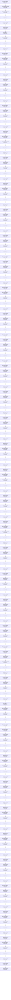

# ./src/pyremaid/files/__init__.py

### Imports


---

```mermaid
flowchart TB
    node_152["ast.Name object at 0x10176ccd0"]
    node_138["ast.Call object at 0x10176ca30"]
    node_145["ast.Call object at 0x10176c9a0"]
    node_19["ast.Call object at 0x1017715b0"]
    node_106["ast.Load object at 0x1016730d0"]
    node_108["ast.Name object at 0x10176cca0"]
    node_130["ast.Name object at 0x10176c5e0"]
    node_44["ast.Store object at 0x101673070"]
    node_155["ast.Call object at 0x10176caf0"]
    node_15["ast.Load object at 0x1016730d0"]
    node_70["ast.Attribute object at 0x10176c640"]
    node_101["ast.Constant object at 0x10176c5b0"]
    node_177["ast.Name object at 0x10176ce50"]
    node_174["ast.Name object at 0x10176c4f0"]
    node_22["ast.Load object at 0x1016730d0"]
    node_146["ast.Attribute object at 0x10176c1c0"]
    node_58["ast.Name object at 0x101771070"]
    node_25["ast.Load object at 0x1016730d0"]
    node_169["ast.With object at 0x10176c880"]
    node_178["ast.Store object at 0x101673070"]
    node_26["ast.Constant object at 0x101771460"]
    node_127["ast.FunctionDef object at 0x10176cc40"]
    node_17["ast.Load object at 0x1016730d0"]
    node_105["ast.Name object at 0x10176c2e0"]
    node_31["ast.Load object at 0x1016730d0"]
    node_79["ast.For object at 0x10176ce80"]
    node_122["ast.Load object at 0x1016730d0"]
    node_62["ast.Expr object at 0x1017710d0"]
    node_85["ast.Call object at 0x10176ca00"]
    node_137["ast.Not object at 0x101673d00"]
    node_160["ast.Call object at 0x10176c790"]
    node_167["ast.Name object at 0x10176ceb0"]
    node_67["ast.Load object at 0x1016730d0"]
    node_3["ast.arg object at 0x1017718e0"]
    node_9["ast.Call object at 0x1017717f0"]
    node_90["ast.Call object at 0x10176c9d0"]
    node_42["ast.Store object at 0x101673070"]
    node_53["ast.Name object at 0x101771160"]
    node_126["ast.Load object at 0x1016730d0"]
    node_116["ast.Load object at 0x1016730d0"]
    node_10["ast.Attribute object at 0x1017717c0"]
    node_128["ast.arguments object at 0x10176c760"]
    node_170["ast.withitem object at 0x10176cf40"]
    node_149["ast.Load object at 0x1016730d0"]
    node_173["ast.Load object at 0x1016730d0"]
    node_47["ast.Store object at 0x101673070"]
    node_123["ast.Add object at 0x101673760"]
    node_120["ast.BinOp object at 0x10176c550"]
    node_176["ast.Constant object at 0x10176c430"]
    node_7["ast.UnaryOp object at 0x101771760"]
    node_45["ast.Name object at 0x101771250"]
    node_124["ast.Constant object at 0x10176c250"]
    node_172["ast.Name object at 0x10176c400"]
    node_1["ast.FunctionDef object at 0x101771880"]
    node_89["ast.Load object at 0x1016730d0"]
    node_35["ast.Load object at 0x1016730d0"]
    node_102["ast.FunctionDef object at 0x10176cd00"]
    node_41["ast.Name object at 0x101771340"]
    node_37["ast.Name object at 0x101771400"]
    node_43["ast.Name object at 0x101771280"]
    node_135["ast.If object at 0x10176c700"]
    node_16["ast.Name object at 0x101771700"]
    node_186["ast.Load object at 0x1016730d0"]
    node_29["ast.arg object at 0x101771490"]
    node_54["ast.Load object at 0x1016730d0"]
    node_103["ast.arguments object at 0x10176cbb0"]
    node_154["ast.Expr object at 0x10176cf70"]
    node_100["ast.Load object at 0x1016730d0"]
    node_27["ast.FunctionDef object at 0x101771130"]
    node_60["ast.Name object at 0x101771100"]
    node_133["ast.Name object at 0x10176cb20"]
    node_113["ast.Attribute object at 0x10176c160"]
    node_153["ast.Load object at 0x1016730d0"]
    node_181["ast.Attribute object at 0x101770e80"]
    node_69["ast.Attribute object at 0x10176cb50"]
    node_80["ast.Name object at 0x10176c100"]
    node_104["ast.arg object at 0x10176c310"]
    node_39["ast.For object at 0x101771220"]
    node_129["ast.arg object at 0x10176c3a0"]
    node_171["ast.Call object at 0x10176cdc0"]
    node_179["ast.Expr object at 0x10176cd60"]
    node_5["ast.Load object at 0x1016730d0"]
    node_81["ast.Store object at 0x101673070"]
    node_132["ast.arg object at 0x10176cc70"]
    node_84["ast.Expr object at 0x10176c7c0"]
    node_134["ast.Load object at 0x1016730d0"]
    node_150["ast.Load object at 0x1016730d0"]
    node_141["ast.Name object at 0x10176c730"]
    node_157["ast.Name object at 0x10176c070"]
    node_56["ast.Constant object at 0x1017711c0"]
    node_98["ast.Load object at 0x1016730d0"]
    node_180["ast.Call object at 0x10176cac0"]
    node_110["ast.Return object at 0x10176c520"]
    node_77["ast.Name object at 0x10176c6a0"]
    node_96["ast.Load object at 0x1016730d0"]
    node_125["ast.Name object at 0x10176cf10"]
    node_185["ast.Name object at 0x1017700d0"]
    node_97["ast.Name object at 0x10176cdf0"]
    node_11["ast.Attribute object at 0x1017716a0"]
    node_66["ast.Load object at 0x1016730d0"]
    node_119["ast.Load object at 0x1016730d0"]
    node_164["ast.Load object at 0x1016730d0"]
    node_50["ast.Name object at 0x101771190"]
    node_147["ast.Attribute object at 0x10176c6d0"]
    node_59["ast.Store object at 0x101673070"]
    node_165["ast.Load object at 0x1016730d0"]
    node_151["ast.Load object at 0x1016730d0"]
    node_73["ast.Load object at 0x1016730d0"]
    node_24["ast.Name object at 0x1017715e0"]
    node_182["ast.Name object at 0x101770130"]
    node_142["ast.Load object at 0x1016730d0"]
    node_163["ast.Name object at 0x10176c040"]
    node_40["ast.Tuple object at 0x101771370"]
    node_72["ast.Load object at 0x1016730d0"]
    node_139["ast.Attribute object at 0x10176ca60"]
    node_4["ast.Name object at 0x1017718b0"]
    node_117["ast.Load object at 0x1016730d0"]
    node_21["ast.Name object at 0x101771610"]
    node_95["ast.Load object at 0x1016730d0"]
    node_38["ast.Load object at 0x1016730d0"]
    node_28["ast.arguments object at 0x1017714c0"]
    node_33["ast.Call object at 0x1017713d0"]
    node_143["ast.Load object at 0x1016730d0"]
    node_92["ast.Attribute object at 0x10176c820"]
    node_168["ast.Load object at 0x1016730d0"]
    node_94["ast.Load object at 0x1016730d0"]
    node_86["ast.Attribute object at 0x10176c8e0"]
    node_158["ast.Load object at 0x1016730d0"]
    node_183["ast.Load object at 0x1016730d0"]
    node_51["ast.Load object at 0x1016730d0"]
    node_88["ast.Load object at 0x1016730d0"]
    node_159["ast.Load object at 0x1016730d0"]
    node_14["ast.Load object at 0x1016730d0"]
    node_18["ast.Expr object at 0x1017716d0"]
    node_57["ast.For object at 0x1017710a0"]
    node_63["ast.Call object at 0x10176ce20"]
    node_12["ast.Name object at 0x101771670"]
    node_48["ast.Call object at 0x1017712e0"]
    node_131["ast.Load object at 0x1016730d0"]
    node_36["ast.keyword object at 0x101771430"]
    node_23["ast.Load object at 0x1016730d0"]
    node_32["ast.Expr object at 0x1017714f0"]
    node_93["ast.Name object at 0x10176cfd0"]
    node_115["ast.Load object at 0x1016730d0"]
    node_118["ast.Name object at 0x10176c1f0"]
    node_34["ast.Name object at 0x1017713a0"]
    node_107["ast.arg object at 0x10176c130"]
    node_144["ast.Load object at 0x1016730d0"]
    node_91["ast.Attribute object at 0x10176c280"]
    node_49["ast.Attribute object at 0x1017712b0"]
    node_2["ast.arguments object at 0x101771850"]
    node_114["ast.Name object at 0x10176cfa0"]
    node_121["ast.Name object at 0x10176c610"]
    node_83["ast.Load object at 0x1016730d0"]
    node_13["ast.Load object at 0x1016730d0"]
    node_46["ast.Store object at 0x101673070"]
    node_76["ast.Load object at 0x1016730d0"]
    node_156["ast.Attribute object at 0x10176cd30"]
    node_20["ast.Attribute object at 0x101771580"]
    node_68["ast.Call object at 0x10176c970"]
    node_99["ast.Name object at 0x10176cd90"]
    node_30["ast.Name object at 0x101771520"]
    node_162["ast.Attribute object at 0x10176c0d0"]
    node_166["ast.Load object at 0x1016730d0"]
    node_161["ast.Attribute object at 0x10176c2b0"]
    node_8["ast.Not object at 0x101673d00"]
    node_148["ast.Name object at 0x10176cb80"]
    node_111["ast.Call object at 0x10176c340"]
    node_65["ast.Name object at 0x10176c8b0"]
    node_78["ast.Load object at 0x1016730d0"]
    node_82["ast.Name object at 0x10176c190"]
    node_112["ast.Attribute object at 0x10176c4c0"]
    node_64["ast.Attribute object at 0x10176c940"]
    node_87["ast.Name object at 0x10176c7f0"]
    node_61["ast.Load object at 0x1016730d0"]
    node_136["ast.UnaryOp object at 0x10176c220"]
    node_184["ast.Load object at 0x1016730d0"]
    node_75["ast.Name object at 0x10176c580"]
    node_52["ast.Load object at 0x1016730d0"]
    node_140["ast.Attribute object at 0x10176cbe0"]
    node_55["ast.keyword object at 0x1017711f0"]
    node_0["ast.Module object at 0x101771730"]
    node_74["ast.Load object at 0x1016730d0"]
    node_71["ast.Name object at 0x10176c0a0"]
    node_175["ast.Load object at 0x1016730d0"]
    node_6["ast.If object at 0x101771790"]
    node_109["ast.Load object at 0x1016730d0"]

    node_0 --> node_1
    node_1 --> node_2
    node_2 --> node_3
    node_3 --> node_4
    node_4 --> node_5
    node_5 --> node_6
    node_6 --> node_7
    node_7 --> node_8
    node_8 --> node_9
    node_9 --> node_10
    node_10 --> node_11
    node_11 --> node_12
    node_12 --> node_13
    node_13 --> node_14
    node_14 --> node_15
    node_15 --> node_16
    node_16 --> node_17
    node_17 --> node_18
    node_18 --> node_19
    node_19 --> node_20
    node_20 --> node_21
    node_21 --> node_22
    node_22 --> node_23
    node_23 --> node_24
    node_24 --> node_25
    node_25 --> node_26
    node_26 --> node_27
    node_27 --> node_28
    node_28 --> node_29
    node_29 --> node_30
    node_30 --> node_31
    node_31 --> node_32
    node_32 --> node_33
    node_33 --> node_34
    node_34 --> node_35
    node_35 --> node_36
    node_36 --> node_37
    node_37 --> node_38
    node_38 --> node_39
    node_39 --> node_40
    node_40 --> node_41
    node_41 --> node_42
    node_42 --> node_43
    node_43 --> node_44
    node_44 --> node_45
    node_45 --> node_46
    node_46 --> node_47
    node_47 --> node_48
    node_48 --> node_49
    node_49 --> node_50
    node_50 --> node_51
    node_51 --> node_52
    node_52 --> node_53
    node_53 --> node_54
    node_54 --> node_55
    node_55 --> node_56
    node_56 --> node_57
    node_57 --> node_58
    node_58 --> node_59
    node_59 --> node_60
    node_60 --> node_61
    node_61 --> node_62
    node_62 --> node_63
    node_63 --> node_64
    node_64 --> node_65
    node_65 --> node_66
    node_66 --> node_67
    node_67 --> node_68
    node_68 --> node_69
    node_69 --> node_70
    node_70 --> node_71
    node_71 --> node_72
    node_72 --> node_73
    node_73 --> node_74
    node_74 --> node_75
    node_75 --> node_76
    node_76 --> node_77
    node_77 --> node_78
    node_78 --> node_79
    node_79 --> node_80
    node_80 --> node_81
    node_81 --> node_82
    node_82 --> node_83
    node_83 --> node_84
    node_84 --> node_85
    node_85 --> node_86
    node_86 --> node_87
    node_87 --> node_88
    node_88 --> node_89
    node_89 --> node_90
    node_90 --> node_91
    node_91 --> node_92
    node_92 --> node_93
    node_93 --> node_94
    node_94 --> node_95
    node_95 --> node_96
    node_96 --> node_97
    node_97 --> node_98
    node_98 --> node_99
    node_99 --> node_100
    node_100 --> node_101
    node_101 --> node_102
    node_102 --> node_103
    node_103 --> node_104
    node_104 --> node_105
    node_105 --> node_106
    node_106 --> node_107
    node_107 --> node_108
    node_108 --> node_109
    node_109 --> node_110
    node_110 --> node_111
    node_111 --> node_112
    node_112 --> node_113
    node_113 --> node_114
    node_114 --> node_115
    node_115 --> node_116
    node_116 --> node_117
    node_117 --> node_118
    node_118 --> node_119
    node_119 --> node_120
    node_120 --> node_121
    node_121 --> node_122
    node_122 --> node_123
    node_123 --> node_124
    node_124 --> node_125
    node_125 --> node_126
    node_126 --> node_127
    node_127 --> node_128
    node_128 --> node_129
    node_129 --> node_130
    node_130 --> node_131
    node_131 --> node_132
    node_132 --> node_133
    node_133 --> node_134
    node_134 --> node_135
    node_135 --> node_136
    node_136 --> node_137
    node_137 --> node_138
    node_138 --> node_139
    node_139 --> node_140
    node_140 --> node_141
    node_141 --> node_142
    node_142 --> node_143
    node_143 --> node_144
    node_144 --> node_145
    node_145 --> node_146
    node_146 --> node_147
    node_147 --> node_148
    node_148 --> node_149
    node_149 --> node_150
    node_150 --> node_151
    node_151 --> node_152
    node_152 --> node_153
    node_153 --> node_154
    node_154 --> node_155
    node_155 --> node_156
    node_156 --> node_157
    node_157 --> node_158
    node_158 --> node_159
    node_159 --> node_160
    node_160 --> node_161
    node_161 --> node_162
    node_162 --> node_163
    node_163 --> node_164
    node_164 --> node_165
    node_165 --> node_166
    node_166 --> node_167
    node_167 --> node_168
    node_168 --> node_169
    node_169 --> node_170
    node_170 --> node_171
    node_171 --> node_172
    node_172 --> node_173
    node_173 --> node_174
    node_174 --> node_175
    node_175 --> node_176
    node_176 --> node_177
    node_177 --> node_178
    node_178 --> node_179
    node_179 --> node_180
    node_180 --> node_181
    node_181 --> node_182
    node_182 --> node_183
    node_183 --> node_184
    node_184 --> node_185
    node_185 --> node_186

```
---

<details>
<summary>Debug AST model dump</summary>

```

```
</details>

