```mermaid
flowchart TB
  _f61_n1767["If"]
  _f61_n1768["UnaryOp"]
  _f61_n1769["Not"]
  _f61_n1770["Call"]
  _f61_n1771["Attribute"]
  _f61_n1772["Attribute"]
  _f61_n1773["Name"]
  _f61_n1774["Load"]
  _f61_n1775["Load"]
  _f61_n1776["Load"]
  _f61_n1777["Name"]
  _f61_n1778["Load"]
  _f61_n1779["Expr"]
  _f61_n1780["Call"]
  _f61_n1781["Attribute"]
  _f61_n1782["Name"]
  _f61_n1783["Load"]
  _f61_n1784["Load"]
  _f61_n1785["Name"]
  _f61_n1786["Load"]
  _f62_n1787["Expr"]
  _f62_n1788["Call"]
  _f62_n1789["Name"]
  _f62_n1790["Load"]
  _f62_n1791["keyword"]
  _f62_n1792["Name"]
  _f62_n1793["Load"]
  _f62_n1794["For"]
  _f62_n1795["Tuple"]
  _f62_n1796["Name"]
  _f62_n1797["Store"]
  _f62_n1798["Name"]
  _f62_n1799["Store"]
  _f62_n1800["Name"]
  _f62_n1801["Store"]
  _f62_n1802["Store"]
  _f62_n1803["Call"]
  _f62_n1804["Attribute"]
  _f62_n1805["Name"]
  _f62_n1806["Load"]
  _f62_n1807["Load"]
  _f62_n1808["Name"]
  _f62_n1809["Load"]
  _f62_n1810["keyword"]
  _f62_n1811["Constant"]
  _f62_n1812["For"]
  _f62_n1813["Name"]
  _f62_n1814["Store"]
  _f62_n1815["Name"]
  _f62_n1816["Load"]
  _f62_n1817["Expr"]
  _f62_n1818["Call"]
  _f62_n1819["Attribute"]
  _f62_n1820["Name"]
  _f62_n1821["Load"]
  _f62_n1822["Load"]
  _f62_n1823["Call"]
  _f62_n1824["Attribute"]
  _f62_n1825["Attribute"]
  _f62_n1826["Name"]
  _f62_n1827["Load"]
  _f62_n1828["Load"]
  _f62_n1829["Load"]
  _f62_n1830["Name"]
  _f62_n1831["Load"]
  _f62_n1832["Name"]
  _f62_n1833["Load"]
  _f62_n1834["For"]
  _f62_n1835["Name"]
  _f62_n1836["Store"]
  _f62_n1837["Name"]
  _f62_n1838["Load"]
  _f62_n1839["Expr"]
  _f62_n1840["Call"]
  _f62_n1841["Attribute"]
  _f62_n1842["Name"]
  _f62_n1843["Load"]
  _f62_n1844["Load"]
  _f62_n1845["Call"]
  _f62_n1846["Attribute"]
  _f62_n1847["Attribute"]
  _f62_n1848["Name"]
  _f62_n1849["Load"]
  _f62_n1850["Load"]
  _f62_n1851["Load"]
  _f62_n1852["Name"]
  _f62_n1853["Load"]
  _f62_n1854["Name"]
  _f62_n1855["Load"]
  _f63_n1856["Return"]
  _f63_n1857["Call"]
  _f63_n1858["Attribute"]
  _f63_n1859["Attribute"]
  _f63_n1860["Name"]
  _f63_n1861["Load"]
  _f63_n1862["Load"]
  _f63_n1863["Load"]
  _f63_n1864["Name"]
  _f63_n1865["Load"]
  _f63_n1866["BinOp"]
  _f63_n1867["Name"]
  _f63_n1868["Load"]
  _f63_n1869["Add"]
  _f63_n1870["Constant"]
  _f64_n1871["If"]
  _f64_n1872["UnaryOp"]
  _f64_n1873["Not"]
  _f64_n1874["Call"]
  _f64_n1875["Attribute"]
  _f64_n1876["Attribute"]
  _f64_n1877["Name"]
  _f64_n1878["Load"]
  _f64_n1879["Load"]
  _f64_n1880["Load"]
  _f64_n1881["Call"]
  _f64_n1882["Attribute"]
  _f64_n1883["Attribute"]
  _f64_n1884["Name"]
  _f64_n1885["Load"]
  _f64_n1886["Load"]
  _f64_n1887["Load"]
  _f64_n1888["Name"]
  _f64_n1889["Load"]
  _f64_n1890["Expr"]
  _f64_n1891["Call"]
  _f64_n1892["Attribute"]
  _f64_n1893["Name"]
  _f64_n1894["Load"]
  _f64_n1895["Load"]
  _f64_n1896["Call"]
  _f64_n1897["Attribute"]
  _f64_n1898["Attribute"]
  _f64_n1899["Name"]
  _f64_n1900["Load"]
  _f64_n1901["Load"]
  _f64_n1902["Load"]
  _f64_n1903["Name"]
  _f64_n1904["Load"]
  _f64_n1905["With"]
  _f64_n1906["withitem"]
  _f64_n1907["Call"]
  _f64_n1908["Name"]
  _f64_n1909["Load"]
  _f64_n1910["Name"]
  _f64_n1911["Load"]
  _f64_n1912["Constant"]
  _f64_n1913["Name"]
  _f64_n1914["Store"]
  _f64_n1915["Expr"]
  _f64_n1916["Call"]
  _f64_n1917["Attribute"]
  _f64_n1918["Name"]
  _f64_n1919["Load"]
  _f64_n1920["Load"]
  _f64_n1921["Name"]
  _f64_n1922["Load"]

  subgraph _create_output_folder
    direction TB
    _f61_n1767 --> _f61_n1768
    _f61_n1768 --> _f61_n1769
    _f61_n1769 --> _f61_n1770
    _f61_n1770 --> _f61_n1771
    _f61_n1771 --> _f61_n1772
    _f61_n1772 --> _f61_n1773
    _f61_n1773 --> _f61_n1774
    _f61_n1774 --> _f61_n1775
    _f61_n1775 --> _f61_n1776
    _f61_n1776 --> _f61_n1777
    _f61_n1777 --> _f61_n1778
    _f61_n1778 --> _f61_n1779
    _f61_n1779 --> _f61_n1780
    _f61_n1780 --> _f61_n1781
    _f61_n1781 --> _f61_n1782
    _f61_n1782 --> _f61_n1783
    _f61_n1783 --> _f61_n1784
    _f61_n1784 --> _f61_n1785
    _f61_n1785 --> _f61_n1786
  end
  subgraph _create_cleared_output_folder
    direction TB
    _f62_n1787 --> _f62_n1788
    _f62_n1788 --> _f62_n1789
    _f62_n1789 --> _f62_n1790
    _f62_n1790 --> _f62_n1791
    _f62_n1791 --> _f62_n1792
    _f62_n1792 --> _f62_n1793
    _f62_n1793 --> _f62_n1794
    _f62_n1794 --> _f62_n1795
    _f62_n1795 --> _f62_n1796
    _f62_n1796 --> _f62_n1797
    _f62_n1797 --> _f62_n1798
    _f62_n1798 --> _f62_n1799
    _f62_n1799 --> _f62_n1800
    _f62_n1800 --> _f62_n1801
    _f62_n1801 --> _f62_n1802
    _f62_n1802 --> _f62_n1803
    _f62_n1803 --> _f62_n1804
    _f62_n1804 --> _f62_n1805
    _f62_n1805 --> _f62_n1806
    _f62_n1806 --> _f62_n1807
    _f62_n1807 --> _f62_n1808
    _f62_n1808 --> _f62_n1809
    _f62_n1809 --> _f62_n1810
    _f62_n1810 --> _f62_n1811
    _f62_n1811 --> _f62_n1812
    _f62_n1812 --> _f62_n1813
    _f62_n1813 --> _f62_n1814
    _f62_n1814 --> _f62_n1815
    _f62_n1815 --> _f62_n1816
    _f62_n1816 --> _f62_n1817
    _f62_n1817 --> _f62_n1818
    _f62_n1818 --> _f62_n1819
    _f62_n1819 --> _f62_n1820
    _f62_n1820 --> _f62_n1821
    _f62_n1821 --> _f62_n1822
    _f62_n1822 --> _f62_n1823
    _f62_n1823 --> _f62_n1824
    _f62_n1824 --> _f62_n1825
    _f62_n1825 --> _f62_n1826
    _f62_n1826 --> _f62_n1827
    _f62_n1827 --> _f62_n1828
    _f62_n1828 --> _f62_n1829
    _f62_n1829 --> _f62_n1830
    _f62_n1830 --> _f62_n1831
    _f62_n1831 --> _f62_n1832
    _f62_n1832 --> _f62_n1833
    _f62_n1833 --> _f62_n1834
    _f62_n1834 --> _f62_n1835
    _f62_n1835 --> _f62_n1836
    _f62_n1836 --> _f62_n1837
    _f62_n1837 --> _f62_n1838
    _f62_n1838 --> _f62_n1839
    _f62_n1839 --> _f62_n1840
    _f62_n1840 --> _f62_n1841
    _f62_n1841 --> _f62_n1842
    _f62_n1842 --> _f62_n1843
    _f62_n1843 --> _f62_n1844
    _f62_n1844 --> _f62_n1845
    _f62_n1845 --> _f62_n1846
    _f62_n1846 --> _f62_n1847
    _f62_n1847 --> _f62_n1848
    _f62_n1848 --> _f62_n1849
    _f62_n1849 --> _f62_n1850
    _f62_n1850 --> _f62_n1851
    _f62_n1851 --> _f62_n1852
    _f62_n1852 --> _f62_n1853
    _f62_n1853 --> _f62_n1854
    _f62_n1854 --> _f62_n1855
  end
  subgraph _get_output_file_path_for_input_file
    direction TB
    _f63_n1856 --> _f63_n1857
    _f63_n1857 --> _f63_n1858
    _f63_n1858 --> _f63_n1859
    _f63_n1859 --> _f63_n1860
    _f63_n1860 --> _f63_n1861
    _f63_n1861 --> _f63_n1862
    _f63_n1862 --> _f63_n1863
    _f63_n1863 --> _f63_n1864
    _f63_n1864 --> _f63_n1865
    _f63_n1865 --> _f63_n1866
    _f63_n1866 --> _f63_n1867
    _f63_n1867 --> _f63_n1868
    _f63_n1868 --> _f63_n1869
    _f63_n1869 --> _f63_n1870
  end
  subgraph _update_output_file
    direction TB
    _f64_n1871 --> _f64_n1872
    _f64_n1872 --> _f64_n1873
    _f64_n1873 --> _f64_n1874
    _f64_n1874 --> _f64_n1875
    _f64_n1875 --> _f64_n1876
    _f64_n1876 --> _f64_n1877
    _f64_n1877 --> _f64_n1878
    _f64_n1878 --> _f64_n1879
    _f64_n1879 --> _f64_n1880
    _f64_n1880 --> _f64_n1881
    _f64_n1881 --> _f64_n1882
    _f64_n1882 --> _f64_n1883
    _f64_n1883 --> _f64_n1884
    _f64_n1884 --> _f64_n1885
    _f64_n1885 --> _f64_n1886
    _f64_n1886 --> _f64_n1887
    _f64_n1887 --> _f64_n1888
    _f64_n1888 --> _f64_n1889
    _f64_n1889 --> _f64_n1890
    _f64_n1890 --> _f64_n1891
    _f64_n1891 --> _f64_n1892
    _f64_n1892 --> _f64_n1893
    _f64_n1893 --> _f64_n1894
    _f64_n1894 --> _f64_n1895
    _f64_n1895 --> _f64_n1896
    _f64_n1896 --> _f64_n1897
    _f64_n1897 --> _f64_n1898
    _f64_n1898 --> _f64_n1899
    _f64_n1899 --> _f64_n1900
    _f64_n1900 --> _f64_n1901
    _f64_n1901 --> _f64_n1902
    _f64_n1902 --> _f64_n1903
    _f64_n1903 --> _f64_n1904
    _f64_n1904 --> _f64_n1905
    _f64_n1905 --> _f64_n1906
    _f64_n1906 --> _f64_n1907
    _f64_n1907 --> _f64_n1908
    _f64_n1908 --> _f64_n1909
    _f64_n1909 --> _f64_n1910
    _f64_n1910 --> _f64_n1911
    _f64_n1911 --> _f64_n1912
    _f64_n1912 --> _f64_n1913
    _f64_n1913 --> _f64_n1914
    _f64_n1914 --> _f64_n1915
    _f64_n1915 --> _f64_n1916
    _f64_n1916 --> _f64_n1917
    _f64_n1917 --> _f64_n1918
    _f64_n1918 --> _f64_n1919
    _f64_n1919 --> _f64_n1920
    _f64_n1920 --> _f64_n1921
    _f64_n1921 --> _f64_n1922
  end

```

# ./src/pyremaid/files/destination.py

### Imports

  - os.*

---

---

<details>
<summary>Debug AST model dump</summary>

```
Module(
  body=[
    Import(
      names=[
        alias(name='os')],
      lineno=1,
      col_offset=0,
      end_lineno=1,
      end_col_offset=9),
    FunctionDef(
      name='create_output_folder',
      args=arguments(
        posonlyargs=[],
        args=[
          arg(
            arg='output_path',
            annotation=Name(
              id='str',
              ctx=Load(),
              lineno=4,
              col_offset=39,
              end_lineno=4,
              end_col_offset=42),
            lineno=4,
            col_offset=25,
            end_lineno=4,
            end_col_offset=42)],
        kwonlyargs=[],
        kw_defaults=[],
        defaults=[]),
      body=[
        If(
          test=UnaryOp(
            op=Not(),
            operand=Call(
              func=Attribute(
                value=Attribute(
                  value=Name(
                    id='os',
                    ctx=Load(),
                    lineno=5,
                    col_offset=11,
                    end_lineno=5,
                    end_col_offset=13),
                  attr='path',
                  ctx=Load(),
                  lineno=5,
                  col_offset=11,
                  end_lineno=5,
                  end_col_offset=18),
                attr='isdir',
                ctx=Load(),
                lineno=5,
                col_offset=11,
                end_lineno=5,
                end_col_offset=24),
              args=[
                Name(
                  id='output_path',
                  ctx=Load(),
                  lineno=5,
                  col_offset=25,
                  end_lineno=5,
                  end_col_offset=36)],
              keywords=[],
              lineno=5,
              col_offset=11,
              end_lineno=5,
              end_col_offset=37),
            lineno=5,
            col_offset=7,
            end_lineno=5,
            end_col_offset=37),
          body=[
            Expr(
              value=Call(
                func=Attribute(
                  value=Name(
                    id='os',
                    ctx=Load(),
                    lineno=6,
                    col_offset=8,
                    end_lineno=6,
                    end_col_offset=10),
                  attr='makedirs',
                  ctx=Load(),
                  lineno=6,
                  col_offset=8,
                  end_lineno=6,
                  end_col_offset=19),
                args=[
                  Name(
                    id='output_path',
                    ctx=Load(),
                    lineno=6,
                    col_offset=20,
                    end_lineno=6,
                    end_col_offset=31)],
                keywords=[],
                lineno=6,
                col_offset=8,
                end_lineno=6,
                end_col_offset=32),
              lineno=6,
              col_offset=8,
              end_lineno=6,
              end_col_offset=32)],
          orelse=[],
          lineno=5,
          col_offset=4,
          end_lineno=6,
          end_col_offset=32)],
      decorator_list=[],
      returns=Constant(
        value=None,
        lineno=4,
        col_offset=47,
        end_lineno=4,
        end_col_offset=51),
      lineno=4,
      col_offset=0,
      end_lineno=6,
      end_col_offset=32),
    FunctionDef(
      name='create_cleared_output_folder',
      args=arguments(
        posonlyargs=[],
        args=[
          arg(
            arg='output_path',
            annotation=Name(
              id='str',
              ctx=Load(),
              lineno=9,
              col_offset=46,
              end_lineno=9,
              end_col_offset=49),
            lineno=9,
            col_offset=33,
            end_lineno=9,
            end_col_offset=49)],
        kwonlyargs=[],
        kw_defaults=[],
        defaults=[]),
      body=[
        Expr(
          value=Call(
            func=Name(
              id='create_output_folder',
              ctx=Load(),
              lineno=10,
              col_offset=4,
              end_lineno=10,
              end_col_offset=24),
            args=[],
            keywords=[
              keyword(
                arg='output_path',
                value=Name(
                  id='output_path',
                  ctx=Load(),
                  lineno=10,
                  col_offset=37,
                  end_lineno=10,
                  end_col_offset=48),
                lineno=10,
                col_offset=25,
                end_lineno=10,
                end_col_offset=48)],
            lineno=10,
            col_offset=4,
            end_lineno=10,
            end_col_offset=49),
          lineno=10,
          col_offset=4,
          end_lineno=10,
          end_col_offset=49),
        For(
          target=Tuple(
            elts=[
              Name(
                id='root',
                ctx=Store(),
                lineno=11,
                col_offset=8,
                end_lineno=11,
                end_col_offset=12),
              Name(
                id='dirs',
                ctx=Store(),
                lineno=11,
                col_offset=14,
                end_lineno=11,
                end_col_offset=18),
              Name(
                id='files',
                ctx=Store(),
                lineno=11,
                col_offset=20,
                end_lineno=11,
                end_col_offset=25)],
            ctx=Store(),
            lineno=11,
            col_offset=8,
            end_lineno=11,
            end_col_offset=25),
          iter=Call(
            func=Attribute(
              value=Name(
                id='os',
                ctx=Load(),
                lineno=11,
                col_offset=29,
                end_lineno=11,
                end_col_offset=31),
              attr='walk',
              ctx=Load(),
              lineno=11,
              col_offset=29,
              end_lineno=11,
              end_col_offset=36),
            args=[
              Name(
                id='output_path',
                ctx=Load(),
                lineno=11,
                col_offset=37,
                end_lineno=11,
                end_col_offset=48)],
            keywords=[
              keyword(
                arg='topdown',
                value=Constant(
                  value=False,
                  lineno=11,
                  col_offset=58,
                  end_lineno=11,
                  end_col_offset=63),
                lineno=11,
                col_offset=50,
                end_lineno=11,
                end_col_offset=63)],
            lineno=11,
            col_offset=29,
            end_lineno=11,
            end_col_offset=64),
          body=[
            For(
              target=Name(
                id='name',
                ctx=Store(),
                lineno=12,
                col_offset=12,
                end_lineno=12,
                end_col_offset=16),
              iter=Name(
                id='files',
                ctx=Load(),
                lineno=12,
                col_offset=20,
                end_lineno=12,
                end_col_offset=25),
              body=[
                Expr(
                  value=Call(
                    func=Attribute(
                      value=Name(
                        id='os',
                        ctx=Load(),
                        lineno=13,
                        col_offset=12,
                        end_lineno=13,
                        end_col_offset=14),
                      attr='remove',
                      ctx=Load(),
                      lineno=13,
                      col_offset=12,
                      end_lineno=13,
                      end_col_offset=21),
                    args=[
                      Call(
                        func=Attribute(
                          value=Attribute(
                            value=Name(
                              id='os',
                              ctx=Load(),
                              lineno=13,
                              col_offset=22,
                              end_lineno=13,
                              end_col_offset=24),
                            attr='path',
                            ctx=Load(),
                            lineno=13,
                            col_offset=22,
                            end_lineno=13,
                            end_col_offset=29),
                          attr='join',
                          ctx=Load(),
                          lineno=13,
                          col_offset=22,
                          end_lineno=13,
                          end_col_offset=34),
                        args=[
                          Name(
                            id='root',
                            ctx=Load(),
                            lineno=13,
                            col_offset=35,
                            end_lineno=13,
                            end_col_offset=39),
                          Name(
                            id='name',
                            ctx=Load(),
                            lineno=13,
                            col_offset=41,
                            end_lineno=13,
                            end_col_offset=45)],
                        keywords=[],
                        lineno=13,
                        col_offset=22,
                        end_lineno=13,
                        end_col_offset=46)],
                    keywords=[],
                    lineno=13,
                    col_offset=12,
                    end_lineno=13,
                    end_col_offset=47),
                  lineno=13,
                  col_offset=12,
                  end_lineno=13,
                  end_col_offset=47)],
              orelse=[],
              lineno=12,
              col_offset=8,
              end_lineno=13,
              end_col_offset=47),
            For(
              target=Name(
                id='name',
                ctx=Store(),
                lineno=14,
                col_offset=12,
                end_lineno=14,
                end_col_offset=16),
              iter=Name(
                id='dirs',
                ctx=Load(),
                lineno=14,
                col_offset=20,
                end_lineno=14,
                end_col_offset=24),
              body=[
                Expr(
                  value=Call(
                    func=Attribute(
                      value=Name(
                        id='os',
                        ctx=Load(),
                        lineno=15,
                        col_offset=12,
                        end_lineno=15,
                        end_col_offset=14),
                      attr='rmdir',
                      ctx=Load(),
                      lineno=15,
                      col_offset=12,
                      end_lineno=15,
                      end_col_offset=20),
                    args=[
                      Call(
                        func=Attribute(
                          value=Attribute(
                            value=Name(
                              id='os',
                              ctx=Load(),
                              lineno=15,
                              col_offset=21,
                              end_lineno=15,
                              end_col_offset=23),
                            attr='path',
                            ctx=Load(),
                            lineno=15,
                            col_offset=21,
                            end_lineno=15,
                            end_col_offset=28),
                          attr='join',
                          ctx=Load(),
                          lineno=15,
                          col_offset=21,
                          end_lineno=15,
                          end_col_offset=33),
                        args=[
                          Name(
                            id='root',
                            ctx=Load(),
                            lineno=15,
                            col_offset=34,
                            end_lineno=15,
                            end_col_offset=38),
                          Name(
                            id='name',
                            ctx=Load(),
                            lineno=15,
                            col_offset=40,
                            end_lineno=15,
                            end_col_offset=44)],
                        keywords=[],
                        lineno=15,
                        col_offset=21,
                        end_lineno=15,
                        end_col_offset=45)],
                    keywords=[],
                    lineno=15,
                    col_offset=12,
                    end_lineno=15,
                    end_col_offset=46),
                  lineno=15,
                  col_offset=12,
                  end_lineno=15,
                  end_col_offset=46)],
              orelse=[],
              lineno=14,
              col_offset=8,
              end_lineno=15,
              end_col_offset=46)],
          orelse=[],
          lineno=11,
          col_offset=4,
          end_lineno=15,
          end_col_offset=46)],
      decorator_list=[],
      returns=Constant(
        value=None,
        lineno=9,
        col_offset=54,
        end_lineno=9,
        end_col_offset=58),
      lineno=9,
      col_offset=0,
      end_lineno=15,
      end_col_offset=46),
    FunctionDef(
      name='get_output_file_path_for_input_file',
      args=arguments(
        posonlyargs=[],
        args=[
          arg(
            arg='input_path',
            annotation=Name(
              id='str',
              ctx=Load(),
              lineno=18,
              col_offset=52,
              end_lineno=18,
              end_col_offset=55),
            lineno=18,
            col_offset=40,
            end_lineno=18,
            end_col_offset=55),
          arg(
            arg='output_root',
            annotation=Name(
              id='str',
              ctx=Load(),
              lineno=18,
              col_offset=70,
              end_lineno=18,
              end_col_offset=73),
            lineno=18,
            col_offset=57,
            end_lineno=18,
            end_col_offset=73)],
        kwonlyargs=[],
        kw_defaults=[],
        defaults=[]),
      body=[
        Return(
          value=Call(
            func=Attribute(
              value=Attribute(
                value=Name(
                  id='os',
                  ctx=Load(),
                  lineno=19,
                  col_offset=11,
                  end_lineno=19,
                  end_col_offset=13),
                attr='path',
                ctx=Load(),
                lineno=19,
                col_offset=11,
                end_lineno=19,
                end_col_offset=18),
              attr='join',
              ctx=Load(),
              lineno=19,
              col_offset=11,
              end_lineno=19,
              end_col_offset=23),
            args=[
              Name(
                id='output_root',
                ctx=Load(),
                lineno=19,
                col_offset=24,
                end_lineno=19,
                end_col_offset=35),
              BinOp(
                left=Name(
                  id='input_path',
                  ctx=Load(),
                  lineno=19,
                  col_offset=37,
                  end_lineno=19,
                  end_col_offset=47),
                op=Add(),
                right=Constant(
                  value='.md',
                  lineno=19,
                  col_offset=50,
                  end_lineno=19,
                  end_col_offset=55),
                lineno=19,
                col_offset=37,
                end_lineno=19,
                end_col_offset=55)],
            keywords=[],
            lineno=19,
            col_offset=11,
            end_lineno=19,
            end_col_offset=56),
          lineno=19,
          col_offset=4,
          end_lineno=19,
          end_col_offset=56)],
      decorator_list=[],
      returns=Name(
        id='str',
        ctx=Load(),
        lineno=18,
        col_offset=78,
        end_lineno=18,
        end_col_offset=81),
      lineno=18,
      col_offset=0,
      end_lineno=19,
      end_col_offset=56),
    FunctionDef(
      name='update_output_file',
      args=arguments(
        posonlyargs=[],
        args=[
          arg(
            arg='content',
            annotation=Name(
              id='str',
              ctx=Load(),
              lineno=22,
              col_offset=32,
              end_lineno=22,
              end_col_offset=35),
            lineno=22,
            col_offset=23,
            end_lineno=22,
            end_col_offset=35),
          arg(
            arg='output_file',
            annotation=Name(
              id='str',
              ctx=Load(),
              lineno=22,
              col_offset=50,
              end_lineno=22,
              end_col_offset=53),
            lineno=22,
            col_offset=37,
            end_lineno=22,
            end_col_offset=53)],
        kwonlyargs=[],
        kw_defaults=[],
        defaults=[]),
      body=[
        If(
          test=UnaryOp(
            op=Not(),
            operand=Call(
              func=Attribute(
                value=Attribute(
                  value=Name(
                    id='os',
                    ctx=Load(),
                    lineno=23,
                    col_offset=11,
                    end_lineno=23,
                    end_col_offset=13),
                  attr='path',
                  ctx=Load(),
                  lineno=23,
                  col_offset=11,
                  end_lineno=23,
                  end_col_offset=18),
                attr='isdir',
                ctx=Load(),
                lineno=23,
                col_offset=11,
                end_lineno=23,
                end_col_offset=24),
              args=[
                Call(
                  func=Attribute(
                    value=Attribute(
                      value=Name(
                        id='os',
                        ctx=Load(),
                        lineno=23,
                        col_offset=25,
                        end_lineno=23,
                        end_col_offset=27),
                      attr='path',
                      ctx=Load(),
                      lineno=23,
                      col_offset=25,
                      end_lineno=23,
                      end_col_offset=32),
                    attr='dirname',
                    ctx=Load(),
                    lineno=23,
                    col_offset=25,
                    end_lineno=23,
                    end_col_offset=40),
                  args=[
                    Name(
                      id='output_file',
                      ctx=Load(),
                      lineno=23,
                      col_offset=41,
                      end_lineno=23,
                      end_col_offset=52)],
                  keywords=[],
                  lineno=23,
                  col_offset=25,
                  end_lineno=23,
                  end_col_offset=53)],
              keywords=[],
              lineno=23,
              col_offset=11,
              end_lineno=23,
              end_col_offset=54),
            lineno=23,
            col_offset=7,
            end_lineno=23,
            end_col_offset=54),
          body=[
            Expr(
              value=Call(
                func=Attribute(
                  value=Name(
                    id='os',
                    ctx=Load(),
                    lineno=24,
                    col_offset=8,
                    end_lineno=24,
                    end_col_offset=10),
                  attr='makedirs',
                  ctx=Load(),
                  lineno=24,
                  col_offset=8,
                  end_lineno=24,
                  end_col_offset=19),
                args=[
                  Call(
                    func=Attribute(
                      value=Attribute(
                        value=Name(
                          id='os',
                          ctx=Load(),
                          lineno=24,
                          col_offset=20,
                          end_lineno=24,
                          end_col_offset=22),
                        attr='path',
                        ctx=Load(),
                        lineno=24,
                        col_offset=20,
                        end_lineno=24,
                        end_col_offset=27),
                      attr='dirname',
                      ctx=Load(),
                      lineno=24,
                      col_offset=20,
                      end_lineno=24,
                      end_col_offset=35),
                    args=[
                      Name(
                        id='output_file',
                        ctx=Load(),
                        lineno=24,
                        col_offset=36,
                        end_lineno=24,
                        end_col_offset=47)],
                    keywords=[],
                    lineno=24,
                    col_offset=20,
                    end_lineno=24,
                    end_col_offset=48)],
                keywords=[],
                lineno=24,
                col_offset=8,
                end_lineno=24,
                end_col_offset=49),
              lineno=24,
              col_offset=8,
              end_lineno=24,
              end_col_offset=49)],
          orelse=[],
          lineno=23,
          col_offset=4,
          end_lineno=24,
          end_col_offset=49),
        With(
          items=[
            withitem(
              context_expr=Call(
                func=Name(
                  id='open',
                  ctx=Load(),
                  lineno=26,
                  col_offset=9,
                  end_lineno=26,
                  end_col_offset=13),
                args=[
                  Name(
                    id='output_file',
                    ctx=Load(),
                    lineno=26,
                    col_offset=14,
                    end_lineno=26,
                    end_col_offset=25),
                  Constant(
                    value='w',
                    lineno=26,
                    col_offset=27,
                    end_lineno=26,
                    end_col_offset=30)],
                keywords=[],
                lineno=26,
                col_offset=9,
                end_lineno=26,
                end_col_offset=31),
              optional_vars=Name(
                id='md_file',
                ctx=Store(),
                lineno=26,
                col_offset=35,
                end_lineno=26,
                end_col_offset=42))],
          body=[
            Expr(
              value=Call(
                func=Attribute(
                  value=Name(
                    id='md_file',
                    ctx=Load(),
                    lineno=27,
                    col_offset=8,
                    end_lineno=27,
                    end_col_offset=15),
                  attr='write',
                  ctx=Load(),
                  lineno=27,
                  col_offset=8,
                  end_lineno=27,
                  end_col_offset=21),
                args=[
                  Name(
                    id='content',
                    ctx=Load(),
                    lineno=27,
                    col_offset=22,
                    end_lineno=27,
                    end_col_offset=29)],
                keywords=[],
                lineno=27,
                col_offset=8,
                end_lineno=27,
                end_col_offset=30),
              lineno=27,
              col_offset=8,
              end_lineno=27,
              end_col_offset=30)],
          lineno=26,
          col_offset=4,
          end_lineno=27,
          end_col_offset=30)],
      decorator_list=[],
      lineno=22,
      col_offset=0,
      end_lineno=27,
      end_col_offset=30)],
  type_ignores=[])
```
</details>

