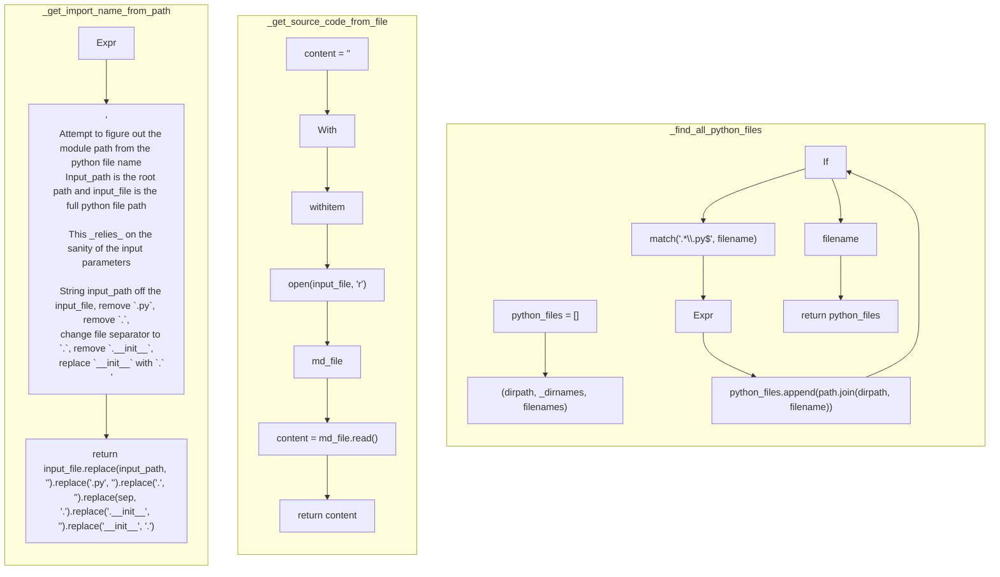

# ./src/pyremaid/files/source.py

### Imports

  - os.walk
  - os.path
  - os.sep
  - re.match

---

---

<details>
<summary>Debug AST model dump</summary>

```
Module(
  body=[
    ImportFrom(
      module='os',
      names=[
        alias(
          name='walk',
          lineno=1,
          col_offset=15,
          end_lineno=1,
          end_col_offset=19),
        alias(
          name='path',
          lineno=1,
          col_offset=21,
          end_lineno=1,
          end_col_offset=25),
        alias(
          name='sep',
          lineno=1,
          col_offset=27,
          end_lineno=1,
          end_col_offset=30)],
      level=0,
      lineno=1,
      col_offset=0,
      end_lineno=1,
      end_col_offset=30),
    ImportFrom(
      module='re',
      names=[
        alias(
          name='match',
          lineno=2,
          col_offset=15,
          end_lineno=2,
          end_col_offset=20)],
      level=0,
      lineno=2,
      col_offset=0,
      end_lineno=2,
      end_col_offset=20),
    FunctionDef(
      name='find_all_python_files',
      args=arguments(
        posonlyargs=[],
        args=[
          arg(
            arg='input_path',
            annotation=Name(
              id='str',
              ctx=Load(),
              lineno=5,
              col_offset=38,
              end_lineno=5,
              end_col_offset=41),
            lineno=5,
            col_offset=26,
            end_lineno=5,
            end_col_offset=41)],
        kwonlyargs=[],
        kw_defaults=[],
        defaults=[]),
      body=[
        Assign(
          targets=[
            Name(
              id='python_files',
              ctx=Store(),
              lineno=6,
              col_offset=4,
              end_lineno=6,
              end_col_offset=16)],
          value=List(
            elts=[],
            ctx=Load(),
            lineno=6,
            col_offset=19,
            end_lineno=6,
            end_col_offset=21),
          lineno=6,
          col_offset=4,
          end_lineno=6,
          end_col_offset=21),
        For(
          target=Tuple(
            elts=[
              Name(
                id='dirpath',
                ctx=Store(),
                lineno=7,
                col_offset=8,
                end_lineno=7,
                end_col_offset=15),
              Name(
                id='_dirnames',
                ctx=Store(),
                lineno=7,
                col_offset=17,
                end_lineno=7,
                end_col_offset=26),
              Name(
                id='filenames',
                ctx=Store(),
                lineno=7,
                col_offset=28,
                end_lineno=7,
                end_col_offset=37)],
            ctx=Store(),
            lineno=7,
            col_offset=8,
            end_lineno=7,
            end_col_offset=37),
          iter=Call(
            func=Name(
              id='walk',
              ctx=Load(),
              lineno=7,
              col_offset=41,
              end_lineno=7,
              end_col_offset=45),
            args=[
              Name(
                id='input_path',
                ctx=Load(),
                lineno=7,
                col_offset=46,
                end_lineno=7,
                end_col_offset=56)],
            keywords=[],
            lineno=7,
            col_offset=41,
            end_lineno=7,
            end_col_offset=57),
          body=[
            For(
              target=Name(
                id='filename',
                ctx=Store(),
                lineno=8,
                col_offset=12,
                end_lineno=8,
                end_col_offset=20),
              iter=Name(
                id='filenames',
                ctx=Load(),
                lineno=8,
                col_offset=24,
                end_lineno=8,
                end_col_offset=33),
              body=[
                If(
                  test=Call(
                    func=Name(
                      id='match',
                      ctx=Load(),
                      lineno=9,
                      col_offset=15,
                      end_lineno=9,
                      end_col_offset=20),
                    args=[
                      Constant(
                        value='.*\\.py$',
                        lineno=9,
                        col_offset=21,
                        end_lineno=9,
                        end_col_offset=31),
                      Name(
                        id='filename',
                        ctx=Load(),
                        lineno=9,
                        col_offset=33,
                        end_lineno=9,
                        end_col_offset=41)],
                    keywords=[],
                    lineno=9,
                    col_offset=15,
                    end_lineno=9,
                    end_col_offset=42),
                  body=[
                    Expr(
                      value=Call(
                        func=Attribute(
                          value=Name(
                            id='python_files',
                            ctx=Load(),
                            lineno=10,
                            col_offset=16,
                            end_lineno=10,
                            end_col_offset=28),
                          attr='append',
                          ctx=Load(),
                          lineno=10,
                          col_offset=16,
                          end_lineno=10,
                          end_col_offset=35),
                        args=[
                          Call(
                            func=Attribute(
                              value=Name(
                                id='path',
                                ctx=Load(),
                                lineno=10,
                                col_offset=36,
                                end_lineno=10,
                                end_col_offset=40),
                              attr='join',
                              ctx=Load(),
                              lineno=10,
                              col_offset=36,
                              end_lineno=10,
                              end_col_offset=45),
                            args=[
                              Name(
                                id='dirpath',
                                ctx=Load(),
                                lineno=10,
                                col_offset=46,
                                end_lineno=10,
                                end_col_offset=53),
                              Name(
                                id='filename',
                                ctx=Load(),
                                lineno=10,
                                col_offset=55,
                                end_lineno=10,
                                end_col_offset=63)],
                            keywords=[],
                            lineno=10,
                            col_offset=36,
                            end_lineno=10,
                            end_col_offset=64)],
                        keywords=[],
                        lineno=10,
                        col_offset=16,
                        end_lineno=10,
                        end_col_offset=65),
                      lineno=10,
                      col_offset=16,
                      end_lineno=10,
                      end_col_offset=65)],
                  orelse=[],
                  lineno=9,
                  col_offset=12,
                  end_lineno=10,
                  end_col_offset=65)],
              orelse=[],
              lineno=8,
              col_offset=8,
              end_lineno=10,
              end_col_offset=65)],
          orelse=[],
          lineno=7,
          col_offset=4,
          end_lineno=10,
          end_col_offset=65),
        Return(
          value=Name(
            id='python_files',
            ctx=Load(),
            lineno=12,
            col_offset=11,
            end_lineno=12,
            end_col_offset=23),
          lineno=12,
          col_offset=4,
          end_lineno=12,
          end_col_offset=23)],
      decorator_list=[],
      returns=Subscript(
        value=Name(
          id='list',
          ctx=Load(),
          lineno=5,
          col_offset=46,
          end_lineno=5,
          end_col_offset=50),
        slice=Name(
          id='str',
          ctx=Load(),
          lineno=5,
          col_offset=51,
          end_lineno=5,
          end_col_offset=54),
        ctx=Load(),
        lineno=5,
        col_offset=46,
        end_lineno=5,
        end_col_offset=55),
      lineno=5,
      col_offset=0,
      end_lineno=12,
      end_col_offset=23),
    FunctionDef(
      name='get_source_code_from_file',
      args=arguments(
        posonlyargs=[],
        args=[
          arg(
            arg='input_file',
            annotation=Name(
              id='str',
              ctx=Load(),
              lineno=15,
              col_offset=42,
              end_lineno=15,
              end_col_offset=45),
            lineno=15,
            col_offset=30,
            end_lineno=15,
            end_col_offset=45)],
        kwonlyargs=[],
        kw_defaults=[],
        defaults=[]),
      body=[
        Assign(
          targets=[
            Name(
              id='content',
              ctx=Store(),
              lineno=16,
              col_offset=4,
              end_lineno=16,
              end_col_offset=11)],
          value=Constant(
            value='',
            lineno=16,
            col_offset=14,
            end_lineno=16,
            end_col_offset=16),
          lineno=16,
          col_offset=4,
          end_lineno=16,
          end_col_offset=16),
        With(
          items=[
            withitem(
              context_expr=Call(
                func=Name(
                  id='open',
                  ctx=Load(),
                  lineno=17,
                  col_offset=9,
                  end_lineno=17,
                  end_col_offset=13),
                args=[
                  Name(
                    id='input_file',
                    ctx=Load(),
                    lineno=17,
                    col_offset=14,
                    end_lineno=17,
                    end_col_offset=24),
                  Constant(
                    value='r',
                    lineno=17,
                    col_offset=26,
                    end_lineno=17,
                    end_col_offset=29)],
                keywords=[],
                lineno=17,
                col_offset=9,
                end_lineno=17,
                end_col_offset=30),
              optional_vars=Name(
                id='md_file',
                ctx=Store(),
                lineno=17,
                col_offset=34,
                end_lineno=17,
                end_col_offset=41))],
          body=[
            Assign(
              targets=[
                Name(
                  id='content',
                  ctx=Store(),
                  lineno=18,
                  col_offset=8,
                  end_lineno=18,
                  end_col_offset=15)],
              value=Call(
                func=Attribute(
                  value=Name(
                    id='md_file',
                    ctx=Load(),
                    lineno=18,
                    col_offset=18,
                    end_lineno=18,
                    end_col_offset=25),
                  attr='read',
                  ctx=Load(),
                  lineno=18,
                  col_offset=18,
                  end_lineno=18,
                  end_col_offset=30),
                args=[],
                keywords=[],
                lineno=18,
                col_offset=18,
                end_lineno=18,
                end_col_offset=32),
              lineno=18,
              col_offset=8,
              end_lineno=18,
              end_col_offset=32)],
          lineno=17,
          col_offset=4,
          end_lineno=18,
          end_col_offset=32),
        Return(
          value=Name(
            id='content',
            ctx=Load(),
            lineno=19,
            col_offset=11,
            end_lineno=19,
            end_col_offset=18),
          lineno=19,
          col_offset=4,
          end_lineno=19,
          end_col_offset=18)],
      decorator_list=[],
      returns=Name(
        id='str',
        ctx=Load(),
        lineno=15,
        col_offset=50,
        end_lineno=15,
        end_col_offset=53),
      lineno=15,
      col_offset=0,
      end_lineno=19,
      end_col_offset=18),
    FunctionDef(
      name='get_import_name_from_path',
      args=arguments(
        posonlyargs=[],
        args=[
          arg(
            arg='input_path',
            annotation=Name(
              id='str',
              ctx=Load(),
              lineno=22,
              col_offset=42,
              end_lineno=22,
              end_col_offset=45),
            lineno=22,
            col_offset=30,
            end_lineno=22,
            end_col_offset=45),
          arg(
            arg='input_file',
            annotation=Name(
              id='str',
              ctx=Load(),
              lineno=22,
              col_offset=59,
              end_lineno=22,
              end_col_offset=62),
            lineno=22,
            col_offset=47,
            end_lineno=22,
            end_col_offset=62)],
        kwonlyargs=[],
        kw_defaults=[],
        defaults=[]),
      body=[
        Expr(
          value=Constant(
            value='\n    Attempt to figure out the module path from the python file name\n    Input_path is the root path and input_file is the full python file path\n\n    This _relies_ on the sanity of the input parameters\n\n    String input_path off the input_file, remove `.py`, remove `.`,\n    change file separator to `.`, remove `.__init__`,\n    replace `__init__` with `.`\n    ',
            lineno=23,
            col_offset=4,
            end_lineno=32,
            end_col_offset=7),
          lineno=23,
          col_offset=4,
          end_lineno=32,
          end_col_offset=7),
        Return(
          value=Call(
            func=Attribute(
              value=Call(
                func=Attribute(
                  value=Call(
                    func=Attribute(
                      value=Call(
                        func=Attribute(
                          value=Call(
                            func=Attribute(
                              value=Call(
                                func=Attribute(
                                  value=Name(
                                    id='input_file',
                                    ctx=Load(),
                                    lineno=35,
                                    col_offset=8,
                                    end_lineno=35,
                                    end_col_offset=18),
                                  attr='replace',
                                  ctx=Load(),
                                  lineno=35,
                                  col_offset=8,
                                  end_lineno=35,
                                  end_col_offset=26),
                                args=[
                                  Name(
                                    id='input_path',
                                    ctx=Load(),
                                    lineno=35,
                                    col_offset=27,
                                    end_lineno=35,
                                    end_col_offset=37),
                                  Constant(
                                    value='',
                                    lineno=35,
                                    col_offset=39,
                                    end_lineno=35,
                                    end_col_offset=41)],
                                keywords=[],
                                lineno=35,
                                col_offset=8,
                                end_lineno=35,
                                end_col_offset=42),
                              attr='replace',
                              ctx=Load(),
                              lineno=35,
                              col_offset=8,
                              end_lineno=36,
                              end_col_offset=16),
                            args=[
                              Constant(
                                value='.py',
                                lineno=36,
                                col_offset=17,
                                end_lineno=36,
                                end_col_offset=22),
                              Constant(
                                value='',
                                lineno=36,
                                col_offset=24,
                                end_lineno=36,
                                end_col_offset=26)],
                            keywords=[],
                            lineno=35,
                            col_offset=8,
                            end_lineno=36,
                            end_col_offset=27),
                          attr='replace',
                          ctx=Load(),
                          lineno=35,
                          col_offset=8,
                          end_lineno=37,
                          end_col_offset=16),
                        args=[
                          Constant(
                            value='.',
                            lineno=37,
                            col_offset=17,
                            end_lineno=37,
                            end_col_offset=20),
                          Constant(
                            value='',
                            lineno=37,
                            col_offset=22,
                            end_lineno=37,
                            end_col_offset=24)],
                        keywords=[],
                        lineno=35,
                        col_offset=8,
                        end_lineno=37,
                        end_col_offset=25),
                      attr='replace',
                      ctx=Load(),
                      lineno=35,
                      col_offset=8,
                      end_lineno=38,
                      end_col_offset=16),
                    args=[
                      Name(
                        id='sep',
                        ctx=Load(),
                        lineno=38,
                        col_offset=17,
                        end_lineno=38,
                        end_col_offset=20),
                      Constant(
                        value='.',
                        lineno=38,
                        col_offset=22,
                        end_lineno=38,
                        end_col_offset=25)],
                    keywords=[],
                    lineno=35,
                    col_offset=8,
                    end_lineno=38,
                    end_col_offset=26),
                  attr='replace',
                  ctx=Load(),
                  lineno=35,
                  col_offset=8,
                  end_lineno=39,
                  end_col_offset=16),
                args=[
                  Constant(
                    value='.__init__',
                    lineno=39,
                    col_offset=17,
                    end_lineno=39,
                    end_col_offset=28),
                  Constant(
                    value='',
                    lineno=39,
                    col_offset=30,
                    end_lineno=39,
                    end_col_offset=32)],
                keywords=[],
                lineno=35,
                col_offset=8,
                end_lineno=39,
                end_col_offset=33),
              attr='replace',
              ctx=Load(),
              lineno=35,
              col_offset=8,
              end_lineno=40,
              end_col_offset=16),
            args=[
              Constant(
                value='__init__',
                lineno=40,
                col_offset=17,
                end_lineno=40,
                end_col_offset=27),
              Constant(
                value='.',
                lineno=40,
                col_offset=29,
                end_lineno=40,
                end_col_offset=32)],
            keywords=[],
            lineno=35,
            col_offset=8,
            end_lineno=40,
            end_col_offset=33),
          lineno=34,
          col_offset=4,
          end_lineno=41,
          end_col_offset=5)],
      decorator_list=[],
      returns=Name(
        id='str',
        ctx=Load(),
        lineno=22,
        col_offset=67,
        end_lineno=22,
        end_col_offset=70),
      lineno=22,
      col_offset=0,
      end_lineno=41,
      end_col_offset=5)],
  type_ignores=[])
```
</details>

