```mermaid
flowchart TB
  _find_all_python_files_node_0["Assign"]
  _find_all_python_files_node_1["Name"]
  _find_all_python_files_node_2["Store"]
  _find_all_python_files_node_3["List"]
  _find_all_python_files_node_4["Load"]
  _find_all_python_files_node_5["For"]
  _find_all_python_files_node_6["Tuple"]
  _find_all_python_files_node_7["Name"]
  _find_all_python_files_node_8["Store"]
  _find_all_python_files_node_9["Name"]
  _find_all_python_files_node_10["Store"]
  _find_all_python_files_node_11["Name"]
  _find_all_python_files_node_12["Store"]
  _find_all_python_files_node_13["Store"]
  _find_all_python_files_node_14["Call"]
  _find_all_python_files_node_15["Attribute"]
  _find_all_python_files_node_16["Name"]
  _find_all_python_files_node_17["Load"]
  _find_all_python_files_node_18["Load"]
  _find_all_python_files_node_19["Name"]
  _find_all_python_files_node_20["Load"]
  _find_all_python_files_node_21["For"]
  _find_all_python_files_node_22["Name"]
  _find_all_python_files_node_23["Store"]
  _find_all_python_files_node_24["Name"]
  _find_all_python_files_node_25["Load"]
  _find_all_python_files_node_26["If"]
  _find_all_python_files_node_27["Call"]
  _find_all_python_files_node_28["Name"]
  _find_all_python_files_node_29["Load"]
  _find_all_python_files_node_30["Constant"]
  _find_all_python_files_node_31["Name"]
  _find_all_python_files_node_32["Load"]
  _find_all_python_files_node_33["Expr"]
  _find_all_python_files_node_34["Call"]
  _find_all_python_files_node_35["Attribute"]
  _find_all_python_files_node_36["Name"]
  _find_all_python_files_node_37["Load"]
  _find_all_python_files_node_38["Load"]
  _find_all_python_files_node_39["Call"]
  _find_all_python_files_node_40["Attribute"]
  _find_all_python_files_node_41["Attribute"]
  _find_all_python_files_node_42["Name"]
  _find_all_python_files_node_43["Load"]
  _find_all_python_files_node_44["Load"]
  _find_all_python_files_node_45["Load"]
  _find_all_python_files_node_46["Name"]
  _find_all_python_files_node_47["Load"]
  _find_all_python_files_node_48["Name"]
  _find_all_python_files_node_49["Load"]
  _find_all_python_files_node_50["Return"]
  _find_all_python_files_node_51["Name"]
  _find_all_python_files_node_52["Load"]
  _get_source_code_from_file_node_0["Assign"]
  _get_source_code_from_file_node_1["Name"]
  _get_source_code_from_file_node_2["Store"]
  _get_source_code_from_file_node_3["Constant"]
  _get_source_code_from_file_node_4["With"]
  _get_source_code_from_file_node_5["withitem"]
  _get_source_code_from_file_node_6["Call"]
  _get_source_code_from_file_node_7["Name"]
  _get_source_code_from_file_node_8["Load"]
  _get_source_code_from_file_node_9["Name"]
  _get_source_code_from_file_node_10["Load"]
  _get_source_code_from_file_node_11["Constant"]
  _get_source_code_from_file_node_12["Name"]
  _get_source_code_from_file_node_13["Store"]
  _get_source_code_from_file_node_14["Assign"]
  _get_source_code_from_file_node_15["Name"]
  _get_source_code_from_file_node_16["Store"]
  _get_source_code_from_file_node_17["Call"]
  _get_source_code_from_file_node_18["Attribute"]
  _get_source_code_from_file_node_19["Name"]
  _get_source_code_from_file_node_20["Load"]
  _get_source_code_from_file_node_21["Load"]
  _get_source_code_from_file_node_22["Return"]
  _get_source_code_from_file_node_23["Name"]
  _get_source_code_from_file_node_24["Load"]
  _get_import_name_from_path_node_0["Return"]
  _get_import_name_from_path_node_1["Call"]
  _get_import_name_from_path_node_2["Attribute"]
  _get_import_name_from_path_node_3["Call"]
  _get_import_name_from_path_node_4["Attribute"]
  _get_import_name_from_path_node_5["Call"]
  _get_import_name_from_path_node_6["Attribute"]
  _get_import_name_from_path_node_7["Call"]
  _get_import_name_from_path_node_8["Attribute"]
  _get_import_name_from_path_node_9["Call"]
  _get_import_name_from_path_node_10["Attribute"]
  _get_import_name_from_path_node_11["Call"]
  _get_import_name_from_path_node_12["Attribute"]
  _get_import_name_from_path_node_13["Name"]
  _get_import_name_from_path_node_14["Load"]
  _get_import_name_from_path_node_15["Load"]
  _get_import_name_from_path_node_16["Name"]
  _get_import_name_from_path_node_17["Load"]
  _get_import_name_from_path_node_18["Constant"]
  _get_import_name_from_path_node_19["Load"]
  _get_import_name_from_path_node_20["Constant"]
  _get_import_name_from_path_node_21["Constant"]
  _get_import_name_from_path_node_22["Load"]
  _get_import_name_from_path_node_23["Constant"]
  _get_import_name_from_path_node_24["Constant"]
  _get_import_name_from_path_node_25["Load"]
  _get_import_name_from_path_node_26["Attribute"]
  _get_import_name_from_path_node_27["Name"]
  _get_import_name_from_path_node_28["Load"]
  _get_import_name_from_path_node_29["Load"]
  _get_import_name_from_path_node_30["Constant"]
  _get_import_name_from_path_node_31["Load"]
  _get_import_name_from_path_node_32["Constant"]
  _get_import_name_from_path_node_33["Constant"]
  _get_import_name_from_path_node_34["Load"]
  _get_import_name_from_path_node_35["Constant"]
  _get_import_name_from_path_node_36["Constant"]

  subgraph find_all_python_files
    direction TB
    _find_all_python_files_node_0 --> _find_all_python_files_node_1
    _find_all_python_files_node_1 --> _find_all_python_files_node_2
    _find_all_python_files_node_2 --> _find_all_python_files_node_3
    _find_all_python_files_node_3 --> _find_all_python_files_node_4
    _find_all_python_files_node_4 --> _find_all_python_files_node_5
    _find_all_python_files_node_5 --> _find_all_python_files_node_6
    _find_all_python_files_node_6 --> _find_all_python_files_node_7
    _find_all_python_files_node_7 --> _find_all_python_files_node_8
    _find_all_python_files_node_8 --> _find_all_python_files_node_9
    _find_all_python_files_node_9 --> _find_all_python_files_node_10
    _find_all_python_files_node_10 --> _find_all_python_files_node_11
    _find_all_python_files_node_11 --> _find_all_python_files_node_12
    _find_all_python_files_node_12 --> _find_all_python_files_node_13
    _find_all_python_files_node_13 --> _find_all_python_files_node_14
    _find_all_python_files_node_14 --> _find_all_python_files_node_15
    _find_all_python_files_node_15 --> _find_all_python_files_node_16
    _find_all_python_files_node_16 --> _find_all_python_files_node_17
    _find_all_python_files_node_17 --> _find_all_python_files_node_18
    _find_all_python_files_node_18 --> _find_all_python_files_node_19
    _find_all_python_files_node_19 --> _find_all_python_files_node_20
    _find_all_python_files_node_20 --> _find_all_python_files_node_21
    _find_all_python_files_node_21 --> _find_all_python_files_node_22
    _find_all_python_files_node_22 --> _find_all_python_files_node_23
    _find_all_python_files_node_23 --> _find_all_python_files_node_24
    _find_all_python_files_node_24 --> _find_all_python_files_node_25
    _find_all_python_files_node_25 --> _find_all_python_files_node_26
    _find_all_python_files_node_26 --> _find_all_python_files_node_27
    _find_all_python_files_node_27 --> _find_all_python_files_node_28
    _find_all_python_files_node_28 --> _find_all_python_files_node_29
    _find_all_python_files_node_29 --> _find_all_python_files_node_30
    _find_all_python_files_node_30 --> _find_all_python_files_node_31
    _find_all_python_files_node_31 --> _find_all_python_files_node_32
    _find_all_python_files_node_32 --> _find_all_python_files_node_33
    _find_all_python_files_node_33 --> _find_all_python_files_node_34
    _find_all_python_files_node_34 --> _find_all_python_files_node_35
    _find_all_python_files_node_35 --> _find_all_python_files_node_36
    _find_all_python_files_node_36 --> _find_all_python_files_node_37
    _find_all_python_files_node_37 --> _find_all_python_files_node_38
    _find_all_python_files_node_38 --> _find_all_python_files_node_39
    _find_all_python_files_node_39 --> _find_all_python_files_node_40
    _find_all_python_files_node_40 --> _find_all_python_files_node_41
    _find_all_python_files_node_41 --> _find_all_python_files_node_42
    _find_all_python_files_node_42 --> _find_all_python_files_node_43
    _find_all_python_files_node_43 --> _find_all_python_files_node_44
    _find_all_python_files_node_44 --> _find_all_python_files_node_45
    _find_all_python_files_node_45 --> _find_all_python_files_node_46
    _find_all_python_files_node_46 --> _find_all_python_files_node_47
    _find_all_python_files_node_47 --> _find_all_python_files_node_48
    _find_all_python_files_node_48 --> _find_all_python_files_node_49
    _find_all_python_files_node_49 --> _find_all_python_files_node_50
    _find_all_python_files_node_50 --> _find_all_python_files_node_51
    _find_all_python_files_node_51 --> _find_all_python_files_node_52
  end
  subgraph get_source_code_from_file
    direction TB
    _get_source_code_from_file_node_0 --> _get_source_code_from_file_node_1
    _get_source_code_from_file_node_1 --> _get_source_code_from_file_node_2
    _get_source_code_from_file_node_2 --> _get_source_code_from_file_node_3
    _get_source_code_from_file_node_3 --> _get_source_code_from_file_node_4
    _get_source_code_from_file_node_4 --> _get_source_code_from_file_node_5
    _get_source_code_from_file_node_5 --> _get_source_code_from_file_node_6
    _get_source_code_from_file_node_6 --> _get_source_code_from_file_node_7
    _get_source_code_from_file_node_7 --> _get_source_code_from_file_node_8
    _get_source_code_from_file_node_8 --> _get_source_code_from_file_node_9
    _get_source_code_from_file_node_9 --> _get_source_code_from_file_node_10
    _get_source_code_from_file_node_10 --> _get_source_code_from_file_node_11
    _get_source_code_from_file_node_11 --> _get_source_code_from_file_node_12
    _get_source_code_from_file_node_12 --> _get_source_code_from_file_node_13
    _get_source_code_from_file_node_13 --> _get_source_code_from_file_node_14
    _get_source_code_from_file_node_14 --> _get_source_code_from_file_node_15
    _get_source_code_from_file_node_15 --> _get_source_code_from_file_node_16
    _get_source_code_from_file_node_16 --> _get_source_code_from_file_node_17
    _get_source_code_from_file_node_17 --> _get_source_code_from_file_node_18
    _get_source_code_from_file_node_18 --> _get_source_code_from_file_node_19
    _get_source_code_from_file_node_19 --> _get_source_code_from_file_node_20
    _get_source_code_from_file_node_20 --> _get_source_code_from_file_node_21
    _get_source_code_from_file_node_21 --> _get_source_code_from_file_node_22
    _get_source_code_from_file_node_22 --> _get_source_code_from_file_node_23
    _get_source_code_from_file_node_23 --> _get_source_code_from_file_node_24
  end
  subgraph get_import_name_from_path
    direction TB
    _get_import_name_from_path_node_0 --> _get_import_name_from_path_node_1
    _get_import_name_from_path_node_1 --> _get_import_name_from_path_node_2
    _get_import_name_from_path_node_2 --> _get_import_name_from_path_node_3
    _get_import_name_from_path_node_3 --> _get_import_name_from_path_node_4
    _get_import_name_from_path_node_4 --> _get_import_name_from_path_node_5
    _get_import_name_from_path_node_5 --> _get_import_name_from_path_node_6
    _get_import_name_from_path_node_6 --> _get_import_name_from_path_node_7
    _get_import_name_from_path_node_7 --> _get_import_name_from_path_node_8
    _get_import_name_from_path_node_8 --> _get_import_name_from_path_node_9
    _get_import_name_from_path_node_9 --> _get_import_name_from_path_node_10
    _get_import_name_from_path_node_10 --> _get_import_name_from_path_node_11
    _get_import_name_from_path_node_11 --> _get_import_name_from_path_node_12
    _get_import_name_from_path_node_12 --> _get_import_name_from_path_node_13
    _get_import_name_from_path_node_13 --> _get_import_name_from_path_node_14
    _get_import_name_from_path_node_14 --> _get_import_name_from_path_node_15
    _get_import_name_from_path_node_15 --> _get_import_name_from_path_node_16
    _get_import_name_from_path_node_16 --> _get_import_name_from_path_node_17
    _get_import_name_from_path_node_17 --> _get_import_name_from_path_node_18
    _get_import_name_from_path_node_18 --> _get_import_name_from_path_node_19
    _get_import_name_from_path_node_19 --> _get_import_name_from_path_node_20
    _get_import_name_from_path_node_20 --> _get_import_name_from_path_node_21
    _get_import_name_from_path_node_21 --> _get_import_name_from_path_node_22
    _get_import_name_from_path_node_22 --> _get_import_name_from_path_node_23
    _get_import_name_from_path_node_23 --> _get_import_name_from_path_node_24
    _get_import_name_from_path_node_24 --> _get_import_name_from_path_node_25
    _get_import_name_from_path_node_25 --> _get_import_name_from_path_node_26
    _get_import_name_from_path_node_26 --> _get_import_name_from_path_node_27
    _get_import_name_from_path_node_27 --> _get_import_name_from_path_node_28
    _get_import_name_from_path_node_28 --> _get_import_name_from_path_node_29
    _get_import_name_from_path_node_29 --> _get_import_name_from_path_node_30
    _get_import_name_from_path_node_30 --> _get_import_name_from_path_node_31
    _get_import_name_from_path_node_31 --> _get_import_name_from_path_node_32
    _get_import_name_from_path_node_32 --> _get_import_name_from_path_node_33
    _get_import_name_from_path_node_33 --> _get_import_name_from_path_node_34
    _get_import_name_from_path_node_34 --> _get_import_name_from_path_node_35
    _get_import_name_from_path_node_35 --> _get_import_name_from_path_node_36
  end

```

# ./src/pyremaid/files/source.py

### Imports

  - os.*
  - re.match

---

---

<details>
<summary>Debug AST model dump</summary>

```
Module(
  body=[
    Import(
      names=[
        alias(name='os')],
      lineno=1,
      col_offset=0,
      end_lineno=1,
      end_col_offset=9),
    ImportFrom(
      module='re',
      names=[
        alias(name='match')],
      level=0,
      lineno=2,
      col_offset=0,
      end_lineno=2,
      end_col_offset=20),
    FunctionDef(
      name='find_all_python_files',
      args=arguments(
        posonlyargs=[],
        args=[
          arg(
            arg='input_path',
            annotation=Name(
              id='str',
              ctx=Load(),
              lineno=5,
              col_offset=38,
              end_lineno=5,
              end_col_offset=41),
            lineno=5,
            col_offset=26,
            end_lineno=5,
            end_col_offset=41)],
        kwonlyargs=[],
        kw_defaults=[],
        defaults=[]),
      body=[
        Assign(
          targets=[
            Name(
              id='python_files',
              ctx=Store(),
              lineno=6,
              col_offset=4,
              end_lineno=6,
              end_col_offset=16)],
          value=List(
            elts=[],
            ctx=Load(),
            lineno=6,
            col_offset=19,
            end_lineno=6,
            end_col_offset=21),
          lineno=6,
          col_offset=4,
          end_lineno=6,
          end_col_offset=21),
        For(
          target=Tuple(
            elts=[
              Name(
                id='dirpath',
                ctx=Store(),
                lineno=7,
                col_offset=8,
                end_lineno=7,
                end_col_offset=15),
              Name(
                id='_dirnames',
                ctx=Store(),
                lineno=7,
                col_offset=17,
                end_lineno=7,
                end_col_offset=26),
              Name(
                id='filenames',
                ctx=Store(),
                lineno=7,
                col_offset=28,
                end_lineno=7,
                end_col_offset=37)],
            ctx=Store(),
            lineno=7,
            col_offset=8,
            end_lineno=7,
            end_col_offset=37),
          iter=Call(
            func=Attribute(
              value=Name(
                id='os',
                ctx=Load(),
                lineno=7,
                col_offset=41,
                end_lineno=7,
                end_col_offset=43),
              attr='walk',
              ctx=Load(),
              lineno=7,
              col_offset=41,
              end_lineno=7,
              end_col_offset=48),
            args=[
              Name(
                id='input_path',
                ctx=Load(),
                lineno=7,
                col_offset=49,
                end_lineno=7,
                end_col_offset=59)],
            keywords=[],
            lineno=7,
            col_offset=41,
            end_lineno=7,
            end_col_offset=60),
          body=[
            For(
              target=Name(
                id='filename',
                ctx=Store(),
                lineno=8,
                col_offset=12,
                end_lineno=8,
                end_col_offset=20),
              iter=Name(
                id='filenames',
                ctx=Load(),
                lineno=8,
                col_offset=24,
                end_lineno=8,
                end_col_offset=33),
              body=[
                If(
                  test=Call(
                    func=Name(
                      id='match',
                      ctx=Load(),
                      lineno=9,
                      col_offset=15,
                      end_lineno=9,
                      end_col_offset=20),
                    args=[
                      Constant(
                        value='.*\\.py$',
                        lineno=9,
                        col_offset=21,
                        end_lineno=9,
                        end_col_offset=31),
                      Name(
                        id='filename',
                        ctx=Load(),
                        lineno=9,
                        col_offset=33,
                        end_lineno=9,
                        end_col_offset=41)],
                    keywords=[],
                    lineno=9,
                    col_offset=15,
                    end_lineno=9,
                    end_col_offset=42),
                  body=[
                    Expr(
                      value=Call(
                        func=Attribute(
                          value=Name(
                            id='python_files',
                            ctx=Load(),
                            lineno=10,
                            col_offset=16,
                            end_lineno=10,
                            end_col_offset=28),
                          attr='append',
                          ctx=Load(),
                          lineno=10,
                          col_offset=16,
                          end_lineno=10,
                          end_col_offset=35),
                        args=[
                          Call(
                            func=Attribute(
                              value=Attribute(
                                value=Name(
                                  id='os',
                                  ctx=Load(),
                                  lineno=10,
                                  col_offset=36,
                                  end_lineno=10,
                                  end_col_offset=38),
                                attr='path',
                                ctx=Load(),
                                lineno=10,
                                col_offset=36,
                                end_lineno=10,
                                end_col_offset=43),
                              attr='join',
                              ctx=Load(),
                              lineno=10,
                              col_offset=36,
                              end_lineno=10,
                              end_col_offset=48),
                            args=[
                              Name(
                                id='dirpath',
                                ctx=Load(),
                                lineno=10,
                                col_offset=49,
                                end_lineno=10,
                                end_col_offset=56),
                              Name(
                                id='filename',
                                ctx=Load(),
                                lineno=10,
                                col_offset=58,
                                end_lineno=10,
                                end_col_offset=66)],
                            keywords=[],
                            lineno=10,
                            col_offset=36,
                            end_lineno=10,
                            end_col_offset=67)],
                        keywords=[],
                        lineno=10,
                        col_offset=16,
                        end_lineno=10,
                        end_col_offset=68),
                      lineno=10,
                      col_offset=16,
                      end_lineno=10,
                      end_col_offset=68)],
                  orelse=[],
                  lineno=9,
                  col_offset=12,
                  end_lineno=10,
                  end_col_offset=68)],
              orelse=[],
              lineno=8,
              col_offset=8,
              end_lineno=10,
              end_col_offset=68)],
          orelse=[],
          lineno=7,
          col_offset=4,
          end_lineno=10,
          end_col_offset=68),
        Return(
          value=Name(
            id='python_files',
            ctx=Load(),
            lineno=12,
            col_offset=11,
            end_lineno=12,
            end_col_offset=23),
          lineno=12,
          col_offset=4,
          end_lineno=12,
          end_col_offset=23)],
      decorator_list=[],
      returns=Subscript(
        value=Name(
          id='list',
          ctx=Load(),
          lineno=5,
          col_offset=46,
          end_lineno=5,
          end_col_offset=50),
        slice=Name(
          id='str',
          ctx=Load(),
          lineno=5,
          col_offset=51,
          end_lineno=5,
          end_col_offset=54),
        ctx=Load(),
        lineno=5,
        col_offset=46,
        end_lineno=5,
        end_col_offset=55),
      lineno=5,
      col_offset=0,
      end_lineno=12,
      end_col_offset=23),
    FunctionDef(
      name='get_source_code_from_file',
      args=arguments(
        posonlyargs=[],
        args=[
          arg(
            arg='input_file',
            annotation=Name(
              id='str',
              ctx=Load(),
              lineno=15,
              col_offset=42,
              end_lineno=15,
              end_col_offset=45),
            lineno=15,
            col_offset=30,
            end_lineno=15,
            end_col_offset=45)],
        kwonlyargs=[],
        kw_defaults=[],
        defaults=[]),
      body=[
        Assign(
          targets=[
            Name(
              id='content',
              ctx=Store(),
              lineno=16,
              col_offset=4,
              end_lineno=16,
              end_col_offset=11)],
          value=Constant(
            value='',
            lineno=16,
            col_offset=14,
            end_lineno=16,
            end_col_offset=16),
          lineno=16,
          col_offset=4,
          end_lineno=16,
          end_col_offset=16),
        With(
          items=[
            withitem(
              context_expr=Call(
                func=Name(
                  id='open',
                  ctx=Load(),
                  lineno=17,
                  col_offset=9,
                  end_lineno=17,
                  end_col_offset=13),
                args=[
                  Name(
                    id='input_file',
                    ctx=Load(),
                    lineno=17,
                    col_offset=14,
                    end_lineno=17,
                    end_col_offset=24),
                  Constant(
                    value='r',
                    lineno=17,
                    col_offset=26,
                    end_lineno=17,
                    end_col_offset=29)],
                keywords=[],
                lineno=17,
                col_offset=9,
                end_lineno=17,
                end_col_offset=30),
              optional_vars=Name(
                id='md_file',
                ctx=Store(),
                lineno=17,
                col_offset=34,
                end_lineno=17,
                end_col_offset=41))],
          body=[
            Assign(
              targets=[
                Name(
                  id='content',
                  ctx=Store(),
                  lineno=18,
                  col_offset=8,
                  end_lineno=18,
                  end_col_offset=15)],
              value=Call(
                func=Attribute(
                  value=Name(
                    id='md_file',
                    ctx=Load(),
                    lineno=18,
                    col_offset=18,
                    end_lineno=18,
                    end_col_offset=25),
                  attr='read',
                  ctx=Load(),
                  lineno=18,
                  col_offset=18,
                  end_lineno=18,
                  end_col_offset=30),
                args=[],
                keywords=[],
                lineno=18,
                col_offset=18,
                end_lineno=18,
                end_col_offset=32),
              lineno=18,
              col_offset=8,
              end_lineno=18,
              end_col_offset=32)],
          lineno=17,
          col_offset=4,
          end_lineno=18,
          end_col_offset=32),
        Return(
          value=Name(
            id='content',
            ctx=Load(),
            lineno=19,
            col_offset=11,
            end_lineno=19,
            end_col_offset=18),
          lineno=19,
          col_offset=4,
          end_lineno=19,
          end_col_offset=18)],
      decorator_list=[],
      returns=Name(
        id='str',
        ctx=Load(),
        lineno=15,
        col_offset=50,
        end_lineno=15,
        end_col_offset=53),
      lineno=15,
      col_offset=0,
      end_lineno=19,
      end_col_offset=18),
    FunctionDef(
      name='get_import_name_from_path',
      args=arguments(
        posonlyargs=[],
        args=[
          arg(
            arg='input_path',
            annotation=Name(
              id='str',
              ctx=Load(),
              lineno=22,
              col_offset=42,
              end_lineno=22,
              end_col_offset=45),
            lineno=22,
            col_offset=30,
            end_lineno=22,
            end_col_offset=45),
          arg(
            arg='input_file',
            annotation=Name(
              id='str',
              ctx=Load(),
              lineno=22,
              col_offset=59,
              end_lineno=22,
              end_col_offset=62),
            lineno=22,
            col_offset=47,
            end_lineno=22,
            end_col_offset=62)],
        kwonlyargs=[],
        kw_defaults=[],
        defaults=[]),
      body=[
        Return(
          value=Call(
            func=Attribute(
              value=Call(
                func=Attribute(
                  value=Call(
                    func=Attribute(
                      value=Call(
                        func=Attribute(
                          value=Call(
                            func=Attribute(
                              value=Call(
                                func=Attribute(
                                  value=Name(
                                    id='input_file',
                                    ctx=Load(),
                                    lineno=24,
                                    col_offset=8,
                                    end_lineno=24,
                                    end_col_offset=18),
                                  attr='replace',
                                  ctx=Load(),
                                  lineno=24,
                                  col_offset=8,
                                  end_lineno=25,
                                  end_col_offset=16),
                                args=[
                                  Name(
                                    id='input_path',
                                    ctx=Load(),
                                    lineno=25,
                                    col_offset=17,
                                    end_lineno=25,
                                    end_col_offset=27),
                                  Constant(
                                    value='',
                                    lineno=25,
                                    col_offset=29,
                                    end_lineno=25,
                                    end_col_offset=31)],
                                keywords=[],
                                lineno=24,
                                col_offset=8,
                                end_lineno=25,
                                end_col_offset=32),
                              attr='replace',
                              ctx=Load(),
                              lineno=24,
                              col_offset=8,
                              end_lineno=26,
                              end_col_offset=16),
                            args=[
                              Constant(
                                value='.py',
                                lineno=26,
                                col_offset=17,
                                end_lineno=26,
                                end_col_offset=22),
                              Constant(
                                value='',
                                lineno=26,
                                col_offset=24,
                                end_lineno=26,
                                end_col_offset=26)],
                            keywords=[],
                            lineno=24,
                            col_offset=8,
                            end_lineno=26,
                            end_col_offset=27),
                          attr='replace',
                          ctx=Load(),
                          lineno=24,
                          col_offset=8,
                          end_lineno=27,
                          end_col_offset=16),
                        args=[
                          Constant(
                            value='.',
                            lineno=27,
                            col_offset=17,
                            end_lineno=27,
                            end_col_offset=20),
                          Constant(
                            value='',
                            lineno=27,
                            col_offset=22,
                            end_lineno=27,
                            end_col_offset=24)],
                        keywords=[],
                        lineno=24,
                        col_offset=8,
                        end_lineno=27,
                        end_col_offset=25),
                      attr='replace',
                      ctx=Load(),
                      lineno=24,
                      col_offset=8,
                      end_lineno=28,
                      end_col_offset=16),
                    args=[
                      Attribute(
                        value=Name(
                          id='os',
                          ctx=Load(),
                          lineno=28,
                          col_offset=17,
                          end_lineno=28,
                          end_col_offset=19),
                        attr='sep',
                        ctx=Load(),
                        lineno=28,
                        col_offset=17,
                        end_lineno=28,
                        end_col_offset=23),
                      Constant(
                        value='.',
                        lineno=28,
                        col_offset=25,
                        end_lineno=28,
                        end_col_offset=28)],
                    keywords=[],
                    lineno=24,
                    col_offset=8,
                    end_lineno=28,
                    end_col_offset=29),
                  attr='replace',
                  ctx=Load(),
                  lineno=24,
                  col_offset=8,
                  end_lineno=29,
                  end_col_offset=16),
                args=[
                  Constant(
                    value='.__init__',
                    lineno=29,
                    col_offset=17,
                    end_lineno=29,
                    end_col_offset=28),
                  Constant(
                    value='',
                    lineno=29,
                    col_offset=30,
                    end_lineno=29,
                    end_col_offset=32)],
                keywords=[],
                lineno=24,
                col_offset=8,
                end_lineno=29,
                end_col_offset=33),
              attr='replace',
              ctx=Load(),
              lineno=24,
              col_offset=8,
              end_lineno=30,
              end_col_offset=16),
            args=[
              Constant(
                value='__init__',
                lineno=30,
                col_offset=17,
                end_lineno=30,
                end_col_offset=27),
              Constant(
                value='.',
                lineno=30,
                col_offset=29,
                end_lineno=30,
                end_col_offset=32)],
            keywords=[],
            lineno=24,
            col_offset=8,
            end_lineno=30,
            end_col_offset=33),
          lineno=23,
          col_offset=4,
          end_lineno=31,
          end_col_offset=5)],
      decorator_list=[],
      returns=Name(
        id='str',
        ctx=Load(),
        lineno=22,
        col_offset=67,
        end_lineno=22,
        end_col_offset=70),
      lineno=22,
      col_offset=0,
      end_lineno=31,
      end_col_offset=5)],
  type_ignores=[])
```
</details>

