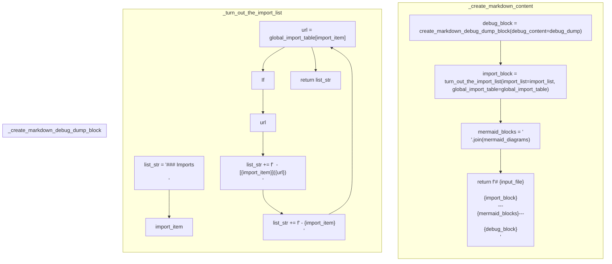

# ./src/pyremaid/markdown_tools.py

### Imports


---

---

<details>
<summary>Debug AST model dump</summary>

```
Module(
  body=[
    FunctionDef(
      name='create_markdown_content',
      args=arguments(
        posonlyargs=[],
        args=[
          arg(
            arg='input_file',
            annotation=Name(
              id='str',
              ctx=Load(),
              lineno=2,
              col_offset=16,
              end_lineno=2,
              end_col_offset=19),
            lineno=2,
            col_offset=4,
            end_lineno=2,
            end_col_offset=19),
          arg(
            arg='import_list',
            annotation=Subscript(
              value=Name(
                id='list',
                ctx=Load(),
                lineno=3,
                col_offset=17,
                end_lineno=3,
                end_col_offset=21),
              slice=Name(
                id='str',
                ctx=Load(),
                lineno=3,
                col_offset=22,
                end_lineno=3,
                end_col_offset=25),
              ctx=Load(),
              lineno=3,
              col_offset=17,
              end_lineno=3,
              end_col_offset=26),
            lineno=3,
            col_offset=4,
            end_lineno=3,
            end_col_offset=26),
          arg(
            arg='global_import_table',
            annotation=Subscript(
              value=Name(
                id='dict',
                ctx=Load(),
                lineno=4,
                col_offset=25,
                end_lineno=4,
                end_col_offset=29),
              slice=Tuple(
                elts=[
                  Name(
                    id='str',
                    ctx=Load(),
                    lineno=4,
                    col_offset=30,
                    end_lineno=4,
                    end_col_offset=33),
                  Name(
                    id='str',
                    ctx=Load(),
                    lineno=4,
                    col_offset=35,
                    end_lineno=4,
                    end_col_offset=38)],
                ctx=Load(),
                lineno=4,
                col_offset=30,
                end_lineno=4,
                end_col_offset=38),
              ctx=Load(),
              lineno=4,
              col_offset=25,
              end_lineno=4,
              end_col_offset=39),
            lineno=4,
            col_offset=4,
            end_lineno=4,
            end_col_offset=39),
          arg(
            arg='mermaid_diagrams',
            annotation=Subscript(
              value=Name(
                id='list',
                ctx=Load(),
                lineno=5,
                col_offset=22,
                end_lineno=5,
                end_col_offset=26),
              slice=Name(
                id='str',
                ctx=Load(),
                lineno=5,
                col_offset=27,
                end_lineno=5,
                end_col_offset=30),
              ctx=Load(),
              lineno=5,
              col_offset=22,
              end_lineno=5,
              end_col_offset=31),
            lineno=5,
            col_offset=4,
            end_lineno=5,
            end_col_offset=31),
          arg(
            arg='debug_dump',
            annotation=Name(
              id='str',
              ctx=Load(),
              lineno=6,
              col_offset=16,
              end_lineno=6,
              end_col_offset=19),
            lineno=6,
            col_offset=4,
            end_lineno=6,
            end_col_offset=19)],
        kwonlyargs=[],
        kw_defaults=[],
        defaults=[]),
      body=[
        Assign(
          targets=[
            Name(
              id='debug_block',
              ctx=Store(),
              lineno=8,
              col_offset=4,
              end_lineno=8,
              end_col_offset=15)],
          value=Call(
            func=Name(
              id='create_markdown_debug_dump_block',
              ctx=Load(),
              lineno=8,
              col_offset=18,
              end_lineno=8,
              end_col_offset=50),
            args=[],
            keywords=[
              keyword(
                arg='debug_content',
                value=Name(
                  id='debug_dump',
                  ctx=Load(),
                  lineno=8,
                  col_offset=65,
                  end_lineno=8,
                  end_col_offset=75),
                lineno=8,
                col_offset=51,
                end_lineno=8,
                end_col_offset=75)],
            lineno=8,
            col_offset=18,
            end_lineno=8,
            end_col_offset=76),
          lineno=8,
          col_offset=4,
          end_lineno=8,
          end_col_offset=76),
        Assign(
          targets=[
            Name(
              id='import_block',
              ctx=Store(),
              lineno=9,
              col_offset=4,
              end_lineno=9,
              end_col_offset=16)],
          value=Call(
            func=Name(
              id='turn_out_the_import_list',
              ctx=Load(),
              lineno=9,
              col_offset=19,
              end_lineno=9,
              end_col_offset=43),
            args=[],
            keywords=[
              keyword(
                arg='import_list',
                value=Name(
                  id='import_list',
                  ctx=Load(),
                  lineno=10,
                  col_offset=20,
                  end_lineno=10,
                  end_col_offset=31),
                lineno=10,
                col_offset=8,
                end_lineno=10,
                end_col_offset=31),
              keyword(
                arg='global_import_table',
                value=Name(
                  id='global_import_table',
                  ctx=Load(),
                  lineno=10,
                  col_offset=53,
                  end_lineno=10,
                  end_col_offset=72),
                lineno=10,
                col_offset=33,
                end_lineno=10,
                end_col_offset=72)],
            lineno=9,
            col_offset=19,
            end_lineno=11,
            end_col_offset=5),
          lineno=9,
          col_offset=4,
          end_lineno=11,
          end_col_offset=5),
        Assign(
          targets=[
            Name(
              id='mermaid_blocks',
              ctx=Store(),
              lineno=12,
              col_offset=4,
              end_lineno=12,
              end_col_offset=18)],
          value=Call(
            func=Attribute(
              value=Constant(
                value='\n',
                lineno=12,
                col_offset=21,
                end_lineno=12,
                end_col_offset=25),
              attr='join',
              ctx=Load(),
              lineno=12,
              col_offset=21,
              end_lineno=12,
              end_col_offset=30),
            args=[
              Name(
                id='mermaid_diagrams',
                ctx=Load(),
                lineno=12,
                col_offset=31,
                end_lineno=12,
                end_col_offset=47)],
            keywords=[],
            lineno=12,
            col_offset=21,
            end_lineno=12,
            end_col_offset=48),
          lineno=12,
          col_offset=4,
          end_lineno=12,
          end_col_offset=48),
        Return(
          value=JoinedStr(
            values=[
              Constant(
                value='# ',
                lineno=14,
                col_offset=8,
                end_lineno=20,
                end_col_offset=26),
              FormattedValue(
                value=Name(
                  id='input_file',
                  ctx=Load(),
                  lineno=14,
                  col_offset=13,
                  end_lineno=14,
                  end_col_offset=23),
                conversion=-1,
                lineno=14,
                col_offset=8,
                end_lineno=20,
                end_col_offset=26),
              Constant(
                value='\n\n',
                lineno=14,
                col_offset=8,
                end_lineno=20,
                end_col_offset=26),
              FormattedValue(
                value=Name(
                  id='import_block',
                  ctx=Load(),
                  lineno=15,
                  col_offset=11,
                  end_lineno=15,
                  end_col_offset=23),
                conversion=-1,
                lineno=14,
                col_offset=8,
                end_lineno=20,
                end_col_offset=26),
              Constant(
                value='\n---\n',
                lineno=14,
                col_offset=8,
                end_lineno=20,
                end_col_offset=26),
              FormattedValue(
                value=Name(
                  id='mermaid_blocks',
                  ctx=Load(),
                  lineno=17,
                  col_offset=11,
                  end_lineno=17,
                  end_col_offset=25),
                conversion=-1,
                lineno=14,
                col_offset=8,
                end_lineno=20,
                end_col_offset=26),
              Constant(
                value='---\n\n',
                lineno=14,
                col_offset=8,
                end_lineno=20,
                end_col_offset=26),
              FormattedValue(
                value=Name(
                  id='debug_block',
                  ctx=Load(),
                  lineno=20,
                  col_offset=11,
                  end_lineno=20,
                  end_col_offset=22),
                conversion=-1,
                lineno=14,
                col_offset=8,
                end_lineno=20,
                end_col_offset=26),
              Constant(
                value='\n',
                lineno=14,
                col_offset=8,
                end_lineno=20,
                end_col_offset=26)],
            lineno=14,
            col_offset=8,
            end_lineno=20,
            end_col_offset=26),
          lineno=13,
          col_offset=4,
          end_lineno=21,
          end_col_offset=5)],
      decorator_list=[],
      returns=Name(
        id='str',
        ctx=Load(),
        lineno=7,
        col_offset=5,
        end_lineno=7,
        end_col_offset=8),
      lineno=1,
      col_offset=0,
      end_lineno=21,
      end_col_offset=5),
    FunctionDef(
      name='turn_out_the_import_list',
      args=arguments(
        posonlyargs=[],
        args=[
          arg(
            arg='import_list',
            annotation=Subscript(
              value=Name(
                id='list',
                ctx=Load(),
                lineno=25,
                col_offset=17,
                end_lineno=25,
                end_col_offset=21),
              slice=Name(
                id='str',
                ctx=Load(),
                lineno=25,
                col_offset=22,
                end_lineno=25,
                end_col_offset=25),
              ctx=Load(),
              lineno=25,
              col_offset=17,
              end_lineno=25,
              end_col_offset=26),
            lineno=25,
            col_offset=4,
            end_lineno=25,
            end_col_offset=26),
          arg(
            arg='global_import_table',
            annotation=Subscript(
              value=Name(
                id='dict',
                ctx=Load(),
                lineno=25,
                col_offset=49,
                end_lineno=25,
                end_col_offset=53),
              slice=Tuple(
                elts=[
                  Name(
                    id='str',
                    ctx=Load(),
                    lineno=25,
                    col_offset=54,
                    end_lineno=25,
                    end_col_offset=57),
                  Name(
                    id='str',
                    ctx=Load(),
                    lineno=25,
                    col_offset=59,
                    end_lineno=25,
                    end_col_offset=62)],
                ctx=Load(),
                lineno=25,
                col_offset=54,
                end_lineno=25,
                end_col_offset=62),
              ctx=Load(),
              lineno=25,
              col_offset=49,
              end_lineno=25,
              end_col_offset=63),
            lineno=25,
            col_offset=28,
            end_lineno=25,
            end_col_offset=63)],
        kwonlyargs=[],
        kw_defaults=[],
        defaults=[]),
      body=[
        Assign(
          targets=[
            Name(
              id='list_str',
              ctx=Store(),
              lineno=27,
              col_offset=4,
              end_lineno=27,
              end_col_offset=12)],
          value=Constant(
            value='### Imports\n\n',
            lineno=27,
            col_offset=15,
            end_lineno=27,
            end_col_offset=32),
          lineno=27,
          col_offset=4,
          end_lineno=27,
          end_col_offset=32),
        For(
          target=Name(
            id='import_item',
            ctx=Store(),
            lineno=28,
            col_offset=8,
            end_lineno=28,
            end_col_offset=19),
          iter=Name(
            id='import_list',
            ctx=Load(),
            lineno=28,
            col_offset=23,
            end_lineno=28,
            end_col_offset=34),
          body=[
            Assign(
              targets=[
                Name(
                  id='url',
                  ctx=Store(),
                  lineno=29,
                  col_offset=8,
                  end_lineno=29,
                  end_col_offset=11)],
              value=Subscript(
                value=Name(
                  id='global_import_table',
                  ctx=Load(),
                  lineno=29,
                  col_offset=14,
                  end_lineno=29,
                  end_col_offset=33),
                slice=Name(
                  id='import_item',
                  ctx=Load(),
                  lineno=29,
                  col_offset=34,
                  end_lineno=29,
                  end_col_offset=45),
                ctx=Load(),
                lineno=29,
                col_offset=14,
                end_lineno=29,
                end_col_offset=46),
              lineno=29,
              col_offset=8,
              end_lineno=29,
              end_col_offset=46),
            If(
              test=Name(
                id='url',
                ctx=Load(),
                lineno=30,
                col_offset=11,
                end_lineno=30,
                end_col_offset=14),
              body=[
                AugAssign(
                  target=Name(
                    id='list_str',
                    ctx=Store(),
                    lineno=31,
                    col_offset=12,
                    end_lineno=31,
                    end_col_offset=20),
                  op=Add(),
                  value=JoinedStr(
                    values=[
                      Constant(
                        value='  - [',
                        lineno=31,
                        col_offset=24,
                        end_lineno=31,
                        end_col_offset=55),
                      FormattedValue(
                        value=Name(
                          id='import_item',
                          ctx=Load(),
                          lineno=31,
                          col_offset=32,
                          end_lineno=31,
                          end_col_offset=43),
                        conversion=-1,
                        lineno=31,
                        col_offset=24,
                        end_lineno=31,
                        end_col_offset=55),
                      Constant(
                        value='](',
                        lineno=31,
                        col_offset=24,
                        end_lineno=31,
                        end_col_offset=55),
                      FormattedValue(
                        value=Name(
                          id='url',
                          ctx=Load(),
                          lineno=31,
                          col_offset=47,
                          end_lineno=31,
                          end_col_offset=50),
                        conversion=-1,
                        lineno=31,
                        col_offset=24,
                        end_lineno=31,
                        end_col_offset=55),
                      Constant(
                        value=')\n',
                        lineno=31,
                        col_offset=24,
                        end_lineno=31,
                        end_col_offset=55)],
                    lineno=31,
                    col_offset=24,
                    end_lineno=31,
                    end_col_offset=55),
                  lineno=31,
                  col_offset=12,
                  end_lineno=31,
                  end_col_offset=55)],
              orelse=[
                AugAssign(
                  target=Name(
                    id='list_str',
                    ctx=Store(),
                    lineno=33,
                    col_offset=12,
                    end_lineno=33,
                    end_col_offset=20),
                  op=Add(),
                  value=JoinedStr(
                    values=[
                      Constant(
                        value='  - ',
                        lineno=33,
                        col_offset=24,
                        end_lineno=33,
                        end_col_offset=46),
                      FormattedValue(
                        value=Name(
                          id='import_item',
                          ctx=Load(),
                          lineno=33,
                          col_offset=31,
                          end_lineno=33,
                          end_col_offset=42),
                        conversion=-1,
                        lineno=33,
                        col_offset=24,
                        end_lineno=33,
                        end_col_offset=46),
                      Constant(
                        value='\n',
                        lineno=33,
                        col_offset=24,
                        end_lineno=33,
                        end_col_offset=46)],
                    lineno=33,
                    col_offset=24,
                    end_lineno=33,
                    end_col_offset=46),
                  lineno=33,
                  col_offset=12,
                  end_lineno=33,
                  end_col_offset=46)],
              lineno=30,
              col_offset=8,
              end_lineno=33,
              end_col_offset=46)],
          orelse=[],
          lineno=28,
          col_offset=4,
          end_lineno=33,
          end_col_offset=46),
        Return(
          value=Name(
            id='list_str',
            ctx=Load(),
            lineno=34,
            col_offset=11,
            end_lineno=34,
            end_col_offset=19),
          lineno=34,
          col_offset=4,
          end_lineno=34,
          end_col_offset=19)],
      decorator_list=[],
      returns=Name(
        id='str',
        ctx=Load(),
        lineno=26,
        col_offset=5,
        end_lineno=26,
        end_col_offset=8),
      lineno=24,
      col_offset=0,
      end_lineno=34,
      end_col_offset=19),
    FunctionDef(
      name='create_markdown_debug_dump_block',
      args=arguments(
        posonlyargs=[],
        args=[
          arg(
            arg='debug_content',
            annotation=Name(
              id='str',
              ctx=Load(),
              lineno=37,
              col_offset=52,
              end_lineno=37,
              end_col_offset=55),
            lineno=37,
            col_offset=37,
            end_lineno=37,
            end_col_offset=55)],
        kwonlyargs=[],
        kw_defaults=[],
        defaults=[]),
      body=[
        Return(
          value=JoinedStr(
            values=[
              Constant(
                value='<details>\n<summary>Debug AST model dump</summary>\n\n```\n',
                lineno=39,
                col_offset=8,
                end_lineno=44,
                end_col_offset=22),
              FormattedValue(
                value=Name(
                  id='debug_content',
                  ctx=Load(),
                  lineno=42,
                  col_offset=11,
                  end_lineno=42,
                  end_col_offset=24),
                conversion=-1,
                lineno=39,
                col_offset=8,
                end_lineno=44,
                end_col_offset=22),
              Constant(
                value='\n```\n</details>\n',
                lineno=39,
                col_offset=8,
                end_lineno=44,
                end_col_offset=22)],
            lineno=39,
            col_offset=8,
            end_lineno=44,
            end_col_offset=22),
          lineno=38,
          col_offset=4,
          end_lineno=45,
          end_col_offset=5)],
      decorator_list=[],
      returns=Name(
        id='str',
        ctx=Load(),
        lineno=37,
        col_offset=60,
        end_lineno=37,
        end_col_offset=63),
      lineno=37,
      col_offset=0,
      end_lineno=45,
      end_col_offset=5)],
  type_ignores=[])
```
</details>

