```mermaid
flowchart TB
  _create_markdown_content_node_0["Assign"]
  _create_markdown_content_node_1["Name"]
  _create_markdown_content_node_2["Store"]
  _create_markdown_content_node_3["Call"]
  _create_markdown_content_node_4["Name"]
  _create_markdown_content_node_5["Load"]
  _create_markdown_content_node_6["keyword"]
  _create_markdown_content_node_7["Name"]
  _create_markdown_content_node_8["Load"]
  _create_markdown_content_node_9["Assign"]
  _create_markdown_content_node_10["Name"]
  _create_markdown_content_node_11["Store"]
  _create_markdown_content_node_12["Call"]
  _create_markdown_content_node_13["Name"]
  _create_markdown_content_node_14["Load"]
  _create_markdown_content_node_15["keyword"]
  _create_markdown_content_node_16["Name"]
  _create_markdown_content_node_17["Load"]
  _create_markdown_content_node_18["Assign"]
  _create_markdown_content_node_19["Name"]
  _create_markdown_content_node_20["Store"]
  _create_markdown_content_node_21["Call"]
  _create_markdown_content_node_22["Attribute"]
  _create_markdown_content_node_23["Constant"]
  _create_markdown_content_node_24["Load"]
  _create_markdown_content_node_25["Name"]
  _create_markdown_content_node_26["Load"]
  _create_markdown_content_node_27["Return"]
  _create_markdown_content_node_28["JoinedStr"]
  _create_markdown_content_node_29["Constant"]
  _create_markdown_content_node_30["FormattedValue"]
  _create_markdown_content_node_31["Name"]
  _create_markdown_content_node_32["Load"]
  _create_markdown_content_node_33["Constant"]
  _create_markdown_content_node_34["FormattedValue"]
  _create_markdown_content_node_35["Name"]
  _create_markdown_content_node_36["Load"]
  _create_markdown_content_node_37["Constant"]
  _create_markdown_content_node_38["FormattedValue"]
  _create_markdown_content_node_39["Name"]
  _create_markdown_content_node_40["Load"]
  _create_markdown_content_node_41["Constant"]
  _create_markdown_content_node_42["FormattedValue"]
  _create_markdown_content_node_43["Name"]
  _create_markdown_content_node_44["Load"]
  _create_markdown_content_node_45["Constant"]
  _turn_out_the_import_list_node_0["Assign"]
  _turn_out_the_import_list_node_1["Name"]
  _turn_out_the_import_list_node_2["Store"]
  _turn_out_the_import_list_node_3["Constant"]
  _turn_out_the_import_list_node_4["For"]
  _turn_out_the_import_list_node_5["Name"]
  _turn_out_the_import_list_node_6["Store"]
  _turn_out_the_import_list_node_7["Name"]
  _turn_out_the_import_list_node_8["Load"]
  _turn_out_the_import_list_node_9["AugAssign"]
  _turn_out_the_import_list_node_10["Name"]
  _turn_out_the_import_list_node_11["Store"]
  _turn_out_the_import_list_node_12["Add"]
  _turn_out_the_import_list_node_13["JoinedStr"]
  _turn_out_the_import_list_node_14["Constant"]
  _turn_out_the_import_list_node_15["FormattedValue"]
  _turn_out_the_import_list_node_16["Name"]
  _turn_out_the_import_list_node_17["Load"]
  _turn_out_the_import_list_node_18["Constant"]
  _turn_out_the_import_list_node_19["Return"]
  _turn_out_the_import_list_node_20["Name"]
  _turn_out_the_import_list_node_21["Load"]
  _create_markdown_debug_dump_block_node_0["Return"]
  _create_markdown_debug_dump_block_node_1["JoinedStr"]
  _create_markdown_debug_dump_block_node_2["Constant"]
  _create_markdown_debug_dump_block_node_3["FormattedValue"]
  _create_markdown_debug_dump_block_node_4["Name"]
  _create_markdown_debug_dump_block_node_5["Load"]
  _create_markdown_debug_dump_block_node_6["Constant"]

  subgraph create_markdown_content
    direction TB
    _create_markdown_content_node_0 --> _create_markdown_content_node_1
    _create_markdown_content_node_1 --> _create_markdown_content_node_2
    _create_markdown_content_node_2 --> _create_markdown_content_node_3
    _create_markdown_content_node_3 --> _create_markdown_content_node_4
    _create_markdown_content_node_4 --> _create_markdown_content_node_5
    _create_markdown_content_node_5 --> _create_markdown_content_node_6
    _create_markdown_content_node_6 --> _create_markdown_content_node_7
    _create_markdown_content_node_7 --> _create_markdown_content_node_8
    _create_markdown_content_node_8 --> _create_markdown_content_node_9
    _create_markdown_content_node_9 --> _create_markdown_content_node_10
    _create_markdown_content_node_10 --> _create_markdown_content_node_11
    _create_markdown_content_node_11 --> _create_markdown_content_node_12
    _create_markdown_content_node_12 --> _create_markdown_content_node_13
    _create_markdown_content_node_13 --> _create_markdown_content_node_14
    _create_markdown_content_node_14 --> _create_markdown_content_node_15
    _create_markdown_content_node_15 --> _create_markdown_content_node_16
    _create_markdown_content_node_16 --> _create_markdown_content_node_17
    _create_markdown_content_node_17 --> _create_markdown_content_node_18
    _create_markdown_content_node_18 --> _create_markdown_content_node_19
    _create_markdown_content_node_19 --> _create_markdown_content_node_20
    _create_markdown_content_node_20 --> _create_markdown_content_node_21
    _create_markdown_content_node_21 --> _create_markdown_content_node_22
    _create_markdown_content_node_22 --> _create_markdown_content_node_23
    _create_markdown_content_node_23 --> _create_markdown_content_node_24
    _create_markdown_content_node_24 --> _create_markdown_content_node_25
    _create_markdown_content_node_25 --> _create_markdown_content_node_26
    _create_markdown_content_node_26 --> _create_markdown_content_node_27
    _create_markdown_content_node_27 --> _create_markdown_content_node_28
    _create_markdown_content_node_28 --> _create_markdown_content_node_29
    _create_markdown_content_node_29 --> _create_markdown_content_node_30
    _create_markdown_content_node_30 --> _create_markdown_content_node_31
    _create_markdown_content_node_31 --> _create_markdown_content_node_32
    _create_markdown_content_node_32 --> _create_markdown_content_node_33
    _create_markdown_content_node_33 --> _create_markdown_content_node_34
    _create_markdown_content_node_34 --> _create_markdown_content_node_35
    _create_markdown_content_node_35 --> _create_markdown_content_node_36
    _create_markdown_content_node_36 --> _create_markdown_content_node_37
    _create_markdown_content_node_37 --> _create_markdown_content_node_38
    _create_markdown_content_node_38 --> _create_markdown_content_node_39
    _create_markdown_content_node_39 --> _create_markdown_content_node_40
    _create_markdown_content_node_40 --> _create_markdown_content_node_41
    _create_markdown_content_node_41 --> _create_markdown_content_node_42
    _create_markdown_content_node_42 --> _create_markdown_content_node_43
    _create_markdown_content_node_43 --> _create_markdown_content_node_44
    _create_markdown_content_node_44 --> _create_markdown_content_node_45
  end
  subgraph turn_out_the_import_list
    direction TB
    _turn_out_the_import_list_node_0 --> _turn_out_the_import_list_node_1
    _turn_out_the_import_list_node_1 --> _turn_out_the_import_list_node_2
    _turn_out_the_import_list_node_2 --> _turn_out_the_import_list_node_3
    _turn_out_the_import_list_node_3 --> _turn_out_the_import_list_node_4
    _turn_out_the_import_list_node_4 --> _turn_out_the_import_list_node_5
    _turn_out_the_import_list_node_5 --> _turn_out_the_import_list_node_6
    _turn_out_the_import_list_node_6 --> _turn_out_the_import_list_node_7
    _turn_out_the_import_list_node_7 --> _turn_out_the_import_list_node_8
    _turn_out_the_import_list_node_8 --> _turn_out_the_import_list_node_9
    _turn_out_the_import_list_node_9 --> _turn_out_the_import_list_node_10
    _turn_out_the_import_list_node_10 --> _turn_out_the_import_list_node_11
    _turn_out_the_import_list_node_11 --> _turn_out_the_import_list_node_12
    _turn_out_the_import_list_node_12 --> _turn_out_the_import_list_node_13
    _turn_out_the_import_list_node_13 --> _turn_out_the_import_list_node_14
    _turn_out_the_import_list_node_14 --> _turn_out_the_import_list_node_15
    _turn_out_the_import_list_node_15 --> _turn_out_the_import_list_node_16
    _turn_out_the_import_list_node_16 --> _turn_out_the_import_list_node_17
    _turn_out_the_import_list_node_17 --> _turn_out_the_import_list_node_18
    _turn_out_the_import_list_node_18 --> _turn_out_the_import_list_node_19
    _turn_out_the_import_list_node_19 --> _turn_out_the_import_list_node_20
    _turn_out_the_import_list_node_20 --> _turn_out_the_import_list_node_21
  end
  subgraph create_markdown_debug_dump_block
    direction TB
    _create_markdown_debug_dump_block_node_0 --> _create_markdown_debug_dump_block_node_1
    _create_markdown_debug_dump_block_node_1 --> _create_markdown_debug_dump_block_node_2
    _create_markdown_debug_dump_block_node_2 --> _create_markdown_debug_dump_block_node_3
    _create_markdown_debug_dump_block_node_3 --> _create_markdown_debug_dump_block_node_4
    _create_markdown_debug_dump_block_node_4 --> _create_markdown_debug_dump_block_node_5
    _create_markdown_debug_dump_block_node_5 --> _create_markdown_debug_dump_block_node_6
  end

```

# ./src/pyremaid/markdown_tools.py

### Imports


---

---

<details>
<summary>Debug AST model dump</summary>

```
Module(
  body=[
    FunctionDef(
      name='create_markdown_content',
      args=arguments(
        posonlyargs=[],
        args=[
          arg(
            arg='input_file',
            annotation=Name(
              id='str',
              ctx=Load(),
              lineno=3,
              col_offset=16,
              end_lineno=3,
              end_col_offset=19),
            lineno=3,
            col_offset=4,
            end_lineno=3,
            end_col_offset=19),
          arg(
            arg='import_list',
            annotation=Subscript(
              value=Name(
                id='list',
                ctx=Load(),
                lineno=4,
                col_offset=17,
                end_lineno=4,
                end_col_offset=21),
              slice=Name(
                id='str',
                ctx=Load(),
                lineno=4,
                col_offset=22,
                end_lineno=4,
                end_col_offset=25),
              ctx=Load(),
              lineno=4,
              col_offset=17,
              end_lineno=4,
              end_col_offset=26),
            lineno=4,
            col_offset=4,
            end_lineno=4,
            end_col_offset=26),
          arg(
            arg='mermaid_diagrams',
            annotation=Subscript(
              value=Name(
                id='list',
                ctx=Load(),
                lineno=5,
                col_offset=22,
                end_lineno=5,
                end_col_offset=26),
              slice=Name(
                id='str',
                ctx=Load(),
                lineno=5,
                col_offset=27,
                end_lineno=5,
                end_col_offset=30),
              ctx=Load(),
              lineno=5,
              col_offset=22,
              end_lineno=5,
              end_col_offset=31),
            lineno=5,
            col_offset=4,
            end_lineno=5,
            end_col_offset=31),
          arg(
            arg='debug_dump',
            annotation=Name(
              id='str',
              ctx=Load(),
              lineno=6,
              col_offset=16,
              end_lineno=6,
              end_col_offset=19),
            lineno=6,
            col_offset=4,
            end_lineno=6,
            end_col_offset=19)],
        kwonlyargs=[],
        kw_defaults=[],
        defaults=[]),
      body=[
        Assign(
          targets=[
            Name(
              id='debug_block',
              ctx=Store(),
              lineno=8,
              col_offset=4,
              end_lineno=8,
              end_col_offset=15)],
          value=Call(
            func=Name(
              id='create_markdown_debug_dump_block',
              ctx=Load(),
              lineno=8,
              col_offset=18,
              end_lineno=8,
              end_col_offset=50),
            args=[],
            keywords=[
              keyword(
                arg='debug_content',
                value=Name(
                  id='debug_dump',
                  ctx=Load(),
                  lineno=8,
                  col_offset=65,
                  end_lineno=8,
                  end_col_offset=75),
                lineno=8,
                col_offset=51,
                end_lineno=8,
                end_col_offset=75)],
            lineno=8,
            col_offset=18,
            end_lineno=8,
            end_col_offset=76),
          lineno=8,
          col_offset=4,
          end_lineno=8,
          end_col_offset=76),
        Assign(
          targets=[
            Name(
              id='import_block',
              ctx=Store(),
              lineno=9,
              col_offset=4,
              end_lineno=9,
              end_col_offset=16)],
          value=Call(
            func=Name(
              id='turn_out_the_import_list',
              ctx=Load(),
              lineno=9,
              col_offset=19,
              end_lineno=9,
              end_col_offset=43),
            args=[],
            keywords=[
              keyword(
                arg='import_list',
                value=Name(
                  id='import_list',
                  ctx=Load(),
                  lineno=9,
                  col_offset=56,
                  end_lineno=9,
                  end_col_offset=67),
                lineno=9,
                col_offset=44,
                end_lineno=9,
                end_col_offset=67)],
            lineno=9,
            col_offset=19,
            end_lineno=9,
            end_col_offset=68),
          lineno=9,
          col_offset=4,
          end_lineno=9,
          end_col_offset=68),
        Assign(
          targets=[
            Name(
              id='mermaid_blocks',
              ctx=Store(),
              lineno=10,
              col_offset=4,
              end_lineno=10,
              end_col_offset=18)],
          value=Call(
            func=Attribute(
              value=Constant(
                value='\n',
                lineno=10,
                col_offset=21,
                end_lineno=10,
                end_col_offset=25),
              attr='join',
              ctx=Load(),
              lineno=10,
              col_offset=21,
              end_lineno=10,
              end_col_offset=30),
            args=[
              Name(
                id='mermaid_diagrams',
                ctx=Load(),
                lineno=10,
                col_offset=31,
                end_lineno=10,
                end_col_offset=47)],
            keywords=[],
            lineno=10,
            col_offset=21,
            end_lineno=10,
            end_col_offset=48),
          lineno=10,
          col_offset=4,
          end_lineno=10,
          end_col_offset=48),
        Return(
          value=JoinedStr(
            values=[
              Constant(
                value='# ',
                lineno=12,
                col_offset=8,
                end_lineno=18,
                end_col_offset=26),
              FormattedValue(
                value=Name(
                  id='input_file',
                  ctx=Load(),
                  lineno=12,
                  col_offset=13,
                  end_lineno=12,
                  end_col_offset=23),
                conversion=-1,
                lineno=12,
                col_offset=8,
                end_lineno=18,
                end_col_offset=26),
              Constant(
                value='\n\n',
                lineno=12,
                col_offset=8,
                end_lineno=18,
                end_col_offset=26),
              FormattedValue(
                value=Name(
                  id='import_block',
                  ctx=Load(),
                  lineno=13,
                  col_offset=11,
                  end_lineno=13,
                  end_col_offset=23),
                conversion=-1,
                lineno=12,
                col_offset=8,
                end_lineno=18,
                end_col_offset=26),
              Constant(
                value='\n---\n',
                lineno=12,
                col_offset=8,
                end_lineno=18,
                end_col_offset=26),
              FormattedValue(
                value=Name(
                  id='mermaid_blocks',
                  ctx=Load(),
                  lineno=15,
                  col_offset=11,
                  end_lineno=15,
                  end_col_offset=25),
                conversion=-1,
                lineno=12,
                col_offset=8,
                end_lineno=18,
                end_col_offset=26),
              Constant(
                value='---\n\n',
                lineno=12,
                col_offset=8,
                end_lineno=18,
                end_col_offset=26),
              FormattedValue(
                value=Name(
                  id='debug_block',
                  ctx=Load(),
                  lineno=18,
                  col_offset=11,
                  end_lineno=18,
                  end_col_offset=22),
                conversion=-1,
                lineno=12,
                col_offset=8,
                end_lineno=18,
                end_col_offset=26),
              Constant(
                value='\n',
                lineno=12,
                col_offset=8,
                end_lineno=18,
                end_col_offset=26)],
            lineno=12,
            col_offset=8,
            end_lineno=18,
            end_col_offset=26),
          lineno=11,
          col_offset=4,
          end_lineno=19,
          end_col_offset=5)],
      decorator_list=[],
      returns=Name(
        id='str',
        ctx=Load(),
        lineno=7,
        col_offset=5,
        end_lineno=7,
        end_col_offset=8),
      lineno=2,
      col_offset=0,
      end_lineno=19,
      end_col_offset=5),
    FunctionDef(
      name='turn_out_the_import_list',
      args=arguments(
        posonlyargs=[],
        args=[
          arg(
            arg='import_list',
            annotation=Subscript(
              value=Name(
                id='list',
                ctx=Load(),
                lineno=22,
                col_offset=42,
                end_lineno=22,
                end_col_offset=46),
              slice=Name(
                id='str',
                ctx=Load(),
                lineno=22,
                col_offset=47,
                end_lineno=22,
                end_col_offset=50),
              ctx=Load(),
              lineno=22,
              col_offset=42,
              end_lineno=22,
              end_col_offset=51),
            lineno=22,
            col_offset=29,
            end_lineno=22,
            end_col_offset=51)],
        kwonlyargs=[],
        kw_defaults=[],
        defaults=[]),
      body=[
        Assign(
          targets=[
            Name(
              id='list_str',
              ctx=Store(),
              lineno=23,
              col_offset=4,
              end_lineno=23,
              end_col_offset=12)],
          value=Constant(
            value='### Imports\n\n',
            lineno=23,
            col_offset=15,
            end_lineno=23,
            end_col_offset=32),
          lineno=23,
          col_offset=4,
          end_lineno=23,
          end_col_offset=32),
        For(
          target=Name(
            id='import_item',
            ctx=Store(),
            lineno=24,
            col_offset=8,
            end_lineno=24,
            end_col_offset=19),
          iter=Name(
            id='import_list',
            ctx=Load(),
            lineno=24,
            col_offset=23,
            end_lineno=24,
            end_col_offset=34),
          body=[
            AugAssign(
              target=Name(
                id='list_str',
                ctx=Store(),
                lineno=25,
                col_offset=8,
                end_lineno=25,
                end_col_offset=16),
              op=Add(),
              value=JoinedStr(
                values=[
                  Constant(
                    value='  - ',
                    lineno=25,
                    col_offset=20,
                    end_lineno=25,
                    end_col_offset=42),
                  FormattedValue(
                    value=Name(
                      id='import_item',
                      ctx=Load(),
                      lineno=25,
                      col_offset=27,
                      end_lineno=25,
                      end_col_offset=38),
                    conversion=-1,
                    lineno=25,
                    col_offset=20,
                    end_lineno=25,
                    end_col_offset=42),
                  Constant(
                    value='\n',
                    lineno=25,
                    col_offset=20,
                    end_lineno=25,
                    end_col_offset=42)],
                lineno=25,
                col_offset=20,
                end_lineno=25,
                end_col_offset=42),
              lineno=25,
              col_offset=8,
              end_lineno=25,
              end_col_offset=42)],
          orelse=[],
          lineno=24,
          col_offset=4,
          end_lineno=25,
          end_col_offset=42),
        Return(
          value=Name(
            id='list_str',
            ctx=Load(),
            lineno=26,
            col_offset=11,
            end_lineno=26,
            end_col_offset=19),
          lineno=26,
          col_offset=4,
          end_lineno=26,
          end_col_offset=19)],
      decorator_list=[],
      returns=Name(
        id='str',
        ctx=Load(),
        lineno=22,
        col_offset=56,
        end_lineno=22,
        end_col_offset=59),
      lineno=22,
      col_offset=0,
      end_lineno=26,
      end_col_offset=19),
    FunctionDef(
      name='create_markdown_debug_dump_block',
      args=arguments(
        posonlyargs=[],
        args=[
          arg(
            arg='debug_content',
            annotation=Name(
              id='str',
              ctx=Load(),
              lineno=30,
              col_offset=52,
              end_lineno=30,
              end_col_offset=55),
            lineno=30,
            col_offset=37,
            end_lineno=30,
            end_col_offset=55)],
        kwonlyargs=[],
        kw_defaults=[],
        defaults=[]),
      body=[
        Return(
          value=JoinedStr(
            values=[
              Constant(
                value='<details>\n<summary>Debug AST model dump</summary>\n\n```\n',
                lineno=32,
                col_offset=8,
                end_lineno=37,
                end_col_offset=22),
              FormattedValue(
                value=Name(
                  id='debug_content',
                  ctx=Load(),
                  lineno=35,
                  col_offset=11,
                  end_lineno=35,
                  end_col_offset=24),
                conversion=-1,
                lineno=32,
                col_offset=8,
                end_lineno=37,
                end_col_offset=22),
              Constant(
                value='\n```\n</details>\n',
                lineno=32,
                col_offset=8,
                end_lineno=37,
                end_col_offset=22)],
            lineno=32,
            col_offset=8,
            end_lineno=37,
            end_col_offset=22),
          lineno=31,
          col_offset=4,
          end_lineno=38,
          end_col_offset=5)],
      decorator_list=[],
      returns=Name(
        id='str',
        ctx=Load(),
        lineno=30,
        col_offset=60,
        end_lineno=30,
        end_col_offset=63),
      lineno=30,
      col_offset=0,
      end_lineno=38,
      end_col_offset=5)],
  type_ignores=[])
```
</details>

