```mermaid
flowchart TB
  _f8_n44["Assign"]
  _f8_n45["Name"]
  _f8_n46["Store"]
  _f8_n47["Call"]
  _f8_n48["Name"]
  _f8_n49["Load"]
  _f8_n50["keyword"]
  _f8_n51["Name"]
  _f8_n52["Load"]
  _f8_n53["Assign"]
  _f8_n54["Name"]
  _f8_n55["Store"]
  _f8_n56["Call"]
  _f8_n57["Name"]
  _f8_n58["Load"]
  _f8_n59["keyword"]
  _f8_n60["Name"]
  _f8_n61["Load"]
  _f8_n62["keyword"]
  _f8_n63["Name"]
  _f8_n64["Load"]
  _f8_n65["Assign"]
  _f8_n66["Name"]
  _f8_n67["Store"]
  _f8_n68["Call"]
  _f8_n69["Attribute"]
  _f8_n70["Constant"]
  _f8_n71["Load"]
  _f8_n72["Name"]
  _f8_n73["Load"]
  _f8_n74["Return"]
  _f8_n75["JoinedStr"]
  _f8_n76["Constant"]
  _f8_n77["FormattedValue"]
  _f8_n78["Name"]
  _f8_n79["Load"]
  _f8_n80["Constant"]
  _f8_n81["FormattedValue"]
  _f8_n82["Name"]
  _f8_n83["Load"]
  _f8_n84["Constant"]
  _f8_n85["FormattedValue"]
  _f8_n86["Name"]
  _f8_n87["Load"]
  _f8_n88["Constant"]
  _f8_n89["FormattedValue"]
  _f8_n90["Name"]
  _f8_n91["Load"]
  _f8_n92["Constant"]
  _f9_n93["Assign"]
  _f9_n94["Name"]
  _f9_n95["Store"]
  _f9_n96["Constant"]
  _f9_n97["For"]
  _f9_n98["Name"]
  _f9_n99["Store"]
  _f9_n100["Name"]
  _f9_n101["Load"]
  _f9_n102["Assign"]
  _f9_n103["Name"]
  _f9_n104["Store"]
  _f9_n105["Subscript"]
  _f9_n106["Name"]
  _f9_n107["Load"]
  _f9_n108["Name"]
  _f9_n109["Load"]
  _f9_n110["Load"]
  _f9_n111["If"]
  _f9_n112["Name"]
  _f9_n113["Load"]
  _f9_n114["AugAssign"]
  _f9_n115["Name"]
  _f9_n116["Store"]
  _f9_n117["Add"]
  _f9_n118["JoinedStr"]
  _f9_n119["Constant"]
  _f9_n120["FormattedValue"]
  _f9_n121["Name"]
  _f9_n122["Load"]
  _f9_n123["Constant"]
  _f9_n124["FormattedValue"]
  _f9_n125["Name"]
  _f9_n126["Load"]
  _f9_n127["Constant"]
  _f9_n128["AugAssign"]
  _f9_n129["Name"]
  _f9_n130["Store"]
  _f9_n131["Add"]
  _f9_n132["JoinedStr"]
  _f9_n133["Constant"]
  _f9_n134["FormattedValue"]
  _f9_n135["Name"]
  _f9_n136["Load"]
  _f9_n137["Constant"]
  _f9_n138["Return"]
  _f9_n139["Name"]
  _f9_n140["Load"]
  _f10_n141["Return"]
  _f10_n142["JoinedStr"]
  _f10_n143["Constant"]
  _f10_n144["FormattedValue"]
  _f10_n145["Name"]
  _f10_n146["Load"]
  _f10_n147["Constant"]

  subgraph _create_markdown_content
    direction TB
    _f8_n44 --> _f8_n45
    _f8_n45 --> _f8_n46
    _f8_n46 --> _f8_n47
    _f8_n47 --> _f8_n48
    _f8_n48 --> _f8_n49
    _f8_n49 --> _f8_n50
    _f8_n50 --> _f8_n51
    _f8_n51 --> _f8_n52
    _f8_n52 --> _f8_n53
    _f8_n53 --> _f8_n54
    _f8_n54 --> _f8_n55
    _f8_n55 --> _f8_n56
    _f8_n56 --> _f8_n57
    _f8_n57 --> _f8_n58
    _f8_n58 --> _f8_n59
    _f8_n59 --> _f8_n60
    _f8_n60 --> _f8_n61
    _f8_n61 --> _f8_n62
    _f8_n62 --> _f8_n63
    _f8_n63 --> _f8_n64
    _f8_n64 --> _f8_n65
    _f8_n65 --> _f8_n66
    _f8_n66 --> _f8_n67
    _f8_n67 --> _f8_n68
    _f8_n68 --> _f8_n69
    _f8_n69 --> _f8_n70
    _f8_n70 --> _f8_n71
    _f8_n71 --> _f8_n72
    _f8_n72 --> _f8_n73
    _f8_n73 --> _f8_n74
    _f8_n74 --> _f8_n75
    _f8_n75 --> _f8_n76
    _f8_n76 --> _f8_n77
    _f8_n77 --> _f8_n78
    _f8_n78 --> _f8_n79
    _f8_n79 --> _f8_n80
    _f8_n80 --> _f8_n81
    _f8_n81 --> _f8_n82
    _f8_n82 --> _f8_n83
    _f8_n83 --> _f8_n84
    _f8_n84 --> _f8_n85
    _f8_n85 --> _f8_n86
    _f8_n86 --> _f8_n87
    _f8_n87 --> _f8_n88
    _f8_n88 --> _f8_n89
    _f8_n89 --> _f8_n90
    _f8_n90 --> _f8_n91
    _f8_n91 --> _f8_n92
  end
  subgraph _turn_out_the_import_list
    direction TB
    _f9_n93 --> _f9_n94
    _f9_n94 --> _f9_n95
    _f9_n95 --> _f9_n96
    _f9_n96 --> _f9_n97
    _f9_n97 --> _f9_n98
    _f9_n98 --> _f9_n99
    _f9_n99 --> _f9_n100
    _f9_n100 --> _f9_n101
    _f9_n101 --> _f9_n102
    _f9_n102 --> _f9_n103
    _f9_n103 --> _f9_n104
    _f9_n104 --> _f9_n105
    _f9_n105 --> _f9_n106
    _f9_n106 --> _f9_n107
    _f9_n107 --> _f9_n108
    _f9_n108 --> _f9_n109
    _f9_n109 --> _f9_n110
    _f9_n110 --> _f9_n111
    _f9_n111 --> _f9_n112
    _f9_n112 --> _f9_n113
    _f9_n113 --> _f9_n114
    _f9_n114 --> _f9_n115
    _f9_n115 --> _f9_n116
    _f9_n116 --> _f9_n117
    _f9_n117 --> _f9_n118
    _f9_n118 --> _f9_n119
    _f9_n119 --> _f9_n120
    _f9_n120 --> _f9_n121
    _f9_n121 --> _f9_n122
    _f9_n122 --> _f9_n123
    _f9_n123 --> _f9_n124
    _f9_n124 --> _f9_n125
    _f9_n125 --> _f9_n126
    _f9_n126 --> _f9_n127
    _f9_n127 --> _f9_n128
    _f9_n128 --> _f9_n129
    _f9_n129 --> _f9_n130
    _f9_n130 --> _f9_n131
    _f9_n131 --> _f9_n132
    _f9_n132 --> _f9_n133
    _f9_n133 --> _f9_n134
    _f9_n134 --> _f9_n135
    _f9_n135 --> _f9_n136
    _f9_n136 --> _f9_n137
    _f9_n137 --> _f9_n138
    _f9_n138 --> _f9_n139
    _f9_n139 --> _f9_n140
  end
  subgraph _create_markdown_debug_dump_block
    direction TB
    _f10_n141 --> _f10_n142
    _f10_n142 --> _f10_n143
    _f10_n143 --> _f10_n144
    _f10_n144 --> _f10_n145
    _f10_n145 --> _f10_n146
    _f10_n146 --> _f10_n147
  end

```

# ./src/pyremaid/markdown_tools.py

### Imports


---

---

<details>
<summary>Debug AST model dump</summary>

```
Module(
  body=[
    FunctionDef(
      name='create_markdown_content',
      args=arguments(
        posonlyargs=[],
        args=[
          arg(
            arg='input_file',
            annotation=Name(
              id='str',
              ctx=Load(),
              lineno=3,
              col_offset=16,
              end_lineno=3,
              end_col_offset=19),
            lineno=3,
            col_offset=4,
            end_lineno=3,
            end_col_offset=19),
          arg(
            arg='import_list',
            annotation=Subscript(
              value=Name(
                id='list',
                ctx=Load(),
                lineno=4,
                col_offset=17,
                end_lineno=4,
                end_col_offset=21),
              slice=Name(
                id='str',
                ctx=Load(),
                lineno=4,
                col_offset=22,
                end_lineno=4,
                end_col_offset=25),
              ctx=Load(),
              lineno=4,
              col_offset=17,
              end_lineno=4,
              end_col_offset=26),
            lineno=4,
            col_offset=4,
            end_lineno=4,
            end_col_offset=26),
          arg(
            arg='global_import_table',
            annotation=Subscript(
              value=Name(
                id='dict',
                ctx=Load(),
                lineno=5,
                col_offset=25,
                end_lineno=5,
                end_col_offset=29),
              slice=Tuple(
                elts=[
                  Name(
                    id='str',
                    ctx=Load(),
                    lineno=5,
                    col_offset=30,
                    end_lineno=5,
                    end_col_offset=33),
                  Name(
                    id='str',
                    ctx=Load(),
                    lineno=5,
                    col_offset=34,
                    end_lineno=5,
                    end_col_offset=37)],
                ctx=Load(),
                lineno=5,
                col_offset=30,
                end_lineno=5,
                end_col_offset=37),
              ctx=Load(),
              lineno=5,
              col_offset=25,
              end_lineno=5,
              end_col_offset=38),
            lineno=5,
            col_offset=4,
            end_lineno=5,
            end_col_offset=38),
          arg(
            arg='mermaid_diagrams',
            annotation=Subscript(
              value=Name(
                id='list',
                ctx=Load(),
                lineno=6,
                col_offset=22,
                end_lineno=6,
                end_col_offset=26),
              slice=Name(
                id='str',
                ctx=Load(),
                lineno=6,
                col_offset=27,
                end_lineno=6,
                end_col_offset=30),
              ctx=Load(),
              lineno=6,
              col_offset=22,
              end_lineno=6,
              end_col_offset=31),
            lineno=6,
            col_offset=4,
            end_lineno=6,
            end_col_offset=31),
          arg(
            arg='debug_dump',
            annotation=Name(
              id='str',
              ctx=Load(),
              lineno=7,
              col_offset=16,
              end_lineno=7,
              end_col_offset=19),
            lineno=7,
            col_offset=4,
            end_lineno=7,
            end_col_offset=19)],
        kwonlyargs=[],
        kw_defaults=[],
        defaults=[]),
      body=[
        Assign(
          targets=[
            Name(
              id='debug_block',
              ctx=Store(),
              lineno=9,
              col_offset=4,
              end_lineno=9,
              end_col_offset=15)],
          value=Call(
            func=Name(
              id='create_markdown_debug_dump_block',
              ctx=Load(),
              lineno=9,
              col_offset=18,
              end_lineno=9,
              end_col_offset=50),
            args=[],
            keywords=[
              keyword(
                arg='debug_content',
                value=Name(
                  id='debug_dump',
                  ctx=Load(),
                  lineno=9,
                  col_offset=65,
                  end_lineno=9,
                  end_col_offset=75),
                lineno=9,
                col_offset=51,
                end_lineno=9,
                end_col_offset=75)],
            lineno=9,
            col_offset=18,
            end_lineno=9,
            end_col_offset=76),
          lineno=9,
          col_offset=4,
          end_lineno=9,
          end_col_offset=76),
        Assign(
          targets=[
            Name(
              id='import_block',
              ctx=Store(),
              lineno=10,
              col_offset=4,
              end_lineno=10,
              end_col_offset=16)],
          value=Call(
            func=Name(
              id='turn_out_the_import_list',
              ctx=Load(),
              lineno=10,
              col_offset=19,
              end_lineno=10,
              end_col_offset=43),
            args=[],
            keywords=[
              keyword(
                arg='import_list',
                value=Name(
                  id='import_list',
                  ctx=Load(),
                  lineno=11,
                  col_offset=20,
                  end_lineno=11,
                  end_col_offset=31),
                lineno=11,
                col_offset=8,
                end_lineno=11,
                end_col_offset=31),
              keyword(
                arg='global_import_table',
                value=Name(
                  id='global_import_table',
                  ctx=Load(),
                  lineno=11,
                  col_offset=53,
                  end_lineno=11,
                  end_col_offset=72),
                lineno=11,
                col_offset=33,
                end_lineno=11,
                end_col_offset=72)],
            lineno=10,
            col_offset=19,
            end_lineno=12,
            end_col_offset=5),
          lineno=10,
          col_offset=4,
          end_lineno=12,
          end_col_offset=5),
        Assign(
          targets=[
            Name(
              id='mermaid_blocks',
              ctx=Store(),
              lineno=13,
              col_offset=4,
              end_lineno=13,
              end_col_offset=18)],
          value=Call(
            func=Attribute(
              value=Constant(
                value='\n',
                lineno=13,
                col_offset=21,
                end_lineno=13,
                end_col_offset=25),
              attr='join',
              ctx=Load(),
              lineno=13,
              col_offset=21,
              end_lineno=13,
              end_col_offset=30),
            args=[
              Name(
                id='mermaid_diagrams',
                ctx=Load(),
                lineno=13,
                col_offset=31,
                end_lineno=13,
                end_col_offset=47)],
            keywords=[],
            lineno=13,
            col_offset=21,
            end_lineno=13,
            end_col_offset=48),
          lineno=13,
          col_offset=4,
          end_lineno=13,
          end_col_offset=48),
        Return(
          value=JoinedStr(
            values=[
              Constant(
                value='# ',
                lineno=15,
                col_offset=8,
                end_lineno=21,
                end_col_offset=26),
              FormattedValue(
                value=Name(
                  id='input_file',
                  ctx=Load(),
                  lineno=15,
                  col_offset=13,
                  end_lineno=15,
                  end_col_offset=23),
                conversion=-1,
                lineno=15,
                col_offset=8,
                end_lineno=21,
                end_col_offset=26),
              Constant(
                value='\n\n',
                lineno=15,
                col_offset=8,
                end_lineno=21,
                end_col_offset=26),
              FormattedValue(
                value=Name(
                  id='import_block',
                  ctx=Load(),
                  lineno=16,
                  col_offset=11,
                  end_lineno=16,
                  end_col_offset=23),
                conversion=-1,
                lineno=15,
                col_offset=8,
                end_lineno=21,
                end_col_offset=26),
              Constant(
                value='\n---\n',
                lineno=15,
                col_offset=8,
                end_lineno=21,
                end_col_offset=26),
              FormattedValue(
                value=Name(
                  id='mermaid_blocks',
                  ctx=Load(),
                  lineno=18,
                  col_offset=11,
                  end_lineno=18,
                  end_col_offset=25),
                conversion=-1,
                lineno=15,
                col_offset=8,
                end_lineno=21,
                end_col_offset=26),
              Constant(
                value='---\n\n',
                lineno=15,
                col_offset=8,
                end_lineno=21,
                end_col_offset=26),
              FormattedValue(
                value=Name(
                  id='debug_block',
                  ctx=Load(),
                  lineno=21,
                  col_offset=11,
                  end_lineno=21,
                  end_col_offset=22),
                conversion=-1,
                lineno=15,
                col_offset=8,
                end_lineno=21,
                end_col_offset=26),
              Constant(
                value='\n',
                lineno=15,
                col_offset=8,
                end_lineno=21,
                end_col_offset=26)],
            lineno=15,
            col_offset=8,
            end_lineno=21,
            end_col_offset=26),
          lineno=14,
          col_offset=4,
          end_lineno=22,
          end_col_offset=5)],
      decorator_list=[],
      returns=Name(
        id='str',
        ctx=Load(),
        lineno=8,
        col_offset=5,
        end_lineno=8,
        end_col_offset=8),
      lineno=2,
      col_offset=0,
      end_lineno=22,
      end_col_offset=5),
    FunctionDef(
      name='turn_out_the_import_list',
      args=arguments(
        posonlyargs=[],
        args=[
          arg(
            arg='import_list',
            annotation=Subscript(
              value=Name(
                id='list',
                ctx=Load(),
                lineno=26,
                col_offset=17,
                end_lineno=26,
                end_col_offset=21),
              slice=Name(
                id='str',
                ctx=Load(),
                lineno=26,
                col_offset=22,
                end_lineno=26,
                end_col_offset=25),
              ctx=Load(),
              lineno=26,
              col_offset=17,
              end_lineno=26,
              end_col_offset=26),
            lineno=26,
            col_offset=4,
            end_lineno=26,
            end_col_offset=26),
          arg(
            arg='global_import_table',
            annotation=Subscript(
              value=Name(
                id='dict',
                ctx=Load(),
                lineno=26,
                col_offset=49,
                end_lineno=26,
                end_col_offset=53),
              slice=Tuple(
                elts=[
                  Name(
                    id='str',
                    ctx=Load(),
                    lineno=26,
                    col_offset=54,
                    end_lineno=26,
                    end_col_offset=57),
                  Name(
                    id='str',
                    ctx=Load(),
                    lineno=26,
                    col_offset=58,
                    end_lineno=26,
                    end_col_offset=61)],
                ctx=Load(),
                lineno=26,
                col_offset=54,
                end_lineno=26,
                end_col_offset=61),
              ctx=Load(),
              lineno=26,
              col_offset=49,
              end_lineno=26,
              end_col_offset=62),
            lineno=26,
            col_offset=28,
            end_lineno=26,
            end_col_offset=62)],
        kwonlyargs=[],
        kw_defaults=[],
        defaults=[]),
      body=[
        Assign(
          targets=[
            Name(
              id='list_str',
              ctx=Store(),
              lineno=28,
              col_offset=4,
              end_lineno=28,
              end_col_offset=12)],
          value=Constant(
            value='### Imports\n\n',
            lineno=28,
            col_offset=15,
            end_lineno=28,
            end_col_offset=32),
          lineno=28,
          col_offset=4,
          end_lineno=28,
          end_col_offset=32),
        For(
          target=Name(
            id='import_item',
            ctx=Store(),
            lineno=29,
            col_offset=8,
            end_lineno=29,
            end_col_offset=19),
          iter=Name(
            id='import_list',
            ctx=Load(),
            lineno=29,
            col_offset=23,
            end_lineno=29,
            end_col_offset=34),
          body=[
            Assign(
              targets=[
                Name(
                  id='url',
                  ctx=Store(),
                  lineno=30,
                  col_offset=8,
                  end_lineno=30,
                  end_col_offset=11)],
              value=Subscript(
                value=Name(
                  id='global_import_table',
                  ctx=Load(),
                  lineno=30,
                  col_offset=14,
                  end_lineno=30,
                  end_col_offset=33),
                slice=Name(
                  id='import_item',
                  ctx=Load(),
                  lineno=30,
                  col_offset=34,
                  end_lineno=30,
                  end_col_offset=45),
                ctx=Load(),
                lineno=30,
                col_offset=14,
                end_lineno=30,
                end_col_offset=46),
              lineno=30,
              col_offset=8,
              end_lineno=30,
              end_col_offset=46),
            If(
              test=Name(
                id='url',
                ctx=Load(),
                lineno=31,
                col_offset=11,
                end_lineno=31,
                end_col_offset=14),
              body=[
                AugAssign(
                  target=Name(
                    id='list_str',
                    ctx=Store(),
                    lineno=32,
                    col_offset=12,
                    end_lineno=32,
                    end_col_offset=20),
                  op=Add(),
                  value=JoinedStr(
                    values=[
                      Constant(
                        value='  - [',
                        lineno=32,
                        col_offset=24,
                        end_lineno=32,
                        end_col_offset=55),
                      FormattedValue(
                        value=Name(
                          id='import_item',
                          ctx=Load(),
                          lineno=32,
                          col_offset=32,
                          end_lineno=32,
                          end_col_offset=43),
                        conversion=-1,
                        lineno=32,
                        col_offset=24,
                        end_lineno=32,
                        end_col_offset=55),
                      Constant(
                        value='](',
                        lineno=32,
                        col_offset=24,
                        end_lineno=32,
                        end_col_offset=55),
                      FormattedValue(
                        value=Name(
                          id='url',
                          ctx=Load(),
                          lineno=32,
                          col_offset=47,
                          end_lineno=32,
                          end_col_offset=50),
                        conversion=-1,
                        lineno=32,
                        col_offset=24,
                        end_lineno=32,
                        end_col_offset=55),
                      Constant(
                        value=')\n',
                        lineno=32,
                        col_offset=24,
                        end_lineno=32,
                        end_col_offset=55)],
                    lineno=32,
                    col_offset=24,
                    end_lineno=32,
                    end_col_offset=55),
                  lineno=32,
                  col_offset=12,
                  end_lineno=32,
                  end_col_offset=55)],
              orelse=[
                AugAssign(
                  target=Name(
                    id='list_str',
                    ctx=Store(),
                    lineno=34,
                    col_offset=12,
                    end_lineno=34,
                    end_col_offset=20),
                  op=Add(),
                  value=JoinedStr(
                    values=[
                      Constant(
                        value='  - ',
                        lineno=34,
                        col_offset=24,
                        end_lineno=34,
                        end_col_offset=46),
                      FormattedValue(
                        value=Name(
                          id='import_item',
                          ctx=Load(),
                          lineno=34,
                          col_offset=31,
                          end_lineno=34,
                          end_col_offset=42),
                        conversion=-1,
                        lineno=34,
                        col_offset=24,
                        end_lineno=34,
                        end_col_offset=46),
                      Constant(
                        value='\n',
                        lineno=34,
                        col_offset=24,
                        end_lineno=34,
                        end_col_offset=46)],
                    lineno=34,
                    col_offset=24,
                    end_lineno=34,
                    end_col_offset=46),
                  lineno=34,
                  col_offset=12,
                  end_lineno=34,
                  end_col_offset=46)],
              lineno=31,
              col_offset=8,
              end_lineno=34,
              end_col_offset=46)],
          orelse=[],
          lineno=29,
          col_offset=4,
          end_lineno=34,
          end_col_offset=46),
        Return(
          value=Name(
            id='list_str',
            ctx=Load(),
            lineno=35,
            col_offset=11,
            end_lineno=35,
            end_col_offset=19),
          lineno=35,
          col_offset=4,
          end_lineno=35,
          end_col_offset=19)],
      decorator_list=[],
      returns=Name(
        id='str',
        ctx=Load(),
        lineno=27,
        col_offset=5,
        end_lineno=27,
        end_col_offset=8),
      lineno=25,
      col_offset=0,
      end_lineno=35,
      end_col_offset=19),
    FunctionDef(
      name='create_markdown_debug_dump_block',
      args=arguments(
        posonlyargs=[],
        args=[
          arg(
            arg='debug_content',
            annotation=Name(
              id='str',
              ctx=Load(),
              lineno=39,
              col_offset=52,
              end_lineno=39,
              end_col_offset=55),
            lineno=39,
            col_offset=37,
            end_lineno=39,
            end_col_offset=55)],
        kwonlyargs=[],
        kw_defaults=[],
        defaults=[]),
      body=[
        Return(
          value=JoinedStr(
            values=[
              Constant(
                value='<details>\n<summary>Debug AST model dump</summary>\n\n```\n',
                lineno=41,
                col_offset=8,
                end_lineno=46,
                end_col_offset=22),
              FormattedValue(
                value=Name(
                  id='debug_content',
                  ctx=Load(),
                  lineno=44,
                  col_offset=11,
                  end_lineno=44,
                  end_col_offset=24),
                conversion=-1,
                lineno=41,
                col_offset=8,
                end_lineno=46,
                end_col_offset=22),
              Constant(
                value='\n```\n</details>\n',
                lineno=41,
                col_offset=8,
                end_lineno=46,
                end_col_offset=22)],
            lineno=41,
            col_offset=8,
            end_lineno=46,
            end_col_offset=22),
          lineno=40,
          col_offset=4,
          end_lineno=47,
          end_col_offset=5)],
      decorator_list=[],
      returns=Name(
        id='str',
        ctx=Load(),
        lineno=39,
        col_offset=60,
        end_lineno=39,
        end_col_offset=63),
      lineno=39,
      col_offset=0,
      end_lineno=47,
      end_col_offset=5)],
  type_ignores=[])
```
</details>

