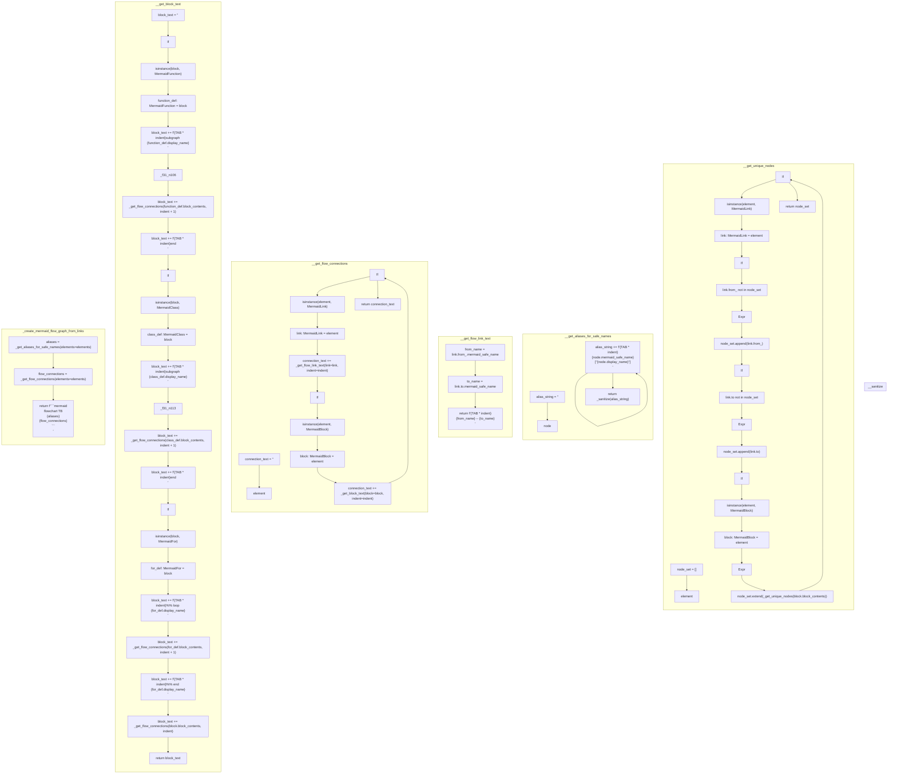

# ./src/pyremaid/mermaid_tools/mermaid_tools.py

### Imports

  - [pyremaid.models.MermaidBlock](/docs/pyremaid/models.py.md)
  - [pyremaid.models.MermaidClass](/docs/pyremaid/models.py.md)
  - [pyremaid.models.MermaidElement](/docs/pyremaid/models.py.md)
  - [pyremaid.models.MermaidFor](/docs/pyremaid/models.py.md)
  - [pyremaid.models.MermaidFunction](/docs/pyremaid/models.py.md)
  - [pyremaid.models.MermaidLink](/docs/pyremaid/models.py.md)
  - [pyremaid.models.MermaidNode](/docs/pyremaid/models.py.md)

---

---

<details>
<summary>Debug AST model dump</summary>

```
Module(
  body=[
    ImportFrom(
      module='pyremaid.models',
      names=[
        alias(
          name='MermaidBlock',
          lineno=2,
          col_offset=4,
          end_lineno=2,
          end_col_offset=16),
        alias(
          name='MermaidClass',
          lineno=3,
          col_offset=4,
          end_lineno=3,
          end_col_offset=16),
        alias(
          name='MermaidElement',
          lineno=4,
          col_offset=4,
          end_lineno=4,
          end_col_offset=18),
        alias(
          name='MermaidFor',
          lineno=5,
          col_offset=4,
          end_lineno=5,
          end_col_offset=14),
        alias(
          name='MermaidFunction',
          lineno=6,
          col_offset=4,
          end_lineno=6,
          end_col_offset=19),
        alias(
          name='MermaidLink',
          lineno=7,
          col_offset=4,
          end_lineno=7,
          end_col_offset=15),
        alias(
          name='MermaidNode',
          lineno=8,
          col_offset=4,
          end_lineno=8,
          end_col_offset=15)],
      level=0,
      lineno=1,
      col_offset=0,
      end_lineno=9,
      end_col_offset=1),
    Assign(
      targets=[
        Name(
          id='TAB',
          ctx=Store(),
          lineno=11,
          col_offset=0,
          end_lineno=11,
          end_col_offset=3)],
      value=Constant(
        value='  ',
        lineno=11,
        col_offset=6,
        end_lineno=11,
        end_col_offset=10),
      lineno=11,
      col_offset=0,
      end_lineno=11,
      end_col_offset=10),
    FunctionDef(
      name='_sanitize',
      args=arguments(
        posonlyargs=[],
        args=[
          arg(
            arg='markdown',
            annotation=Name(
              id='str',
              ctx=Load(),
              lineno=14,
              col_offset=24,
              end_lineno=14,
              end_col_offset=27),
            lineno=14,
            col_offset=14,
            end_lineno=14,
            end_col_offset=27)],
        kwonlyargs=[],
        kw_defaults=[],
        defaults=[]),
      body=[
        Return(
          value=Call(
            func=Attribute(
              value=Call(
                func=Attribute(
                  value=Name(
                    id='markdown',
                    ctx=Load(),
                    lineno=15,
                    col_offset=11,
                    end_lineno=15,
                    end_col_offset=19),
                  attr='replace',
                  ctx=Load(),
                  lineno=15,
                  col_offset=11,
                  end_lineno=15,
                  end_col_offset=27),
                args=[
                  Constant(
                    value='<',
                    lineno=15,
                    col_offset=28,
                    end_lineno=15,
                    end_col_offset=31),
                  Constant(
                    value='',
                    lineno=15,
                    col_offset=33,
                    end_lineno=15,
                    end_col_offset=35)],
                keywords=[],
                lineno=15,
                col_offset=11,
                end_lineno=15,
                end_col_offset=36),
              attr='replace',
              ctx=Load(),
              lineno=15,
              col_offset=11,
              end_lineno=15,
              end_col_offset=44),
            args=[
              Constant(
                value='>',
                lineno=15,
                col_offset=45,
                end_lineno=15,
                end_col_offset=48),
              Constant(
                value='',
                lineno=15,
                col_offset=50,
                end_lineno=15,
                end_col_offset=52)],
            keywords=[],
            lineno=15,
            col_offset=11,
            end_lineno=15,
            end_col_offset=53),
          lineno=15,
          col_offset=4,
          end_lineno=15,
          end_col_offset=53)],
      decorator_list=[],
      returns=Name(
        id='str',
        ctx=Load(),
        lineno=14,
        col_offset=32,
        end_lineno=14,
        end_col_offset=35),
      lineno=14,
      col_offset=0,
      end_lineno=15,
      end_col_offset=53),
    FunctionDef(
      name='_get_unique_nodes',
      args=arguments(
        posonlyargs=[],
        args=[
          arg(
            arg='elements',
            annotation=Subscript(
              value=Name(
                id='list',
                ctx=Load(),
                lineno=18,
                col_offset=32,
                end_lineno=18,
                end_col_offset=36),
              slice=Name(
                id='MermaidElement',
                ctx=Load(),
                lineno=18,
                col_offset=37,
                end_lineno=18,
                end_col_offset=51),
              ctx=Load(),
              lineno=18,
              col_offset=32,
              end_lineno=18,
              end_col_offset=52),
            lineno=18,
            col_offset=22,
            end_lineno=18,
            end_col_offset=52)],
        kwonlyargs=[],
        kw_defaults=[],
        defaults=[]),
      body=[
        Assign(
          targets=[
            Name(
              id='node_set',
              ctx=Store(),
              lineno=20,
              col_offset=4,
              end_lineno=20,
              end_col_offset=12)],
          value=List(
            elts=[],
            ctx=Load(),
            lineno=20,
            col_offset=15,
            end_lineno=20,
            end_col_offset=17),
          lineno=20,
          col_offset=4,
          end_lineno=20,
          end_col_offset=17),
        For(
          target=Name(
            id='element',
            ctx=Store(),
            lineno=21,
            col_offset=8,
            end_lineno=21,
            end_col_offset=15),
          iter=Name(
            id='elements',
            ctx=Load(),
            lineno=21,
            col_offset=19,
            end_lineno=21,
            end_col_offset=27),
          body=[
            If(
              test=Call(
                func=Name(
                  id='isinstance',
                  ctx=Load(),
                  lineno=22,
                  col_offset=11,
                  end_lineno=22,
                  end_col_offset=21),
                args=[
                  Name(
                    id='element',
                    ctx=Load(),
                    lineno=22,
                    col_offset=22,
                    end_lineno=22,
                    end_col_offset=29),
                  Name(
                    id='MermaidLink',
                    ctx=Load(),
                    lineno=22,
                    col_offset=31,
                    end_lineno=22,
                    end_col_offset=42)],
                keywords=[],
                lineno=22,
                col_offset=11,
                end_lineno=22,
                end_col_offset=43),
              body=[
                AnnAssign(
                  target=Name(
                    id='link',
                    ctx=Store(),
                    lineno=23,
                    col_offset=12,
                    end_lineno=23,
                    end_col_offset=16),
                  annotation=Name(
                    id='MermaidLink',
                    ctx=Load(),
                    lineno=23,
                    col_offset=18,
                    end_lineno=23,
                    end_col_offset=29),
                  value=Name(
                    id='element',
                    ctx=Load(),
                    lineno=23,
                    col_offset=32,
                    end_lineno=23,
                    end_col_offset=39),
                  simple=1,
                  lineno=23,
                  col_offset=12,
                  end_lineno=23,
                  end_col_offset=39),
                If(
                  test=Compare(
                    left=Attribute(
                      value=Name(
                        id='link',
                        ctx=Load(),
                        lineno=24,
                        col_offset=15,
                        end_lineno=24,
                        end_col_offset=19),
                      attr='from_',
                      ctx=Load(),
                      lineno=24,
                      col_offset=15,
                      end_lineno=24,
                      end_col_offset=25),
                    ops=[
                      NotIn()],
                    comparators=[
                      Name(
                        id='node_set',
                        ctx=Load(),
                        lineno=24,
                        col_offset=33,
                        end_lineno=24,
                        end_col_offset=41)],
                    lineno=24,
                    col_offset=15,
                    end_lineno=24,
                    end_col_offset=41),
                  body=[
                    Expr(
                      value=Call(
                        func=Attribute(
                          value=Name(
                            id='node_set',
                            ctx=Load(),
                            lineno=25,
                            col_offset=16,
                            end_lineno=25,
                            end_col_offset=24),
                          attr='append',
                          ctx=Load(),
                          lineno=25,
                          col_offset=16,
                          end_lineno=25,
                          end_col_offset=31),
                        args=[
                          Attribute(
                            value=Name(
                              id='link',
                              ctx=Load(),
                              lineno=25,
                              col_offset=32,
                              end_lineno=25,
                              end_col_offset=36),
                            attr='from_',
                            ctx=Load(),
                            lineno=25,
                            col_offset=32,
                            end_lineno=25,
                            end_col_offset=42)],
                        keywords=[],
                        lineno=25,
                        col_offset=16,
                        end_lineno=25,
                        end_col_offset=43),
                      lineno=25,
                      col_offset=16,
                      end_lineno=25,
                      end_col_offset=43)],
                  orelse=[],
                  lineno=24,
                  col_offset=12,
                  end_lineno=25,
                  end_col_offset=43),
                If(
                  test=Compare(
                    left=Attribute(
                      value=Name(
                        id='link',
                        ctx=Load(),
                        lineno=26,
                        col_offset=15,
                        end_lineno=26,
                        end_col_offset=19),
                      attr='to',
                      ctx=Load(),
                      lineno=26,
                      col_offset=15,
                      end_lineno=26,
                      end_col_offset=22),
                    ops=[
                      NotIn()],
                    comparators=[
                      Name(
                        id='node_set',
                        ctx=Load(),
                        lineno=26,
                        col_offset=30,
                        end_lineno=26,
                        end_col_offset=38)],
                    lineno=26,
                    col_offset=15,
                    end_lineno=26,
                    end_col_offset=38),
                  body=[
                    Expr(
                      value=Call(
                        func=Attribute(
                          value=Name(
                            id='node_set',
                            ctx=Load(),
                            lineno=27,
                            col_offset=16,
                            end_lineno=27,
                            end_col_offset=24),
                          attr='append',
                          ctx=Load(),
                          lineno=27,
                          col_offset=16,
                          end_lineno=27,
                          end_col_offset=31),
                        args=[
                          Attribute(
                            value=Name(
                              id='link',
                              ctx=Load(),
                              lineno=27,
                              col_offset=32,
                              end_lineno=27,
                              end_col_offset=36),
                            attr='to',
                            ctx=Load(),
                            lineno=27,
                            col_offset=32,
                            end_lineno=27,
                            end_col_offset=39)],
                        keywords=[],
                        lineno=27,
                        col_offset=16,
                        end_lineno=27,
                        end_col_offset=40),
                      lineno=27,
                      col_offset=16,
                      end_lineno=27,
                      end_col_offset=40)],
                  orelse=[],
                  lineno=26,
                  col_offset=12,
                  end_lineno=27,
                  end_col_offset=40)],
              orelse=[],
              lineno=22,
              col_offset=8,
              end_lineno=27,
              end_col_offset=40),
            If(
              test=Call(
                func=Name(
                  id='isinstance',
                  ctx=Load(),
                  lineno=28,
                  col_offset=11,
                  end_lineno=28,
                  end_col_offset=21),
                args=[
                  Name(
                    id='element',
                    ctx=Load(),
                    lineno=28,
                    col_offset=22,
                    end_lineno=28,
                    end_col_offset=29),
                  Name(
                    id='MermaidBlock',
                    ctx=Load(),
                    lineno=28,
                    col_offset=31,
                    end_lineno=28,
                    end_col_offset=43)],
                keywords=[],
                lineno=28,
                col_offset=11,
                end_lineno=28,
                end_col_offset=44),
              body=[
                AnnAssign(
                  target=Name(
                    id='block',
                    ctx=Store(),
                    lineno=29,
                    col_offset=12,
                    end_lineno=29,
                    end_col_offset=17),
                  annotation=Name(
                    id='MermaidBlock',
                    ctx=Load(),
                    lineno=29,
                    col_offset=19,
                    end_lineno=29,
                    end_col_offset=31),
                  value=Name(
                    id='element',
                    ctx=Load(),
                    lineno=29,
                    col_offset=34,
                    end_lineno=29,
                    end_col_offset=41),
                  simple=1,
                  lineno=29,
                  col_offset=12,
                  end_lineno=29,
                  end_col_offset=41),
                Expr(
                  value=Call(
                    func=Attribute(
                      value=Name(
                        id='node_set',
                        ctx=Load(),
                        lineno=30,
                        col_offset=12,
                        end_lineno=30,
                        end_col_offset=20),
                      attr='extend',
                      ctx=Load(),
                      lineno=30,
                      col_offset=12,
                      end_lineno=30,
                      end_col_offset=27),
                    args=[
                      Call(
                        func=Name(
                          id='_get_unique_nodes',
                          ctx=Load(),
                          lineno=30,
                          col_offset=28,
                          end_lineno=30,
                          end_col_offset=45),
                        args=[
                          Attribute(
                            value=Name(
                              id='block',
                              ctx=Load(),
                              lineno=30,
                              col_offset=46,
                              end_lineno=30,
                              end_col_offset=51),
                            attr='block_contents',
                            ctx=Load(),
                            lineno=30,
                            col_offset=46,
                            end_lineno=30,
                            end_col_offset=66)],
                        keywords=[],
                        lineno=30,
                        col_offset=28,
                        end_lineno=30,
                        end_col_offset=67)],
                    keywords=[],
                    lineno=30,
                    col_offset=12,
                    end_lineno=30,
                    end_col_offset=68),
                  lineno=30,
                  col_offset=12,
                  end_lineno=30,
                  end_col_offset=68)],
              orelse=[],
              lineno=28,
              col_offset=8,
              end_lineno=30,
              end_col_offset=68)],
          orelse=[],
          lineno=21,
          col_offset=4,
          end_lineno=30,
          end_col_offset=68),
        Return(
          value=Name(
            id='node_set',
            ctx=Load(),
            lineno=31,
            col_offset=11,
            end_lineno=31,
            end_col_offset=19),
          lineno=31,
          col_offset=4,
          end_lineno=31,
          end_col_offset=19)],
      decorator_list=[],
      returns=Subscript(
        value=Name(
          id='list',
          ctx=Load(),
          lineno=18,
          col_offset=57,
          end_lineno=18,
          end_col_offset=61),
        slice=Name(
          id='MermaidNode',
          ctx=Load(),
          lineno=18,
          col_offset=62,
          end_lineno=18,
          end_col_offset=73),
        ctx=Load(),
        lineno=18,
        col_offset=57,
        end_lineno=18,
        end_col_offset=74),
      lineno=18,
      col_offset=0,
      end_lineno=31,
      end_col_offset=19),
    FunctionDef(
      name='_get_aliases_for_safe_names',
      args=arguments(
        posonlyargs=[],
        args=[
          arg(
            arg='elements',
            annotation=Subscript(
              value=Name(
                id='list',
                ctx=Load(),
                lineno=34,
                col_offset=42,
                end_lineno=34,
                end_col_offset=46),
              slice=Name(
                id='MermaidElement',
                ctx=Load(),
                lineno=34,
                col_offset=47,
                end_lineno=34,
                end_col_offset=61),
              ctx=Load(),
              lineno=34,
              col_offset=42,
              end_lineno=34,
              end_col_offset=62),
            lineno=34,
            col_offset=32,
            end_lineno=34,
            end_col_offset=62),
          arg(
            arg='indent',
            annotation=Name(
              id='int',
              ctx=Load(),
              lineno=34,
              col_offset=72,
              end_lineno=34,
              end_col_offset=75),
            lineno=34,
            col_offset=64,
            end_lineno=34,
            end_col_offset=75)],
        kwonlyargs=[],
        kw_defaults=[],
        defaults=[
          Constant(
            value=1,
            lineno=34,
            col_offset=78,
            end_lineno=34,
            end_col_offset=79)]),
      body=[
        Assign(
          targets=[
            Name(
              id='alias_string',
              ctx=Store(),
              lineno=35,
              col_offset=4,
              end_lineno=35,
              end_col_offset=16)],
          value=Constant(
            value='',
            lineno=35,
            col_offset=19,
            end_lineno=35,
            end_col_offset=21),
          lineno=35,
          col_offset=4,
          end_lineno=35,
          end_col_offset=21),
        For(
          target=Name(
            id='node',
            ctx=Store(),
            lineno=36,
            col_offset=8,
            end_lineno=36,
            end_col_offset=12),
          iter=Call(
            func=Name(
              id='_get_unique_nodes',
              ctx=Load(),
              lineno=36,
              col_offset=16,
              end_lineno=36,
              end_col_offset=33),
            args=[],
            keywords=[
              keyword(
                arg='elements',
                value=Name(
                  id='elements',
                  ctx=Load(),
                  lineno=36,
                  col_offset=43,
                  end_lineno=36,
                  end_col_offset=51),
                lineno=36,
                col_offset=34,
                end_lineno=36,
                end_col_offset=51)],
            lineno=36,
            col_offset=16,
            end_lineno=36,
            end_col_offset=52),
          body=[
            AugAssign(
              target=Name(
                id='alias_string',
                ctx=Store(),
                lineno=37,
                col_offset=8,
                end_lineno=37,
                end_col_offset=20),
              op=Add(),
              value=JoinedStr(
                values=[
                  FormattedValue(
                    value=BinOp(
                      left=Name(
                        id='TAB',
                        ctx=Load(),
                        lineno=38,
                        col_offset=15,
                        end_lineno=38,
                        end_col_offset=18),
                      op=Mult(),
                      right=Name(
                        id='indent',
                        ctx=Load(),
                        lineno=38,
                        col_offset=21,
                        end_lineno=38,
                        end_col_offset=27),
                      lineno=38,
                      col_offset=15,
                      end_lineno=38,
                      end_col_offset=27),
                    conversion=-1,
                    lineno=38,
                    col_offset=12,
                    end_lineno=38,
                    end_col_offset=78),
                  FormattedValue(
                    value=Attribute(
                      value=Name(
                        id='node',
                        ctx=Load(),
                        lineno=38,
                        col_offset=29,
                        end_lineno=38,
                        end_col_offset=33),
                      attr='mermaid_safe_name',
                      ctx=Load(),
                      lineno=38,
                      col_offset=29,
                      end_lineno=38,
                      end_col_offset=51),
                    conversion=-1,
                    lineno=38,
                    col_offset=12,
                    end_lineno=38,
                    end_col_offset=78),
                  Constant(
                    value='["',
                    lineno=38,
                    col_offset=12,
                    end_lineno=38,
                    end_col_offset=78),
                  FormattedValue(
                    value=Attribute(
                      value=Name(
                        id='node',
                        ctx=Load(),
                        lineno=38,
                        col_offset=55,
                        end_lineno=38,
                        end_col_offset=59),
                      attr='display_name',
                      ctx=Load(),
                      lineno=38,
                      col_offset=55,
                      end_lineno=38,
                      end_col_offset=72),
                    conversion=-1,
                    lineno=38,
                    col_offset=12,
                    end_lineno=38,
                    end_col_offset=78),
                  Constant(
                    value='"]\n',
                    lineno=38,
                    col_offset=12,
                    end_lineno=38,
                    end_col_offset=78)],
                lineno=38,
                col_offset=12,
                end_lineno=38,
                end_col_offset=78),
              lineno=37,
              col_offset=8,
              end_lineno=39,
              end_col_offset=9)],
          orelse=[],
          lineno=36,
          col_offset=4,
          end_lineno=39,
          end_col_offset=9),
        Return(
          value=Call(
            func=Name(
              id='_sanitize',
              ctx=Load(),
              lineno=40,
              col_offset=11,
              end_lineno=40,
              end_col_offset=20),
            args=[
              Name(
                id='alias_string',
                ctx=Load(),
                lineno=40,
                col_offset=21,
                end_lineno=40,
                end_col_offset=33)],
            keywords=[],
            lineno=40,
            col_offset=11,
            end_lineno=40,
            end_col_offset=34),
          lineno=40,
          col_offset=4,
          end_lineno=40,
          end_col_offset=34)],
      decorator_list=[],
      returns=Name(
        id='str',
        ctx=Load(),
        lineno=34,
        col_offset=84,
        end_lineno=34,
        end_col_offset=87),
      lineno=34,
      col_offset=0,
      end_lineno=40,
      end_col_offset=34),
    FunctionDef(
      name='_get_flow_link_text',
      args=arguments(
        posonlyargs=[],
        args=[
          arg(
            arg='link',
            annotation=Name(
              id='MermaidElement',
              ctx=Load(),
              lineno=43,
              col_offset=30,
              end_lineno=43,
              end_col_offset=44),
            lineno=43,
            col_offset=24,
            end_lineno=43,
            end_col_offset=44),
          arg(
            arg='indent',
            annotation=Name(
              id='int',
              ctx=Load(),
              lineno=43,
              col_offset=54,
              end_lineno=43,
              end_col_offset=57),
            lineno=43,
            col_offset=46,
            end_lineno=43,
            end_col_offset=57)],
        kwonlyargs=[],
        kw_defaults=[],
        defaults=[]),
      body=[
        Assign(
          targets=[
            Name(
              id='from_name',
              ctx=Store(),
              lineno=44,
              col_offset=4,
              end_lineno=44,
              end_col_offset=13)],
          value=Attribute(
            value=Attribute(
              value=Name(
                id='link',
                ctx=Load(),
                lineno=44,
                col_offset=16,
                end_lineno=44,
                end_col_offset=20),
              attr='from_',
              ctx=Load(),
              lineno=44,
              col_offset=16,
              end_lineno=44,
              end_col_offset=26),
            attr='mermaid_safe_name',
            ctx=Load(),
            lineno=44,
            col_offset=16,
            end_lineno=44,
            end_col_offset=44),
          lineno=44,
          col_offset=4,
          end_lineno=44,
          end_col_offset=44),
        Assign(
          targets=[
            Name(
              id='to_name',
              ctx=Store(),
              lineno=45,
              col_offset=4,
              end_lineno=45,
              end_col_offset=11)],
          value=Attribute(
            value=Attribute(
              value=Name(
                id='link',
                ctx=Load(),
                lineno=45,
                col_offset=14,
                end_lineno=45,
                end_col_offset=18),
              attr='to',
              ctx=Load(),
              lineno=45,
              col_offset=14,
              end_lineno=45,
              end_col_offset=21),
            attr='mermaid_safe_name',
            ctx=Load(),
            lineno=45,
            col_offset=14,
            end_lineno=45,
            end_col_offset=39),
          lineno=45,
          col_offset=4,
          end_lineno=45,
          end_col_offset=39),
        Return(
          value=JoinedStr(
            values=[
              FormattedValue(
                value=BinOp(
                  left=Name(
                    id='TAB',
                    ctx=Load(),
                    lineno=47,
                    col_offset=14,
                    end_lineno=47,
                    end_col_offset=17),
                  op=Mult(),
                  right=Name(
                    id='indent',
                    ctx=Load(),
                    lineno=47,
                    col_offset=18,
                    end_lineno=47,
                    end_col_offset=24),
                  lineno=47,
                  col_offset=14,
                  end_lineno=47,
                  end_col_offset=24),
                conversion=-1,
                lineno=47,
                col_offset=11,
                end_lineno=47,
                end_col_offset=53),
              FormattedValue(
                value=Name(
                  id='from_name',
                  ctx=Load(),
                  lineno=47,
                  col_offset=26,
                  end_lineno=47,
                  end_col_offset=35),
                conversion=-1,
                lineno=47,
                col_offset=11,
                end_lineno=47,
                end_col_offset=53),
              Constant(
                value=' --> ',
                lineno=47,
                col_offset=11,
                end_lineno=47,
                end_col_offset=53),
              FormattedValue(
                value=Name(
                  id='to_name',
                  ctx=Load(),
                  lineno=47,
                  col_offset=42,
                  end_lineno=47,
                  end_col_offset=49),
                conversion=-1,
                lineno=47,
                col_offset=11,
                end_lineno=47,
                end_col_offset=53),
              Constant(
                value='\n',
                lineno=47,
                col_offset=11,
                end_lineno=47,
                end_col_offset=53)],
            lineno=47,
            col_offset=11,
            end_lineno=47,
            end_col_offset=53),
          lineno=47,
          col_offset=4,
          end_lineno=47,
          end_col_offset=53)],
      decorator_list=[],
      returns=Name(
        id='str',
        ctx=Load(),
        lineno=43,
        col_offset=62,
        end_lineno=43,
        end_col_offset=65),
      lineno=43,
      col_offset=0,
      end_lineno=47,
      end_col_offset=53),
    FunctionDef(
      name='_get_flow_connections',
      args=arguments(
        posonlyargs=[],
        args=[
          arg(
            arg='elements',
            annotation=Subscript(
              value=Name(
                id='list',
                ctx=Load(),
                lineno=50,
                col_offset=36,
                end_lineno=50,
                end_col_offset=40),
              slice=Name(
                id='MermaidElement',
                ctx=Load(),
                lineno=50,
                col_offset=41,
                end_lineno=50,
                end_col_offset=55),
              ctx=Load(),
              lineno=50,
              col_offset=36,
              end_lineno=50,
              end_col_offset=56),
            lineno=50,
            col_offset=26,
            end_lineno=50,
            end_col_offset=56),
          arg(
            arg='indent',
            annotation=Name(
              id='int',
              ctx=Load(),
              lineno=50,
              col_offset=66,
              end_lineno=50,
              end_col_offset=69),
            lineno=50,
            col_offset=58,
            end_lineno=50,
            end_col_offset=69)],
        kwonlyargs=[],
        kw_defaults=[],
        defaults=[
          Constant(
            value=1,
            lineno=50,
            col_offset=72,
            end_lineno=50,
            end_col_offset=73)]),
      body=[
        Assign(
          targets=[
            Name(
              id='connection_text',
              ctx=Store(),
              lineno=51,
              col_offset=4,
              end_lineno=51,
              end_col_offset=19)],
          value=Constant(
            value='',
            lineno=51,
            col_offset=22,
            end_lineno=51,
            end_col_offset=24),
          lineno=51,
          col_offset=4,
          end_lineno=51,
          end_col_offset=24),
        For(
          target=Name(
            id='element',
            ctx=Store(),
            lineno=52,
            col_offset=8,
            end_lineno=52,
            end_col_offset=15),
          iter=Name(
            id='elements',
            ctx=Load(),
            lineno=52,
            col_offset=19,
            end_lineno=52,
            end_col_offset=27),
          body=[
            If(
              test=Call(
                func=Name(
                  id='isinstance',
                  ctx=Load(),
                  lineno=53,
                  col_offset=11,
                  end_lineno=53,
                  end_col_offset=21),
                args=[
                  Name(
                    id='element',
                    ctx=Load(),
                    lineno=53,
                    col_offset=22,
                    end_lineno=53,
                    end_col_offset=29),
                  Name(
                    id='MermaidLink',
                    ctx=Load(),
                    lineno=53,
                    col_offset=31,
                    end_lineno=53,
                    end_col_offset=42)],
                keywords=[],
                lineno=53,
                col_offset=11,
                end_lineno=53,
                end_col_offset=43),
              body=[
                AnnAssign(
                  target=Name(
                    id='link',
                    ctx=Store(),
                    lineno=54,
                    col_offset=12,
                    end_lineno=54,
                    end_col_offset=16),
                  annotation=Name(
                    id='MermaidLink',
                    ctx=Load(),
                    lineno=54,
                    col_offset=18,
                    end_lineno=54,
                    end_col_offset=29),
                  value=Name(
                    id='element',
                    ctx=Load(),
                    lineno=54,
                    col_offset=32,
                    end_lineno=54,
                    end_col_offset=39),
                  simple=1,
                  lineno=54,
                  col_offset=12,
                  end_lineno=54,
                  end_col_offset=39),
                AugAssign(
                  target=Name(
                    id='connection_text',
                    ctx=Store(),
                    lineno=55,
                    col_offset=12,
                    end_lineno=55,
                    end_col_offset=27),
                  op=Add(),
                  value=Call(
                    func=Name(
                      id='_get_flow_link_text',
                      ctx=Load(),
                      lineno=55,
                      col_offset=31,
                      end_lineno=55,
                      end_col_offset=50),
                    args=[],
                    keywords=[
                      keyword(
                        arg='link',
                        value=Name(
                          id='link',
                          ctx=Load(),
                          lineno=55,
                          col_offset=56,
                          end_lineno=55,
                          end_col_offset=60),
                        lineno=55,
                        col_offset=51,
                        end_lineno=55,
                        end_col_offset=60),
                      keyword(
                        arg='indent',
                        value=Name(
                          id='indent',
                          ctx=Load(),
                          lineno=55,
                          col_offset=69,
                          end_lineno=55,
                          end_col_offset=75),
                        lineno=55,
                        col_offset=62,
                        end_lineno=55,
                        end_col_offset=75)],
                    lineno=55,
                    col_offset=31,
                    end_lineno=55,
                    end_col_offset=76),
                  lineno=55,
                  col_offset=12,
                  end_lineno=55,
                  end_col_offset=76)],
              orelse=[
                If(
                  test=Call(
                    func=Name(
                      id='isinstance',
                      ctx=Load(),
                      lineno=56,
                      col_offset=13,
                      end_lineno=56,
                      end_col_offset=23),
                    args=[
                      Name(
                        id='element',
                        ctx=Load(),
                        lineno=56,
                        col_offset=24,
                        end_lineno=56,
                        end_col_offset=31),
                      Name(
                        id='MermaidBlock',
                        ctx=Load(),
                        lineno=56,
                        col_offset=33,
                        end_lineno=56,
                        end_col_offset=45)],
                    keywords=[],
                    lineno=56,
                    col_offset=13,
                    end_lineno=56,
                    end_col_offset=46),
                  body=[
                    AnnAssign(
                      target=Name(
                        id='block',
                        ctx=Store(),
                        lineno=57,
                        col_offset=12,
                        end_lineno=57,
                        end_col_offset=17),
                      annotation=Name(
                        id='MermaidBlock',
                        ctx=Load(),
                        lineno=57,
                        col_offset=19,
                        end_lineno=57,
                        end_col_offset=31),
                      value=Name(
                        id='element',
                        ctx=Load(),
                        lineno=57,
                        col_offset=34,
                        end_lineno=57,
                        end_col_offset=41),
                      simple=1,
                      lineno=57,
                      col_offset=12,
                      end_lineno=57,
                      end_col_offset=41),
                    AugAssign(
                      target=Name(
                        id='connection_text',
                        ctx=Store(),
                        lineno=58,
                        col_offset=12,
                        end_lineno=58,
                        end_col_offset=27),
                      op=Add(),
                      value=Call(
                        func=Name(
                          id='_get_block_text',
                          ctx=Load(),
                          lineno=58,
                          col_offset=31,
                          end_lineno=58,
                          end_col_offset=46),
                        args=[],
                        keywords=[
                          keyword(
                            arg='block',
                            value=Name(
                              id='block',
                              ctx=Load(),
                              lineno=58,
                              col_offset=53,
                              end_lineno=58,
                              end_col_offset=58),
                            lineno=58,
                            col_offset=47,
                            end_lineno=58,
                            end_col_offset=58),
                          keyword(
                            arg='indent',
                            value=Name(
                              id='indent',
                              ctx=Load(),
                              lineno=58,
                              col_offset=67,
                              end_lineno=58,
                              end_col_offset=73),
                            lineno=58,
                            col_offset=60,
                            end_lineno=58,
                            end_col_offset=73)],
                        lineno=58,
                        col_offset=31,
                        end_lineno=58,
                        end_col_offset=74),
                      lineno=58,
                      col_offset=12,
                      end_lineno=58,
                      end_col_offset=74)],
                  orelse=[],
                  lineno=56,
                  col_offset=8,
                  end_lineno=58,
                  end_col_offset=74)],
              lineno=53,
              col_offset=8,
              end_lineno=58,
              end_col_offset=74)],
          orelse=[],
          lineno=52,
          col_offset=4,
          end_lineno=58,
          end_col_offset=74),
        Return(
          value=Name(
            id='connection_text',
            ctx=Load(),
            lineno=60,
            col_offset=11,
            end_lineno=60,
            end_col_offset=26),
          lineno=60,
          col_offset=4,
          end_lineno=60,
          end_col_offset=26)],
      decorator_list=[],
      returns=Name(
        id='str',
        ctx=Load(),
        lineno=50,
        col_offset=78,
        end_lineno=50,
        end_col_offset=81),
      lineno=50,
      col_offset=0,
      end_lineno=60,
      end_col_offset=26),
    FunctionDef(
      name='_get_block_text',
      args=arguments(
        posonlyargs=[],
        args=[
          arg(
            arg='block',
            annotation=Name(
              id='MermaidBlock',
              ctx=Load(),
              lineno=63,
              col_offset=27,
              end_lineno=63,
              end_col_offset=39),
            lineno=63,
            col_offset=20,
            end_lineno=63,
            end_col_offset=39),
          arg(
            arg='indent',
            annotation=Name(
              id='int',
              ctx=Load(),
              lineno=63,
              col_offset=49,
              end_lineno=63,
              end_col_offset=52),
            lineno=63,
            col_offset=41,
            end_lineno=63,
            end_col_offset=52)],
        kwonlyargs=[],
        kw_defaults=[],
        defaults=[]),
      body=[
        Assign(
          targets=[
            Name(
              id='block_text',
              ctx=Store(),
              lineno=64,
              col_offset=4,
              end_lineno=64,
              end_col_offset=14)],
          value=Constant(
            value='',
            lineno=64,
            col_offset=17,
            end_lineno=64,
            end_col_offset=19),
          lineno=64,
          col_offset=4,
          end_lineno=64,
          end_col_offset=19),
        If(
          test=Call(
            func=Name(
              id='isinstance',
              ctx=Load(),
              lineno=65,
              col_offset=7,
              end_lineno=65,
              end_col_offset=17),
            args=[
              Name(
                id='block',
                ctx=Load(),
                lineno=65,
                col_offset=18,
                end_lineno=65,
                end_col_offset=23),
              Name(
                id='MermaidFunction',
                ctx=Load(),
                lineno=65,
                col_offset=25,
                end_lineno=65,
                end_col_offset=40)],
            keywords=[],
            lineno=65,
            col_offset=7,
            end_lineno=65,
            end_col_offset=41),
          body=[
            AnnAssign(
              target=Name(
                id='function_def',
                ctx=Store(),
                lineno=66,
                col_offset=8,
                end_lineno=66,
                end_col_offset=20),
              annotation=Name(
                id='MermaidFunction',
                ctx=Load(),
                lineno=66,
                col_offset=22,
                end_lineno=66,
                end_col_offset=37),
              value=Name(
                id='block',
                ctx=Load(),
                lineno=66,
                col_offset=40,
                end_lineno=66,
                end_col_offset=45),
              simple=1,
              lineno=66,
              col_offset=8,
              end_lineno=66,
              end_col_offset=45),
            AugAssign(
              target=Name(
                id='block_text',
                ctx=Store(),
                lineno=67,
                col_offset=8,
                end_lineno=67,
                end_col_offset=18),
              op=Add(),
              value=JoinedStr(
                values=[
                  FormattedValue(
                    value=BinOp(
                      left=Name(
                        id='TAB',
                        ctx=Load(),
                        lineno=67,
                        col_offset=25,
                        end_lineno=67,
                        end_col_offset=28),
                      op=Mult(),
                      right=Name(
                        id='indent',
                        ctx=Load(),
                        lineno=67,
                        col_offset=31,
                        end_lineno=67,
                        end_col_offset=37),
                      lineno=67,
                      col_offset=25,
                      end_lineno=67,
                      end_col_offset=37),
                    conversion=-1,
                    lineno=67,
                    col_offset=22,
                    end_lineno=67,
                    end_col_offset=77),
                  Constant(
                    value='subgraph ',
                    lineno=67,
                    col_offset=22,
                    end_lineno=67,
                    end_col_offset=77),
                  FormattedValue(
                    value=Attribute(
                      value=Name(
                        id='function_def',
                        ctx=Load(),
                        lineno=67,
                        col_offset=48,
                        end_lineno=67,
                        end_col_offset=60),
                      attr='display_name',
                      ctx=Load(),
                      lineno=67,
                      col_offset=48,
                      end_lineno=67,
                      end_col_offset=73),
                    conversion=-1,
                    lineno=67,
                    col_offset=22,
                    end_lineno=67,
                    end_col_offset=77),
                  Constant(
                    value='\n',
                    lineno=67,
                    col_offset=22,
                    end_lineno=67,
                    end_col_offset=77)],
                lineno=67,
                col_offset=22,
                end_lineno=67,
                end_col_offset=77),
              lineno=67,
              col_offset=8,
              end_lineno=67,
              end_col_offset=77),
            AugAssign(
              target=Name(
                id='block_text',
                ctx=Store(),
                lineno=68,
                col_offset=8,
                end_lineno=68,
                end_col_offset=18),
              op=Add(),
              value=JoinedStr(
                values=[
                  FormattedValue(
                    value=BinOp(
                      left=Name(
                        id='TAB',
                        ctx=Load(),
                        lineno=68,
                        col_offset=25,
                        end_lineno=68,
                        end_col_offset=28),
                      op=Mult(),
                      right=BinOp(
                        left=Name(
                          id='indent',
                          ctx=Load(),
                          lineno=68,
                          col_offset=32,
                          end_lineno=68,
                          end_col_offset=38),
                        op=Add(),
                        right=Constant(
                          value=1,
                          lineno=68,
                          col_offset=41,
                          end_lineno=68,
                          end_col_offset=42),
                        lineno=68,
                        col_offset=32,
                        end_lineno=68,
                        end_col_offset=42),
                      lineno=68,
                      col_offset=25,
                      end_lineno=68,
                      end_col_offset=43),
                    conversion=-1,
                    lineno=68,
                    col_offset=22,
                    end_lineno=68,
                    end_col_offset=59),
                  Constant(
                    value='direction TB\n',
                    lineno=68,
                    col_offset=22,
                    end_lineno=68,
                    end_col_offset=59)],
                lineno=68,
                col_offset=22,
                end_lineno=68,
                end_col_offset=59),
              lineno=68,
              col_offset=8,
              end_lineno=68,
              end_col_offset=59),
            AugAssign(
              target=Name(
                id='block_text',
                ctx=Store(),
                lineno=69,
                col_offset=8,
                end_lineno=69,
                end_col_offset=18),
              op=Add(),
              value=Call(
                func=Name(
                  id='_get_flow_connections',
                  ctx=Load(),
                  lineno=69,
                  col_offset=22,
                  end_lineno=69,
                  end_col_offset=43),
                args=[
                  Attribute(
                    value=Name(
                      id='function_def',
                      ctx=Load(),
                      lineno=69,
                      col_offset=44,
                      end_lineno=69,
                      end_col_offset=56),
                    attr='block_contents',
                    ctx=Load(),
                    lineno=69,
                    col_offset=44,
                    end_lineno=69,
                    end_col_offset=71),
                  BinOp(
                    left=Name(
                      id='indent',
                      ctx=Load(),
                      lineno=69,
                      col_offset=73,
                      end_lineno=69,
                      end_col_offset=79),
                    op=Add(),
                    right=Constant(
                      value=1,
                      lineno=69,
                      col_offset=82,
                      end_lineno=69,
                      end_col_offset=83),
                    lineno=69,
                    col_offset=73,
                    end_lineno=69,
                    end_col_offset=83)],
                keywords=[],
                lineno=69,
                col_offset=22,
                end_lineno=69,
                end_col_offset=84),
              lineno=69,
              col_offset=8,
              end_lineno=69,
              end_col_offset=84),
            AugAssign(
              target=Name(
                id='block_text',
                ctx=Store(),
                lineno=70,
                col_offset=8,
                end_lineno=70,
                end_col_offset=18),
              op=Add(),
              value=JoinedStr(
                values=[
                  FormattedValue(
                    value=BinOp(
                      left=Name(
                        id='TAB',
                        ctx=Load(),
                        lineno=70,
                        col_offset=25,
                        end_lineno=70,
                        end_col_offset=28),
                      op=Mult(),
                      right=Name(
                        id='indent',
                        ctx=Load(),
                        lineno=70,
                        col_offset=31,
                        end_lineno=70,
                        end_col_offset=37),
                      lineno=70,
                      col_offset=25,
                      end_lineno=70,
                      end_col_offset=37),
                    conversion=-1,
                    lineno=70,
                    col_offset=22,
                    end_lineno=70,
                    end_col_offset=44),
                  Constant(
                    value='end\n',
                    lineno=70,
                    col_offset=22,
                    end_lineno=70,
                    end_col_offset=44)],
                lineno=70,
                col_offset=22,
                end_lineno=70,
                end_col_offset=44),
              lineno=70,
              col_offset=8,
              end_lineno=70,
              end_col_offset=44)],
          orelse=[
            If(
              test=Call(
                func=Name(
                  id='isinstance',
                  ctx=Load(),
                  lineno=71,
                  col_offset=9,
                  end_lineno=71,
                  end_col_offset=19),
                args=[
                  Name(
                    id='block',
                    ctx=Load(),
                    lineno=71,
                    col_offset=20,
                    end_lineno=71,
                    end_col_offset=25),
                  Name(
                    id='MermaidClass',
                    ctx=Load(),
                    lineno=71,
                    col_offset=27,
                    end_lineno=71,
                    end_col_offset=39)],
                keywords=[],
                lineno=71,
                col_offset=9,
                end_lineno=71,
                end_col_offset=40),
              body=[
                AnnAssign(
                  target=Name(
                    id='class_def',
                    ctx=Store(),
                    lineno=72,
                    col_offset=8,
                    end_lineno=72,
                    end_col_offset=17),
                  annotation=Name(
                    id='MermaidClass',
                    ctx=Load(),
                    lineno=72,
                    col_offset=19,
                    end_lineno=72,
                    end_col_offset=31),
                  value=Name(
                    id='block',
                    ctx=Load(),
                    lineno=72,
                    col_offset=34,
                    end_lineno=72,
                    end_col_offset=39),
                  simple=1,
                  lineno=72,
                  col_offset=8,
                  end_lineno=72,
                  end_col_offset=39),
                AugAssign(
                  target=Name(
                    id='block_text',
                    ctx=Store(),
                    lineno=73,
                    col_offset=8,
                    end_lineno=73,
                    end_col_offset=18),
                  op=Add(),
                  value=JoinedStr(
                    values=[
                      FormattedValue(
                        value=BinOp(
                          left=Name(
                            id='TAB',
                            ctx=Load(),
                            lineno=73,
                            col_offset=25,
                            end_lineno=73,
                            end_col_offset=28),
                          op=Mult(),
                          right=Name(
                            id='indent',
                            ctx=Load(),
                            lineno=73,
                            col_offset=31,
                            end_lineno=73,
                            end_col_offset=37),
                          lineno=73,
                          col_offset=25,
                          end_lineno=73,
                          end_col_offset=37),
                        conversion=-1,
                        lineno=73,
                        col_offset=22,
                        end_lineno=73,
                        end_col_offset=74),
                      Constant(
                        value='subgraph ',
                        lineno=73,
                        col_offset=22,
                        end_lineno=73,
                        end_col_offset=74),
                      FormattedValue(
                        value=Attribute(
                          value=Name(
                            id='class_def',
                            ctx=Load(),
                            lineno=73,
                            col_offset=48,
                            end_lineno=73,
                            end_col_offset=57),
                          attr='display_name',
                          ctx=Load(),
                          lineno=73,
                          col_offset=48,
                          end_lineno=73,
                          end_col_offset=70),
                        conversion=-1,
                        lineno=73,
                        col_offset=22,
                        end_lineno=73,
                        end_col_offset=74),
                      Constant(
                        value='\n',
                        lineno=73,
                        col_offset=22,
                        end_lineno=73,
                        end_col_offset=74)],
                    lineno=73,
                    col_offset=22,
                    end_lineno=73,
                    end_col_offset=74),
                  lineno=73,
                  col_offset=8,
                  end_lineno=73,
                  end_col_offset=74),
                AugAssign(
                  target=Name(
                    id='block_text',
                    ctx=Store(),
                    lineno=74,
                    col_offset=8,
                    end_lineno=74,
                    end_col_offset=18),
                  op=Add(),
                  value=JoinedStr(
                    values=[
                      FormattedValue(
                        value=BinOp(
                          left=Name(
                            id='TAB',
                            ctx=Load(),
                            lineno=74,
                            col_offset=25,
                            end_lineno=74,
                            end_col_offset=28),
                          op=Mult(),
                          right=BinOp(
                            left=Name(
                              id='indent',
                              ctx=Load(),
                              lineno=74,
                              col_offset=32,
                              end_lineno=74,
                              end_col_offset=38),
                            op=Add(),
                            right=Constant(
                              value=1,
                              lineno=74,
                              col_offset=41,
                              end_lineno=74,
                              end_col_offset=42),
                            lineno=74,
                            col_offset=32,
                            end_lineno=74,
                            end_col_offset=42),
                          lineno=74,
                          col_offset=25,
                          end_lineno=74,
                          end_col_offset=43),
                        conversion=-1,
                        lineno=74,
                        col_offset=22,
                        end_lineno=74,
                        end_col_offset=59),
                      Constant(
                        value='direction TB\n',
                        lineno=74,
                        col_offset=22,
                        end_lineno=74,
                        end_col_offset=59)],
                    lineno=74,
                    col_offset=22,
                    end_lineno=74,
                    end_col_offset=59),
                  lineno=74,
                  col_offset=8,
                  end_lineno=74,
                  end_col_offset=59),
                AugAssign(
                  target=Name(
                    id='block_text',
                    ctx=Store(),
                    lineno=75,
                    col_offset=8,
                    end_lineno=75,
                    end_col_offset=18),
                  op=Add(),
                  value=Call(
                    func=Name(
                      id='_get_flow_connections',
                      ctx=Load(),
                      lineno=75,
                      col_offset=22,
                      end_lineno=75,
                      end_col_offset=43),
                    args=[
                      Attribute(
                        value=Name(
                          id='class_def',
                          ctx=Load(),
                          lineno=75,
                          col_offset=44,
                          end_lineno=75,
                          end_col_offset=53),
                        attr='block_contents',
                        ctx=Load(),
                        lineno=75,
                        col_offset=44,
                        end_lineno=75,
                        end_col_offset=68),
                      BinOp(
                        left=Name(
                          id='indent',
                          ctx=Load(),
                          lineno=75,
                          col_offset=70,
                          end_lineno=75,
                          end_col_offset=76),
                        op=Add(),
                        right=Constant(
                          value=1,
                          lineno=75,
                          col_offset=79,
                          end_lineno=75,
                          end_col_offset=80),
                        lineno=75,
                        col_offset=70,
                        end_lineno=75,
                        end_col_offset=80)],
                    keywords=[],
                    lineno=75,
                    col_offset=22,
                    end_lineno=75,
                    end_col_offset=81),
                  lineno=75,
                  col_offset=8,
                  end_lineno=75,
                  end_col_offset=81),
                AugAssign(
                  target=Name(
                    id='block_text',
                    ctx=Store(),
                    lineno=76,
                    col_offset=8,
                    end_lineno=76,
                    end_col_offset=18),
                  op=Add(),
                  value=JoinedStr(
                    values=[
                      FormattedValue(
                        value=BinOp(
                          left=Name(
                            id='TAB',
                            ctx=Load(),
                            lineno=76,
                            col_offset=25,
                            end_lineno=76,
                            end_col_offset=28),
                          op=Mult(),
                          right=Name(
                            id='indent',
                            ctx=Load(),
                            lineno=76,
                            col_offset=31,
                            end_lineno=76,
                            end_col_offset=37),
                          lineno=76,
                          col_offset=25,
                          end_lineno=76,
                          end_col_offset=37),
                        conversion=-1,
                        lineno=76,
                        col_offset=22,
                        end_lineno=76,
                        end_col_offset=44),
                      Constant(
                        value='end\n',
                        lineno=76,
                        col_offset=22,
                        end_lineno=76,
                        end_col_offset=44)],
                    lineno=76,
                    col_offset=22,
                    end_lineno=76,
                    end_col_offset=44),
                  lineno=76,
                  col_offset=8,
                  end_lineno=76,
                  end_col_offset=44)],
              orelse=[
                If(
                  test=Call(
                    func=Name(
                      id='isinstance',
                      ctx=Load(),
                      lineno=77,
                      col_offset=9,
                      end_lineno=77,
                      end_col_offset=19),
                    args=[
                      Name(
                        id='block',
                        ctx=Load(),
                        lineno=77,
                        col_offset=20,
                        end_lineno=77,
                        end_col_offset=25),
                      Name(
                        id='MermaidFor',
                        ctx=Load(),
                        lineno=77,
                        col_offset=27,
                        end_lineno=77,
                        end_col_offset=37)],
                    keywords=[],
                    lineno=77,
                    col_offset=9,
                    end_lineno=77,
                    end_col_offset=38),
                  body=[
                    AnnAssign(
                      target=Name(
                        id='for_def',
                        ctx=Store(),
                        lineno=78,
                        col_offset=8,
                        end_lineno=78,
                        end_col_offset=15),
                      annotation=Name(
                        id='MermaidFor',
                        ctx=Load(),
                        lineno=78,
                        col_offset=17,
                        end_lineno=78,
                        end_col_offset=27),
                      value=Name(
                        id='block',
                        ctx=Load(),
                        lineno=78,
                        col_offset=30,
                        end_lineno=78,
                        end_col_offset=35),
                      simple=1,
                      lineno=78,
                      col_offset=8,
                      end_lineno=78,
                      end_col_offset=35),
                    AugAssign(
                      target=Name(
                        id='block_text',
                        ctx=Store(),
                        lineno=79,
                        col_offset=8,
                        end_lineno=79,
                        end_col_offset=18),
                      op=Add(),
                      value=JoinedStr(
                        values=[
                          FormattedValue(
                            value=BinOp(
                              left=Name(
                                id='TAB',
                                ctx=Load(),
                                lineno=79,
                                col_offset=25,
                                end_lineno=79,
                                end_col_offset=28),
                              op=Mult(),
                              right=Name(
                                id='indent',
                                ctx=Load(),
                                lineno=79,
                                col_offset=31,
                                end_lineno=79,
                                end_col_offset=37),
                              lineno=79,
                              col_offset=25,
                              end_lineno=79,
                              end_col_offset=37),
                            conversion=-1,
                            lineno=79,
                            col_offset=22,
                            end_lineno=79,
                            end_col_offset=71),
                          Constant(
                            value='%% loop ',
                            lineno=79,
                            col_offset=22,
                            end_lineno=79,
                            end_col_offset=71),
                          FormattedValue(
                            value=Attribute(
                              value=Name(
                                id='for_def',
                                ctx=Load(),
                                lineno=79,
                                col_offset=47,
                                end_lineno=79,
                                end_col_offset=54),
                              attr='display_name',
                              ctx=Load(),
                              lineno=79,
                              col_offset=47,
                              end_lineno=79,
                              end_col_offset=67),
                            conversion=-1,
                            lineno=79,
                            col_offset=22,
                            end_lineno=79,
                            end_col_offset=71),
                          Constant(
                            value='\n',
                            lineno=79,
                            col_offset=22,
                            end_lineno=79,
                            end_col_offset=71)],
                        lineno=79,
                        col_offset=22,
                        end_lineno=79,
                        end_col_offset=71),
                      lineno=79,
                      col_offset=8,
                      end_lineno=79,
                      end_col_offset=71),
                    AugAssign(
                      target=Name(
                        id='block_text',
                        ctx=Store(),
                        lineno=80,
                        col_offset=8,
                        end_lineno=80,
                        end_col_offset=18),
                      op=Add(),
                      value=Call(
                        func=Name(
                          id='_get_flow_connections',
                          ctx=Load(),
                          lineno=80,
                          col_offset=22,
                          end_lineno=80,
                          end_col_offset=43),
                        args=[
                          Attribute(
                            value=Name(
                              id='for_def',
                              ctx=Load(),
                              lineno=80,
                              col_offset=44,
                              end_lineno=80,
                              end_col_offset=51),
                            attr='block_contents',
                            ctx=Load(),
                            lineno=80,
                            col_offset=44,
                            end_lineno=80,
                            end_col_offset=66),
                          BinOp(
                            left=Name(
                              id='indent',
                              ctx=Load(),
                              lineno=80,
                              col_offset=68,
                              end_lineno=80,
                              end_col_offset=74),
                            op=Add(),
                            right=Constant(
                              value=1,
                              lineno=80,
                              col_offset=77,
                              end_lineno=80,
                              end_col_offset=78),
                            lineno=80,
                            col_offset=68,
                            end_lineno=80,
                            end_col_offset=78)],
                        keywords=[],
                        lineno=80,
                        col_offset=22,
                        end_lineno=80,
                        end_col_offset=79),
                      lineno=80,
                      col_offset=8,
                      end_lineno=80,
                      end_col_offset=79),
                    AugAssign(
                      target=Name(
                        id='block_text',
                        ctx=Store(),
                        lineno=81,
                        col_offset=8,
                        end_lineno=81,
                        end_col_offset=18),
                      op=Add(),
                      value=JoinedStr(
                        values=[
                          FormattedValue(
                            value=BinOp(
                              left=Name(
                                id='TAB',
                                ctx=Load(),
                                lineno=81,
                                col_offset=25,
                                end_lineno=81,
                                end_col_offset=28),
                              op=Mult(),
                              right=Name(
                                id='indent',
                                ctx=Load(),
                                lineno=81,
                                col_offset=31,
                                end_lineno=81,
                                end_col_offset=37),
                              lineno=81,
                              col_offset=25,
                              end_lineno=81,
                              end_col_offset=37),
                            conversion=-1,
                            lineno=81,
                            col_offset=22,
                            end_lineno=81,
                            end_col_offset=70),
                          Constant(
                            value='%% end ',
                            lineno=81,
                            col_offset=22,
                            end_lineno=81,
                            end_col_offset=70),
                          FormattedValue(
                            value=Attribute(
                              value=Name(
                                id='for_def',
                                ctx=Load(),
                                lineno=81,
                                col_offset=46,
                                end_lineno=81,
                                end_col_offset=53),
                              attr='display_name',
                              ctx=Load(),
                              lineno=81,
                              col_offset=46,
                              end_lineno=81,
                              end_col_offset=66),
                            conversion=-1,
                            lineno=81,
                            col_offset=22,
                            end_lineno=81,
                            end_col_offset=70),
                          Constant(
                            value='\n',
                            lineno=81,
                            col_offset=22,
                            end_lineno=81,
                            end_col_offset=70)],
                        lineno=81,
                        col_offset=22,
                        end_lineno=81,
                        end_col_offset=70),
                      lineno=81,
                      col_offset=8,
                      end_lineno=81,
                      end_col_offset=70)],
                  orelse=[
                    AugAssign(
                      target=Name(
                        id='block_text',
                        ctx=Store(),
                        lineno=83,
                        col_offset=8,
                        end_lineno=83,
                        end_col_offset=18),
                      op=Add(),
                      value=Call(
                        func=Name(
                          id='_get_flow_connections',
                          ctx=Load(),
                          lineno=83,
                          col_offset=22,
                          end_lineno=83,
                          end_col_offset=43),
                        args=[
                          Attribute(
                            value=Name(
                              id='block',
                              ctx=Load(),
                              lineno=83,
                              col_offset=44,
                              end_lineno=83,
                              end_col_offset=49),
                            attr='block_contents',
                            ctx=Load(),
                            lineno=83,
                            col_offset=44,
                            end_lineno=83,
                            end_col_offset=64),
                          Name(
                            id='indent',
                            ctx=Load(),
                            lineno=83,
                            col_offset=66,
                            end_lineno=83,
                            end_col_offset=72)],
                        keywords=[],
                        lineno=83,
                        col_offset=22,
                        end_lineno=83,
                        end_col_offset=73),
                      lineno=83,
                      col_offset=8,
                      end_lineno=83,
                      end_col_offset=73)],
                  lineno=77,
                  col_offset=4,
                  end_lineno=83,
                  end_col_offset=73)],
              lineno=71,
              col_offset=4,
              end_lineno=83,
              end_col_offset=73)],
          lineno=65,
          col_offset=4,
          end_lineno=83,
          end_col_offset=73),
        Return(
          value=Name(
            id='block_text',
            ctx=Load(),
            lineno=84,
            col_offset=11,
            end_lineno=84,
            end_col_offset=21),
          lineno=84,
          col_offset=4,
          end_lineno=84,
          end_col_offset=21)],
      decorator_list=[],
      returns=Name(
        id='str',
        ctx=Load(),
        lineno=63,
        col_offset=57,
        end_lineno=63,
        end_col_offset=60),
      lineno=63,
      col_offset=0,
      end_lineno=84,
      end_col_offset=21),
    FunctionDef(
      name='create_mermaid_flow_graph_from_links',
      args=arguments(
        posonlyargs=[],
        args=[
          arg(
            arg='elements',
            annotation=Subscript(
              value=Name(
                id='list',
                ctx=Load(),
                lineno=87,
                col_offset=51,
                end_lineno=87,
                end_col_offset=55),
              slice=Name(
                id='MermaidElement',
                ctx=Load(),
                lineno=87,
                col_offset=56,
                end_lineno=87,
                end_col_offset=70),
              ctx=Load(),
              lineno=87,
              col_offset=51,
              end_lineno=87,
              end_col_offset=71),
            lineno=87,
            col_offset=41,
            end_lineno=87,
            end_col_offset=71)],
        kwonlyargs=[],
        kw_defaults=[],
        defaults=[]),
      body=[
        Assign(
          targets=[
            Name(
              id='aliases',
              ctx=Store(),
              lineno=88,
              col_offset=4,
              end_lineno=88,
              end_col_offset=11)],
          value=Call(
            func=Name(
              id='_get_aliases_for_safe_names',
              ctx=Load(),
              lineno=88,
              col_offset=14,
              end_lineno=88,
              end_col_offset=41),
            args=[],
            keywords=[
              keyword(
                arg='elements',
                value=Name(
                  id='elements',
                  ctx=Load(),
                  lineno=88,
                  col_offset=51,
                  end_lineno=88,
                  end_col_offset=59),
                lineno=88,
                col_offset=42,
                end_lineno=88,
                end_col_offset=59)],
            lineno=88,
            col_offset=14,
            end_lineno=88,
            end_col_offset=60),
          lineno=88,
          col_offset=4,
          end_lineno=88,
          end_col_offset=60),
        Assign(
          targets=[
            Name(
              id='flow_connections',
              ctx=Store(),
              lineno=89,
              col_offset=4,
              end_lineno=89,
              end_col_offset=20)],
          value=Call(
            func=Name(
              id='_get_flow_connections',
              ctx=Load(),
              lineno=89,
              col_offset=23,
              end_lineno=89,
              end_col_offset=44),
            args=[],
            keywords=[
              keyword(
                arg='elements',
                value=Name(
                  id='elements',
                  ctx=Load(),
                  lineno=89,
                  col_offset=54,
                  end_lineno=89,
                  end_col_offset=62),
                lineno=89,
                col_offset=45,
                end_lineno=89,
                end_col_offset=62)],
            lineno=89,
            col_offset=23,
            end_lineno=89,
            end_col_offset=63),
          lineno=89,
          col_offset=4,
          end_lineno=89,
          end_col_offset=63),
        Return(
          value=JoinedStr(
            values=[
              Constant(
                value='```mermaid\nflowchart TB\n',
                lineno=91,
                col_offset=8,
                end_lineno=91,
                end_col_offset=86),
              FormattedValue(
                value=Name(
                  id='aliases',
                  ctx=Load(),
                  lineno=91,
                  col_offset=43,
                  end_lineno=91,
                  end_col_offset=50),
                conversion=-1,
                lineno=91,
                col_offset=8,
                end_lineno=91,
                end_col_offset=86),
              Constant(
                value='\n',
                lineno=91,
                col_offset=8,
                end_lineno=91,
                end_col_offset=86),
              FormattedValue(
                value=Name(
                  id='flow_connections',
                  ctx=Load(),
                  lineno=91,
                  col_offset=58,
                  end_lineno=91,
                  end_col_offset=74),
                conversion=-1,
                lineno=91,
                col_offset=8,
                end_lineno=91,
                end_col_offset=86),
              Constant(
                value='\n```\n',
                lineno=91,
                col_offset=8,
                end_lineno=91,
                end_col_offset=86)],
            lineno=91,
            col_offset=8,
            end_lineno=91,
            end_col_offset=86),
          lineno=90,
          col_offset=4,
          end_lineno=92,
          end_col_offset=5)],
      decorator_list=[],
      returns=Name(
        id='str',
        ctx=Load(),
        lineno=87,
        col_offset=76,
        end_lineno=87,
        end_col_offset=79),
      lineno=87,
      col_offset=0,
      end_lineno=92,
      end_col_offset=5)],
  type_ignores=[])
```
</details>

