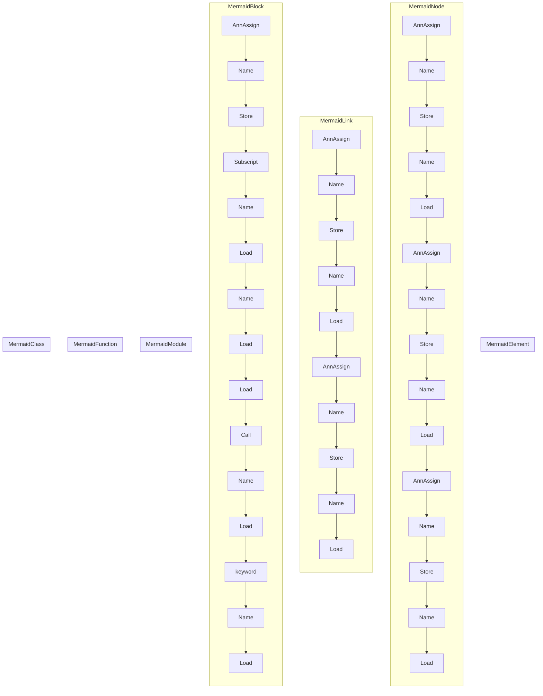

# ./src/pyremaid/models.py

### Imports

  - ast.AST
  - dataclasses.dataclass
  - dataclasses.field
  - typing.Optional

---

---

<details>
<summary>Debug AST model dump</summary>

```
Module(
  body=[
    ImportFrom(
      module='ast',
      names=[
        alias(name='AST')],
      level=0,
      lineno=1,
      col_offset=0,
      end_lineno=1,
      end_col_offset=19),
    ImportFrom(
      module='dataclasses',
      names=[
        alias(name='dataclass'),
        alias(name='field')],
      level=0,
      lineno=2,
      col_offset=0,
      end_lineno=2,
      end_col_offset=40),
    ImportFrom(
      module='typing',
      names=[
        alias(name='Optional')],
      level=0,
      lineno=3,
      col_offset=0,
      end_lineno=3,
      end_col_offset=27),
    ClassDef(
      name='MermaidElement',
      bases=[],
      keywords=[],
      body=[
        Pass(
          lineno=8,
          col_offset=4,
          end_lineno=8,
          end_col_offset=8)],
      decorator_list=[
        Call(
          func=Name(
            id='dataclass',
            ctx=Load(),
            lineno=6,
            col_offset=1,
            end_lineno=6,
            end_col_offset=10),
          args=[],
          keywords=[
            keyword(
              arg='frozen',
              value=Constant(
                value=True,
                lineno=6,
                col_offset=18,
                end_lineno=6,
                end_col_offset=22),
              lineno=6,
              col_offset=11,
              end_lineno=6,
              end_col_offset=22)],
          lineno=6,
          col_offset=1,
          end_lineno=6,
          end_col_offset=23)],
      lineno=7,
      col_offset=0,
      end_lineno=8,
      end_col_offset=8),
    ClassDef(
      name='MermaidNode',
      bases=[
        Name(
          id='MermaidElement',
          ctx=Load(),
          lineno=12,
          col_offset=18,
          end_lineno=12,
          end_col_offset=32)],
      keywords=[],
      body=[
        AnnAssign(
          target=Name(
            id='ast_node',
            ctx=Store(),
            lineno=13,
            col_offset=4,
            end_lineno=13,
            end_col_offset=12),
          annotation=Name(
            id='AST',
            ctx=Load(),
            lineno=13,
            col_offset=14,
            end_lineno=13,
            end_col_offset=17),
          simple=1,
          lineno=13,
          col_offset=4,
          end_lineno=13,
          end_col_offset=17),
        AnnAssign(
          target=Name(
            id='mermaid_safe_name',
            ctx=Store(),
            lineno=14,
            col_offset=4,
            end_lineno=14,
            end_col_offset=21),
          annotation=Name(
            id='str',
            ctx=Load(),
            lineno=14,
            col_offset=23,
            end_lineno=14,
            end_col_offset=26),
          simple=1,
          lineno=14,
          col_offset=4,
          end_lineno=14,
          end_col_offset=26),
        AnnAssign(
          target=Name(
            id='display_name',
            ctx=Store(),
            lineno=15,
            col_offset=4,
            end_lineno=15,
            end_col_offset=16),
          annotation=Name(
            id='str',
            ctx=Load(),
            lineno=15,
            col_offset=18,
            end_lineno=15,
            end_col_offset=21),
          simple=1,
          lineno=15,
          col_offset=4,
          end_lineno=15,
          end_col_offset=21)],
      decorator_list=[
        Call(
          func=Name(
            id='dataclass',
            ctx=Load(),
            lineno=11,
            col_offset=1,
            end_lineno=11,
            end_col_offset=10),
          args=[],
          keywords=[
            keyword(
              arg='unsafe_hash',
              value=Constant(
                value=True,
                lineno=11,
                col_offset=23,
                end_lineno=11,
                end_col_offset=27),
              lineno=11,
              col_offset=11,
              end_lineno=11,
              end_col_offset=27),
            keyword(
              arg='frozen',
              value=Constant(
                value=True,
                lineno=11,
                col_offset=36,
                end_lineno=11,
                end_col_offset=40),
              lineno=11,
              col_offset=29,
              end_lineno=11,
              end_col_offset=40)],
          lineno=11,
          col_offset=1,
          end_lineno=11,
          end_col_offset=41)],
      lineno=12,
      col_offset=0,
      end_lineno=15,
      end_col_offset=21),
    ClassDef(
      name='MermaidLink',
      bases=[
        Name(
          id='MermaidElement',
          ctx=Load(),
          lineno=19,
          col_offset=18,
          end_lineno=19,
          end_col_offset=32)],
      keywords=[],
      body=[
        AnnAssign(
          target=Name(
            id='from_',
            ctx=Store(),
            lineno=20,
            col_offset=4,
            end_lineno=20,
            end_col_offset=9),
          annotation=Name(
            id='MermaidNode',
            ctx=Load(),
            lineno=20,
            col_offset=11,
            end_lineno=20,
            end_col_offset=22),
          simple=1,
          lineno=20,
          col_offset=4,
          end_lineno=20,
          end_col_offset=22),
        AnnAssign(
          target=Name(
            id='to',
            ctx=Store(),
            lineno=21,
            col_offset=4,
            end_lineno=21,
            end_col_offset=6),
          annotation=Name(
            id='MermaidNode',
            ctx=Load(),
            lineno=21,
            col_offset=8,
            end_lineno=21,
            end_col_offset=19),
          simple=1,
          lineno=21,
          col_offset=4,
          end_lineno=21,
          end_col_offset=19)],
      decorator_list=[
        Call(
          func=Name(
            id='dataclass',
            ctx=Load(),
            lineno=18,
            col_offset=1,
            end_lineno=18,
            end_col_offset=10),
          args=[],
          keywords=[
            keyword(
              arg='frozen',
              value=Constant(
                value=True,
                lineno=18,
                col_offset=18,
                end_lineno=18,
                end_col_offset=22),
              lineno=18,
              col_offset=11,
              end_lineno=18,
              end_col_offset=22)],
          lineno=18,
          col_offset=1,
          end_lineno=18,
          end_col_offset=23)],
      lineno=19,
      col_offset=0,
      end_lineno=21,
      end_col_offset=19),
    ClassDef(
      name='MermaidBlock',
      bases=[
        Name(
          id='MermaidNode',
          ctx=Load(),
          lineno=25,
          col_offset=19,
          end_lineno=25,
          end_col_offset=30)],
      keywords=[],
      body=[
        AnnAssign(
          target=Name(
            id='block_contents',
            ctx=Store(),
            lineno=26,
            col_offset=4,
            end_lineno=26,
            end_col_offset=18),
          annotation=Subscript(
            value=Name(
              id='list',
              ctx=Load(),
              lineno=26,
              col_offset=20,
              end_lineno=26,
              end_col_offset=24),
            slice=Name(
              id='MermaidLink',
              ctx=Load(),
              lineno=26,
              col_offset=25,
              end_lineno=26,
              end_col_offset=36),
            ctx=Load(),
            lineno=26,
            col_offset=20,
            end_lineno=26,
            end_col_offset=37),
          value=Call(
            func=Name(
              id='field',
              ctx=Load(),
              lineno=26,
              col_offset=40,
              end_lineno=26,
              end_col_offset=45),
            args=[],
            keywords=[
              keyword(
                arg='default_factory',
                value=Name(
                  id='list',
                  ctx=Load(),
                  lineno=26,
                  col_offset=62,
                  end_lineno=26,
                  end_col_offset=66),
                lineno=26,
                col_offset=46,
                end_lineno=26,
                end_col_offset=66)],
            lineno=26,
            col_offset=40,
            end_lineno=26,
            end_col_offset=67),
          simple=1,
          lineno=26,
          col_offset=4,
          end_lineno=26,
          end_col_offset=67)],
      decorator_list=[
        Call(
          func=Name(
            id='dataclass',
            ctx=Load(),
            lineno=24,
            col_offset=1,
            end_lineno=24,
            end_col_offset=10),
          args=[],
          keywords=[
            keyword(
              arg='unsafe_hash',
              value=Constant(
                value=True,
                lineno=24,
                col_offset=23,
                end_lineno=24,
                end_col_offset=27),
              lineno=24,
              col_offset=11,
              end_lineno=24,
              end_col_offset=27),
            keyword(
              arg='frozen',
              value=Constant(
                value=True,
                lineno=24,
                col_offset=36,
                end_lineno=24,
                end_col_offset=40),
              lineno=24,
              col_offset=29,
              end_lineno=24,
              end_col_offset=40)],
          lineno=24,
          col_offset=1,
          end_lineno=24,
          end_col_offset=41)],
      lineno=25,
      col_offset=0,
      end_lineno=26,
      end_col_offset=67),
    ClassDef(
      name='MermaidModule',
      bases=[
        Name(
          id='MermaidBlock',
          ctx=Load(),
          lineno=30,
          col_offset=20,
          end_lineno=30,
          end_col_offset=32)],
      keywords=[],
      body=[
        Pass(
          lineno=31,
          col_offset=4,
          end_lineno=31,
          end_col_offset=8)],
      decorator_list=[
        Call(
          func=Name(
            id='dataclass',
            ctx=Load(),
            lineno=29,
            col_offset=1,
            end_lineno=29,
            end_col_offset=10),
          args=[],
          keywords=[
            keyword(
              arg='unsafe_hash',
              value=Constant(
                value=True,
                lineno=29,
                col_offset=23,
                end_lineno=29,
                end_col_offset=27),
              lineno=29,
              col_offset=11,
              end_lineno=29,
              end_col_offset=27),
            keyword(
              arg='frozen',
              value=Constant(
                value=True,
                lineno=29,
                col_offset=36,
                end_lineno=29,
                end_col_offset=40),
              lineno=29,
              col_offset=29,
              end_lineno=29,
              end_col_offset=40)],
          lineno=29,
          col_offset=1,
          end_lineno=29,
          end_col_offset=41)],
      lineno=30,
      col_offset=0,
      end_lineno=31,
      end_col_offset=8),
    ClassDef(
      name='MermaidFunction',
      bases=[
        Name(
          id='MermaidBlock',
          ctx=Load(),
          lineno=35,
          col_offset=22,
          end_lineno=35,
          end_col_offset=34)],
      keywords=[],
      body=[
        Pass(
          lineno=36,
          col_offset=4,
          end_lineno=36,
          end_col_offset=8)],
      decorator_list=[
        Call(
          func=Name(
            id='dataclass',
            ctx=Load(),
            lineno=34,
            col_offset=1,
            end_lineno=34,
            end_col_offset=10),
          args=[],
          keywords=[
            keyword(
              arg='unsafe_hash',
              value=Constant(
                value=True,
                lineno=34,
                col_offset=23,
                end_lineno=34,
                end_col_offset=27),
              lineno=34,
              col_offset=11,
              end_lineno=34,
              end_col_offset=27),
            keyword(
              arg='frozen',
              value=Constant(
                value=True,
                lineno=34,
                col_offset=36,
                end_lineno=34,
                end_col_offset=40),
              lineno=34,
              col_offset=29,
              end_lineno=34,
              end_col_offset=40)],
          lineno=34,
          col_offset=1,
          end_lineno=34,
          end_col_offset=41)],
      lineno=35,
      col_offset=0,
      end_lineno=36,
      end_col_offset=8),
    ClassDef(
      name='MermaidClass',
      bases=[
        Name(
          id='MermaidBlock',
          ctx=Load(),
          lineno=40,
          col_offset=19,
          end_lineno=40,
          end_col_offset=31)],
      keywords=[],
      body=[
        Pass(
          lineno=41,
          col_offset=4,
          end_lineno=41,
          end_col_offset=8)],
      decorator_list=[
        Call(
          func=Name(
            id='dataclass',
            ctx=Load(),
            lineno=39,
            col_offset=1,
            end_lineno=39,
            end_col_offset=10),
          args=[],
          keywords=[
            keyword(
              arg='unsafe_hash',
              value=Constant(
                value=True,
                lineno=39,
                col_offset=23,
                end_lineno=39,
                end_col_offset=27),
              lineno=39,
              col_offset=11,
              end_lineno=39,
              end_col_offset=27),
            keyword(
              arg='frozen',
              value=Constant(
                value=True,
                lineno=39,
                col_offset=36,
                end_lineno=39,
                end_col_offset=40),
              lineno=39,
              col_offset=29,
              end_lineno=39,
              end_col_offset=40)],
          lineno=39,
          col_offset=1,
          end_lineno=39,
          end_col_offset=41)],
      lineno=40,
      col_offset=0,
      end_lineno=41,
      end_col_offset=8)],
  type_ignores=[])
```
</details>

