```mermaid
flowchart TB
    node_6["ast.Load object at 0x1016730d0"]
    node_20["ast.Store object at 0x101673070"]
    node_26["ast.Name object at 0x10176c460"]
    node_2["ast.AnnAssign object at 0x1016ba070"]
    node_9["ast.Store object at 0x101673070"]
    node_23["ast.AnnAssign object at 0x10176c5b0"]
    node_15["ast.keyword object at 0x10176ce80"]
    node_8["ast.Name object at 0x10176c430"]
    node_19["ast.Name object at 0x10176ceb0"]
    node_27["ast.Load object at 0x1016730d0"]
    node_22["ast.Load object at 0x1016730d0"]
    node_18["ast.AnnAssign object at 0x10176ce20"]
    node_5["ast.Name object at 0x10176c040"]
    node_13["ast.Name object at 0x10176c7c0"]
    node_11["ast.Load object at 0x1016730d0"]
    node_21["ast.Name object at 0x10176c670"]
    node_4["ast.Store object at 0x101673070"]
    node_0["ast.Module object at 0x1016ba190"]
    node_24["ast.Name object at 0x10176cee0"]
    node_29["ast.Load object at 0x1016730d0"]
    node_7["ast.AnnAssign object at 0x10176c130"]
    node_16["ast.Constant object at 0x10176ce50"]
    node_1["ast.ClassDef object at 0x1016ba250"]
    node_10["ast.Name object at 0x10176c400"]
    node_17["ast.ClassDef object at 0x10176c6a0"]
    node_12["ast.Call object at 0x10176c7f0"]
    node_3["ast.Name object at 0x101670e80"]
    node_25["ast.Store object at 0x101673070"]
    node_14["ast.Load object at 0x1016730d0"]
    node_28["ast.Name object at 0x10176c1c0"]

    node_0 --> node_1
    node_1 --> node_2
    node_2 --> node_3
    node_3 --> node_4
    node_4 --> node_5
    node_5 --> node_6
    node_6 --> node_7
    node_7 --> node_8
    node_8 --> node_9
    node_9 --> node_10
    node_10 --> node_11
    node_11 --> node_12
    node_12 --> node_13
    node_13 --> node_14
    node_14 --> node_15
    node_15 --> node_16
    node_16 --> node_17
    node_17 --> node_18
    node_18 --> node_19
    node_19 --> node_20
    node_20 --> node_21
    node_21 --> node_22
    node_22 --> node_23
    node_23 --> node_24
    node_24 --> node_25
    node_25 --> node_26
    node_26 --> node_27
    node_27 --> node_28
    node_28 --> node_29

```

# ./src/pyremaid/models.py

### Imports

  - ast.AST
  - dataclasses.dataclass

---

---

<details>
<summary>Debug AST model dump</summary>

```
Module(
  body=[
    ImportFrom(
      module='ast',
      names=[
        alias(name='AST')],
      level=0,
      lineno=1,
      col_offset=0,
      end_lineno=1,
      end_col_offset=19),
    ImportFrom(
      module='dataclasses',
      names=[
        alias(name='dataclass')],
      level=0,
      lineno=2,
      col_offset=0,
      end_lineno=2,
      end_col_offset=33),
    ClassDef(
      name='MermaidNode',
      bases=[],
      keywords=[],
      body=[
        AnnAssign(
          target=Name(
            id='ast_node',
            ctx=Store(),
            lineno=7,
            col_offset=4,
            end_lineno=7,
            end_col_offset=12),
          annotation=Name(
            id='AST',
            ctx=Load(),
            lineno=7,
            col_offset=14,
            end_lineno=7,
            end_col_offset=17),
          simple=1,
          lineno=7,
          col_offset=4,
          end_lineno=7,
          end_col_offset=17),
        AnnAssign(
          target=Name(
            id='mermaid_safe_name',
            ctx=Store(),
            lineno=8,
            col_offset=4,
            end_lineno=8,
            end_col_offset=21),
          annotation=Name(
            id='str',
            ctx=Load(),
            lineno=8,
            col_offset=23,
            end_lineno=8,
            end_col_offset=26),
          simple=1,
          lineno=8,
          col_offset=4,
          end_lineno=8,
          end_col_offset=26)],
      decorator_list=[
        Call(
          func=Name(
            id='dataclass',
            ctx=Load(),
            lineno=5,
            col_offset=1,
            end_lineno=5,
            end_col_offset=10),
          args=[],
          keywords=[
            keyword(
              arg='unsafe_hash',
              value=Constant(
                value=True,
                lineno=5,
                col_offset=23,
                end_lineno=5,
                end_col_offset=27),
              lineno=5,
              col_offset=11,
              end_lineno=5,
              end_col_offset=27)],
          lineno=5,
          col_offset=1,
          end_lineno=5,
          end_col_offset=28)],
      lineno=6,
      col_offset=0,
      end_lineno=8,
      end_col_offset=26),
    ClassDef(
      name='MermaidLink',
      bases=[],
      keywords=[],
      body=[
        AnnAssign(
          target=Name(
            id='from_',
            ctx=Store(),
            lineno=13,
            col_offset=4,
            end_lineno=13,
            end_col_offset=9),
          annotation=Name(
            id='MermaidNode',
            ctx=Load(),
            lineno=13,
            col_offset=11,
            end_lineno=13,
            end_col_offset=22),
          simple=1,
          lineno=13,
          col_offset=4,
          end_lineno=13,
          end_col_offset=22),
        AnnAssign(
          target=Name(
            id='to',
            ctx=Store(),
            lineno=14,
            col_offset=4,
            end_lineno=14,
            end_col_offset=6),
          annotation=Name(
            id='MermaidNode',
            ctx=Load(),
            lineno=14,
            col_offset=8,
            end_lineno=14,
            end_col_offset=19),
          simple=1,
          lineno=14,
          col_offset=4,
          end_lineno=14,
          end_col_offset=19)],
      decorator_list=[
        Name(
          id='dataclass',
          ctx=Load(),
          lineno=11,
          col_offset=1,
          end_lineno=11,
          end_col_offset=10)],
      lineno=12,
      col_offset=0,
      end_lineno=14,
      end_col_offset=19)],
  type_ignores=[])
```
</details>

