```mermaid
flowchart TB
  node_0["ast.Module object at 0x1067e4fa0"]
  node_1["ast.ClassDef object at 0x1068cf0a0"]
  node_2["ast.Pass object at 0x1068cf0d0"]
  node_3["ast.Call object at 0x1068cf310"]
  node_4["ast.Name object at 0x1068cfa90"]
  node_5["ast.Load object at 0x1067e70d0"]
  node_6["ast.keyword object at 0x1068cfd00"]
  node_7["ast.Constant object at 0x1068cf700"]
  node_8["ast.ClassDef object at 0x1068cf730"]
  node_9["ast.Name object at 0x1068cf2e0"]
  node_10["ast.Load object at 0x1067e70d0"]
  node_11["ast.AnnAssign object at 0x1068cf8e0"]
  node_12["ast.Name object at 0x1068cf5e0"]
  node_13["ast.Store object at 0x1067e7070"]
  node_14["ast.Name object at 0x1068cffd0"]
  node_15["ast.Load object at 0x1067e70d0"]
  node_16["ast.AnnAssign object at 0x1068cf5b0"]
  node_17["ast.Name object at 0x1068cfe80"]
  node_18["ast.Store object at 0x1067e7070"]
  node_19["ast.Name object at 0x1068cfbb0"]
  node_20["ast.Load object at 0x1067e70d0"]
  node_21["ast.Call object at 0x1068cfb80"]
  node_22["ast.Name object at 0x1068cffa0"]
  node_23["ast.Load object at 0x1067e70d0"]
  node_24["ast.keyword object at 0x1068cfb50"]
  node_25["ast.Constant object at 0x1068cf670"]
  node_26["ast.keyword object at 0x1068cf3d0"]
  node_27["ast.Constant object at 0x1068cf6d0"]
  node_28["ast.ClassDef object at 0x1068cfb20"]
  node_29["ast.Name object at 0x1068cf340"]
  node_30["ast.Load object at 0x1067e70d0"]
  node_31["ast.AnnAssign object at 0x1068cff70"]
  node_32["ast.Name object at 0x1068cfc70"]
  node_33["ast.Store object at 0x1067e7070"]
  node_34["ast.Name object at 0x1068cf850"]
  node_35["ast.Load object at 0x1067e70d0"]
  node_36["ast.AnnAssign object at 0x1068cfbe0"]
  node_37["ast.Name object at 0x1068c7e20"]
  node_38["ast.Store object at 0x1067e7070"]
  node_39["ast.Name object at 0x1068c77f0"]
  node_40["ast.Load object at 0x1067e70d0"]
  node_41["ast.Call object at 0x1068c7220"]
  node_42["ast.Name object at 0x1068c7d90"]
  node_43["ast.Load object at 0x1067e70d0"]
  node_44["ast.keyword object at 0x1068c7fd0"]
  node_45["ast.Constant object at 0x1068c78b0"]
  node_46["ast.ClassDef object at 0x1068c7c10"]
  node_47["ast.Name object at 0x1068c7940"]
  node_48["ast.Load object at 0x1067e70d0"]
  node_49["ast.AnnAssign object at 0x1068c7880"]
  node_50["ast.Name object at 0x1068c79d0"]
  node_51["ast.Store object at 0x1067e7070"]
  node_52["ast.Subscript object at 0x1068c75e0"]
  node_53["ast.Name object at 0x1068c7760"]
  node_54["ast.Load object at 0x1067e70d0"]
  node_55["ast.Name object at 0x1068c72b0"]
  node_56["ast.Load object at 0x1067e70d0"]
  node_57["ast.Load object at 0x1067e70d0"]
  node_58["ast.Call object at 0x1068c7bb0"]
  node_59["ast.Name object at 0x1068c7610"]
  node_60["ast.Load object at 0x1067e70d0"]
  node_61["ast.keyword object at 0x1068c70a0"]
  node_62["ast.Name object at 0x1068c7e80"]
  node_63["ast.Load object at 0x1067e70d0"]
  node_64["ast.Call object at 0x1068c76a0"]
  node_65["ast.Name object at 0x1068c7d00"]
  node_66["ast.Load object at 0x1067e70d0"]
  node_67["ast.keyword object at 0x1068c7df0"]
  node_68["ast.Constant object at 0x1068c78e0"]
  node_69["ast.keyword object at 0x1068c7ac0"]
  node_70["ast.Constant object at 0x1068c76d0"]

  node_0 --> node_1
  node_1 --> node_2
  node_2 --> node_3
  node_3 --> node_4
  node_4 --> node_5
  node_5 --> node_6
  node_6 --> node_7
  node_7 --> node_8
  node_8 --> node_9
  node_9 --> node_10
  node_10 --> node_11
  node_11 --> node_12
  node_12 --> node_13
  node_13 --> node_14
  node_14 --> node_15
  node_15 --> node_16
  node_16 --> node_17
  node_17 --> node_18
  node_18 --> node_19
  node_19 --> node_20
  node_20 --> node_21
  node_21 --> node_22
  node_22 --> node_23
  node_23 --> node_24
  node_24 --> node_25
  node_25 --> node_26
  node_26 --> node_27
  node_27 --> node_28
  node_28 --> node_29
  node_29 --> node_30
  node_30 --> node_31
  node_31 --> node_32
  node_32 --> node_33
  node_33 --> node_34
  node_34 --> node_35
  node_35 --> node_36
  node_36 --> node_37
  node_37 --> node_38
  node_38 --> node_39
  node_39 --> node_40
  node_40 --> node_41
  node_41 --> node_42
  node_42 --> node_43
  node_43 --> node_44
  node_44 --> node_45
  node_45 --> node_46
  node_46 --> node_47
  node_47 --> node_48
  node_48 --> node_49
  node_49 --> node_50
  node_50 --> node_51
  node_51 --> node_52
  node_52 --> node_53
  node_53 --> node_54
  node_54 --> node_55
  node_55 --> node_56
  node_56 --> node_57
  node_57 --> node_58
  node_58 --> node_59
  node_59 --> node_60
  node_60 --> node_61
  node_61 --> node_62
  node_62 --> node_63
  node_63 --> node_64
  node_64 --> node_65
  node_65 --> node_66
  node_66 --> node_67
  node_67 --> node_68
  node_68 --> node_69
  node_69 --> node_70

```

# ./src/pyremaid/models.py

### Imports

  - ast.AST
  - dataclasses.dataclass
  - dataclasses.field
  - typing.Optional

---

---

<details>
<summary>Debug AST model dump</summary>

```
Module(
  body=[
    ImportFrom(
      module='ast',
      names=[
        alias(name='AST')],
      level=0,
      lineno=1,
      col_offset=0,
      end_lineno=1,
      end_col_offset=19),
    ImportFrom(
      module='dataclasses',
      names=[
        alias(name='dataclass'),
        alias(name='field')],
      level=0,
      lineno=2,
      col_offset=0,
      end_lineno=2,
      end_col_offset=40),
    ImportFrom(
      module='typing',
      names=[
        alias(name='Optional')],
      level=0,
      lineno=3,
      col_offset=0,
      end_lineno=3,
      end_col_offset=27),
    ClassDef(
      name='MermaidElement',
      bases=[],
      keywords=[],
      body=[
        Pass(
          lineno=8,
          col_offset=4,
          end_lineno=8,
          end_col_offset=8)],
      decorator_list=[
        Call(
          func=Name(
            id='dataclass',
            ctx=Load(),
            lineno=6,
            col_offset=1,
            end_lineno=6,
            end_col_offset=10),
          args=[],
          keywords=[
            keyword(
              arg='frozen',
              value=Constant(
                value=True,
                lineno=6,
                col_offset=18,
                end_lineno=6,
                end_col_offset=22),
              lineno=6,
              col_offset=11,
              end_lineno=6,
              end_col_offset=22)],
          lineno=6,
          col_offset=1,
          end_lineno=6,
          end_col_offset=23)],
      lineno=7,
      col_offset=0,
      end_lineno=8,
      end_col_offset=8),
    ClassDef(
      name='MermaidNode',
      bases=[
        Name(
          id='MermaidElement',
          ctx=Load(),
          lineno=12,
          col_offset=18,
          end_lineno=12,
          end_col_offset=32)],
      keywords=[],
      body=[
        AnnAssign(
          target=Name(
            id='ast_node',
            ctx=Store(),
            lineno=13,
            col_offset=4,
            end_lineno=13,
            end_col_offset=12),
          annotation=Name(
            id='AST',
            ctx=Load(),
            lineno=13,
            col_offset=14,
            end_lineno=13,
            end_col_offset=17),
          simple=1,
          lineno=13,
          col_offset=4,
          end_lineno=13,
          end_col_offset=17),
        AnnAssign(
          target=Name(
            id='mermaid_safe_name',
            ctx=Store(),
            lineno=14,
            col_offset=4,
            end_lineno=14,
            end_col_offset=21),
          annotation=Name(
            id='str',
            ctx=Load(),
            lineno=14,
            col_offset=23,
            end_lineno=14,
            end_col_offset=26),
          simple=1,
          lineno=14,
          col_offset=4,
          end_lineno=14,
          end_col_offset=26)],
      decorator_list=[
        Call(
          func=Name(
            id='dataclass',
            ctx=Load(),
            lineno=11,
            col_offset=1,
            end_lineno=11,
            end_col_offset=10),
          args=[],
          keywords=[
            keyword(
              arg='unsafe_hash',
              value=Constant(
                value=True,
                lineno=11,
                col_offset=23,
                end_lineno=11,
                end_col_offset=27),
              lineno=11,
              col_offset=11,
              end_lineno=11,
              end_col_offset=27),
            keyword(
              arg='frozen',
              value=Constant(
                value=True,
                lineno=11,
                col_offset=36,
                end_lineno=11,
                end_col_offset=40),
              lineno=11,
              col_offset=29,
              end_lineno=11,
              end_col_offset=40)],
          lineno=11,
          col_offset=1,
          end_lineno=11,
          end_col_offset=41)],
      lineno=12,
      col_offset=0,
      end_lineno=14,
      end_col_offset=26),
    ClassDef(
      name='MermaidLink',
      bases=[
        Name(
          id='MermaidElement',
          ctx=Load(),
          lineno=18,
          col_offset=18,
          end_lineno=18,
          end_col_offset=32)],
      keywords=[],
      body=[
        AnnAssign(
          target=Name(
            id='from_',
            ctx=Store(),
            lineno=19,
            col_offset=4,
            end_lineno=19,
            end_col_offset=9),
          annotation=Name(
            id='MermaidNode',
            ctx=Load(),
            lineno=19,
            col_offset=11,
            end_lineno=19,
            end_col_offset=22),
          simple=1,
          lineno=19,
          col_offset=4,
          end_lineno=19,
          end_col_offset=22),
        AnnAssign(
          target=Name(
            id='to',
            ctx=Store(),
            lineno=20,
            col_offset=4,
            end_lineno=20,
            end_col_offset=6),
          annotation=Name(
            id='MermaidNode',
            ctx=Load(),
            lineno=20,
            col_offset=8,
            end_lineno=20,
            end_col_offset=19),
          simple=1,
          lineno=20,
          col_offset=4,
          end_lineno=20,
          end_col_offset=19)],
      decorator_list=[
        Call(
          func=Name(
            id='dataclass',
            ctx=Load(),
            lineno=17,
            col_offset=1,
            end_lineno=17,
            end_col_offset=10),
          args=[],
          keywords=[
            keyword(
              arg='frozen',
              value=Constant(
                value=True,
                lineno=17,
                col_offset=18,
                end_lineno=17,
                end_col_offset=22),
              lineno=17,
              col_offset=11,
              end_lineno=17,
              end_col_offset=22)],
          lineno=17,
          col_offset=1,
          end_lineno=17,
          end_col_offset=23)],
      lineno=18,
      col_offset=0,
      end_lineno=20,
      end_col_offset=19),
    ClassDef(
      name='MermaidBlock',
      bases=[
        Name(
          id='MermaidNode',
          ctx=Load(),
          lineno=24,
          col_offset=19,
          end_lineno=24,
          end_col_offset=30)],
      keywords=[],
      body=[
        AnnAssign(
          target=Name(
            id='block_contents',
            ctx=Store(),
            lineno=25,
            col_offset=4,
            end_lineno=25,
            end_col_offset=18),
          annotation=Subscript(
            value=Name(
              id='list',
              ctx=Load(),
              lineno=25,
              col_offset=20,
              end_lineno=25,
              end_col_offset=24),
            slice=Name(
              id='MermaidLink',
              ctx=Load(),
              lineno=25,
              col_offset=25,
              end_lineno=25,
              end_col_offset=36),
            ctx=Load(),
            lineno=25,
            col_offset=20,
            end_lineno=25,
            end_col_offset=37),
          value=Call(
            func=Name(
              id='field',
              ctx=Load(),
              lineno=25,
              col_offset=40,
              end_lineno=25,
              end_col_offset=45),
            args=[],
            keywords=[
              keyword(
                arg='default_factory',
                value=Name(
                  id='list',
                  ctx=Load(),
                  lineno=25,
                  col_offset=62,
                  end_lineno=25,
                  end_col_offset=66),
                lineno=25,
                col_offset=46,
                end_lineno=25,
                end_col_offset=66)],
            lineno=25,
            col_offset=40,
            end_lineno=25,
            end_col_offset=67),
          simple=1,
          lineno=25,
          col_offset=4,
          end_lineno=25,
          end_col_offset=67)],
      decorator_list=[
        Call(
          func=Name(
            id='dataclass',
            ctx=Load(),
            lineno=23,
            col_offset=1,
            end_lineno=23,
            end_col_offset=10),
          args=[],
          keywords=[
            keyword(
              arg='unsafe_hash',
              value=Constant(
                value=True,
                lineno=23,
                col_offset=23,
                end_lineno=23,
                end_col_offset=27),
              lineno=23,
              col_offset=11,
              end_lineno=23,
              end_col_offset=27),
            keyword(
              arg='frozen',
              value=Constant(
                value=True,
                lineno=23,
                col_offset=36,
                end_lineno=23,
                end_col_offset=40),
              lineno=23,
              col_offset=29,
              end_lineno=23,
              end_col_offset=40)],
          lineno=23,
          col_offset=1,
          end_lineno=23,
          end_col_offset=41)],
      lineno=24,
      col_offset=0,
      end_lineno=25,
      end_col_offset=67)],
  type_ignores=[])
```
</details>

