```mermaid
flowchart TB
  _f12_n148["Expr"]
  _f12_n149["Call"]
  _f12_n150["Name"]
  _f12_n151["Load"]
  _f12_n152["keyword"]
  _f12_n153["Name"]
  _f12_n154["Load"]
  _f12_n155["Assign"]
  _f12_n156["Name"]
  _f12_n157["Store"]
  _f12_n158["Call"]
  _f12_n159["Name"]
  _f12_n160["Load"]
  _f12_n161["keyword"]
  _f12_n162["Name"]
  _f12_n163["Load"]
  _f12_n164["Assign"]
  _f12_n165["Name"]
  _f12_n166["Store"]
  _f12_n167["Call"]
  _f12_n168["Name"]
  _f12_n169["Load"]
  _f12_n170["keyword"]
  _f12_n171["Name"]
  _f12_n172["Load"]
  _f12_n173["keyword"]
  _f12_n174["Name"]
  _f12_n175["Load"]
  _f12_n176["keyword"]
  _f12_n177["Name"]
  _f12_n178["Load"]
  _f12_n179["For"]
  _f12_n180["Name"]
  _f12_n181["Store"]
  _f12_n182["Name"]
  _f12_n183["Load"]
  _f12_n184["Assign"]
  _f12_n185["Name"]
  _f12_n186["Store"]
  _f12_n187["Call"]
  _f12_n188["Attribute"]
  _f12_n189["Name"]
  _f12_n190["Load"]
  _f12_n191["Load"]
  _f12_n192["Name"]
  _f12_n193["Load"]
  _f12_n194["Constant"]
  _f12_n195["Assign"]
  _f12_n196["Name"]
  _f12_n197["Store"]
  _f12_n198["Call"]
  _f12_n199["Name"]
  _f12_n200["Load"]
  _f12_n201["keyword"]
  _f12_n202["Name"]
  _f12_n203["Load"]
  _f12_n204["keyword"]
  _f12_n205["Name"]
  _f12_n206["Load"]
  _f12_n207["Assign"]
  _f12_n208["Name"]
  _f12_n209["Store"]
  _f12_n210["Constant"]
  _f12_n211["Assign"]
  _f12_n212["Name"]
  _f12_n213["Store"]
  _f12_n214["List"]
  _f12_n215["Load"]
  _f12_n216["If"]
  _f12_n217["NamedExpr"]
  _f12_n218["Name"]
  _f12_n219["Store"]
  _f12_n220["Call"]
  _f12_n221["Name"]
  _f12_n222["Load"]
  _f12_n223["keyword"]
  _f12_n224["Name"]
  _f12_n225["Load"]
  _f12_n226["If"]
  _f12_n227["NamedExpr"]
  _f12_n228["Name"]
  _f12_n229["Store"]
  _f12_n230["Call"]
  _f12_n231["Name"]
  _f12_n232["Load"]
  _f12_n233["keyword"]
  _f12_n234["Name"]
  _f12_n235["Load"]
  _f12_n236["keyword"]
  _f12_n237["Name"]
  _f12_n238["Load"]
  _f12_n239["Assign"]
  _f12_n240["Name"]
  _f12_n241["Store"]
  _f12_n242["Call"]
  _f12_n243["Name"]
  _f12_n244["Load"]
  _f12_n245["keyword"]
  _f12_n246["Name"]
  _f12_n247["Load"]
  _f12_n248["Assign"]
  _f12_n249["Name"]
  _f12_n250["Store"]
  _f12_n251["Call"]
  _f12_n252["Name"]
  _f12_n253["Load"]
  _f12_n254["keyword"]
  _f12_n255["Name"]
  _f12_n256["Load"]
  _f12_n257["AnnAssign"]
  _f12_n258["Name"]
  _f12_n259["Store"]
  _f12_n260["Subscript"]
  _f12_n261["Name"]
  _f12_n262["Load"]
  _f12_n263["Name"]
  _f12_n264["Load"]
  _f12_n265["Load"]
  _f12_n266["Call"]
  _f12_n267["Name"]
  _f12_n268["Load"]
  _f12_n269["keyword"]
  _f12_n270["Name"]
  _f12_n271["Load"]
  _f12_n272["Assign"]
  _f12_n273["Name"]
  _f12_n274["Store"]
  _f12_n275["Call"]
  _f12_n276["Name"]
  _f12_n277["Load"]
  _f12_n278["Name"]
  _f12_n279["Load"]
  _f12_n280["Assign"]
  _f12_n281["Name"]
  _f12_n282["Store"]
  _f12_n283["Call"]
  _f12_n284["Name"]
  _f12_n285["Load"]
  _f12_n286["keyword"]
  _f12_n287["Name"]
  _f12_n288["Load"]
  _f12_n289["keyword"]
  _f12_n290["Name"]
  _f12_n291["Load"]
  _f12_n292["keyword"]
  _f12_n293["Name"]
  _f12_n294["Load"]
  _f12_n295["keyword"]
  _f12_n296["List"]
  _f12_n297["Name"]
  _f12_n298["Load"]
  _f12_n299["Load"]
  _f12_n300["keyword"]
  _f12_n301["Name"]
  _f12_n302["Load"]
  _f12_n303["Expr"]
  _f12_n304["Call"]
  _f12_n305["Name"]
  _f12_n306["Load"]
  _f12_n307["keyword"]
  _f12_n308["Name"]
  _f12_n309["Load"]
  _f12_n310["keyword"]
  _f12_n311["Name"]
  _f12_n312["Load"]
  _f13_n313["Assign"]
  _f13_n314["Name"]
  _f13_n315["Store"]
  _f13_n316["Call"]
  _f13_n317["Name"]
  _f13_n318["Load"]
  _f13_n319["keyword"]
  _f13_n320["Name"]
  _f13_n321["Load"]
  _f13_n322["keyword"]
  _f13_n323["Name"]
  _f13_n324["Load"]
  _f13_n325["For"]
  _f13_n326["Name"]
  _f13_n327["Store"]
  _f13_n328["Name"]
  _f13_n329["Load"]
  _f13_n330["Assign"]
  _f13_n331["Name"]
  _f13_n332["Store"]
  _f13_n333["Call"]
  _f13_n334["Attribute"]
  _f13_n335["Subscript"]
  _f13_n336["Name"]
  _f13_n337["Load"]
  _f13_n338["Name"]
  _f13_n339["Load"]
  _f13_n340["Load"]
  _f13_n341["Load"]
  _f13_n342["Name"]
  _f13_n343["Load"]
  _f13_n344["Constant"]
  _f13_n345["If"]
  _f13_n346["Name"]
  _f13_n347["Load"]
  _f13_n348["Assign"]
  _f13_n349["Subscript"]
  _f13_n350["Name"]
  _f13_n351["Load"]
  _f13_n352["Name"]
  _f13_n353["Load"]
  _f13_n354["Store"]
  _f13_n355["Call"]
  _f13_n356["Attribute"]
  _f13_n357["Call"]
  _f13_n358["Name"]
  _f13_n359["Load"]
  _f13_n360["keyword"]
  _f13_n361["Name"]
  _f13_n362["Load"]
  _f13_n363["keyword"]
  _f13_n364["Name"]
  _f13_n365["Load"]
  _f13_n366["Load"]
  _f13_n367["Constant"]
  _f13_n368["Expr"]
  _f13_n369["Call"]
  _f13_n370["Name"]
  _f13_n371["Load"]
  _f13_n372["Call"]
  _f13_n373["Attribute"]
  _f13_n374["Constant"]
  _f13_n375["Load"]
  _f13_n376["ListComp"]
  _f13_n377["JoinedStr"]
  _f13_n378["FormattedValue"]
  _f13_n379["Name"]
  _f13_n380["Load"]
  _f13_n381["Constant"]
  _f13_n382["FormattedValue"]
  _f13_n383["Name"]
  _f13_n384["Load"]
  _f13_n385["comprehension"]
  _f13_n386["Tuple"]
  _f13_n387["Name"]
  _f13_n388["Store"]
  _f13_n389["Name"]
  _f13_n390["Store"]
  _f13_n391["Store"]
  _f13_n392["Call"]
  _f13_n393["Attribute"]
  _f13_n394["Name"]
  _f13_n395["Load"]
  _f13_n396["Load"]
  _f13_n397["Return"]
  _f13_n398["Name"]
  _f13_n399["Load"]
  _n400["If"]
  _n401["Compare"]
  _n402["Name"]
  _n403["Load"]
  _n404["Eq"]
  _n405["Constant"]
  _n406["Assign"]
  _n407["Name"]
  _n408["Store"]
  _n409["Constant"]
  _n410["Assign"]
  _n411["Name"]
  _n412["Store"]
  _n413["Constant"]
  _n414["Expr"]
  _n415["Call"]
  _n416["Name"]
  _n417["Load"]
  _n418["keyword"]
  _n419["Name"]
  _n420["Load"]
  _n421["keyword"]
  _n422["Name"]
  _n423["Load"]

  subgraph _create_mermaid_analysis_from_python
    direction TB
    _f12_n148 --> _f12_n149
    _f12_n149 --> _f12_n150
    _f12_n150 --> _f12_n151
    _f12_n151 --> _f12_n152
    _f12_n152 --> _f12_n153
    _f12_n153 --> _f12_n154
    _f12_n154 --> _f12_n155
    _f12_n155 --> _f12_n156
    _f12_n156 --> _f12_n157
    _f12_n157 --> _f12_n158
    _f12_n158 --> _f12_n159
    _f12_n159 --> _f12_n160
    _f12_n160 --> _f12_n161
    _f12_n161 --> _f12_n162
    _f12_n162 --> _f12_n163
    _f12_n163 --> _f12_n164
    _f12_n164 --> _f12_n165
    _f12_n165 --> _f12_n166
    _f12_n166 --> _f12_n167
    _f12_n167 --> _f12_n168
    _f12_n168 --> _f12_n169
    _f12_n169 --> _f12_n170
    _f12_n170 --> _f12_n171
    _f12_n171 --> _f12_n172
    _f12_n172 --> _f12_n173
    _f12_n173 --> _f12_n174
    _f12_n174 --> _f12_n175
    _f12_n175 --> _f12_n176
    _f12_n176 --> _f12_n177
    _f12_n177 --> _f12_n178
    _f12_n178 --> _f12_n179
    _f12_n179 --> _f12_n180
    _f12_n180 --> _f12_n181
    _f12_n181 --> _f12_n182
    _f12_n182 --> _f12_n183
    _f12_n183 --> _f12_n184
    _f12_n184 --> _f12_n185
    _f12_n185 --> _f12_n186
    _f12_n186 --> _f12_n187
    _f12_n187 --> _f12_n188
    _f12_n188 --> _f12_n189
    _f12_n189 --> _f12_n190
    _f12_n190 --> _f12_n191
    _f12_n191 --> _f12_n192
    _f12_n192 --> _f12_n193
    _f12_n193 --> _f12_n194
    _f12_n194 --> _f12_n195
    _f12_n195 --> _f12_n196
    _f12_n196 --> _f12_n197
    _f12_n197 --> _f12_n198
    _f12_n198 --> _f12_n199
    _f12_n199 --> _f12_n200
    _f12_n200 --> _f12_n201
    _f12_n201 --> _f12_n202
    _f12_n202 --> _f12_n203
    _f12_n203 --> _f12_n204
    _f12_n204 --> _f12_n205
    _f12_n205 --> _f12_n206
    _f12_n206 --> _f12_n207
    _f12_n207 --> _f12_n208
    _f12_n208 --> _f12_n209
    _f12_n209 --> _f12_n210
    _f12_n210 --> _f12_n211
    _f12_n211 --> _f12_n212
    _f12_n212 --> _f12_n213
    _f12_n213 --> _f12_n214
    _f12_n214 --> _f12_n215
    _f12_n215 --> _f12_n216
    _f12_n216 --> _f12_n217
    _f12_n217 --> _f12_n218
    _f12_n218 --> _f12_n219
    _f12_n219 --> _f12_n220
    _f12_n220 --> _f12_n221
    _f12_n221 --> _f12_n222
    _f12_n222 --> _f12_n223
    _f12_n223 --> _f12_n224
    _f12_n224 --> _f12_n225
    _f12_n225 --> _f12_n226
    _f12_n226 --> _f12_n227
    _f12_n227 --> _f12_n228
    _f12_n228 --> _f12_n229
    _f12_n229 --> _f12_n230
    _f12_n230 --> _f12_n231
    _f12_n231 --> _f12_n232
    _f12_n232 --> _f12_n233
    _f12_n233 --> _f12_n234
    _f12_n234 --> _f12_n235
    _f12_n235 --> _f12_n236
    _f12_n236 --> _f12_n237
    _f12_n237 --> _f12_n238
    _f12_n238 --> _f12_n239
    _f12_n239 --> _f12_n240
    _f12_n240 --> _f12_n241
    _f12_n241 --> _f12_n242
    _f12_n242 --> _f12_n243
    _f12_n243 --> _f12_n244
    _f12_n244 --> _f12_n245
    _f12_n245 --> _f12_n246
    _f12_n246 --> _f12_n247
    _f12_n247 --> _f12_n248
    _f12_n248 --> _f12_n249
    _f12_n249 --> _f12_n250
    _f12_n250 --> _f12_n251
    _f12_n251 --> _f12_n252
    _f12_n252 --> _f12_n253
    _f12_n253 --> _f12_n254
    _f12_n254 --> _f12_n255
    _f12_n255 --> _f12_n256
    _f12_n256 --> _f12_n257
    _f12_n257 --> _f12_n258
    _f12_n258 --> _f12_n259
    _f12_n259 --> _f12_n260
    _f12_n260 --> _f12_n261
    _f12_n261 --> _f12_n262
    _f12_n262 --> _f12_n263
    _f12_n263 --> _f12_n264
    _f12_n264 --> _f12_n265
    _f12_n265 --> _f12_n266
    _f12_n266 --> _f12_n267
    _f12_n267 --> _f12_n268
    _f12_n268 --> _f12_n269
    _f12_n269 --> _f12_n270
    _f12_n270 --> _f12_n271
    _f12_n271 --> _f12_n272
    _f12_n272 --> _f12_n273
    _f12_n273 --> _f12_n274
    _f12_n274 --> _f12_n275
    _f12_n275 --> _f12_n276
    _f12_n276 --> _f12_n277
    _f12_n277 --> _f12_n278
    _f12_n278 --> _f12_n279
    _f12_n279 --> _f12_n280
    _f12_n280 --> _f12_n281
    _f12_n281 --> _f12_n282
    _f12_n282 --> _f12_n283
    _f12_n283 --> _f12_n284
    _f12_n284 --> _f12_n285
    _f12_n285 --> _f12_n286
    _f12_n286 --> _f12_n287
    _f12_n287 --> _f12_n288
    _f12_n288 --> _f12_n289
    _f12_n289 --> _f12_n290
    _f12_n290 --> _f12_n291
    _f12_n291 --> _f12_n292
    _f12_n292 --> _f12_n293
    _f12_n293 --> _f12_n294
    _f12_n294 --> _f12_n295
    _f12_n295 --> _f12_n296
    _f12_n296 --> _f12_n297
    _f12_n297 --> _f12_n298
    _f12_n298 --> _f12_n299
    _f12_n299 --> _f12_n300
    _f12_n300 --> _f12_n301
    _f12_n301 --> _f12_n302
    _f12_n302 --> _f12_n303
    _f12_n303 --> _f12_n304
    _f12_n304 --> _f12_n305
    _f12_n305 --> _f12_n306
    _f12_n306 --> _f12_n307
    _f12_n307 --> _f12_n308
    _f12_n308 --> _f12_n309
    _f12_n309 --> _f12_n310
    _f12_n310 --> _f12_n311
    _f12_n311 --> _f12_n312
  end
  subgraph _get_global_input_table
    direction TB
    _f13_n313 --> _f13_n314
    _f13_n314 --> _f13_n315
    _f13_n315 --> _f13_n316
    _f13_n316 --> _f13_n317
    _f13_n317 --> _f13_n318
    _f13_n318 --> _f13_n319
    _f13_n319 --> _f13_n320
    _f13_n320 --> _f13_n321
    _f13_n321 --> _f13_n322
    _f13_n322 --> _f13_n323
    _f13_n323 --> _f13_n324
    _f13_n324 --> _f13_n325
    _f13_n325 --> _f13_n326
    _f13_n326 --> _f13_n327
    _f13_n327 --> _f13_n328
    _f13_n328 --> _f13_n329
    _f13_n329 --> _f13_n330
    _f13_n330 --> _f13_n331
    _f13_n331 --> _f13_n332
    _f13_n332 --> _f13_n333
    _f13_n333 --> _f13_n334
    _f13_n334 --> _f13_n335
    _f13_n335 --> _f13_n336
    _f13_n336 --> _f13_n337
    _f13_n337 --> _f13_n338
    _f13_n338 --> _f13_n339
    _f13_n339 --> _f13_n340
    _f13_n340 --> _f13_n341
    _f13_n341 --> _f13_n342
    _f13_n342 --> _f13_n343
    _f13_n343 --> _f13_n344
    _f13_n344 --> _f13_n345
    _f13_n345 --> _f13_n346
    _f13_n346 --> _f13_n347
    _f13_n347 --> _f13_n348
    _f13_n348 --> _f13_n349
    _f13_n349 --> _f13_n350
    _f13_n350 --> _f13_n351
    _f13_n351 --> _f13_n352
    _f13_n352 --> _f13_n353
    _f13_n353 --> _f13_n354
    _f13_n354 --> _f13_n355
    _f13_n355 --> _f13_n356
    _f13_n356 --> _f13_n357
    _f13_n357 --> _f13_n358
    _f13_n358 --> _f13_n359
    _f13_n359 --> _f13_n360
    _f13_n360 --> _f13_n361
    _f13_n361 --> _f13_n362
    _f13_n362 --> _f13_n363
    _f13_n363 --> _f13_n364
    _f13_n364 --> _f13_n365
    _f13_n365 --> _f13_n366
    _f13_n366 --> _f13_n367
    _f13_n367 --> _f13_n368
    _f13_n368 --> _f13_n369
    _f13_n369 --> _f13_n370
    _f13_n370 --> _f13_n371
    _f13_n371 --> _f13_n372
    _f13_n372 --> _f13_n373
    _f13_n373 --> _f13_n374
    _f13_n374 --> _f13_n375
    _f13_n375 --> _f13_n376
    _f13_n376 --> _f13_n377
    _f13_n377 --> _f13_n378
    _f13_n378 --> _f13_n379
    _f13_n379 --> _f13_n380
    _f13_n380 --> _f13_n381
    _f13_n381 --> _f13_n382
    _f13_n382 --> _f13_n383
    _f13_n383 --> _f13_n384
    _f13_n384 --> _f13_n385
    _f13_n385 --> _f13_n386
    _f13_n386 --> _f13_n387
    _f13_n387 --> _f13_n388
    _f13_n388 --> _f13_n389
    _f13_n389 --> _f13_n390
    _f13_n390 --> _f13_n391
    _f13_n391 --> _f13_n392
    _f13_n392 --> _f13_n393
    _f13_n393 --> _f13_n394
    _f13_n394 --> _f13_n395
    _f13_n395 --> _f13_n396
    _f13_n396 --> _f13_n397
    _f13_n397 --> _f13_n398
    _f13_n398 --> _f13_n399
  end
  _n400 --> _n401
  _n401 --> _n402
  _n402 --> _n403
  _n403 --> _n404
  _n404 --> _n405
  _n405 --> _n406
  _n406 --> _n407
  _n407 --> _n408
  _n408 --> _n409
  _n409 --> _n410
  _n410 --> _n411
  _n411 --> _n412
  _n412 --> _n413
  _n413 --> _n414
  _n414 --> _n415
  _n415 --> _n416
  _n416 --> _n417
  _n417 --> _n418
  _n418 --> _n419
  _n419 --> _n420
  _n420 --> _n421
  _n421 --> _n422
  _n422 --> _n423

```

# ./src/pyremaid/pyremaid.py

### Imports

  - [files.destination.create_cleared_output_folder](/docs/pyremaid/files/destination.py.md)
  - [files.destination.get_output_file_path_for_input_file](/docs/pyremaid/files/destination.py.md)
  - [files.destination.update_output_file](/docs/pyremaid/files/destination.py.md)
  - [files.source.find_all_python_files](/docs/pyremaid/files/source.py.md)
  - [files.source.get_source_code_from_file](/docs/pyremaid/files/source.py.md)
  - [files.source.get_import_name_from_path](/docs/pyremaid/files/source.py.md)
  - [ast_tools.create_mermaid_model_from_ast_model](/docs/pyremaid/ast_tools/__init__.py.md)
  - [ast_tools.get_ast_root_node_for_file](/docs/pyremaid/ast_tools/__init__.py.md)
  - [ast_tools.get_markdown_dump_for_ast_node](/docs/pyremaid/ast_tools/__init__.py.md)
  - [ast_tools.get_used_import_list](/docs/pyremaid/ast_tools/__init__.py.md)
  - [ast_tools.import_map.get_all_imports_from_files](/docs/pyremaid/ast_tools/import_map.py.md)
  - [markdown_tools.create_markdown_content](/docs/pyremaid/markdown_tools.py.md)
  - [mermaid_tools.create_mermaid_flow_graph_from_links](/docs/pyremaid/mermaid_tools/__init__.py.md)
  - [models.MermaidElement](/docs/pyremaid/models.py.md)

---

---

<details>
<summary>Debug AST model dump</summary>

```
Module(
  body=[
    ImportFrom(
      module='files.destination',
      names=[
        alias(name='create_cleared_output_folder'),
        alias(name='get_output_file_path_for_input_file'),
        alias(name='update_output_file')],
      level=0,
      lineno=3,
      col_offset=0,
      end_lineno=7,
      end_col_offset=1),
    ImportFrom(
      module='files.source',
      names=[
        alias(name='find_all_python_files'),
        alias(name='get_source_code_from_file'),
        alias(name='get_import_name_from_path')],
      level=0,
      lineno=8,
      col_offset=0,
      end_lineno=8,
      end_col_offset=100),
    ImportFrom(
      module='ast_tools',
      names=[
        alias(name='create_mermaid_model_from_ast_model'),
        alias(name='get_ast_root_node_for_file'),
        alias(name='get_markdown_dump_for_ast_node'),
        alias(name='get_used_import_list')],
      level=0,
      lineno=9,
      col_offset=0,
      end_lineno=14,
      end_col_offset=1),
    ImportFrom(
      module='ast_tools.import_map',
      names=[
        alias(name='get_all_imports_from_files')],
      level=0,
      lineno=15,
      col_offset=0,
      end_lineno=15,
      end_col_offset=59),
    ImportFrom(
      module='markdown_tools',
      names=[
        alias(name='create_markdown_content')],
      level=0,
      lineno=16,
      col_offset=0,
      end_lineno=16,
      end_col_offset=50),
    ImportFrom(
      module='mermaid_tools',
      names=[
        alias(name='create_mermaid_flow_graph_from_links')],
      level=0,
      lineno=17,
      col_offset=0,
      end_lineno=17,
      end_col_offset=62),
    ImportFrom(
      module='models',
      names=[
        alias(name='MermaidElement')],
      level=0,
      lineno=18,
      col_offset=0,
      end_lineno=18,
      end_col_offset=33),
    FunctionDef(
      name='create_mermaid_analysis_from_python',
      args=arguments(
        posonlyargs=[],
        args=[
          arg(
            arg='input_path',
            annotation=Name(
              id='str',
              ctx=Load(),
              lineno=20,
              col_offset=53,
              end_lineno=20,
              end_col_offset=56),
            lineno=20,
            col_offset=40,
            end_lineno=20,
            end_col_offset=56),
          arg(
            arg='output_path',
            annotation=Name(
              id='str',
              ctx=Load(),
              lineno=20,
              col_offset=71,
              end_lineno=20,
              end_col_offset=74),
            lineno=20,
            col_offset=58,
            end_lineno=20,
            end_col_offset=74)],
        kwonlyargs=[],
        kw_defaults=[],
        defaults=[]),
      body=[
        Expr(
          value=Call(
            func=Name(
              id='create_cleared_output_folder',
              ctx=Load(),
              lineno=21,
              col_offset=4,
              end_lineno=21,
              end_col_offset=32),
            args=[],
            keywords=[
              keyword(
                arg='output_path',
                value=Name(
                  id='output_path',
                  ctx=Load(),
                  lineno=21,
                  col_offset=45,
                  end_lineno=21,
                  end_col_offset=56),
                lineno=21,
                col_offset=33,
                end_lineno=21,
                end_col_offset=56)],
            lineno=21,
            col_offset=4,
            end_lineno=21,
            end_col_offset=57),
          lineno=21,
          col_offset=4,
          end_lineno=21,
          end_col_offset=57),
        Assign(
          targets=[
            Name(
              id='python_files',
              ctx=Store(),
              lineno=22,
              col_offset=4,
              end_lineno=22,
              end_col_offset=16)],
          value=Call(
            func=Name(
              id='find_all_python_files',
              ctx=Load(),
              lineno=22,
              col_offset=19,
              end_lineno=22,
              end_col_offset=40),
            args=[],
            keywords=[
              keyword(
                arg='input_path',
                value=Name(
                  id='input_path',
                  ctx=Load(),
                  lineno=22,
                  col_offset=52,
                  end_lineno=22,
                  end_col_offset=62),
                lineno=22,
                col_offset=41,
                end_lineno=22,
                end_col_offset=62)],
            lineno=22,
            col_offset=19,
            end_lineno=22,
            end_col_offset=63),
          lineno=22,
          col_offset=4,
          end_lineno=22,
          end_col_offset=63),
        Assign(
          targets=[
            Name(
              id='global_import_table',
              ctx=Store(),
              lineno=23,
              col_offset=4,
              end_lineno=23,
              end_col_offset=23)],
          value=Call(
            func=Name(
              id='get_global_input_table',
              ctx=Load(),
              lineno=23,
              col_offset=26,
              end_lineno=23,
              end_col_offset=48),
            args=[],
            keywords=[
              keyword(
                arg='input_path',
                value=Name(
                  id='input_path',
                  ctx=Load(),
                  lineno=24,
                  col_offset=19,
                  end_lineno=24,
                  end_col_offset=29),
                lineno=24,
                col_offset=8,
                end_lineno=24,
                end_col_offset=29),
              keyword(
                arg='python_files',
                value=Name(
                  id='python_files',
                  ctx=Load(),
                  lineno=24,
                  col_offset=44,
                  end_lineno=24,
                  end_col_offset=56),
                lineno=24,
                col_offset=31,
                end_lineno=24,
                end_col_offset=56),
              keyword(
                arg='output_root',
                value=Name(
                  id='output_path',
                  ctx=Load(),
                  lineno=24,
                  col_offset=70,
                  end_lineno=24,
                  end_col_offset=81),
                lineno=24,
                col_offset=58,
                end_lineno=24,
                end_col_offset=81)],
            lineno=23,
            col_offset=26,
            end_lineno=25,
            end_col_offset=5),
          lineno=23,
          col_offset=4,
          end_lineno=25,
          end_col_offset=5),
        For(
          target=Name(
            id='in_file',
            ctx=Store(),
            lineno=27,
            col_offset=8,
            end_lineno=27,
            end_col_offset=15),
          iter=Name(
            id='python_files',
            ctx=Load(),
            lineno=27,
            col_offset=19,
            end_lineno=27,
            end_col_offset=31),
          body=[
            Assign(
              targets=[
                Name(
                  id='relative_in_file',
                  ctx=Store(),
                  lineno=28,
                  col_offset=8,
                  end_lineno=28,
                  end_col_offset=24)],
              value=Call(
                func=Attribute(
                  value=Name(
                    id='in_file',
                    ctx=Load(),
                    lineno=28,
                    col_offset=27,
                    end_lineno=28,
                    end_col_offset=34),
                  attr='replace',
                  ctx=Load(),
                  lineno=28,
                  col_offset=27,
                  end_lineno=28,
                  end_col_offset=42),
                args=[
                  Name(
                    id='input_path',
                    ctx=Load(),
                    lineno=28,
                    col_offset=43,
                    end_lineno=28,
                    end_col_offset=53),
                  Constant(
                    value='',
                    lineno=28,
                    col_offset=55,
                    end_lineno=28,
                    end_col_offset=57)],
                keywords=[],
                lineno=28,
                col_offset=27,
                end_lineno=28,
                end_col_offset=58),
              lineno=28,
              col_offset=8,
              end_lineno=28,
              end_col_offset=58),
            Assign(
              targets=[
                Name(
                  id='out_file',
                  ctx=Store(),
                  lineno=29,
                  col_offset=8,
                  end_lineno=29,
                  end_col_offset=16)],
              value=Call(
                func=Name(
                  id='get_output_file_path_for_input_file',
                  ctx=Load(),
                  lineno=29,
                  col_offset=19,
                  end_lineno=29,
                  end_col_offset=54),
                args=[],
                keywords=[
                  keyword(
                    arg='input_path',
                    value=Name(
                      id='relative_in_file',
                      ctx=Load(),
                      lineno=30,
                      col_offset=23,
                      end_lineno=30,
                      end_col_offset=39),
                    lineno=30,
                    col_offset=12,
                    end_lineno=30,
                    end_col_offset=39),
                  keyword(
                    arg='output_root',
                    value=Name(
                      id='output_path',
                      ctx=Load(),
                      lineno=30,
                      col_offset=53,
                      end_lineno=30,
                      end_col_offset=64),
                    lineno=30,
                    col_offset=41,
                    end_lineno=30,
                    end_col_offset=64)],
                lineno=29,
                col_offset=19,
                end_lineno=31,
                end_col_offset=9),
              lineno=29,
              col_offset=8,
              end_lineno=31,
              end_col_offset=9),
            Assign(
              targets=[
                Name(
                  id='debug_dump',
                  ctx=Store(),
                  lineno=33,
                  col_offset=8,
                  end_lineno=33,
                  end_col_offset=18)],
              value=Constant(
                value='',
                lineno=33,
                col_offset=21,
                end_lineno=33,
                end_col_offset=23),
              lineno=33,
              col_offset=8,
              end_lineno=33,
              end_col_offset=23),
            Assign(
              targets=[
                Name(
                  id='import_list',
                  ctx=Store(),
                  lineno=34,
                  col_offset=8,
                  end_lineno=34,
                  end_col_offset=19)],
              value=List(
                elts=[],
                ctx=Load(),
                lineno=34,
                col_offset=22,
                end_lineno=34,
                end_col_offset=24),
              lineno=34,
              col_offset=8,
              end_lineno=34,
              end_col_offset=24),
            If(
              test=NamedExpr(
                target=Name(
                  id='source_code',
                  ctx=Store(),
                  lineno=36,
                  col_offset=11,
                  end_lineno=36,
                  end_col_offset=22),
                value=Call(
                  func=Name(
                    id='get_source_code_from_file',
                    ctx=Load(),
                    lineno=36,
                    col_offset=26,
                    end_lineno=36,
                    end_col_offset=51),
                  args=[],
                  keywords=[
                    keyword(
                      arg='input_file',
                      value=Name(
                        id='in_file',
                        ctx=Load(),
                        lineno=36,
                        col_offset=63,
                        end_lineno=36,
                        end_col_offset=70),
                      lineno=36,
                      col_offset=52,
                      end_lineno=36,
                      end_col_offset=70)],
                  lineno=36,
                  col_offset=26,
                  end_lineno=36,
                  end_col_offset=71),
                lineno=36,
                col_offset=11,
                end_lineno=36,
                end_col_offset=71),
              body=[
                If(
                  test=NamedExpr(
                    target=Name(
                      id='ast_node',
                      ctx=Store(),
                      lineno=37,
                      col_offset=15,
                      end_lineno=37,
                      end_col_offset=23),
                    value=Call(
                      func=Name(
                        id='get_ast_root_node_for_file',
                        ctx=Load(),
                        lineno=37,
                        col_offset=27,
                        end_lineno=37,
                        end_col_offset=53),
                      args=[],
                      keywords=[
                        keyword(
                          arg='source_code',
                          value=Name(
                            id='source_code',
                            ctx=Load(),
                            lineno=38,
                            col_offset=28,
                            end_lineno=38,
                            end_col_offset=39),
                          lineno=38,
                          col_offset=16,
                          end_lineno=38,
                          end_col_offset=39),
                        keyword(
                          arg='input_file',
                          value=Name(
                            id='in_file',
                            ctx=Load(),
                            lineno=39,
                            col_offset=27,
                            end_lineno=39,
                            end_col_offset=34),
                          lineno=39,
                          col_offset=16,
                          end_lineno=39,
                          end_col_offset=34)],
                      lineno=37,
                      col_offset=27,
                      end_lineno=40,
                      end_col_offset=13),
                    lineno=37,
                    col_offset=15,
                    end_lineno=40,
                    end_col_offset=13),
                  body=[
                    Assign(
                      targets=[
                        Name(
                          id='debug_dump',
                          ctx=Store(),
                          lineno=42,
                          col_offset=16,
                          end_lineno=42,
                          end_col_offset=26)],
                      value=Call(
                        func=Name(
                          id='get_markdown_dump_for_ast_node',
                          ctx=Load(),
                          lineno=42,
                          col_offset=29,
                          end_lineno=42,
                          end_col_offset=59),
                        args=[],
                        keywords=[
                          keyword(
                            arg='ast_node',
                            value=Name(
                              id='ast_node',
                              ctx=Load(),
                              lineno=42,
                              col_offset=69,
                              end_lineno=42,
                              end_col_offset=77),
                            lineno=42,
                            col_offset=60,
                            end_lineno=42,
                            end_col_offset=77)],
                        lineno=42,
                        col_offset=29,
                        end_lineno=42,
                        end_col_offset=78),
                      lineno=42,
                      col_offset=16,
                      end_lineno=42,
                      end_col_offset=78),
                    Assign(
                      targets=[
                        Name(
                          id='import_list',
                          ctx=Store(),
                          lineno=44,
                          col_offset=16,
                          end_lineno=44,
                          end_col_offset=27)],
                      value=Call(
                        func=Name(
                          id='get_used_import_list',
                          ctx=Load(),
                          lineno=44,
                          col_offset=30,
                          end_lineno=44,
                          end_col_offset=50),
                        args=[],
                        keywords=[
                          keyword(
                            arg='ast_node',
                            value=Name(
                              id='ast_node',
                              ctx=Load(),
                              lineno=44,
                              col_offset=60,
                              end_lineno=44,
                              end_col_offset=68),
                            lineno=44,
                            col_offset=51,
                            end_lineno=44,
                            end_col_offset=68)],
                        lineno=44,
                        col_offset=30,
                        end_lineno=44,
                        end_col_offset=69),
                      lineno=44,
                      col_offset=16,
                      end_lineno=44,
                      end_col_offset=69),
                    AnnAssign(
                      target=Name(
                        id='link_info',
                        ctx=Store(),
                        lineno=46,
                        col_offset=16,
                        end_lineno=46,
                        end_col_offset=25),
                      annotation=Subscript(
                        value=Name(
                          id='list',
                          ctx=Load(),
                          lineno=46,
                          col_offset=28,
                          end_lineno=46,
                          end_col_offset=32),
                        slice=Name(
                          id='MermaidElement',
                          ctx=Load(),
                          lineno=46,
                          col_offset=33,
                          end_lineno=46,
                          end_col_offset=47),
                        ctx=Load(),
                        lineno=46,
                        col_offset=28,
                        end_lineno=46,
                        end_col_offset=48),
                      value=Call(
                        func=Name(
                          id='create_mermaid_model_from_ast_model',
                          ctx=Load(),
                          lineno=47,
                          col_offset=20,
                          end_lineno=47,
                          end_col_offset=55),
                        args=[],
                        keywords=[
                          keyword(
                            arg='model',
                            value=Name(
                              id='ast_node',
                              ctx=Load(),
                              lineno=47,
                              col_offset=62,
                              end_lineno=47,
                              end_col_offset=70),
                            lineno=47,
                            col_offset=56,
                            end_lineno=47,
                            end_col_offset=70)],
                        lineno=47,
                        col_offset=20,
                        end_lineno=47,
                        end_col_offset=71),
                      simple=1,
                      lineno=46,
                      col_offset=16,
                      end_lineno=48,
                      end_col_offset=17),
                    Assign(
                      targets=[
                        Name(
                          id='mermaid_diagram',
                          ctx=Store(),
                          lineno=50,
                          col_offset=16,
                          end_lineno=50,
                          end_col_offset=31)],
                      value=Call(
                        func=Name(
                          id='create_mermaid_flow_graph_from_links',
                          ctx=Load(),
                          lineno=50,
                          col_offset=34,
                          end_lineno=50,
                          end_col_offset=70),
                        args=[
                          Name(
                            id='link_info',
                            ctx=Load(),
                            lineno=50,
                            col_offset=71,
                            end_lineno=50,
                            end_col_offset=80)],
                        keywords=[],
                        lineno=50,
                        col_offset=34,
                        end_lineno=50,
                        end_col_offset=81),
                      lineno=50,
                      col_offset=16,
                      end_lineno=50,
                      end_col_offset=81)],
                  orelse=[],
                  lineno=37,
                  col_offset=12,
                  end_lineno=50,
                  end_col_offset=81)],
              orelse=[],
              lineno=36,
              col_offset=8,
              end_lineno=50,
              end_col_offset=81),
            Assign(
              targets=[
                Name(
                  id='markdown_content',
                  ctx=Store(),
                  lineno=52,
                  col_offset=8,
                  end_lineno=52,
                  end_col_offset=24)],
              value=Call(
                func=Name(
                  id='create_markdown_content',
                  ctx=Load(),
                  lineno=52,
                  col_offset=27,
                  end_lineno=52,
                  end_col_offset=50),
                args=[],
                keywords=[
                  keyword(
                    arg='input_file',
                    value=Name(
                      id='in_file',
                      ctx=Load(),
                      lineno=53,
                      col_offset=23,
                      end_lineno=53,
                      end_col_offset=30),
                    lineno=53,
                    col_offset=12,
                    end_lineno=53,
                    end_col_offset=30),
                  keyword(
                    arg='import_list',
                    value=Name(
                      id='import_list',
                      ctx=Load(),
                      lineno=54,
                      col_offset=24,
                      end_lineno=54,
                      end_col_offset=35),
                    lineno=54,
                    col_offset=12,
                    end_lineno=54,
                    end_col_offset=35),
                  keyword(
                    arg='global_import_table',
                    value=Name(
                      id='global_import_table',
                      ctx=Load(),
                      lineno=55,
                      col_offset=32,
                      end_lineno=55,
                      end_col_offset=51),
                    lineno=55,
                    col_offset=12,
                    end_lineno=55,
                    end_col_offset=51),
                  keyword(
                    arg='mermaid_diagrams',
                    value=List(
                      elts=[
                        Name(
                          id='mermaid_diagram',
                          ctx=Load(),
                          lineno=56,
                          col_offset=30,
                          end_lineno=56,
                          end_col_offset=45)],
                      ctx=Load(),
                      lineno=56,
                      col_offset=29,
                      end_lineno=56,
                      end_col_offset=46),
                    lineno=56,
                    col_offset=12,
                    end_lineno=56,
                    end_col_offset=46),
                  keyword(
                    arg='debug_dump',
                    value=Name(
                      id='debug_dump',
                      ctx=Load(),
                      lineno=57,
                      col_offset=23,
                      end_lineno=57,
                      end_col_offset=33),
                    lineno=57,
                    col_offset=12,
                    end_lineno=57,
                    end_col_offset=33)],
                lineno=52,
                col_offset=27,
                end_lineno=58,
                end_col_offset=9),
              lineno=52,
              col_offset=8,
              end_lineno=58,
              end_col_offset=9),
            Expr(
              value=Call(
                func=Name(
                  id='update_output_file',
                  ctx=Load(),
                  lineno=60,
                  col_offset=8,
                  end_lineno=60,
                  end_col_offset=26),
                args=[],
                keywords=[
                  keyword(
                    arg='content',
                    value=Name(
                      id='markdown_content',
                      ctx=Load(),
                      lineno=60,
                      col_offset=35,
                      end_lineno=60,
                      end_col_offset=51),
                    lineno=60,
                    col_offset=27,
                    end_lineno=60,
                    end_col_offset=51),
                  keyword(
                    arg='output_file',
                    value=Name(
                      id='out_file',
                      ctx=Load(),
                      lineno=60,
                      col_offset=65,
                      end_lineno=60,
                      end_col_offset=73),
                    lineno=60,
                    col_offset=53,
                    end_lineno=60,
                    end_col_offset=73)],
                lineno=60,
                col_offset=8,
                end_lineno=60,
                end_col_offset=74),
              lineno=60,
              col_offset=8,
              end_lineno=60,
              end_col_offset=74)],
          orelse=[],
          lineno=27,
          col_offset=4,
          end_lineno=60,
          end_col_offset=74)],
      decorator_list=[],
      lineno=20,
      col_offset=0,
      end_lineno=60,
      end_col_offset=74),
    FunctionDef(
      name='get_global_input_table',
      args=arguments(
        posonlyargs=[],
        args=[
          arg(
            arg='input_path',
            annotation=Name(
              id='str',
              ctx=Load(),
              lineno=63,
              col_offset=16,
              end_lineno=63,
              end_col_offset=19),
            lineno=63,
            col_offset=4,
            end_lineno=63,
            end_col_offset=19),
          arg(
            arg='python_files',
            annotation=Subscript(
              value=Name(
                id='list',
                ctx=Load(),
                lineno=63,
                col_offset=35,
                end_lineno=63,
                end_col_offset=39),
              slice=Name(
                id='str',
                ctx=Load(),
                lineno=63,
                col_offset=40,
                end_lineno=63,
                end_col_offset=43),
              ctx=Load(),
              lineno=63,
              col_offset=35,
              end_lineno=63,
              end_col_offset=44),
            lineno=63,
            col_offset=21,
            end_lineno=63,
            end_col_offset=44),
          arg(
            arg='output_root',
            annotation=Name(
              id='str',
              ctx=Load(),
              lineno=63,
              col_offset=59,
              end_lineno=63,
              end_col_offset=62),
            lineno=63,
            col_offset=46,
            end_lineno=63,
            end_col_offset=62)],
        kwonlyargs=[],
        kw_defaults=[],
        defaults=[]),
      body=[
        Assign(
          targets=[
            Name(
              id='global_import_table',
              ctx=Store(),
              lineno=65,
              col_offset=4,
              end_lineno=65,
              end_col_offset=23)],
          value=Call(
            func=Name(
              id='get_all_imports_from_files',
              ctx=Load(),
              lineno=65,
              col_offset=26,
              end_lineno=65,
              end_col_offset=52),
            args=[],
            keywords=[
              keyword(
                arg='input_path',
                value=Name(
                  id='input_path',
                  ctx=Load(),
                  lineno=66,
                  col_offset=19,
                  end_lineno=66,
                  end_col_offset=29),
                lineno=66,
                col_offset=8,
                end_lineno=66,
                end_col_offset=29),
              keyword(
                arg='python_files',
                value=Name(
                  id='python_files',
                  ctx=Load(),
                  lineno=66,
                  col_offset=44,
                  end_lineno=66,
                  end_col_offset=56),
                lineno=66,
                col_offset=31,
                end_lineno=66,
                end_col_offset=56)],
            lineno=65,
            col_offset=26,
            end_lineno=67,
            end_col_offset=5),
          lineno=65,
          col_offset=4,
          end_lineno=67,
          end_col_offset=5),
        For(
          target=Name(
            id='global_import',
            ctx=Store(),
            lineno=68,
            col_offset=8,
            end_lineno=68,
            end_col_offset=21),
          iter=Name(
            id='global_import_table',
            ctx=Load(),
            lineno=68,
            col_offset=25,
            end_lineno=68,
            end_col_offset=44),
          body=[
            Assign(
              targets=[
                Name(
                  id='relative_in_file',
                  ctx=Store(),
                  lineno=69,
                  col_offset=8,
                  end_lineno=69,
                  end_col_offset=24)],
              value=Call(
                func=Attribute(
                  value=Subscript(
                    value=Name(
                      id='global_import_table',
                      ctx=Load(),
                      lineno=69,
                      col_offset=27,
                      end_lineno=69,
                      end_col_offset=46),
                    slice=Name(
                      id='global_import',
                      ctx=Load(),
                      lineno=69,
                      col_offset=47,
                      end_lineno=69,
                      end_col_offset=60),
                    ctx=Load(),
                    lineno=69,
                    col_offset=27,
                    end_lineno=69,
                    end_col_offset=61),
                  attr='replace',
                  ctx=Load(),
                  lineno=69,
                  col_offset=27,
                  end_lineno=69,
                  end_col_offset=69),
                args=[
                  Name(
                    id='input_path',
                    ctx=Load(),
                    lineno=69,
                    col_offset=70,
                    end_lineno=69,
                    end_col_offset=80),
                  Constant(
                    value='',
                    lineno=69,
                    col_offset=82,
                    end_lineno=69,
                    end_col_offset=84)],
                keywords=[],
                lineno=69,
                col_offset=27,
                end_lineno=69,
                end_col_offset=85),
              lineno=69,
              col_offset=8,
              end_lineno=69,
              end_col_offset=85),
            If(
              test=Name(
                id='relative_in_file',
                ctx=Load(),
                lineno=70,
                col_offset=11,
                end_lineno=70,
                end_col_offset=27),
              body=[
                Assign(
                  targets=[
                    Subscript(
                      value=Name(
                        id='global_import_table',
                        ctx=Load(),
                        lineno=71,
                        col_offset=12,
                        end_lineno=71,
                        end_col_offset=31),
                      slice=Name(
                        id='global_import',
                        ctx=Load(),
                        lineno=71,
                        col_offset=32,
                        end_lineno=71,
                        end_col_offset=45),
                      ctx=Store(),
                      lineno=71,
                      col_offset=12,
                      end_lineno=71,
                      end_col_offset=46)],
                  value=Call(
                    func=Attribute(
                      value=Call(
                        func=Name(
                          id='get_output_file_path_for_input_file',
                          ctx=Load(),
                          lineno=71,
                          col_offset=49,
                          end_lineno=71,
                          end_col_offset=84),
                        args=[],
                        keywords=[
                          keyword(
                            arg='input_path',
                            value=Name(
                              id='relative_in_file',
                              ctx=Load(),
                              lineno=72,
                              col_offset=27,
                              end_lineno=72,
                              end_col_offset=43),
                            lineno=72,
                            col_offset=16,
                            end_lineno=72,
                            end_col_offset=43),
                          keyword(
                            arg='output_root',
                            value=Name(
                              id='output_root',
                              ctx=Load(),
                              lineno=72,
                              col_offset=57,
                              end_lineno=72,
                              end_col_offset=68),
                            lineno=72,
                            col_offset=45,
                            end_lineno=72,
                            end_col_offset=68)],
                        lineno=71,
                        col_offset=49,
                        end_lineno=73,
                        end_col_offset=13),
                      attr='lstrip',
                      ctx=Load(),
                      lineno=71,
                      col_offset=49,
                      end_lineno=73,
                      end_col_offset=20),
                    args=[
                      Constant(
                        value='.',
                        lineno=73,
                        col_offset=21,
                        end_lineno=73,
                        end_col_offset=24)],
                    keywords=[],
                    lineno=71,
                    col_offset=49,
                    end_lineno=73,
                    end_col_offset=25),
                  lineno=71,
                  col_offset=12,
                  end_lineno=73,
                  end_col_offset=25)],
              orelse=[],
              lineno=70,
              col_offset=8,
              end_lineno=73,
              end_col_offset=25)],
          orelse=[],
          lineno=68,
          col_offset=4,
          end_lineno=73,
          end_col_offset=25),
        Expr(
          value=Call(
            func=Name(
              id='print',
              ctx=Load(),
              lineno=74,
              col_offset=4,
              end_lineno=74,
              end_col_offset=9),
            args=[
              Call(
                func=Attribute(
                  value=Constant(
                    value='\n',
                    lineno=74,
                    col_offset=10,
                    end_lineno=74,
                    end_col_offset=14),
                  attr='join',
                  ctx=Load(),
                  lineno=74,
                  col_offset=10,
                  end_lineno=74,
                  end_col_offset=19),
                args=[
                  ListComp(
                    elt=JoinedStr(
                      values=[
                        FormattedValue(
                          value=Name(
                            id='k',
                            ctx=Load(),
                            lineno=74,
                            col_offset=24,
                            end_lineno=74,
                            end_col_offset=25),
                          conversion=-1,
                          lineno=74,
                          col_offset=21,
                          end_lineno=74,
                          end_col_offset=32),
                        Constant(
                          value=': ',
                          lineno=74,
                          col_offset=21,
                          end_lineno=74,
                          end_col_offset=32),
                        FormattedValue(
                          value=Name(
                            id='v',
                            ctx=Load(),
                            lineno=74,
                            col_offset=29,
                            end_lineno=74,
                            end_col_offset=30),
                          conversion=-1,
                          lineno=74,
                          col_offset=21,
                          end_lineno=74,
                          end_col_offset=32)],
                      lineno=74,
                      col_offset=21,
                      end_lineno=74,
                      end_col_offset=32),
                    generators=[
                      comprehension(
                        target=Tuple(
                          elts=[
                            Name(
                              id='k',
                              ctx=Store(),
                              lineno=74,
                              col_offset=37,
                              end_lineno=74,
                              end_col_offset=38),
                            Name(
                              id='v',
                              ctx=Store(),
                              lineno=74,
                              col_offset=39,
                              end_lineno=74,
                              end_col_offset=40)],
                          ctx=Store(),
                          lineno=74,
                          col_offset=37,
                          end_lineno=74,
                          end_col_offset=40),
                        iter=Call(
                          func=Attribute(
                            value=Name(
                              id='global_import_table',
                              ctx=Load(),
                              lineno=74,
                              col_offset=44,
                              end_lineno=74,
                              end_col_offset=63),
                            attr='items',
                            ctx=Load(),
                            lineno=74,
                            col_offset=44,
                            end_lineno=74,
                            end_col_offset=69),
                          args=[],
                          keywords=[],
                          lineno=74,
                          col_offset=44,
                          end_lineno=74,
                          end_col_offset=71),
                        ifs=[],
                        is_async=0)],
                    lineno=74,
                    col_offset=20,
                    end_lineno=74,
                    end_col_offset=72)],
                keywords=[],
                lineno=74,
                col_offset=10,
                end_lineno=74,
                end_col_offset=73)],
            keywords=[],
            lineno=74,
            col_offset=4,
            end_lineno=74,
            end_col_offset=74),
          lineno=74,
          col_offset=4,
          end_lineno=74,
          end_col_offset=74),
        Return(
          value=Name(
            id='global_import_table',
            ctx=Load(),
            lineno=75,
            col_offset=11,
            end_lineno=75,
            end_col_offset=30),
          lineno=75,
          col_offset=4,
          end_lineno=75,
          end_col_offset=30)],
      decorator_list=[],
      returns=Subscript(
        value=Name(
          id='dict',
          ctx=Load(),
          lineno=64,
          col_offset=5,
          end_lineno=64,
          end_col_offset=9),
        slice=Tuple(
          elts=[
            Name(
              id='str',
              ctx=Load(),
              lineno=64,
              col_offset=10,
              end_lineno=64,
              end_col_offset=13),
            Name(
              id='str',
              ctx=Load(),
              lineno=64,
              col_offset=14,
              end_lineno=64,
              end_col_offset=17)],
          ctx=Load(),
          lineno=64,
          col_offset=10,
          end_lineno=64,
          end_col_offset=17),
        ctx=Load(),
        lineno=64,
        col_offset=5,
        end_lineno=64,
        end_col_offset=18),
      lineno=62,
      col_offset=0,
      end_lineno=75,
      end_col_offset=30),
    If(
      test=Compare(
        left=Name(
          id='__name__',
          ctx=Load(),
          lineno=78,
          col_offset=3,
          end_lineno=78,
          end_col_offset=11),
        ops=[
          Eq()],
        comparators=[
          Constant(
            value='__main__',
            lineno=78,
            col_offset=15,
            end_lineno=78,
            end_col_offset=25)],
        lineno=78,
        col_offset=3,
        end_lineno=78,
        end_col_offset=25),
      body=[
        Assign(
          targets=[
            Name(
              id='input_path',
              ctx=Store(),
              lineno=81,
              col_offset=4,
              end_lineno=81,
              end_col_offset=14)],
          value=Constant(
            value='./src/pyremaid/',
            lineno=81,
            col_offset=17,
            end_lineno=81,
            end_col_offset=34),
          lineno=81,
          col_offset=4,
          end_lineno=81,
          end_col_offset=34),
        Assign(
          targets=[
            Name(
              id='output_path',
              ctx=Store(),
              lineno=82,
              col_offset=4,
              end_lineno=82,
              end_col_offset=15)],
          value=Constant(
            value='./docs/pyremaid/',
            lineno=82,
            col_offset=18,
            end_lineno=82,
            end_col_offset=36),
          lineno=82,
          col_offset=4,
          end_lineno=82,
          end_col_offset=36),
        Expr(
          value=Call(
            func=Name(
              id='create_mermaid_analysis_from_python',
              ctx=Load(),
              lineno=83,
              col_offset=4,
              end_lineno=83,
              end_col_offset=39),
            args=[],
            keywords=[
              keyword(
                arg='input_path',
                value=Name(
                  id='input_path',
                  ctx=Load(),
                  lineno=83,
                  col_offset=51,
                  end_lineno=83,
                  end_col_offset=61),
                lineno=83,
                col_offset=40,
                end_lineno=83,
                end_col_offset=61),
              keyword(
                arg='output_path',
                value=Name(
                  id='output_path',
                  ctx=Load(),
                  lineno=83,
                  col_offset=75,
                  end_lineno=83,
                  end_col_offset=86),
                lineno=83,
                col_offset=63,
                end_lineno=83,
                end_col_offset=86)],
            lineno=83,
            col_offset=4,
            end_lineno=83,
            end_col_offset=87),
          lineno=83,
          col_offset=4,
          end_lineno=83,
          end_col_offset=87)],
      orelse=[],
      lineno=78,
      col_offset=0,
      end_lineno=83,
      end_col_offset=87)],
  type_ignores=[])
```
</details>

