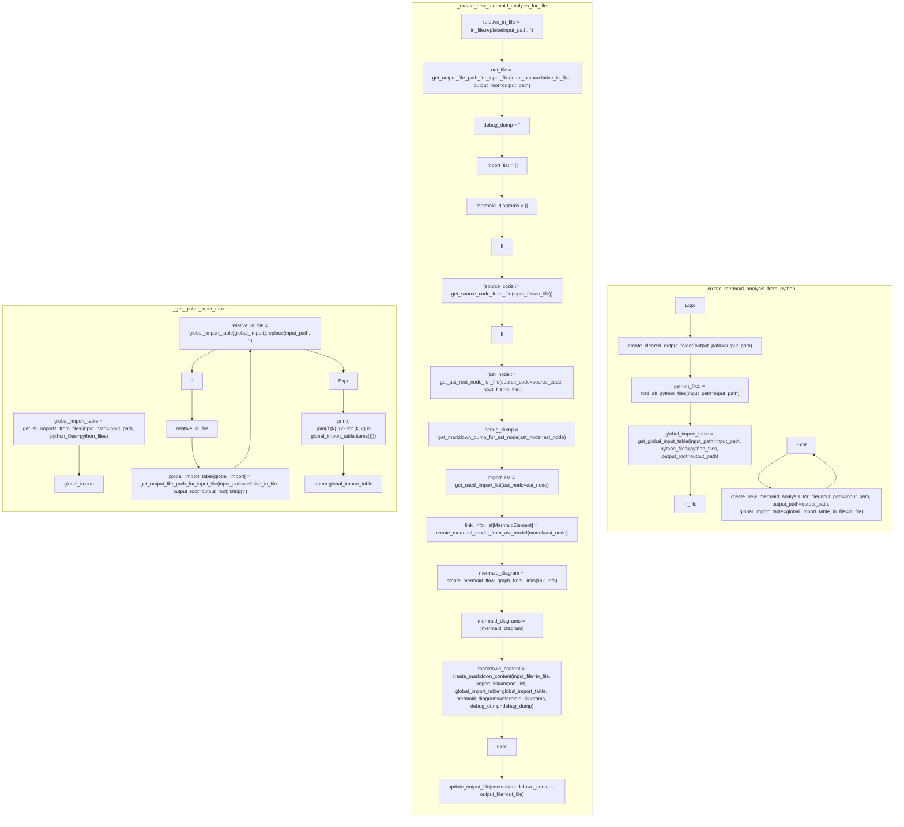

# ./src/pyremaid/pyremaid.py

### Imports

  - [pyremaid.files.destination.create_cleared_output_folder](/docs/pyremaid/files/destination.py.md)
  - [pyremaid.files.destination.get_output_file_path_for_input_file](/docs/pyremaid/files/destination.py.md)
  - [pyremaid.files.destination.update_output_file](/docs/pyremaid/files/destination.py.md)
  - [pyremaid.files.source.find_all_python_files](/docs/pyremaid/files/source.py.md)
  - [pyremaid.files.source.get_source_code_from_file](/docs/pyremaid/files/source.py.md)
  - [pyremaid.files.source.get_import_name_from_path](/docs/pyremaid/files/source.py.md)
  - [pyremaid.ast_tools.create_mermaid_model_from_ast_model](/docs/pyremaid/ast_tools/__init__.py.md)
  - [pyremaid.ast_tools.get_ast_root_node_for_file](/docs/pyremaid/ast_tools/__init__.py.md)
  - [pyremaid.ast_tools.get_markdown_dump_for_ast_node](/docs/pyremaid/ast_tools/__init__.py.md)
  - [pyremaid.ast_tools.get_used_import_list](/docs/pyremaid/ast_tools/__init__.py.md)
  - [pyremaid.ast_tools.import_map.get_all_imports_from_files](/docs/pyremaid/ast_tools/import_map.py.md)
  - [pyremaid.markdown_tools.create_markdown_content](/docs/pyremaid/markdown_tools.py.md)
  - [pyremaid.mermaid_tools.create_mermaid_flow_graph_from_links](/docs/pyremaid/mermaid_tools/__init__.py.md)
  - [pyremaid.models.MermaidElement](/docs/pyremaid/models.py.md)

---

---

<details>
<summary>Debug AST model dump</summary>

```
Module(
  body=[
    ImportFrom(
      module='pyremaid.files.destination',
      names=[
        alias(
          name='create_cleared_output_folder',
          lineno=2,
          col_offset=4,
          end_lineno=2,
          end_col_offset=32),
        alias(
          name='get_output_file_path_for_input_file',
          lineno=3,
          col_offset=4,
          end_lineno=3,
          end_col_offset=39),
        alias(
          name='update_output_file',
          lineno=4,
          col_offset=4,
          end_lineno=4,
          end_col_offset=22)],
      level=0,
      lineno=1,
      col_offset=0,
      end_lineno=5,
      end_col_offset=1),
    ImportFrom(
      module='pyremaid.files.source',
      names=[
        alias(
          name='find_all_python_files',
          lineno=7,
          col_offset=4,
          end_lineno=7,
          end_col_offset=25),
        alias(
          name='get_source_code_from_file',
          lineno=8,
          col_offset=4,
          end_lineno=8,
          end_col_offset=29),
        alias(
          name='get_import_name_from_path',
          lineno=9,
          col_offset=4,
          end_lineno=9,
          end_col_offset=29)],
      level=0,
      lineno=6,
      col_offset=0,
      end_lineno=10,
      end_col_offset=1),
    ImportFrom(
      module='pyremaid.ast_tools',
      names=[
        alias(
          name='create_mermaid_model_from_ast_model',
          lineno=12,
          col_offset=4,
          end_lineno=12,
          end_col_offset=39),
        alias(
          name='get_ast_root_node_for_file',
          lineno=13,
          col_offset=4,
          end_lineno=13,
          end_col_offset=30),
        alias(
          name='get_markdown_dump_for_ast_node',
          lineno=14,
          col_offset=4,
          end_lineno=14,
          end_col_offset=34),
        alias(
          name='get_used_import_list',
          lineno=15,
          col_offset=4,
          end_lineno=15,
          end_col_offset=24)],
      level=0,
      lineno=11,
      col_offset=0,
      end_lineno=16,
      end_col_offset=1),
    ImportFrom(
      module='pyremaid.ast_tools.import_map',
      names=[
        alias(
          name='get_all_imports_from_files',
          lineno=17,
          col_offset=42,
          end_lineno=17,
          end_col_offset=68)],
      level=0,
      lineno=17,
      col_offset=0,
      end_lineno=17,
      end_col_offset=68),
    ImportFrom(
      module='pyremaid.markdown_tools',
      names=[
        alias(
          name='create_markdown_content',
          lineno=18,
          col_offset=36,
          end_lineno=18,
          end_col_offset=59)],
      level=0,
      lineno=18,
      col_offset=0,
      end_lineno=18,
      end_col_offset=59),
    ImportFrom(
      module='pyremaid.mermaid_tools',
      names=[
        alias(
          name='create_mermaid_flow_graph_from_links',
          lineno=19,
          col_offset=35,
          end_lineno=19,
          end_col_offset=71)],
      level=0,
      lineno=19,
      col_offset=0,
      end_lineno=19,
      end_col_offset=71),
    ImportFrom(
      module='pyremaid.models',
      names=[
        alias(
          name='MermaidElement',
          lineno=20,
          col_offset=28,
          end_lineno=20,
          end_col_offset=42)],
      level=0,
      lineno=20,
      col_offset=0,
      end_lineno=20,
      end_col_offset=42),
    FunctionDef(
      name='create_mermaid_analysis_from_python',
      args=arguments(
        posonlyargs=[],
        args=[
          arg(
            arg='input_path',
            annotation=Name(
              id='str',
              ctx=Load(),
              lineno=23,
              col_offset=52,
              end_lineno=23,
              end_col_offset=55),
            lineno=23,
            col_offset=40,
            end_lineno=23,
            end_col_offset=55),
          arg(
            arg='output_path',
            annotation=Name(
              id='str',
              ctx=Load(),
              lineno=23,
              col_offset=70,
              end_lineno=23,
              end_col_offset=73),
            lineno=23,
            col_offset=57,
            end_lineno=23,
            end_col_offset=73)],
        kwonlyargs=[],
        kw_defaults=[],
        defaults=[]),
      body=[
        Expr(
          value=Call(
            func=Name(
              id='create_cleared_output_folder',
              ctx=Load(),
              lineno=24,
              col_offset=4,
              end_lineno=24,
              end_col_offset=32),
            args=[],
            keywords=[
              keyword(
                arg='output_path',
                value=Name(
                  id='output_path',
                  ctx=Load(),
                  lineno=24,
                  col_offset=45,
                  end_lineno=24,
                  end_col_offset=56),
                lineno=24,
                col_offset=33,
                end_lineno=24,
                end_col_offset=56)],
            lineno=24,
            col_offset=4,
            end_lineno=24,
            end_col_offset=57),
          lineno=24,
          col_offset=4,
          end_lineno=24,
          end_col_offset=57),
        Assign(
          targets=[
            Name(
              id='python_files',
              ctx=Store(),
              lineno=25,
              col_offset=4,
              end_lineno=25,
              end_col_offset=16)],
          value=Call(
            func=Name(
              id='find_all_python_files',
              ctx=Load(),
              lineno=25,
              col_offset=19,
              end_lineno=25,
              end_col_offset=40),
            args=[],
            keywords=[
              keyword(
                arg='input_path',
                value=Name(
                  id='input_path',
                  ctx=Load(),
                  lineno=25,
                  col_offset=52,
                  end_lineno=25,
                  end_col_offset=62),
                lineno=25,
                col_offset=41,
                end_lineno=25,
                end_col_offset=62)],
            lineno=25,
            col_offset=19,
            end_lineno=25,
            end_col_offset=63),
          lineno=25,
          col_offset=4,
          end_lineno=25,
          end_col_offset=63),
        Assign(
          targets=[
            Name(
              id='global_import_table',
              ctx=Store(),
              lineno=26,
              col_offset=4,
              end_lineno=26,
              end_col_offset=23)],
          value=Call(
            func=Name(
              id='get_global_input_table',
              ctx=Load(),
              lineno=26,
              col_offset=26,
              end_lineno=26,
              end_col_offset=48),
            args=[],
            keywords=[
              keyword(
                arg='input_path',
                value=Name(
                  id='input_path',
                  ctx=Load(),
                  lineno=27,
                  col_offset=19,
                  end_lineno=27,
                  end_col_offset=29),
                lineno=27,
                col_offset=8,
                end_lineno=27,
                end_col_offset=29),
              keyword(
                arg='python_files',
                value=Name(
                  id='python_files',
                  ctx=Load(),
                  lineno=27,
                  col_offset=44,
                  end_lineno=27,
                  end_col_offset=56),
                lineno=27,
                col_offset=31,
                end_lineno=27,
                end_col_offset=56),
              keyword(
                arg='output_root',
                value=Name(
                  id='output_path',
                  ctx=Load(),
                  lineno=27,
                  col_offset=70,
                  end_lineno=27,
                  end_col_offset=81),
                lineno=27,
                col_offset=58,
                end_lineno=27,
                end_col_offset=81)],
            lineno=26,
            col_offset=26,
            end_lineno=28,
            end_col_offset=5),
          lineno=26,
          col_offset=4,
          end_lineno=28,
          end_col_offset=5),
        For(
          target=Name(
            id='in_file',
            ctx=Store(),
            lineno=30,
            col_offset=8,
            end_lineno=30,
            end_col_offset=15),
          iter=Name(
            id='python_files',
            ctx=Load(),
            lineno=30,
            col_offset=19,
            end_lineno=30,
            end_col_offset=31),
          body=[
            Expr(
              value=Call(
                func=Name(
                  id='create_new_mermaid_analysis_for_file',
                  ctx=Load(),
                  lineno=31,
                  col_offset=8,
                  end_lineno=31,
                  end_col_offset=44),
                args=[],
                keywords=[
                  keyword(
                    arg='input_path',
                    value=Name(
                      id='input_path',
                      ctx=Load(),
                      lineno=32,
                      col_offset=23,
                      end_lineno=32,
                      end_col_offset=33),
                    lineno=32,
                    col_offset=12,
                    end_lineno=32,
                    end_col_offset=33),
                  keyword(
                    arg='output_path',
                    value=Name(
                      id='output_path',
                      ctx=Load(),
                      lineno=33,
                      col_offset=24,
                      end_lineno=33,
                      end_col_offset=35),
                    lineno=33,
                    col_offset=12,
                    end_lineno=33,
                    end_col_offset=35),
                  keyword(
                    arg='global_import_table',
                    value=Name(
                      id='global_import_table',
                      ctx=Load(),
                      lineno=34,
                      col_offset=32,
                      end_lineno=34,
                      end_col_offset=51),
                    lineno=34,
                    col_offset=12,
                    end_lineno=34,
                    end_col_offset=51),
                  keyword(
                    arg='in_file',
                    value=Name(
                      id='in_file',
                      ctx=Load(),
                      lineno=35,
                      col_offset=20,
                      end_lineno=35,
                      end_col_offset=27),
                    lineno=35,
                    col_offset=12,
                    end_lineno=35,
                    end_col_offset=27)],
                lineno=31,
                col_offset=8,
                end_lineno=36,
                end_col_offset=9),
              lineno=31,
              col_offset=8,
              end_lineno=36,
              end_col_offset=9)],
          orelse=[],
          lineno=30,
          col_offset=4,
          end_lineno=36,
          end_col_offset=9)],
      decorator_list=[],
      returns=Constant(
        value=None,
        lineno=23,
        col_offset=78,
        end_lineno=23,
        end_col_offset=82),
      lineno=23,
      col_offset=0,
      end_lineno=36,
      end_col_offset=9),
    FunctionDef(
      name='create_new_mermaid_analysis_for_file',
      args=arguments(
        posonlyargs=[],
        args=[
          arg(
            arg='input_path',
            annotation=Name(
              id='str',
              ctx=Load(),
              lineno=40,
              col_offset=16,
              end_lineno=40,
              end_col_offset=19),
            lineno=40,
            col_offset=4,
            end_lineno=40,
            end_col_offset=19),
          arg(
            arg='output_path',
            annotation=Name(
              id='str',
              ctx=Load(),
              lineno=40,
              col_offset=34,
              end_lineno=40,
              end_col_offset=37),
            lineno=40,
            col_offset=21,
            end_lineno=40,
            end_col_offset=37),
          arg(
            arg='global_import_table',
            annotation=Subscript(
              value=Name(
                id='dict',
                ctx=Load(),
                lineno=40,
                col_offset=60,
                end_lineno=40,
                end_col_offset=64),
              slice=Tuple(
                elts=[
                  Name(
                    id='str',
                    ctx=Load(),
                    lineno=40,
                    col_offset=65,
                    end_lineno=40,
                    end_col_offset=68),
                  Name(
                    id='str',
                    ctx=Load(),
                    lineno=40,
                    col_offset=70,
                    end_lineno=40,
                    end_col_offset=73)],
                ctx=Load(),
                lineno=40,
                col_offset=65,
                end_lineno=40,
                end_col_offset=73),
              ctx=Load(),
              lineno=40,
              col_offset=60,
              end_lineno=40,
              end_col_offset=74),
            lineno=40,
            col_offset=39,
            end_lineno=40,
            end_col_offset=74),
          arg(
            arg='in_file',
            annotation=Name(
              id='str',
              ctx=Load(),
              lineno=40,
              col_offset=85,
              end_lineno=40,
              end_col_offset=88),
            lineno=40,
            col_offset=76,
            end_lineno=40,
            end_col_offset=88)],
        kwonlyargs=[],
        kw_defaults=[],
        defaults=[]),
      body=[
        Assign(
          targets=[
            Name(
              id='relative_in_file',
              ctx=Store(),
              lineno=42,
              col_offset=4,
              end_lineno=42,
              end_col_offset=20)],
          value=Call(
            func=Attribute(
              value=Name(
                id='in_file',
                ctx=Load(),
                lineno=42,
                col_offset=23,
                end_lineno=42,
                end_col_offset=30),
              attr='replace',
              ctx=Load(),
              lineno=42,
              col_offset=23,
              end_lineno=42,
              end_col_offset=38),
            args=[
              Name(
                id='input_path',
                ctx=Load(),
                lineno=42,
                col_offset=39,
                end_lineno=42,
                end_col_offset=49),
              Constant(
                value='',
                lineno=42,
                col_offset=51,
                end_lineno=42,
                end_col_offset=53)],
            keywords=[],
            lineno=42,
            col_offset=23,
            end_lineno=42,
            end_col_offset=54),
          lineno=42,
          col_offset=4,
          end_lineno=42,
          end_col_offset=54),
        Assign(
          targets=[
            Name(
              id='out_file',
              ctx=Store(),
              lineno=43,
              col_offset=4,
              end_lineno=43,
              end_col_offset=12)],
          value=Call(
            func=Name(
              id='get_output_file_path_for_input_file',
              ctx=Load(),
              lineno=43,
              col_offset=15,
              end_lineno=43,
              end_col_offset=50),
            args=[],
            keywords=[
              keyword(
                arg='input_path',
                value=Name(
                  id='relative_in_file',
                  ctx=Load(),
                  lineno=44,
                  col_offset=19,
                  end_lineno=44,
                  end_col_offset=35),
                lineno=44,
                col_offset=8,
                end_lineno=44,
                end_col_offset=35),
              keyword(
                arg='output_root',
                value=Name(
                  id='output_path',
                  ctx=Load(),
                  lineno=44,
                  col_offset=49,
                  end_lineno=44,
                  end_col_offset=60),
                lineno=44,
                col_offset=37,
                end_lineno=44,
                end_col_offset=60)],
            lineno=43,
            col_offset=15,
            end_lineno=45,
            end_col_offset=5),
          lineno=43,
          col_offset=4,
          end_lineno=45,
          end_col_offset=5),
        Assign(
          targets=[
            Name(
              id='debug_dump',
              ctx=Store(),
              lineno=47,
              col_offset=4,
              end_lineno=47,
              end_col_offset=14)],
          value=Constant(
            value='',
            lineno=47,
            col_offset=17,
            end_lineno=47,
            end_col_offset=19),
          lineno=47,
          col_offset=4,
          end_lineno=47,
          end_col_offset=19),
        Assign(
          targets=[
            Name(
              id='import_list',
              ctx=Store(),
              lineno=48,
              col_offset=4,
              end_lineno=48,
              end_col_offset=15)],
          value=List(
            elts=[],
            ctx=Load(),
            lineno=48,
            col_offset=18,
            end_lineno=48,
            end_col_offset=20),
          lineno=48,
          col_offset=4,
          end_lineno=48,
          end_col_offset=20),
        Assign(
          targets=[
            Name(
              id='mermaid_diagrams',
              ctx=Store(),
              lineno=49,
              col_offset=4,
              end_lineno=49,
              end_col_offset=20)],
          value=List(
            elts=[],
            ctx=Load(),
            lineno=49,
            col_offset=23,
            end_lineno=49,
            end_col_offset=25),
          lineno=49,
          col_offset=4,
          end_lineno=49,
          end_col_offset=25),
        If(
          test=NamedExpr(
            target=Name(
              id='source_code',
              ctx=Store(),
              lineno=51,
              col_offset=7,
              end_lineno=51,
              end_col_offset=18),
            value=Call(
              func=Name(
                id='get_source_code_from_file',
                ctx=Load(),
                lineno=51,
                col_offset=22,
                end_lineno=51,
                end_col_offset=47),
              args=[],
              keywords=[
                keyword(
                  arg='input_file',
                  value=Name(
                    id='in_file',
                    ctx=Load(),
                    lineno=51,
                    col_offset=59,
                    end_lineno=51,
                    end_col_offset=66),
                  lineno=51,
                  col_offset=48,
                  end_lineno=51,
                  end_col_offset=66)],
              lineno=51,
              col_offset=22,
              end_lineno=51,
              end_col_offset=67),
            lineno=51,
            col_offset=7,
            end_lineno=51,
            end_col_offset=67),
          body=[
            If(
              test=NamedExpr(
                target=Name(
                  id='ast_node',
                  ctx=Store(),
                  lineno=52,
                  col_offset=11,
                  end_lineno=52,
                  end_col_offset=19),
                value=Call(
                  func=Name(
                    id='get_ast_root_node_for_file',
                    ctx=Load(),
                    lineno=52,
                    col_offset=23,
                    end_lineno=52,
                    end_col_offset=49),
                  args=[],
                  keywords=[
                    keyword(
                      arg='source_code',
                      value=Name(
                        id='source_code',
                        ctx=Load(),
                        lineno=53,
                        col_offset=24,
                        end_lineno=53,
                        end_col_offset=35),
                      lineno=53,
                      col_offset=12,
                      end_lineno=53,
                      end_col_offset=35),
                    keyword(
                      arg='input_file',
                      value=Name(
                        id='in_file',
                        ctx=Load(),
                        lineno=54,
                        col_offset=23,
                        end_lineno=54,
                        end_col_offset=30),
                      lineno=54,
                      col_offset=12,
                      end_lineno=54,
                      end_col_offset=30)],
                  lineno=52,
                  col_offset=23,
                  end_lineno=55,
                  end_col_offset=9),
                lineno=52,
                col_offset=11,
                end_lineno=55,
                end_col_offset=9),
              body=[
                Assign(
                  targets=[
                    Name(
                      id='debug_dump',
                      ctx=Store(),
                      lineno=57,
                      col_offset=12,
                      end_lineno=57,
                      end_col_offset=22)],
                  value=Call(
                    func=Name(
                      id='get_markdown_dump_for_ast_node',
                      ctx=Load(),
                      lineno=57,
                      col_offset=25,
                      end_lineno=57,
                      end_col_offset=55),
                    args=[],
                    keywords=[
                      keyword(
                        arg='ast_node',
                        value=Name(
                          id='ast_node',
                          ctx=Load(),
                          lineno=57,
                          col_offset=65,
                          end_lineno=57,
                          end_col_offset=73),
                        lineno=57,
                        col_offset=56,
                        end_lineno=57,
                        end_col_offset=73)],
                    lineno=57,
                    col_offset=25,
                    end_lineno=57,
                    end_col_offset=74),
                  lineno=57,
                  col_offset=12,
                  end_lineno=57,
                  end_col_offset=74),
                Assign(
                  targets=[
                    Name(
                      id='import_list',
                      ctx=Store(),
                      lineno=59,
                      col_offset=12,
                      end_lineno=59,
                      end_col_offset=23)],
                  value=Call(
                    func=Name(
                      id='get_used_import_list',
                      ctx=Load(),
                      lineno=59,
                      col_offset=26,
                      end_lineno=59,
                      end_col_offset=46),
                    args=[],
                    keywords=[
                      keyword(
                        arg='ast_node',
                        value=Name(
                          id='ast_node',
                          ctx=Load(),
                          lineno=59,
                          col_offset=56,
                          end_lineno=59,
                          end_col_offset=64),
                        lineno=59,
                        col_offset=47,
                        end_lineno=59,
                        end_col_offset=64)],
                    lineno=59,
                    col_offset=26,
                    end_lineno=59,
                    end_col_offset=65),
                  lineno=59,
                  col_offset=12,
                  end_lineno=59,
                  end_col_offset=65),
                AnnAssign(
                  target=Name(
                    id='link_info',
                    ctx=Store(),
                    lineno=61,
                    col_offset=12,
                    end_lineno=61,
                    end_col_offset=21),
                  annotation=Subscript(
                    value=Name(
                      id='list',
                      ctx=Load(),
                      lineno=61,
                      col_offset=23,
                      end_lineno=61,
                      end_col_offset=27),
                    slice=Name(
                      id='MermaidElement',
                      ctx=Load(),
                      lineno=61,
                      col_offset=28,
                      end_lineno=61,
                      end_col_offset=42),
                    ctx=Load(),
                    lineno=61,
                    col_offset=23,
                    end_lineno=61,
                    end_col_offset=43),
                  value=Call(
                    func=Name(
                      id='create_mermaid_model_from_ast_model',
                      ctx=Load(),
                      lineno=61,
                      col_offset=46,
                      end_lineno=61,
                      end_col_offset=81),
                    args=[],
                    keywords=[
                      keyword(
                        arg='model',
                        value=Name(
                          id='ast_node',
                          ctx=Load(),
                          lineno=62,
                          col_offset=22,
                          end_lineno=62,
                          end_col_offset=30),
                        lineno=62,
                        col_offset=16,
                        end_lineno=62,
                        end_col_offset=30)],
                    lineno=61,
                    col_offset=46,
                    end_lineno=63,
                    end_col_offset=13),
                  simple=1,
                  lineno=61,
                  col_offset=12,
                  end_lineno=63,
                  end_col_offset=13),
                Assign(
                  targets=[
                    Name(
                      id='mermaid_diagram',
                      ctx=Store(),
                      lineno=65,
                      col_offset=12,
                      end_lineno=65,
                      end_col_offset=27)],
                  value=Call(
                    func=Name(
                      id='create_mermaid_flow_graph_from_links',
                      ctx=Load(),
                      lineno=65,
                      col_offset=30,
                      end_lineno=65,
                      end_col_offset=66),
                    args=[
                      Name(
                        id='link_info',
                        ctx=Load(),
                        lineno=65,
                        col_offset=67,
                        end_lineno=65,
                        end_col_offset=76)],
                    keywords=[],
                    lineno=65,
                    col_offset=30,
                    end_lineno=65,
                    end_col_offset=77),
                  lineno=65,
                  col_offset=12,
                  end_lineno=65,
                  end_col_offset=77),
                Assign(
                  targets=[
                    Name(
                      id='mermaid_diagrams',
                      ctx=Store(),
                      lineno=66,
                      col_offset=12,
                      end_lineno=66,
                      end_col_offset=28)],
                  value=List(
                    elts=[
                      Name(
                        id='mermaid_diagram',
                        ctx=Load(),
                        lineno=66,
                        col_offset=32,
                        end_lineno=66,
                        end_col_offset=47)],
                    ctx=Load(),
                    lineno=66,
                    col_offset=31,
                    end_lineno=66,
                    end_col_offset=48),
                  lineno=66,
                  col_offset=12,
                  end_lineno=66,
                  end_col_offset=48)],
              orelse=[],
              lineno=52,
              col_offset=8,
              end_lineno=66,
              end_col_offset=48)],
          orelse=[],
          lineno=51,
          col_offset=4,
          end_lineno=66,
          end_col_offset=48),
        Assign(
          targets=[
            Name(
              id='markdown_content',
              ctx=Store(),
              lineno=68,
              col_offset=4,
              end_lineno=68,
              end_col_offset=20)],
          value=Call(
            func=Name(
              id='create_markdown_content',
              ctx=Load(),
              lineno=68,
              col_offset=23,
              end_lineno=68,
              end_col_offset=46),
            args=[],
            keywords=[
              keyword(
                arg='input_file',
                value=Name(
                  id='in_file',
                  ctx=Load(),
                  lineno=69,
                  col_offset=19,
                  end_lineno=69,
                  end_col_offset=26),
                lineno=69,
                col_offset=8,
                end_lineno=69,
                end_col_offset=26),
              keyword(
                arg='import_list',
                value=Name(
                  id='import_list',
                  ctx=Load(),
                  lineno=70,
                  col_offset=20,
                  end_lineno=70,
                  end_col_offset=31),
                lineno=70,
                col_offset=8,
                end_lineno=70,
                end_col_offset=31),
              keyword(
                arg='global_import_table',
                value=Name(
                  id='global_import_table',
                  ctx=Load(),
                  lineno=71,
                  col_offset=28,
                  end_lineno=71,
                  end_col_offset=47),
                lineno=71,
                col_offset=8,
                end_lineno=71,
                end_col_offset=47),
              keyword(
                arg='mermaid_diagrams',
                value=Name(
                  id='mermaid_diagrams',
                  ctx=Load(),
                  lineno=72,
                  col_offset=25,
                  end_lineno=72,
                  end_col_offset=41),
                lineno=72,
                col_offset=8,
                end_lineno=72,
                end_col_offset=41),
              keyword(
                arg='debug_dump',
                value=Name(
                  id='debug_dump',
                  ctx=Load(),
                  lineno=73,
                  col_offset=19,
                  end_lineno=73,
                  end_col_offset=29),
                lineno=73,
                col_offset=8,
                end_lineno=73,
                end_col_offset=29)],
            lineno=68,
            col_offset=23,
            end_lineno=74,
            end_col_offset=5),
          lineno=68,
          col_offset=4,
          end_lineno=74,
          end_col_offset=5),
        Expr(
          value=Call(
            func=Name(
              id='update_output_file',
              ctx=Load(),
              lineno=76,
              col_offset=4,
              end_lineno=76,
              end_col_offset=22),
            args=[],
            keywords=[
              keyword(
                arg='content',
                value=Name(
                  id='markdown_content',
                  ctx=Load(),
                  lineno=76,
                  col_offset=31,
                  end_lineno=76,
                  end_col_offset=47),
                lineno=76,
                col_offset=23,
                end_lineno=76,
                end_col_offset=47),
              keyword(
                arg='output_file',
                value=Name(
                  id='out_file',
                  ctx=Load(),
                  lineno=76,
                  col_offset=61,
                  end_lineno=76,
                  end_col_offset=69),
                lineno=76,
                col_offset=49,
                end_lineno=76,
                end_col_offset=69)],
            lineno=76,
            col_offset=4,
            end_lineno=76,
            end_col_offset=70),
          lineno=76,
          col_offset=4,
          end_lineno=76,
          end_col_offset=70)],
      decorator_list=[],
      lineno=39,
      col_offset=0,
      end_lineno=76,
      end_col_offset=70),
    FunctionDef(
      name='get_global_input_table',
      args=arguments(
        posonlyargs=[],
        args=[
          arg(
            arg='input_path',
            annotation=Name(
              id='str',
              ctx=Load(),
              lineno=80,
              col_offset=16,
              end_lineno=80,
              end_col_offset=19),
            lineno=80,
            col_offset=4,
            end_lineno=80,
            end_col_offset=19),
          arg(
            arg='python_files',
            annotation=Subscript(
              value=Name(
                id='list',
                ctx=Load(),
                lineno=80,
                col_offset=35,
                end_lineno=80,
                end_col_offset=39),
              slice=Name(
                id='str',
                ctx=Load(),
                lineno=80,
                col_offset=40,
                end_lineno=80,
                end_col_offset=43),
              ctx=Load(),
              lineno=80,
              col_offset=35,
              end_lineno=80,
              end_col_offset=44),
            lineno=80,
            col_offset=21,
            end_lineno=80,
            end_col_offset=44),
          arg(
            arg='output_root',
            annotation=Name(
              id='str',
              ctx=Load(),
              lineno=80,
              col_offset=59,
              end_lineno=80,
              end_col_offset=62),
            lineno=80,
            col_offset=46,
            end_lineno=80,
            end_col_offset=62)],
        kwonlyargs=[],
        kw_defaults=[],
        defaults=[]),
      body=[
        Assign(
          targets=[
            Name(
              id='global_import_table',
              ctx=Store(),
              lineno=82,
              col_offset=4,
              end_lineno=82,
              end_col_offset=23)],
          value=Call(
            func=Name(
              id='get_all_imports_from_files',
              ctx=Load(),
              lineno=82,
              col_offset=26,
              end_lineno=82,
              end_col_offset=52),
            args=[],
            keywords=[
              keyword(
                arg='input_path',
                value=Name(
                  id='input_path',
                  ctx=Load(),
                  lineno=83,
                  col_offset=19,
                  end_lineno=83,
                  end_col_offset=29),
                lineno=83,
                col_offset=8,
                end_lineno=83,
                end_col_offset=29),
              keyword(
                arg='python_files',
                value=Name(
                  id='python_files',
                  ctx=Load(),
                  lineno=83,
                  col_offset=44,
                  end_lineno=83,
                  end_col_offset=56),
                lineno=83,
                col_offset=31,
                end_lineno=83,
                end_col_offset=56)],
            lineno=82,
            col_offset=26,
            end_lineno=84,
            end_col_offset=5),
          lineno=82,
          col_offset=4,
          end_lineno=84,
          end_col_offset=5),
        For(
          target=Name(
            id='global_import',
            ctx=Store(),
            lineno=85,
            col_offset=8,
            end_lineno=85,
            end_col_offset=21),
          iter=Name(
            id='global_import_table',
            ctx=Load(),
            lineno=85,
            col_offset=25,
            end_lineno=85,
            end_col_offset=44),
          body=[
            Assign(
              targets=[
                Name(
                  id='relative_in_file',
                  ctx=Store(),
                  lineno=86,
                  col_offset=8,
                  end_lineno=86,
                  end_col_offset=24)],
              value=Call(
                func=Attribute(
                  value=Subscript(
                    value=Name(
                      id='global_import_table',
                      ctx=Load(),
                      lineno=86,
                      col_offset=27,
                      end_lineno=86,
                      end_col_offset=46),
                    slice=Name(
                      id='global_import',
                      ctx=Load(),
                      lineno=86,
                      col_offset=47,
                      end_lineno=86,
                      end_col_offset=60),
                    ctx=Load(),
                    lineno=86,
                    col_offset=27,
                    end_lineno=86,
                    end_col_offset=61),
                  attr='replace',
                  ctx=Load(),
                  lineno=86,
                  col_offset=27,
                  end_lineno=86,
                  end_col_offset=69),
                args=[
                  Name(
                    id='input_path',
                    ctx=Load(),
                    lineno=86,
                    col_offset=70,
                    end_lineno=86,
                    end_col_offset=80),
                  Constant(
                    value='',
                    lineno=86,
                    col_offset=82,
                    end_lineno=86,
                    end_col_offset=84)],
                keywords=[],
                lineno=86,
                col_offset=27,
                end_lineno=86,
                end_col_offset=85),
              lineno=86,
              col_offset=8,
              end_lineno=86,
              end_col_offset=85),
            If(
              test=Name(
                id='relative_in_file',
                ctx=Load(),
                lineno=87,
                col_offset=11,
                end_lineno=87,
                end_col_offset=27),
              body=[
                Assign(
                  targets=[
                    Subscript(
                      value=Name(
                        id='global_import_table',
                        ctx=Load(),
                        lineno=88,
                        col_offset=12,
                        end_lineno=88,
                        end_col_offset=31),
                      slice=Name(
                        id='global_import',
                        ctx=Load(),
                        lineno=88,
                        col_offset=32,
                        end_lineno=88,
                        end_col_offset=45),
                      ctx=Store(),
                      lineno=88,
                      col_offset=12,
                      end_lineno=88,
                      end_col_offset=46)],
                  value=Call(
                    func=Attribute(
                      value=Call(
                        func=Name(
                          id='get_output_file_path_for_input_file',
                          ctx=Load(),
                          lineno=88,
                          col_offset=49,
                          end_lineno=88,
                          end_col_offset=84),
                        args=[],
                        keywords=[
                          keyword(
                            arg='input_path',
                            value=Name(
                              id='relative_in_file',
                              ctx=Load(),
                              lineno=89,
                              col_offset=27,
                              end_lineno=89,
                              end_col_offset=43),
                            lineno=89,
                            col_offset=16,
                            end_lineno=89,
                            end_col_offset=43),
                          keyword(
                            arg='output_root',
                            value=Name(
                              id='output_root',
                              ctx=Load(),
                              lineno=89,
                              col_offset=57,
                              end_lineno=89,
                              end_col_offset=68),
                            lineno=89,
                            col_offset=45,
                            end_lineno=89,
                            end_col_offset=68)],
                        lineno=88,
                        col_offset=49,
                        end_lineno=90,
                        end_col_offset=13),
                      attr='lstrip',
                      ctx=Load(),
                      lineno=88,
                      col_offset=49,
                      end_lineno=90,
                      end_col_offset=20),
                    args=[
                      Constant(
                        value='.',
                        lineno=90,
                        col_offset=21,
                        end_lineno=90,
                        end_col_offset=24)],
                    keywords=[],
                    lineno=88,
                    col_offset=49,
                    end_lineno=90,
                    end_col_offset=25),
                  lineno=88,
                  col_offset=12,
                  end_lineno=90,
                  end_col_offset=25)],
              orelse=[],
              lineno=87,
              col_offset=8,
              end_lineno=90,
              end_col_offset=25)],
          orelse=[],
          lineno=85,
          col_offset=4,
          end_lineno=90,
          end_col_offset=25),
        Expr(
          value=Call(
            func=Name(
              id='print',
              ctx=Load(),
              lineno=91,
              col_offset=4,
              end_lineno=91,
              end_col_offset=9),
            args=[
              Call(
                func=Attribute(
                  value=Constant(
                    value='\n',
                    lineno=91,
                    col_offset=10,
                    end_lineno=91,
                    end_col_offset=14),
                  attr='join',
                  ctx=Load(),
                  lineno=91,
                  col_offset=10,
                  end_lineno=91,
                  end_col_offset=19),
                args=[
                  ListComp(
                    elt=JoinedStr(
                      values=[
                        FormattedValue(
                          value=Name(
                            id='k',
                            ctx=Load(),
                            lineno=91,
                            col_offset=24,
                            end_lineno=91,
                            end_col_offset=25),
                          conversion=-1,
                          lineno=91,
                          col_offset=21,
                          end_lineno=91,
                          end_col_offset=32),
                        Constant(
                          value=': ',
                          lineno=91,
                          col_offset=21,
                          end_lineno=91,
                          end_col_offset=32),
                        FormattedValue(
                          value=Name(
                            id='v',
                            ctx=Load(),
                            lineno=91,
                            col_offset=29,
                            end_lineno=91,
                            end_col_offset=30),
                          conversion=-1,
                          lineno=91,
                          col_offset=21,
                          end_lineno=91,
                          end_col_offset=32)],
                      lineno=91,
                      col_offset=21,
                      end_lineno=91,
                      end_col_offset=32),
                    generators=[
                      comprehension(
                        target=Tuple(
                          elts=[
                            Name(
                              id='k',
                              ctx=Store(),
                              lineno=91,
                              col_offset=37,
                              end_lineno=91,
                              end_col_offset=38),
                            Name(
                              id='v',
                              ctx=Store(),
                              lineno=91,
                              col_offset=40,
                              end_lineno=91,
                              end_col_offset=41)],
                          ctx=Store(),
                          lineno=91,
                          col_offset=37,
                          end_lineno=91,
                          end_col_offset=41),
                        iter=Call(
                          func=Attribute(
                            value=Name(
                              id='global_import_table',
                              ctx=Load(),
                              lineno=91,
                              col_offset=45,
                              end_lineno=91,
                              end_col_offset=64),
                            attr='items',
                            ctx=Load(),
                            lineno=91,
                            col_offset=45,
                            end_lineno=91,
                            end_col_offset=70),
                          args=[],
                          keywords=[],
                          lineno=91,
                          col_offset=45,
                          end_lineno=91,
                          end_col_offset=72),
                        ifs=[],
                        is_async=0)],
                    lineno=91,
                    col_offset=20,
                    end_lineno=91,
                    end_col_offset=73)],
                keywords=[],
                lineno=91,
                col_offset=10,
                end_lineno=91,
                end_col_offset=74)],
            keywords=[],
            lineno=91,
            col_offset=4,
            end_lineno=91,
            end_col_offset=75),
          lineno=91,
          col_offset=4,
          end_lineno=91,
          end_col_offset=75),
        Return(
          value=Name(
            id='global_import_table',
            ctx=Load(),
            lineno=92,
            col_offset=11,
            end_lineno=92,
            end_col_offset=30),
          lineno=92,
          col_offset=4,
          end_lineno=92,
          end_col_offset=30)],
      decorator_list=[],
      returns=Subscript(
        value=Name(
          id='dict',
          ctx=Load(),
          lineno=81,
          col_offset=5,
          end_lineno=81,
          end_col_offset=9),
        slice=Tuple(
          elts=[
            Name(
              id='str',
              ctx=Load(),
              lineno=81,
              col_offset=10,
              end_lineno=81,
              end_col_offset=13),
            Name(
              id='str',
              ctx=Load(),
              lineno=81,
              col_offset=15,
              end_lineno=81,
              end_col_offset=18)],
          ctx=Load(),
          lineno=81,
          col_offset=10,
          end_lineno=81,
          end_col_offset=18),
        ctx=Load(),
        lineno=81,
        col_offset=5,
        end_lineno=81,
        end_col_offset=19),
      lineno=79,
      col_offset=0,
      end_lineno=92,
      end_col_offset=30)],
  type_ignores=[])
```
</details>

